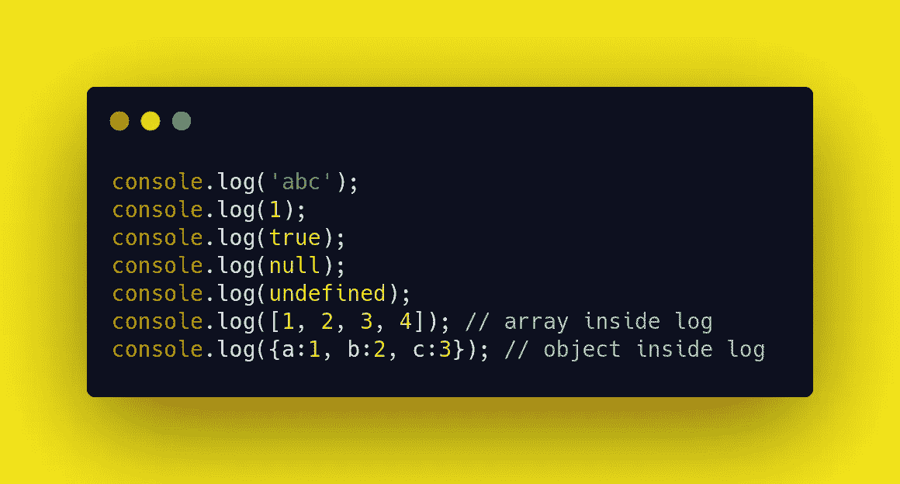
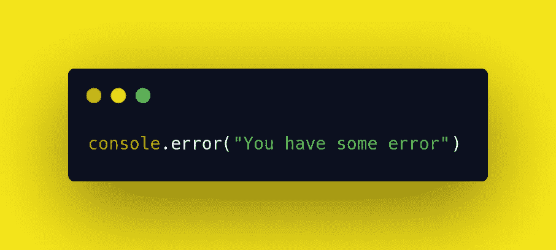
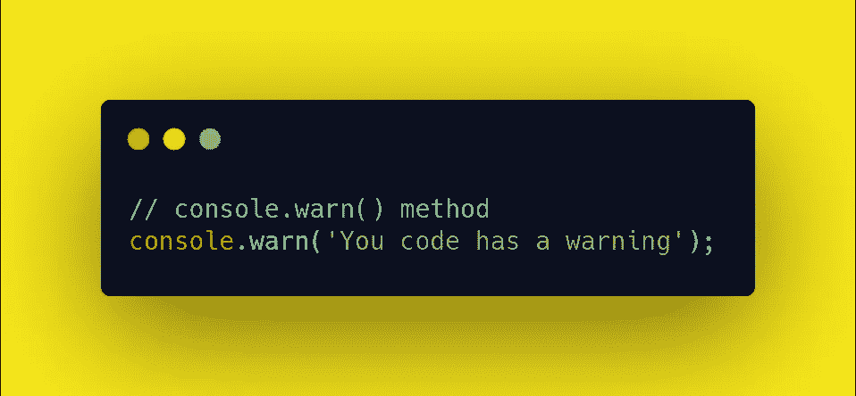
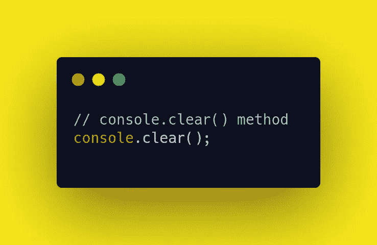
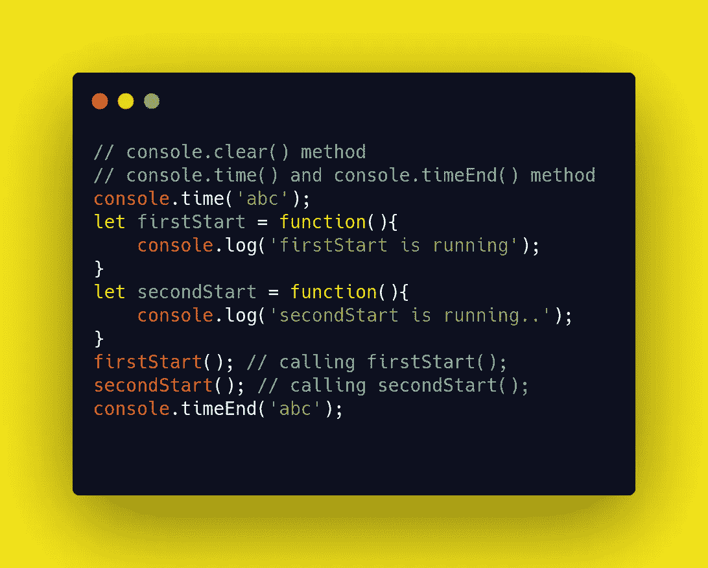
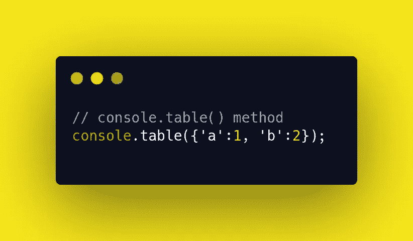

# 控制台方法及其用例

> 原文：<https://betterprogramming.pub/on-console-methods-and-their-uses-b57ed2c6bf59>

## 在 JavaScript 中使用每个控制台方法的最佳方式是什么？

[Pankaj Patel](https://unsplash.com/@pankajpatel?utm_source=medium&utm_medium=referral) 在 [Unsplash](https://unsplash.com?utm_source=medium&utm_medium=referral) 上拍照。

web 控制台用于记录和输出与网页相关的信息，如错误、警告、CSS 等*。*通过执行 JavaScript 表达式，实现与网页的无缝交互。JavaScript 中的`console`方法是一个提供对浏览器调试控制台的访问的对象。对于 Windows，我们可以使用 Ctrl + Shift + K，对于 Mac，我们可以使用 Command + Option + K 在 web 浏览器中打开控制台。

有许多有用的`console`方法，但是让我们特别看几个，看看它们如何简化我们的工作。

# Console.log()

console.log

`Console.log`是最常用的`console`方法。它用于记录控制台的输出。我们可以使用`log()`打印任何数据类型，可以是字符串、数组、对象、布尔值等。

# Console.error()

控制台.错误

`Console.error`用于向控制台输出错误消息——通常以红色开头，带有错误符号。

# Console.warn()

控制台.警告

`Console.warn`用于向控制台输出警告信息——通常以黄色开头，带有警告符号。

# Console.clear()

控制台.清除

`Console.clear()`用于清除控制台。在 Chrome 中，控制台将被清除，它会向控制台打印一条“控制台已被清除”的消息。在 Firefox 中，它会清除控制台，但不会返回任何消息。

# Console.time()和 Console.timeEnd()

console.time() console.timeEnd()

`Console.time()`和`Console.timeEnd()`用于了解一个函数或代码块执行所花费的时间。`time()`和`timeEnd()`方法可以确定花费的时间。里面的代码可以是任何东西，但是它们的标签必须相同。

在示例代码中，我们使用`abc`作为两种方法的标签。随着我们增加方法定义的代码块中的代码量，时间也会增加。返回到控制台的时间以毫秒为单位，可能会随着页面刷新而变化。

# Console.table()

控制台.表格

`console.table()`方法用于在控制台内生成表格。它只接受一个数组或一个对象作为它的输入，它将显示为一个表。

我们可以使用许多控制台方法来简化我们的工作。如果你想了解更多关于`console`方法的知识，请查阅 [MDN 网络文档](https://developer.mozilla.org/en-US/docs/Web/API/console)或[谷歌文档](https://developers.google.com/web/tools/chrome-devtools/console/api)。

感谢阅读。