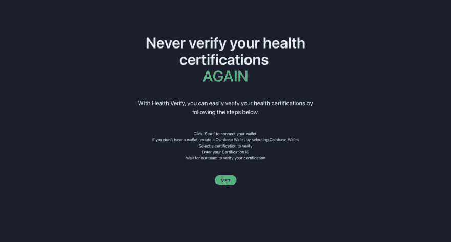
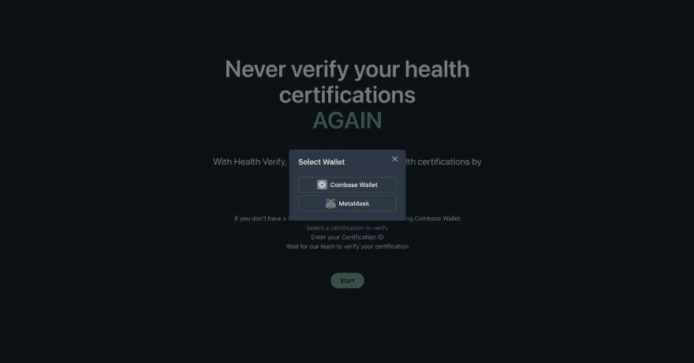
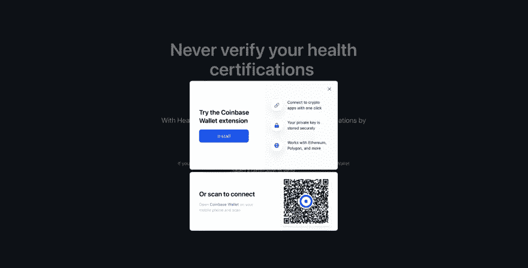

# 使用 Next.js、Typescript、Wagmi 和比特币基地钱包 SDK 构建一个 Dapp

> 原文：<https://betterprogramming.pub/onboarding-new-users-with-coinbase-wallet-790784ac8821>

## 比特币基地钱包新用户入职


封面图像

# 介绍

Web3 代表了互联网发展中激动人心的一章。区块链提供的原语将导致无限数量的应用程序和用例。我们已经看到 ico、DeFi、NFTs 和点对点支付系统的爆炸式增长。然而，在大规模采用这项新技术之前，我们还有很长的路要走。用户体验仍然是一个欠缺的领域。

作为 web3 开发者，当普通人不理解诸如非保管加密钱包或签名交易等概念时，我们应该如何加入下一波用户？本文将探讨这个问题，并提供一个解决方案来帮助创建更好的用户体验。我们将看一个真实的例子，展示我们如何使用[比特币基地钱包 SDK](https://docs.cloud.coinbase.com/wallet-sdk/docs/welcome) 为新用户创造无缝的入职体验。

# 现实世界的问题

web3 中最有趣的概念之一是医疗保健和区块链技术的交叉。HIPAA 合规性意味着患者记录可能不应该放在公共区块链上。然而，我们还有成百上千的其他方法可以利用区块链来革新医疗保健部门。

医疗保健工作者(HCW)在任何医疗保健机构工作之前，必须花费超过六周的时间接受审查和核实。医院系统的时间和收入损失是巨大的。一个可信的第三方进行认证验证，背景调查等连续数周，而 HCW 没有支付，医院系统必须找到一个临时工来填补空缺。这是一个区块链能够解决的问题。有了区块链不变性，认证一旦被验证，就再也不会发生了。

# Web3 解决方案

为了解决这个问题，我想构建一个名为 Health Verify (HV)的认证验证 dapp，如果成功验证了 HCW 证书，它就会生成一个 NFT。这个解决方案有很多不同的路径可以走: [ZK 证明](https://en.wikipedia.org/wiki/Zero-knowledge_proof)保证匿名，用 [Arweave](https://www.arweave.org/) 或者[陶瓷](https://ceramic.network/)作为所有验证过的证书的卖点，等等。在我看来，一切都取决于首次使用 crypto 的用户的入门质量。

因为用户需要一个钱包浏览器扩展来与 web3 应用程序交互，所以对于不熟悉该技术的人应该有所考虑。仅仅看到一个“连接钱包”按钮，没有什么背景，可能会给人一种令人生畏的第一印象，所以我们希望事情尽可能顺利。

[比特币基地钱包](https://docs.cloud.coinbase.com/wallet-sdk/docs/welcome)是为数不多的钱包之一，如果用户还没有安装钱包扩展，它可以提供入职体验。使用这个钱包是有意义的，因为比特币基地在 web3 中是一个受信任的名字，并为新用户提供了一个安全的入口，同时允许现有用户轻松连接到我的 dapp。

在本文的其余部分，我们将重点构建健康验证 dapp 的第一部分。我们将创建入职页面并集成比特币基地钱包 SDK，使用户可以轻松连接现有钱包或创建新钱包。

# 该项目

所以让我们开始把所有的事情都联系起来。React 是当前构建 dapps 的库，我首选的健康验证库包括:

*   [Next.js](https://nextjs.org/) —理想的 React 生产框架
*   [Wagmi 钩子](https://wagmi.sh/)——React 钩子的集合，包含开始使用以太坊所需的一切
*   [Infura RPC provider](https://infura.io/) —高度可用的以太坊 API
*   [比特币基地钱包 SDK](https://docs.cloud.coinbase.com/wallet-sdk/docs/welcome)——比特币基地钱包 SDK(前身为 WalletLink)允许开发者在移动网络(iOS 和 Android)和桌面上将其 dapps 连接到比特币基地钱包
*   [Chakra UI](https://chakra-ui.com/) —一个简单的、模块化的、可访问的组件库，为您提供构建 React 应用程序所需的构件

至于特性，本文的范围如下:

*   入职:允许 HCW 在没有钱包的情况下注册。
*   验证:HCW 从支持的认证列表中选择，提交一些信息，然后将其发送到服务器进行人工验证。验证完成后，会发布一个 NFT。

对于本文，我们将只为这个工作流的提交部分构建一个简单的接口，包括比特币基地钱包入职流程。

# 履行

**注:**如果你愿意，可以在这里查看代码库[。](https://github.com/teeolendo/health-verify)

好吧，但是时间到了！Next.js 自问世以来一直是 React 生态系统的宠儿。就我个人而言，我喜欢不与 React 路由器打交道，所以当我开始任何 React 项目时，它都是我的首选。对于 Health Verify，我们将从安装 Next.js 和 Chakra UI 开始。我在本文中使用 Typescript，但是您也可以使用 Javascript，一切都应该是一样的，没有所有的打字样板。

## 步骤 1:安装 Next.js

*   转到您的终端，键入以下命令:

```
npx create-next-app@latest --typescript
```

*   按照提示输入应用程序名称。如果一切顺利，那么您应该有一个全新的 Next.js 安装。

## 步骤 2:安装和配置 Chakra 用户界面

这些年来，我已经使用了许多不同的 UI 库，但是我还没有发现任何关于 UI 元素设计的非固执己见的东西，同时拥有如此惊人的开发者体验。所以我强烈推荐 Chakra UI 库。

*   在终端中导航到您在步骤 1 中创建的项目文件夹，并运行以下命令:

```
yarn add @chakra-ui/react @emotion/react@^11 @emotion/styled@^11 framer-motion@^6
```

*   导入 Chakra UI 提供程序，并将其添加到`_app.tsx`文件中。在这个阶段，`_app.tsx`应该如下所示:

```
import type { AppProps } from "next/app"
import { ChakraProvider } from "@chakra-ui/react"function MyApp({ Component, pageProps }: AppProps) {
    return (
        <ChakraProvider>
            <Component {...pageProps} />
        </ChakraProvider>
    );
}export default MyApp;
```

## 第三步:安装比特币基地钱包 SDK 和 Wagmi 挂钩

通过运行以下命令安装比特币基地钱包 SDK 和 Wagmi 挂钩:

```
yarn add @coinbase/wallet-sdk wagmi ethers
```

**注意** : Ethers 是 Wagmi 依赖。

## 步骤 4:获取一个 Infura ID

Infura 的以太坊高可用性 API 将帮助我们开始使用 Health Verify。我们正在为比特币基地钱包配置一个备份提供程序，用于不使用注入提供程序的请求。这一步是可选的。你可以按照这个指南开始运行一个 Infura 项目。

一旦你有了你的信息 ID，通过添加下面的键来编辑`.env.local`:

```
REACT_APP_INFURA_ID=xxxxxxIDHERE*******
```

## 步骤 5:配置 Wagmi 和比特币基地 SDK

我们可以主要通过连接器实现比特币基地钱包 SDK 和 Wagmi 之间的集成。连接器是提供者的包装器，既可以被注入，也可以来自保管或非保管钱包。Wagmi 内置了对比特币基地钱包的支持，这使得整合变得轻而易举。

*   在项目的根目录下创建一个文件，并将其命名为`connectors.ts`。这个可以放在任何地方。我把我的放在项目根目录下的`utils`文件夹中。
*   我选择支持 Metamask 以及 Health Verify，因为它有助于我的测试，也为一些用户提供了一种替代方法。

[连接器. ts](https://github.com/teeolendo/health-verify/blob/main/utils/connectors.ts)

```
import { CoinbaseWalletConnector } from 'wagmi/connectors/coinbaseWallet'
import { MetaMaskConnector } from 'wagmi/connectors/metaMask'
import { chain } from 'wagmi'const APP_NAME = 'Health Verify'
const APP_LOGO_URL = 'https://ethereum.org/static/a110735dade3f354a46fc2446cd52476/f3a29/eth-home-iconwebp'export const connectors = [
    new CoinbaseWalletConnector({
        chains: [chain.mainnet],
        options: {
            appName: APP_NAME,
            appLogoURL: APP_LOGO_URL,
    }}),
    new MetaMaskConnector({
        chains: [chain.mainnet],
        options: {
            shimChainChangedDisconnect: false,
        },
    }),
]
```

## 步骤 6:配置 Wagmi 挂钩

我喜欢 Wagmi Hooks 库的简单性。你所需要做的就是把你的应用程序包装在 WagmiConfig 组件中，然后你就可以在你的 dapp 上使用 React 钩子了。就是这样。对于健康验证，我必须以下列方式编辑`_app.tsx`:

*   从 Wagmi 库导入 Wagmi 钩子提供程序、`[createClient](https://wagmi.sh/docs/client)`、`[configureChains](https://wagmi.sh/docs/providers/configuring-chains)`、链对象。你可以在 Wagmi 文档[这里](https://wagmi.sh/docs/)阅读他们都做了什么。
*   用您在步骤 4 中创建的 Infura ID 初始化一个变量。
*   使用`configureChains`创建一个提供者。在这个阶段，您还可以传递一组受支持的链。我用的是 mainnet 和 polygon。注意:您可以在步骤 5 中创建的`Connector`对象中配置支持的链。

在这一步结束时，您的`_app.tsx`文件应该如下所示:

```
import type { AppProps } from 'next/app'
import { providers } from 'ethers'
import {ChakraProvider } from '@chakra-ui/react'
import { WagmiConfig, createClient, configureChains, chain } from 'wagmi'
import { connectors } from '../utils/connectors'
import { infuraProvider } from 'wagmi/providers/infura'const infuraId = process.env.REACT_APP_INFURA_ID
const { provider } = configureChains(
    [chain.mainnet, chain.polygon],
    [infuraProvider({ infuraId })],
)const client = createClient({
    connectors,
    provider,
})function MyApp({ Component, pageProps }: AppProps) {
    return (
        <ChakraProvider>
            <WagmiConfig client={client}>
                <Component {...pageProps} />
            </WagmiConfig>
        </ChakraProvider>
    )
}export default MyApp
```

在这之后，您可以通过运行`yarn dev`来启动您的 Next.js 实例。但是，如果您这样做了，您将会看到样本 Next.js 主页。让我们解决这个问题。

## 步骤 7:连接钱包模式

现在是有趣的部分。我不会关注我将使用的特定 Chakra UI 元素，但我会关注我们需要使用的几个很酷的 Wagmi 挂钩，以便构建一个响应钱包连接状态的动态 UI。

*   `useAccount` -用于访问连接的账户。我们可以基于这个二进制值来切换 UI 状态。
*   `useConnect` -用于使用已配置的连接器访问账户。

对于 Connect Wallet 模式，我们正在加载之前配置的连接器，并向用户显示支持的 Wallet 选项。这一切都凑在一起了——上蜡，下蜡。

[选择 WalletModal.tsx](https://github.com/teeolendo/health-verify/blob/main/components/SelectWalletModal.tsx)

```
import {
    VStack,
    HStack,
    Modal,
    ModalOverlay,
    ModalContent,
    ModalHeader,
    ModalBody,
    ModalCloseButton,
    Button,
    Text,
    Image,
} from '@chakra-ui/react'
import { useConnect } from 'wagmi'export type SelectWalletModalProps = {
    isOpen: boolean;
    closeModal: () => coid;
}export default function SelectWalletModal({
    isopen,
    closeModal,
}: SelectWalletModalProps) {
    const { data } = useConnect();
    const {
        activeConnector,
        connect,
        connectors,
        error,
        isConnecting,
        pendingConnector,
    } = uesConnect(); return (
        <Modal isOpen={isOpen} onClose={closeModal} isCentered>
            <ModalOverlay />
            <ModalContent w='300px'>
                <ModalHeader>Select Wallet</ModalHeader>
                <ModalCloseButton
                    _focus={{
                        boxShadow: 'none',
                    }}
                />
                <ModalBody paddingBottom='1.5rem'>
                    <VStack>
                        {activateConnector && <div>Connected to {activeConnector.name}</div>}
                        {connectors.map((connector) => (
                            <Button
                                variant='outline'
                                key={connector.id}
                                disabled={!connector.ready}
                                onClick={() => {
                                    connect(connector);
                                    closeModal();
                                }}
                                w='100%'
                            >
                                <HStack w='100%' justifyContent='center'>
                                  <Image
                                    width={26}
                                    height={26}
                                    borderRadius="3px"
                                    src={walletIcons(connector.name)}
                                    alt={"Wallet"}
                                    ></Image>
                                  <Text>
                                    {connector.name}{" "}
                                    {isConnecting &&
                                    pendingConnector?.id === connector.id &&
                                    " (connecting)"}
                                   </Text>
                             </Button>
                        ))}
                        {error && <Text>(error.message)</Text>}
                    </VStack>
                </ModalBody>
            </ModalContent>
        </Modal>
    );
}
```

## 步骤 8:主页用户界面

对于 Health Verify，我想要的 UX 是用户访问主页，看到一些副本，以及提示用户选择钱包的行动号召。如果他们没有钱包，那么他们可以快速轻松地创建一个。

使用比特币基地钱包 SDK 的最大好处是，如果用户没有钱包，他或她仍然可以获得无缝的登录体验，并且是绿色的。我们已经做了很多工作，所以让我们通过组装一个漂亮的 UI 来把它带回家。

[index.tsx](https://github.com/teeolendo/health-verify/blob/main/pages/index.tsx)

```
import {
    Flex,
    Box,
    Text,
    Button,
    Container,
    Heading,
    Stack,
    ListItem,
    UnorderedList,
    useDisclosure, } from '@chakra-ui/react'
import type { NextPage } from 'next'
import Head from 'next/head'import { useAccount, useConnect } from 'wagmi'
import SelectWalletModal from '../components/SelectWalletModal'
import { Certifications } from '../components/certifications'const Home: NextPage = () => {
    const { data: account } = useAccount()
    const { isOpen, onOpen, onClose } = useDisclosure() return (
        <>
            <Head>
                <title>Health Verify</title>
                <meta
                    name='Health Verify'
                    content='Health Verify remembers your certifications'
                />
                <link rel='icon' href='/facivon.ico' />
            </Head>
            <Flex alignItems='center' justifyContent='center'>
                {account ? <Certifications/> : (
                    <Container maxW={'3x1'}>
                        <Stack
                            as={Box}
                            textAlign={'center'}
                            spacing={{ base: 8, md: 14 }}
                            py={{ base: 20, md: 36 }}
                        >
                        <Heading
                            fontWeight={600}
                            fontSize={{ base: '2x1', sm: '4x1', md: '6x1' }}
                            lineHeight={'110%'}
                        >
                            Never verify your health certifications <br />
                            <Text as={'span'} color={'green.400'}>
                                AGAIN
                            </Text>
                        </Heading>
                        <Text fontSize={'2x1'}>
                            With Health Verify, you can easily verify your health certifications by following the steps below.
                        </Text>
                        <UnorderedList listStyleType='none'>
                            <ListItem>{`Click 'Start' to connect your wallet.`}</ListItem>
                <ListItem>{`If you don't have a wallet, create a Coinbase Wallet by selecting Coinbase Wallet`}</ListItem>
                            <ListItem>Select a certification to verify</ListItem>
                            <ListItem>Enter your Certification ID</ListItem>
                            <ListItem>
                                Wait for our team to verify your certification
                            </ListItem>
                        </UnorderedList>
                        <Stack
                            direction={'column'}
                            spacing={3}
                            align={'center'}
                            position={'relative'}
                        >
                            <Button
                                colorScheme={'green'}
                                bg={'green.400'}
                                rounded={'full'}
                                onClick={onOpen}
                                px={6}
                                _hover={{
                                    bg: 'green.500',
                                }}
                            >
                                Start
                            </Button>
                        </Stack>
                        </Stack>
                    </Container>
                )}
            </Flex>
            <SelectWalletModal isopen={isOpen} closeModal={onClose} />
        </>
    );
}
```

现在，如果你很感兴趣，你会注意到我们只需要一个钩子就能让一切顺利进行。这也是 Wagmi 这么牛逼的另一个原因。我们可以非常容易地开始使用钩子，而不需要为 RPC 或契约交互编写大量的样板文件。Wagmi 有更多的钩子，我鼓励任何人去看看。

现在我们有了自己的用户界面，我们可以把所有的东西都放在一起。让我们启动应用程序，看看我们渲染的应用程序是什么样子的。如果您正确配置了所有内容，那么您的主页应该如下图所示:



当你点击**开始**时，应该会弹出如下的连接钱包模式:



选择“比特币基地钱包”，如果你配置正确，它应该显示比特币基地钱包 SDK“安装”对话框，允许用户注册他们的手机或安装比特币基地钱包。



如果用户选择“**安装**，系统将提示他们安装比特币基地钱包浏览器扩展，并引导他们完成最终设置。这正是我们希望新接触 crypto 的用户体验。现在，我们可以搭载全新的用户，我们可以继续构建健康验证。

# 结论

Web3 引入的技术无疑将增强我们数字生活的许多领域。我们仅处于开发的早期阶段，但用例及应用已经在增长。然而，为了达到更广泛的采用，用户体验需要改善。

在本文中，我们回顾了如何使用 Next.js、Typescript、Wagmi 和比特币基地钱包 SDK 构建 Dapp。通过一点点配置，我们能够为新的加密用户提供出色的用户体验。现在，我们可以进一步构建运行状况验证。