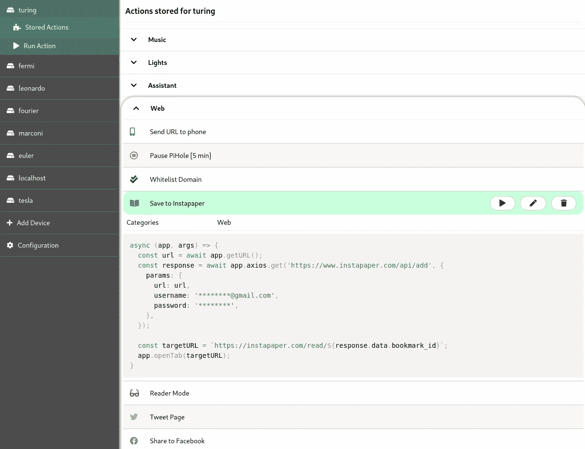
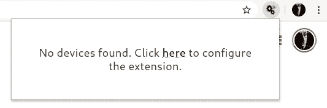
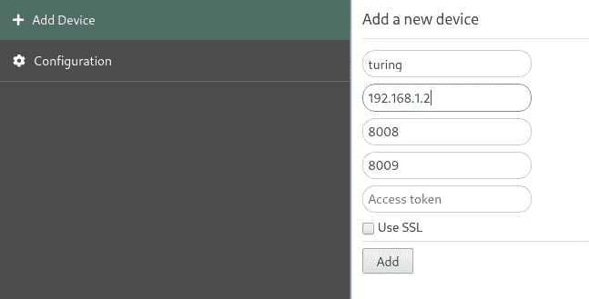
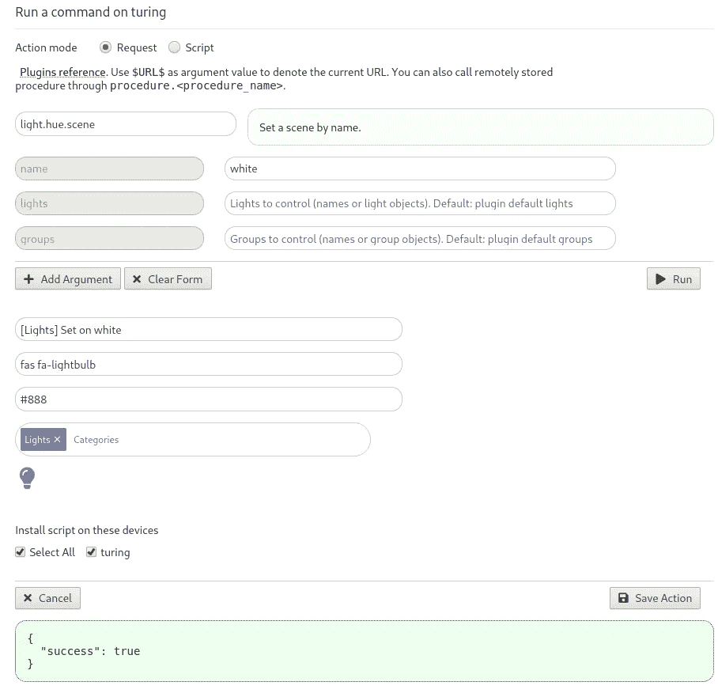
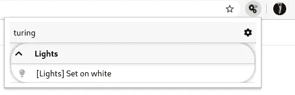
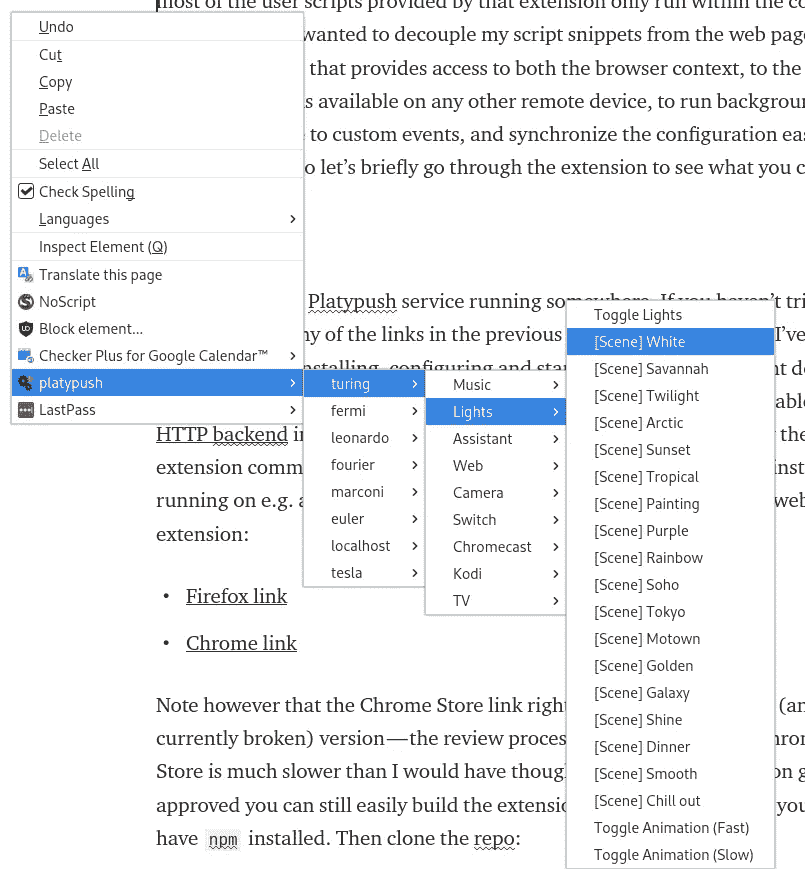
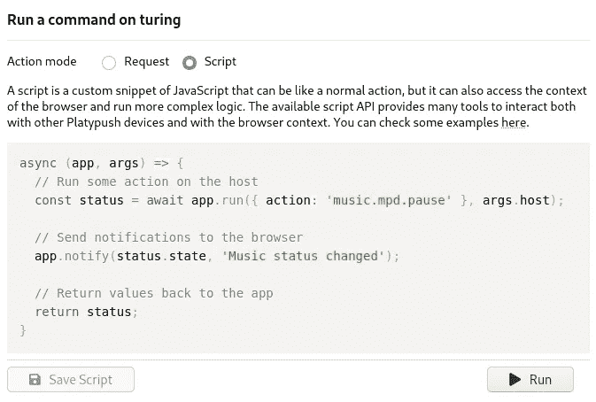
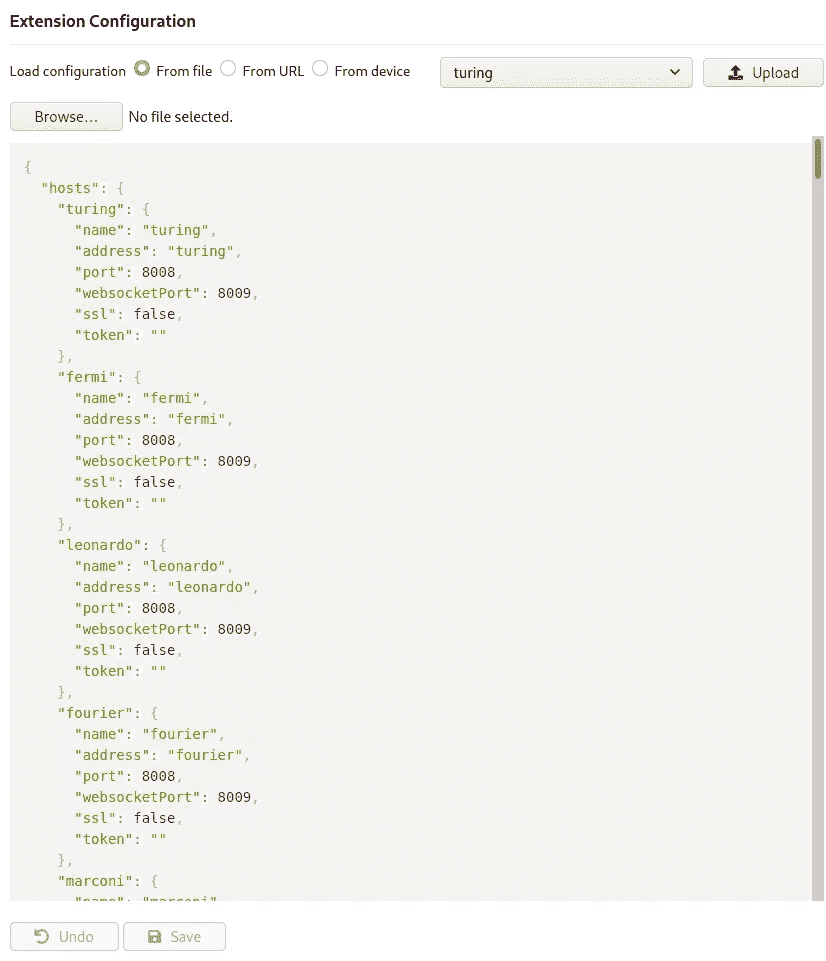

# 一个浏览器扩展来管理它们

> 原文：<https://betterprogramming.pub/one-browser-extension-to-rule-them-all-3118dc7f9c9b>

## Platypush web 扩展如何使定制浏览器和连接东西变得容易



使用 Platypush 浏览器扩展在浏览器中部署自定义脚本和动作。

*这篇文章的更新版本可以在* [*Platypush 博客*](https://blog.platypush.tech/article/One-browser-extension-to-rule-them-all) *上找到。*

曾几何时，在万维网上，web 扩展仍然是新玩物，支持它们的主要浏览器(即 Firefox 和 Chrome)并不介意为它们提供非常广泛的内部访问和 API 来做(或多或少)他们喜欢的任何事情。他们的想法是，这些浏览器插件/应用程序/扩展(当时它们之间的界限还很模糊)可以成为一种强大的方式，在浏览器内(甚至在本地，不连接到另一个网站)运行用户想要运行的任何软件。

这是一个强大的扩展诞生的时代，这些扩展也可以深刻地改变浏览器中的许多东西(比如现在已经失效的 [Vimperator](http://vimperator.org/) 可以完全重新设计浏览器的 UI，使其看起来和行为都像 vim)，而[用户脚本](https://en.wikipedia.org/wiki/Userscript)是一种强大的方式，用户可以利用它在他们喜欢的任何地方运行他们喜欢的任何东西。我过去经常使用 Vimperator 自定义脚本来将我想要的任何按键序列映射到我想要的任何自定义动作——只是建模为普通的 JavaScript。我过去也经常使用用户脚本——那些仍然存在，但是比以前有更多的限制。

网络扩展和应用的狂野西部时代现在已经一去不复返了。没过多久，恶意行为者就意识到，给予 web 扩展的自由使它们成为直接在浏览器中运行恶意软件/间谍软件的完美载体，在许多情况下，它们可以绕过几个反恶意软件层。web 扩展的产生还有另一个关于碎片的问题。Firefox 和 Chrome 都开发了自己的 API(比如 Mozilla 的 [XUL](https://www.zdnet.com/article/mozilla-changes-firefox-apis-developers-unhappy/) 和 [Chrome Apps](https://blog.chromium.org/2016/08/from-chrome-apps-to-web.html) ),没有太多重叠。这使得开发针对多种浏览器的 web 扩展成为一种非常昂贵的体验，而且许多扩展和应用程序只适用于特定的浏览器。

对更高安全性、关注点分离和更少碎片的需求推动了向现代 [WebExtension API](https://wiki.mozilla.org/WebExtensions) 的迁移。2017 年底左右， [Mozilla](https://www.zdnet.com/article/mozilla-changes-firefox-apis-developers-unhappy/) 和 [Google](https://blog.chromium.org/2016/08/from-chrome-apps-to-web.html) 都在各自的浏览器中结束了对之前 API 的支持。他们还对商店上未批准的插件和脚本增加了更多限制(Firefox 的最新版本只允许你永久安装商店上发布的扩展)，并在审查过程中增加了更多限制和检查。

新的 API 使恶意行为者更难通过浏览器攻击用户，也大大降低了开发跨浏览器扩展所需的障碍。然而，另一方面，它也大大减少了提供给扩展的自由度。几个需要与浏览器深度集成的扩展(如 Vimperator 和 Postman)决定要么迁移到独立的应用程序，要么放弃他们的努力。用户脚本已经变得更加小众，比第三方扩展提供的限制更多，如[grease monkey](https://addons.mozilla.org/en-US/firefox/addon/greasemonkey/)/[Tampermonkey](https://chrome.google.com/webstore/detail/tampermonkey/dhdgffkkebhmkfjojejmpbldmpobfkfo?hl=en)。Firefox 最近的[用户脚本 API](https://www.ghacks.net/2019/03/27/firefox-support-user-scripts-api/) 是复兴过去浪潮力量的一个有希望的选择，但是到目前为止它只被 Firefox 支持。

作为一名超级用户，虽然我理解浏览器开发者决定对扩展进行更多防护/沙箱化的所有动机，但我仍然怀念那些我们可以深度定制浏览器以及它可以按照我们喜欢的方式做什么的时候。多年来，我构建了 [Platypush](https://github.com/Blacklight/platypush) 来解决我对后端无止境的可扩展性和定制的需求，一切都由一个统一一致的 API 和平台提供(对于那些还不熟悉它的人，请查看[自述文件](https://github.com/Blacklight/platypush)或 GitHub 页面上的 Wiki 中引用的中型文章来开始)。我认为将同样的哲学应用到我的 web 浏览器环境中是很自然的下一步。通过 Platypush web 扩展，我试图为许多高级用户面临的多种需求构建一个解决方案。

首先，我们有几个后端解决方案来运行事物，还有智能家居设备来做事情和传递信息。但亲爱的 ol '桌面网络浏览器在自动化的这一进步中往往被落在了后面，即使许多人仍然通过桌面设备在网络上花费大量时间。大多数云/家庭自动化的前端解决方案都来自移动应用。一些自动化解决方案提供了一个 web 应用程序/面板(Platypush 也是如此)，但在一个日益以移动为中心的世界中，web 面板越来越不受重视。

即使你的解决方案提供了一个 web 应用，还有另一个重要因素需要考虑:行动的时间。从你想到“我想在那个设备上运行这个操作”到在那个设备上实际执行这个操作之间过了多长时间？请记住，尤其是对于智能设备而言，“智能”方式下的行动时间(就像你远程开关灯泡)永远不应该比“笨”方式下的行动时间(就像你站起来开关)长。这是你的底线。

当我在笔记本电脑上工作时，我有时可能想在另一台设备上运行一些操作，例如向我的手机发送链接，打开灯或风扇，在我的媒体中心播放笔记本电脑上当前播放的视频，在我的卧室或客厅播放 Spotify 播放列表，等等。当然，对于其中的一些问题，有一个 Platypush/home assistant/open hab/big corp Inc .的前端解决方案，但这通常需要你将手从笔记本电脑上拿开以抓住你的手机，或者使用你的平台提供的 web 应用程序打开/切换到标签，搜索正确的菜单/选项，滚动一点，然后运行该操作。语音助手是另一种选择(Platypush [提供集成](https://medium.com/better-programming/building-your-custom-voice-assistants-an-overview-of-the-current-solutions-and-integrations-d8db227a325)，让你接触到周围的许多语音技术)，但一天中用你的方式运行任何事情还不是许多人想要的无摩擦和快速的过程——也不应该是唯一的*方式。对我来说，最小化动作时间意味着能够从任何选项卡或工具栏本身运行该动作(理想情况下最多三次点击或击键)，而不管该动作。*

当然，有一些网络扩展可以解决这些问题。但这通常包括:

*   依靠别人的解决方案来解决你的问题，而这个解决方案对于你的用例来说不一定是最优的。
*   用大量的扩展来污染你的浏览器，以便执行不同类型的动作。向其他设备发送链接可能涉及安装 push pullet/Join 扩展、在 Kodi 的另一个扩展上播放媒体、在 Chromecast 的另一个扩展上播放媒体、保存到 Instapaper/Evernote/Pocket 或其他扩展的链接、在 Twitter/脸书上分享更多扩展、控制智能家居中枢的又一个扩展……等等，直到浏览器的工具栏挤满了图标，而你甚至无法回忆起其中一些是做什么的——这违背了从 web 浏览器的上下文中优化操作时间的整个目的。
*   当然，安装太多的扩展会增加针对您的浏览器的潜在攻击面——这是 WebExtensions API 最初应该解决的问题。

我首先通过构建一个简单的 web 扩展开始了这段旅程，我可以使用它通过 web API/websocket/MQTT 快速调试在我家周围的其他 RaspberryPis 和智能设备上执行的 Platypush 命令。然后，我意识到我可以使用相同的解决方案来解决我的优化行动时间的问题，即“当我在笔记本电脑上处理我的中型文章时，我想现在就开灯，而不用拿起我的手机或切换标签或站起来。”这意味着要么从工具栏本身(最好将所有操作都分组在同一个扩展按钮和 UI 下)，要么通过右键单击上下文菜单，如本地浏览器操作。从我的浏览器在任何远程设备上运行任何 Platypush 动作的能力意味着我可以从同一界面控制任何设备或远程 API，只要有 Platypush 插件与该设备/API 交互。

但是这个目标对我来说还不够。并不是所有我想从浏览器中的任何位置运行的动作都可以转换成原子的 Platypush 动作。Platypush 远程过程肯定有助于在后端运行更复杂的逻辑，但我希望该扩展也涵盖我的需要与浏览器上下文交互的用例——比如“在我的 Chromecast 上播放该视频(是的，即使我在 Firefox 上)”，“翻译该页面并确保结果看起来不像 1997 年的网站(是的，即使我在 Firefox 上)”，“直接在我的 NAS 上下载该 Magnet 链接”，等等。一直到自定义事件挂钩，这些事件挂钩可以对浏览器中运行自定义逻辑的其他设备触发的 Platypush 事件做出反应，比如“如果另一个 Platypush 设备发送`[ClipboardEvent](https://platypush.readthedocs.io/en/latest/platypush/events/clipboard.html)`，则同步笔记本电脑上的剪贴板”，“当 Google Assistant 插件触发`[ResponseEvent](https://platypush.readthedocs.io/en/latest/platypush/events/assistant.html#platypush.message.event.assistant.ResponseEvent)`时，向浏览器发送带有语音文本的通知”，或者当传感器超过某个阈值时，等等。

我希望能够通过类似于 Greasemonkey/Tampermonkey 提供的 JavaScript 本地 API 来定义所有这些操作。但是，虽然这些扩展提供的大多数用户脚本只能在网页的上下文中运行，但我希望将我的脚本片段从网页中分离出来，并构建一个 API 来提供对浏览器上下文、任何其他远程设备上可用的 Platypush 操作的访问，以运行后台代码来响应自定义事件，并轻松地跨设备同步配置。所以让我们简单地浏览一下这个扩展，看看你能用它做些什么。

# 安装和使用

首先，您需要一个在某个地方运行的 Platypush 服务。如果您以前没有尝试过，请参考前面几节中的任何链接开始(我保证安装、配置和启动一个基础环境不会超过五分钟:)。另外，确保您在`config.yaml`中启用了 [HTTP 后端](https://platypush.readthedocs.io/en/latest/platypush/backend/http.html)，因为 webserver 是扩展用来与服务器通信的通道。一旦在 RaspberryPi、另一台服务器或您的笔记本电脑上运行了 Platypush 实例，请获取 web 扩展:

*   [火狐链接](https://addons.mozilla.org/en-US/firefox/addon/platypush/)
*   [Chrome 链接](https://chrome.google.com/webstore/detail/platypush/aphldjclndofhflbbdnmpejbjgomkbie?hl=en-GB&authuser=0)

您也可以从源代码构建一个扩展。首先，确保您已经安装了`npm`,然后克隆 repo:

```
git clone [https://github.com/BlackLight/platypush-webext](https://github.com/BlackLight/platypush-webext)
```

安装依赖项并构建扩展:

```
npm install
npm run build
```

在这个过程的最后，您应该有一个带有`manifest.json`的`dist`文件夹。

*   在 Chrome(或任何基于 Chrome 的浏览器)中，进入扩展->加载解包并选择`dist`文件夹。
*   在 Firefox 中，进入`about:debugging`->This Firefox->Load Temporary Add-on，选择`manifest.json`文件。

请注意，Firefox [的最新版本仅支持](https://blog.mozilla.org/addons/2018/02/22/removing-support-unpacked-extensions/)通过`about:debugging`解压的扩展(即 Firefox 附加组件网站上未加载的任何扩展)。这意味着当浏览器重新启动时，任何临时扩展都将丢失——然而，在重新安装时恢复 Platypush 扩展的配置是一个非常快速的过程。

一旦安装在浏览器中，扩展图标将出现在工具栏中。



全新安装时的板状延伸

单击可用链接打开扩展配置选项卡，并在配置中添加您的 Platypush 设备。



设备配置

添加设备后，从菜单中单击其名称，然后选择运行操作。



在动作/请求模式下运行/调试/保存 Platypush 动作

“运行”选项卡有两种模式:请求和脚本模式。在请求模式下，你可以通过一个动态界面直接在一个远程的 Platypush 设备上运行动作。您已经有了一个带有自动完成菜单的表单，该菜单显示了您的设备上所有可用的操作，选择后，该表单会预填充该操作的所有可用参数、它们的默认值和描述。这个界面非常类似于 Platypush web panel 提供的 execute 选项卡，它使在另一台主机上快速测试和运行命令变得非常容易。

只要安装并配置了插件，您就可以使用该界面在任何远程设备上运行任何操作——文件系统管理、媒体中心控制、语音助手、摄像头、开关、从传感器获取数据、管理云服务，等等。您还可以运行存储在远程设备上的过程——它们的动作名称以`procedure`开头——您还可以通过使用特殊变量`$URL$`作为动作值，将活动选项卡中的 URL 作为参数传递给动作。例如，您可以使用它创建一个动作，通过`[pushbullet.send_note](https://platypush.readthedocs.io/en/latest/platypush/plugins/pushbullet.html#platypush.plugins.pushbullet.PushbulletPlugin.send_note)`将当前 URL 发送到您的移动设备，同时将`body`和`url`设置为`$URL$`。一旦您对您的操作满意，您可以保存它，以便它在工具栏和浏览器上下文菜单中都可用。

如果你只需要一种从你的浏览器远程执行 Platypush 动作的方法，这就是你所需要的。该操作现在可从扩展工具栏中获得:



从上下文菜单中:



您可以从扩展的配置页面中的 stored action 选项卡轻松地调试/编辑存储的操作。

另一种(也是最强大的)定义定制动作的方法是通过脚本。脚本可以用来将 Platypush API(或任何其他 API)和浏览器 API 粘合在一起。

从*运行动作*选项卡顶部的选择器中选择`Script`。您将看到一个带有预加载脚本模板的 JavaScript 编辑器:



Platypush 扩展中的脚本模式

该页面还提供了一个链接，链接到显示所有可用 API 示例的要点。简而言之，这些是您可以用来构建用户脚本的最重要的部分:

*   `args`包含脚本的相关上下文信息，比如目标 Platypush `host`、`tabId`和`target`元素，如果动作是从页面上的上下文菜单调用的话。
*   `app`公开脚本可用的 API。

`app`曝光的方法中:

*   `app.getURL`返回活动标签中的 URL。
*   `app.setURL`改变当前标签中的 URL，而`app.openTab`在新标签中打开一个 URL。
*   `app.notify(message, title)`显示浏览器通知。
*   `app.run`在远程 Platypush 设备上执行操作。

例如，这是将 YouTube 视频播放到默认 Chromecast 设备的可能操作:

*   `app.axios.[get|post|put|delete|patch|head|options]`:该 API 还公开了 [Axios](https://github.com/axios/axios) API 来执行对远程端点的定制 AJAX 调用。例如，如果您想要将当前 URL 保存到您的 Instapaper 帐户:

*   `app.getDOM`返回当前页面的 DOM/内容(作为`Node`元素)，而`app.setDOM`替换页面的 DOM/内容(作为字符串给出)。例如，您可以将提供的 DOM API 与 [Platypush 翻译插件](https://platypush.readthedocs.io/en/latest/platypush/plugins/google.translate.html)结合起来，即时翻译网页:

*   扩展 API 还公开了 [Mercury Reader API](https://github.com/postlight/mercury-parser) 来简化/提炼网页内容。您可以将目前看到的元素合并到一个脚本中，该脚本可以简化网页的内容，以获得更好的可读性，或者使其更便于打印:

*   最后，如果您通过上下文菜单运行操作(例如，右键单击页面上的一个项目)，您可以访问`target`元素。由于 WebExtensions API 的限制(只能传递 JSON-serializable 对象)，`target`元素作为字符串在`args`上传递，但是您可以通过`app.HTML2DOM`方法轻松地将其转换为 DOM 对象(并且您可以将任何 HTML 转换为 DOM)。例如，您可以将最初的 YouTube 扩展到 Chromecast 用户脚本，以播放页面上出现的任何音频或视频项目:

有了这些基本块，您应该能够创建任何您想要的自定义浏览器操作。一些例子:

*   通过 [Platypush 网页简化插件](https://platypush.readthedocs.io/en/latest/platypush/plugins/http.webpage.html)将当前网页转换为 PDF，并通过 [Platypush GMail 插件](https://platypush.readthedocs.io/en/latest/platypush/plugins/google.mail.html)将其作为附件发送到您的 Kindle。
*   向某人发送包含页面上所选文本的电子邮件。
*   即时翻译页面上选定的一些文本。
*   分享当前到 Twitter/脸书/LinkedIn 的链接(抛弃所有其他分享到社交的扩展)。
*   将页面上的 magnet/torrent 链接直接下载到您的 NAS。

# 配置备份和恢复

最后，您可以通过*配置*选项卡轻松编辑、备份和恢复扩展配置。配置既可以加载/复制到文件，也可以从 Platypush 设备恢复/远程备份到 Platypush 设备(看 ma，没有云！)，或者从 URL 加载。



# 正在进行的工作

该扩展仍在开发中，我对建议、票证和 [GitHub 页面](https://github.com/BlackLight/platypush-webext)上的请求持开放态度。具体来说，我的路线图上接下来有两个功能:

## 与 Platypush web 套接字协议集成

这将允许许多有趣的功能，例如检查远程设备的健康状态，传输更大块的数据(如来自远程设备的音频/视频流)，最重要的是，设置事件挂钩——当平板推送设备触发事件时自动运行的脚本，如语音助手响应处理、媒体状态改变、灯光场景改变、接收到新的传感器数据等。

## 通过 API 支持第三方库

到目前为止，脚本 API 公开了`axios`和`mercury`解析器库，但是我相信为了灵活性，应该可以通过简单的方式在用户脚本中导入外部库:

```
const jquery = app.loadScript('https://some.cdn/jquery.min.js');
```

最终，如果这个项目获得足够的支持，我很乐意创建一个用户可以分享他们的创作的资源库——只要我们都记住，能力越大，责任越大:)

# 结论

我理解导致采用 WebExtensions API 的安全性和一致性问题。但我也理解为什么许多依赖于与浏览器更深层次集成的扩展拒绝与新的 API 妥协，并在此期间停止使用。

我自己用新的 API 开发了这个扩展，因为当前的 WebExtensions API 创建了许多沙箱，它只让特定上下文(如后台脚本、内容脚本或弹出上下文)可以访问信息片段，它迫使需要信息和功能的开发人员设置复杂的消息传递系统来传递数据。它还对哪些代码可以在哪里执行进行了严格的限制(祝你在代码中使用`eval`时好运)。通过 Platypush web 扩展，我试图填补以前的扩展/应用程序/附加组件 API 的废弃所留下的空白，并为高级用户提供一个层来深度定制他们浏览器的行为。我还想构建一个扩展，可以让我从同一个用户界面和同一个按钮上轻松访问我周围越来越分散的智能设备世界。我也厌倦了看到工具栏上的空间被成吨的扩展图标吞噬，这些图标只能执行一个特定的任务！