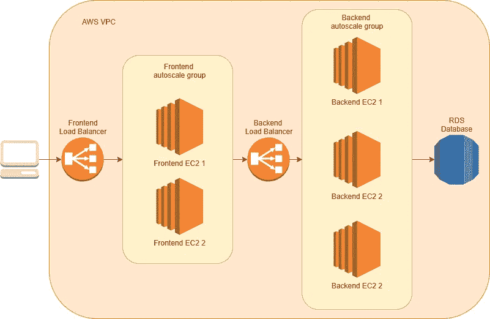
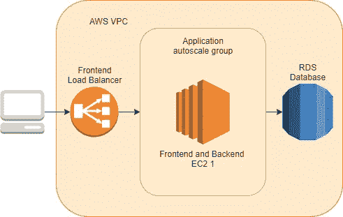
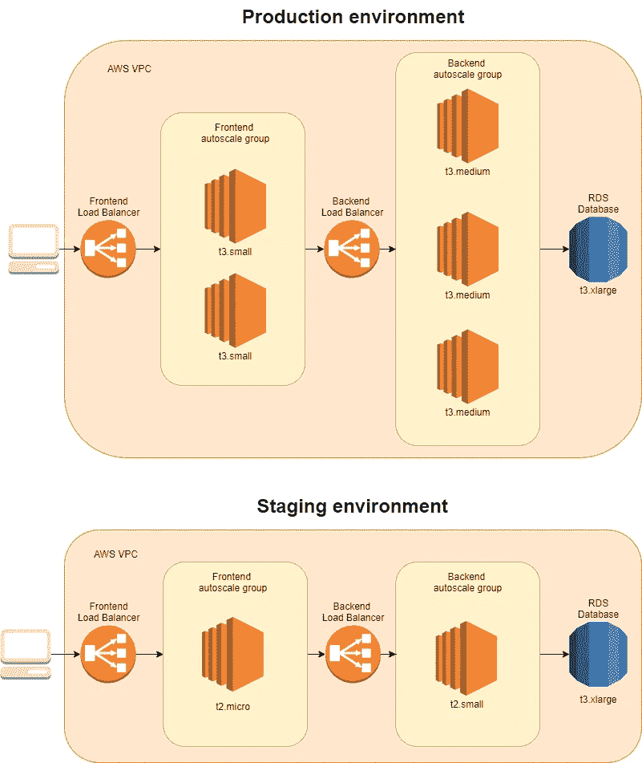

# 一个统治他们的环境

> 原文：<https://betterprogramming.pub/one-environment-to-rule-them-all-d72858ffda22>

## 将基础设施开发为代码时使用环境模板的优势


图片来源:[goodfreephotos.com](https://www.goodfreephotos.com/public-domain-images/lord-of-the-rings-the-one-ring.jpg.php)

你早早地来到办公室，渴望从事一个有很多有趣的东西和新技术的新项目。

您的第一个任务是建立一系列环境:一个闪亮的、新的、空的生产环境和一些生产前环境，供开发人员和您自己使用。只有一个条件:你必须使用基础设施作为代码，就像任何像你这样伟大的 DevOps 程序员应该做的那样。

# 成本过度优化

该架构非常简单:前端、后端和数据库层的经典三层架构，各层之间有一些平衡器。



要实施的架构

设置继续进行，在几个小时内，所需的基础设施需求就得到满足。

现在是建立其他环境的时候了，但是我们关心的是成本优化。在试运行环境中，我的团队是否需要四个副本用于后端？数据库呢？t3 .中型就够了，不需要 T3 . x 大型。

最终，我们意识到对于非生产性环境，没有必要分离层。因此，我们合并了前端和后端的基础架构。



登台环境的体系结构

这里是红旗开始飘扬的地方。为了成本过度优化，我们是否要改变架构团队交付给我们的闪亮而纯粹的架构，或者更糟糕的是，由我们自己来改变？*哦，上帝，闭嘴，你这个势利的 DevOps 作家；不是生产环境的问题。*好吧，让我们及时向前跳跃。

# 节约…但代价是什么？

产品已经交付，现在开发只是减少到错误修复和新特性。作为 DevOps，基础设施需要有维护。

由于我们在架构上的改变，我们最终得到了如下的代码结构:

```
terraform/
├── production/
│   ├── main.tf
│   ├── frontend.tf
│   ├── backend.tf
│   ├── database.tf
├── staging/
│   ├── main.tf
│   ├── app.tf
│   ├── database.tf
```

除了架构上的明显变化(这是一个巨大的气味)，还有一个很大的代码气味:代码重复。由于我们的改变，我们需要有两个不同的目录，其中大部分是相同的代码。但是为什么呢？

首先，这是为了维护每个不同环境的状态，因为它们不是由同一个地形状态管理的。

其次，这是因为现在层之间的集成已经改变，因此一些代码块，如层之间的安全组或自动缩放组，可能是不必要的。

这种代码重复的结果是，存在一个大问题，那就是我们如何向平台引入变化。对于配置之类的简单改动，可能比较容易。我们只需要转到适当的文件并更改值。但是如果基础设施需要新特性呢？这将导致我们编写新代码，然后测试它。

如上所述，对于新特性，必须编写新代码。它已经在试运行环境中测试过了，如果运行良好，在生产环境中也应该如此。但是有一个很大的 *if* :当且仅当集成和其他流程与产品化环境中的相同时，新特性才能在产品中正常工作。我们能做出这样的假设吗？简单来说，不是。

对于不同的环境，我们的代码是不同的。因此，向基础设施部署新功能将是一个巨大的挑战，因为它涉及到对每个环境的编码和测试功能。

# 一个统治他们的环境

我们手中有什么可以避免这个问题？这里是我喜欢称之为*的建模架构*。软件开发人员有一种叫做*面向对象编程*的东西，他们定义一个类，然后用不同的值创建那个类(对象)的实例。然后他们只需要用一个对象来测试这个类，并且他们可以确定这个测试通过了同一个类的其他对象。难道这种想法不能作为代码应用于基础设施吗？

为此，我们必须使用代码来严格定义架构，将配置值作为变量。这样，我们可以在文件中为每个环境定义配置，而各部分之间的集成只需要测试一次。由于配置依赖性，这可能无法确保在产品中也能实现，但它使在环境中部署、测试和调试更改变得非常容易。



使用环境蓝图的环境

最后，我们可能会完成一个新的代码结构，如下所示:

```
terraform/
├── variables/
│   ├── production.tfvars
│   ├── staging.tfvars
├── main.tf
├── frontend.tf
├── backend.tf
├── database.tf
```

这样，我们就构建了一个环境蓝图，可以用来部署不同的环境。每个新环境都有一个独立的状态，而不需要代码复制。