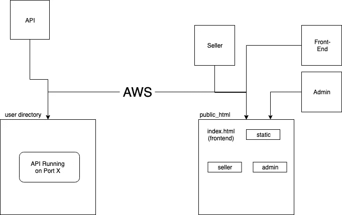
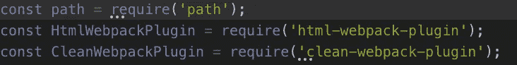
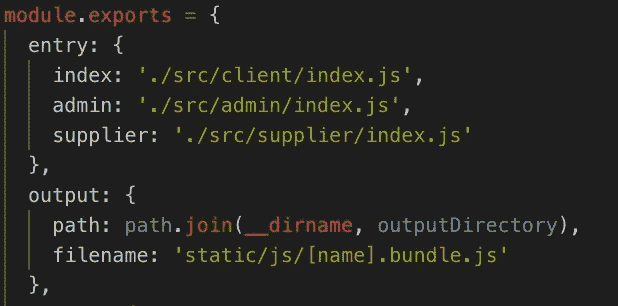
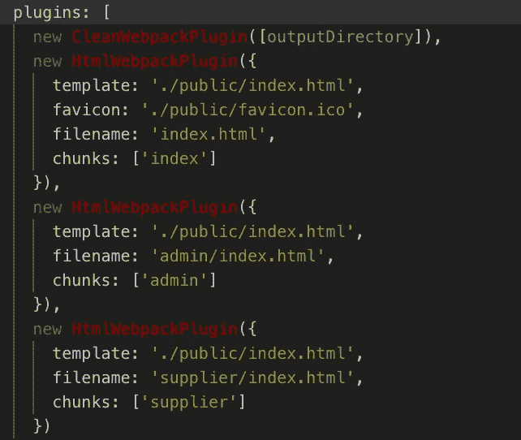
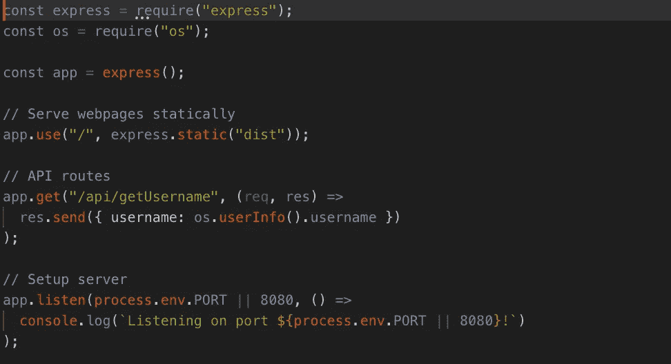

# 一个快速服务器，无限的反应应用

> 原文：<https://betterprogramming.pub/one-express-server-unlimited-react-apps-9ea875863f2e>

React 和 [Express](https://expressjs.com/) 显然是 web 开发技术方面的佼佼者。它们是 MEAN ( [Mongo](https://www.mongodb.com/) ，Express， [Angular](https://angular.io/) ， [Node](https://nodejs.org/) )或 MERN (Mongo，Express，React，Node)栈的一部分，被开发者广泛使用。

有很多资源可以学习如何构建完整的 stack React 应用程序，其中很多都使用类似的模式来实现这一目标。

# 将一个 Express 服务器路由到多个 React 应用程序

一段时间以来，我遇到的一个问题是将一个 Express 服务器路由到多个 React 应用程序，以简化生产过程。它将使事情变得易于维护、可伸缩和部署到云服务。

我的情况是一个包含三个不同部分的网站:管理员面板、销售者面板和前端，这基本上是世界(用户)可以访问的。

我最初着手解决这个问题的方法是将每个部分拆分到它自己的 React 应用程序中，有自己的 [npm](https://www.npmjs.com/) 文件夹。

当涉及到部署时，我会在服务器的一个端口上运行我自己的 API，并构建每个应用程序，以便将它们部署到我的 [AWS](https://aws.amazon.com/) 服务器上的 public_html 文件夹中。

React 应用程序显然指向 AWS EC2 实例链接，该链接带有我为 API 打开的端口。

下图更好地展示了我过去使用的架构。

所以基本上，API 使用永久 npm 模块运行。React 应用程序是单独构建的，放在你正在使用的服务器的公共文件夹中。

基本 index.html 和静态文件夹是前端 React 构建的输出，其他的在文件夹中，你可以通过链接并在你的资源中添加一个斜杠来访问它们。

例如:

*   [https://www.domain.com](https://www.domain.com)(用于前端)
*   [https://www.domain.com/seller](https://www.domain.com/seller)(卖家面板)等。

这是一个让多个 React 应用程序连接到一个 API 的解决方案，而不需要 Express 服务器为应用程序提供服务。

它可以工作，但不是最有效的解决方案，尤其是在开发和部署方面。你必须不断地构建这三个应用程序。

此外，如果您决定添加越来越多的出口供不同类型的用户访问，那么它将无法很好地扩展。

# 如何实现这一点

在研究并回到如何开发 full stack React 应用程序的最初方式后，我决定让一个 Express 服务器为应用程序提供服务，并根据用户访问的路径为正确的服务器提供服务。

我在网上找到了几个关于如何使用 Express 服务器为多个 React 应用提供服务的教程，但是它们要么不能正常工作，要么不是很简单。

为了遵循我的解决方案，你需要克隆我的 [GitHub repo](https://github.com/PierreJC/react-full-stack-multiple) 。自述文件为您提供了许多您需要的信息，但我将在下面讨论关键部分。

在这个 repo 中，我参考了 [crsanddeep](https://github.com/crsandeep/simple-react-full-stack) 对典型的全栈 React 应用的 repo，扩展了 [webpack](https://webpack.js.org/) 配置，并改变了服务器为不同文件提供服务的方式。

关键的部分是 webpackwebpack 是一个模块捆绑器。它的主要目的是捆绑 JavaScript 文件，以便在浏览器中使用。

webpack 配置文件是奇迹发生的地方，我们将从它开始。

1.  确保你已经安装了 webpack 插件`HtmlWebpackPlugin`。
2.  之后，我们开始将它导入文件。

导入 HtmlWebpackPlugin。CleanWebpackPlugin 只是一个额外的工具，在重新生成之前清理构建文件夹。路径是导入的，因为它用于计算不同的路径，等等。

3.定义多个入口路径，并使用`[]`语法将输出名称更改为动态名称。这将为每个路径生成一个包，并存储在分发文件夹`dist/static/js/**x**.bundle.js`下。

src 文件夹中的每个 react 应用程序都有多个条目，并且 **filename** 属性使用[name]标签来标识使用上面定义的条目名称来更改包名称。

4.最后，您需要为每个 React 应用程序定义多个`HtmlWebpackPlugin`实例。

三个页面的三个 HtmlWebpackPlugin 条目。如你所见，这可以很容易地扩展。

上面的`HtmlWebpackPlugin`告诉 webpack 为路径中的每个条目生成一个`index.html`，并将其存储在一个子文件夹中。

如你所见，主前端存储在根中；filename `index.html`和其他文件都有各自目录下的文件名。

在定义了 webpack 配置文件(这应该很简单)之后，您可以进入位于`src/server/index.js`中的服务器文件，您将看到服务器指向您的构建文件夹(在我们的例子中是`dist/`)。

如果您有服务器端开发的经验，您应该能够扩展并让您的 Express 服务器基于所访问的路径做更多疯狂的事情。

app.use("/"，…)告诉 Express 静态文件在哪里。

上面的代码片段展示了如何根据用户访问的链接，定制 Express 来为存储在`dist`文件夹中的不同目录提供服务。

你可以看出这种做事方式是非常可扩展的。

添加越来越多的 React 应用程序(或页面，无论你想叫它们什么)，拥有自己独立的模块，非常容易做到。您需要添加一个条目和一个新的`HtmlWebpackPlugin`实例。

# 结论

感谢阅读。我一直想找到这个问题的解决方案，我很高兴与你分享。