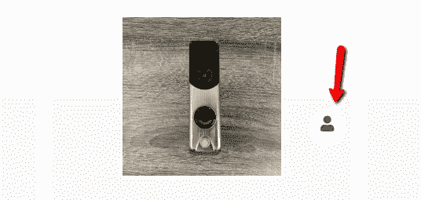

# 最常见的网页可访问性错误之一

> 原文：<https://betterprogramming.pub/one-of-the-most-common-web-accessibility-mistakes-9823b94491fb>

## 网页可访问性很重要


照片由[米歇尔·亨德森](https://unsplash.com/@micheile?utm_source=medium&utm_medium=referral)在 [Unsplash](https://unsplash.com?utm_source=medium&utm_medium=referral) 上拍摄

网页可访问性真的很重要，不仅因为你将为你的网站带来更多的流量或道德困境，还因为根据这项最近的研究显示，由视力障碍者发起的三分之二的互联网交易以放弃告终，因为他们访问的网站不够可访问。

*话虽如此，我不得不诚实地说:在我从事 web 开发的七年中，我对 web 可访问性不够关心。我在编写代码的时候没有考虑到可访问性，直到有一天我在做一个项目，一张吉拉的票敲了我的门。*

*那个项目是基于 Magento 核心的，但是它也有巨大的自定义特性——模块、插件和自定义 UI。由于这个原因，或者因为我们太匆忙，我们忘记了在我们创建的组件中添加基本的 web 可访问性标准。我们忽略了 IMG 标签、表单标签、页面标题、aria-label 或其他 web 可访问性标准的可选文本(ALT)属性。*

*为了解决这个问题，需要在商店的所有电子商务平台元素中为所有 IMG 标签、aria-label、title 和 role 属性添加 ALT 属性。我对网页可访问性标准有所了解，所以我首先着手解决这个问题。*

# *向所有 IMG 标签添加可选文本(ALT)*

*除非另有说明，否则必须指定`alt`属性，并且其值不得为空。*

*这很容易。我只需要找到所有出现的 IMG 标签，然后相应地设置客户端给出的替代文本。就是这样！*

*然而，客户接着问“图标呢？我们是否也应该为它们设置一个替代文本？”我不得不承认，我被这个特殊的场景击中了。我想到了下一个问题:*

# *我应该给标签添加 ALT 或 Title 属性吗？*

*我试图修改的代码片段没有任何`IMG`标记，但是有一个`SPAN`标记作为包装器，并且在它里面有一个`<i>`标记设置为字体很棒的图标。正如你可能知道的，这是根据官方的 FontAwesome 文档的方法——被数百万网站所知和使用。*

# *修复前编码*

```
*<span class="pro-install-box">
    <div class="tooltip-container">
      <div class="tooltip-container__text">Requires Professional          Installation</div>
     <div class="tooltip-container__arrow"></div>
   </div>
   <i class="fas fa-user"></i>
</span>*
```

*红色箭头指向我们需要描述的图标:*

**

*图标表示产品需要专业安装*

*当时，我不知道一个`<i>`标签是否支持`ALT`属性，或者设置它是否是一个好习惯。如果我知道`<i>`标签是用来编文字的呢？常识告诉我，给它设置一个`ALT`属性并不是一个好主意。*

*毫无疑问，我需要依靠我最亲密的朋友谷歌。在花了一些时间做研究后，这是我发现的。*

# *网页可访问性倡议对 ALT 有什么建议？*

*基于[Web Accessibility Initiative(WAI)](https://www.w3.org/WAI/fundamentals/accessibility-principles/#alternatives)我们应该将`ALT`文本添加到非内容中，例如图像的简短等价物，包括图标、按钮和图形，图表、图示和插图上表示的数据描述。*

**`*ALT*`*属性的值不应该包含可能被认为是图像说明、标题或图例的文本。它应该包含可供用户使用的替换文本，而不是图像。***

**— [HTML 4.01 规范，13.2](http://www.w3.org/TR/html401/struct/objects.html)**

# **基于图像用途的适当 ALT 属性**

**为了更好地理解这一点，让我们来讨论如何根据图像的用途提供合适的 ALT 属性。**

## **信息图像**

**以图形方式表示概念和信息的图像，通常是图片、照片和插图。替代文本至少应该是传达图像所呈现的基本信息的简短描述。**

## **装饰图像**

**当图像的唯一目的是给页面添加视觉装饰，而不是传达理解页面的重要信息时，提供空文本替代(`alt=” ”`)。**

## **功能图像**

**用作链接或按钮的图像的文本替换应该描述链接或按钮的功能，而不是视觉图像。例如,“关闭”按钮有一个关闭的图标来表示注销操作。**

## **文本图像**

**可读的文本有时出现在图像中。如果图像不是一个标志，避免图像中的文字。但是，如果使用文本图像，文本替换应该包含与图像相同的单词。**

## **复杂图像**

**比如图形和图表。要传达数据或详细信息，请提供图像中提供的数据或信息的全文等效文本作为文本替代。点击阅读更多关于此[的信息。](https://www.w3.org/WAI/tutorials/images/)**

**如果你有兴趣学习更多关于 ALT 属性和你应该在什么情况下使用它，t [这是一个 ALT 决策树教程是一个很好的基准。](https://www.w3.org/WAI/tutorials/images/decision-tree/)**

**现在我们对 ALT 和 image 概念有了更多的了解，我们准备实施我们的解决方案。**

# **可访问的富互联网应用程序(ARIA)**

## **方法 1**

**让我们利用新的 [WAI-ARIA](https://www.w3.org/WAI/standards-guidelines/aria/) 规格，特别是当我们使用令人敬畏的字体图标时。因此，让我们依靠`role, aria-label and aria-hidden`属性来提高可访问性。**

```
**<span class="pro-install-box">    
    <div class="tooltip-container">
      <div class="pro-tooltip-text">Requires Professional            Installation</div>
     <div class="product-tooltip-arrow"></div>
   </div>
   <i aria-label="Requires Professional Installation" role="presentation" class="fas fa-user"></i>
</span>**
```

**我们使用`role="presentation"`来移除元素的隐式本地角色语义。在这种情况下，我们在使用`<i>`元素的同时，删除了使用图标的本地语义角色。**

**`[aria-label](https://www.w3.org/WAI/PF/aria-1.1/states_and_properties#aria-label)`提供了一个标记元素的字符串值。通过这样做，我们为辅助技术的用户，比如屏幕阅读器，提供了一个鼠标经过的对象的可识别名称。**

**换句话说，`aria-label`属性定义了一个不可见的标签，在这里一个可见的标签不能被使用。在文本标签在屏幕上不可见的情况下使用它。**

## **方法 2**

**第二种解决方案是使用`role="img"`让我们的图标充当图像:**

```
**<span class="pro-install-box">    
    <div class="tooltip-container">
      <div class="pro-tooltip-text">Requires Professional            Installation</div>
     <div class="product-tooltip-arrow"></div>
   </div>
   <i aria-label="Requires Professional Installation" role="img" class="fas fa-user"></i>
</span>**
```

# **结束语**

**网页可访问性很重要。我们的使命是给每一个用户，无论在什么情况下，相同的用户体验。**

**不提供基于图像目的和非内容的文本替换(ALT)是最常见的 Web 可访问性错误之一。因此，我们需要坚持标准，确保我们的 web 应用程序足够容易访问。**

**此外，使用`aria-`属性，当用户使用辅助技术时，我们可以更有效地改进和描述我们的内容。**

**感谢阅读！**