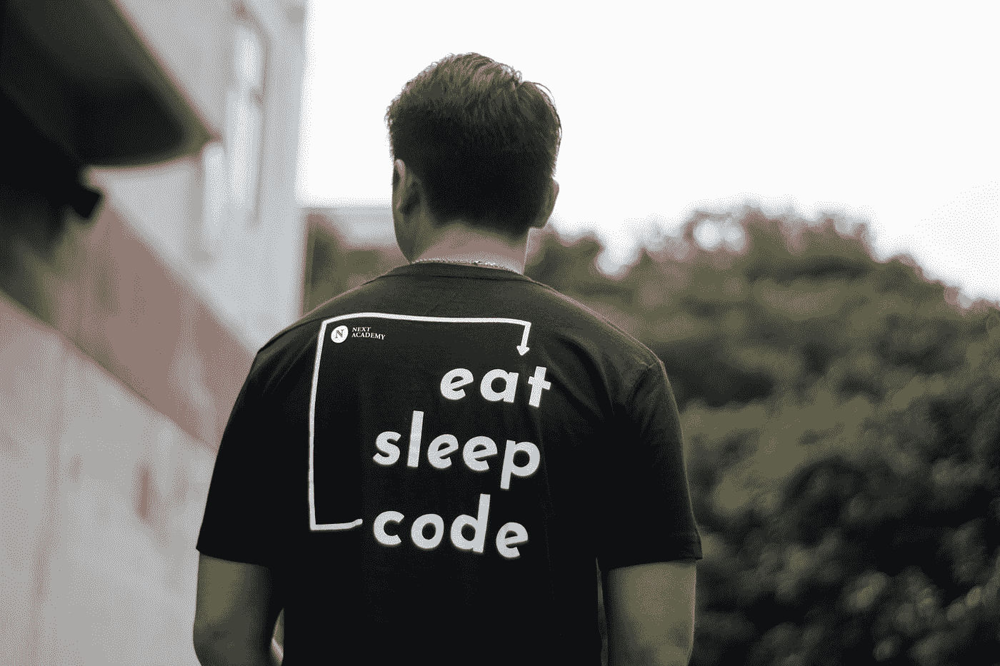
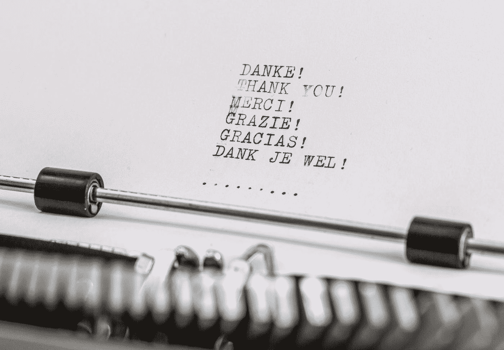
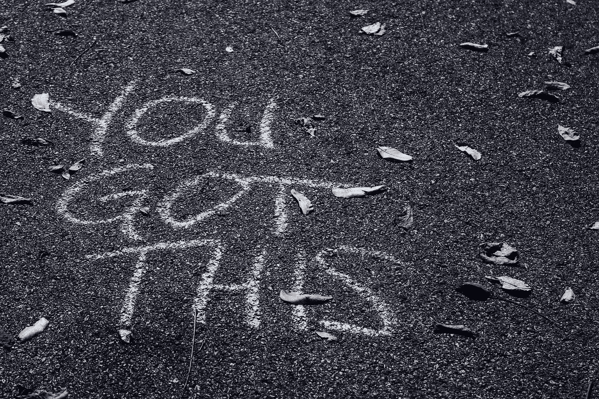
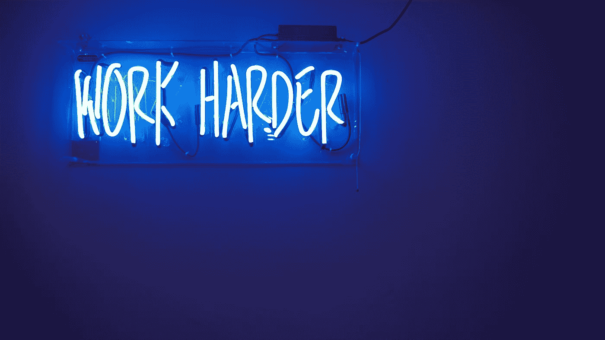

# 离成功更近一步的拒绝

> 原文：<https://betterprogramming.pub/one-rejection-closer-to-success-fa3da3726bc5>

## 最近我一直在思考成功和运气之间的区别

照片由[杰玛·埃文斯](https://unsplash.com/@stayandroam?utm_source=medium&utm_medium=referral)在 [Unsplash](https://unsplash.com?utm_source=medium&utm_medium=referral) 上拍摄

最近我一直在思考成功和运气之间的区别。

刚从大学毕业，回到我住在波兰的时候，我参加了一个双语(英语和西班牙语)客户服务代表职位的面试。这是我有史以来的第一次面试，当面试官漫不经心地问我是否打算在不久的将来怀孕(说真的)时，我完全不知道有什么不妥。这就是我对职业世界的陌生程度。

长话短说，我当天就得到了这份工作，并和另外三名女性一起被派往布鲁塞尔接受为期一个月的培训。我在那里工作了几年，很喜欢那里，但最终决定在我还年轻、单身的时候去冒险。

我继续在北爱尔兰、南美生活，最终去了美国。无论我去哪里，我都很幸运地得到了我申请的第一份工作。

照片由[阿兰·范](https://unsplash.com/@alain_pham?utm_source=medium&utm_medium=referral)在 [Unsplash](https://unsplash.com?utm_source=medium&utm_medium=referral) 上拍摄

这让我有资格开始每周专栏，告诉你如何找到你想要的工作吗？绝对不行。我很早就意识到自己很幸运，但情况不会总是如此。这让我感激我得到的所有机会，但也足够谦虚地承认我并不比那些运气不那么好的人好。

我不相信命运，但我知道发生在我们身上的很多事情都是随机的，我能控制的事情并不像我希望的那么多。这是一种可怕但奇怪的解放意识。它让我专注于我能控制的东西:我对生活当前呈现给我的任何事物的态度，以及我自己的行动。

这就把我们带到了现在。大约两年前，我决定我需要一个新的冒险和挑战，这次搬家不是一个选择(丈夫加抵押贷款加四只猫)。我参加了 Udacity 当时最受欢迎的课程“大卫·埃文斯计算机科学导论”(不幸的是，不久前这门课似乎已经从课程中消失了)，突然发现编程与我想象的完全不同，事实上，它非常有趣！

就在那时，我决定将编程作为我的下一次冒险。我没有回头。

我研究了编码训练营，选择了熨斗学校，申请了他们的沉浸式软件工程项目，最近毕业了。我现在已经准备好开始我的新事业，而且我一点也不因为我开始找工作的日期与全球健康危机巧合而感到沮丧。我再次提醒自己，生活在变化，我的目标没有改变，最好的行动是保持冷静，坚持下去。

在 [Unsplash](https://unsplash.com?utm_source=medium&utm_medium=referral) 上[下一个学院](https://unsplash.com/@next_academy?utm_source=medium&utm_medium=referral)的照片

上周，我终于得到了一家公司的面试机会，这家公司让我非常兴奋。我与招聘经理进行了第一次面试，之后我被要求完成一项代码挑战。那个周末，我用 React with Redux、Open Weather Map API、Geolocation API 和一些 Bootstrap 构建了一个简单的天气应用程序。

我在这里 **写了一篇详细的博文描述我的过程 [**。**](https://medium.com/@justynakuchta/react-weather-app-with-geolocation-api-and-open-weather-map-api-part-1-21d335d6aa34)**

我在周一提交了我的代码，并在周二收到了一封电子邮件，询问我是否有时间在第二天与工程团队进行代码审查缩放会议。我对这家公司做了更多的研究，清理了我的代码，并再次练习了我的电梯推销。我认为我做得很好，我很高兴听到反馈。当你申请一个有前途的职位时，他们告诉你不要抱太大希望，但你怎么能不抱太大希望呢？如果你知道，请告诉我。我的希望很大，我很兴奋——起诉我吧！

同一周，我收到了首席技术官的电子邮件回复:

*“感谢您抽出时间与我们聊天。不幸的是，我们现在无法继续这个过程。我们认为你是一个强有力的候选人；然而，我们正在寻找一个在这一点上更有经验的候选人。我们祝你在寻找中好运！”*

我不想撒谎，我脑子里闪过许多不愉快的想法。首先是“你不够好”，其次是“他们不够喜欢你”。我很快提醒自己，可能有一百个原因让我不适合，并立即制定了一个计划，告诉自己如何应对这个结果。

我做的第一件事是给招聘经理写了一封回信:

*“您好[经理姓名]，*

我不打算撒谎，我很失望。我想我会很适合你的乐队(他们的话，不是我的！)*对前景感到兴奋。感谢您花时间来面试我，这是一次很好的经历，因为我过去没有太多的代码审查。任何关于我可以改进的弱点的建议都将不胜感激。*

*我希望你能为你的团队找到合适的人，*

*Justyna"*

我真的是认真的。我选择把它看作是一次学习经历，是向我梦想的工作靠近了一步。这是我第一次不在学校环境下的代码审查，也不是模拟面试，风险是真实的。我很紧张，这表现出来了。我立即列出了我本可以做得更好的事情，并在谷歌上搜索了关于如何更好地面试的文章(这是一种技能！).不管结果如何，我真的很喜欢和这个团队见面，并且认为这是一次无价的经历和一次伟大的实践。

我感到失望和悲伤吗？当然，我是。我整个晚上都在经历悲伤的过程，[这是真实的事情，而不是我刚刚发明的东西](https://www.leadershipinstitute.org/news/?NR=13729)，并尽情享受最新一季的精彩战斗。

所以，在发了一封感谢邮件/请求反馈并感到有点难过之后，我反思了面试过程，决定心怀感激。

照片由[威廉·冈克尔](https://unsplash.com/@wilhelmgunkel?utm_source=medium&utm_medium=referral)在 [Unsplash](https://unsplash.com?utm_source=medium&utm_medium=referral) 上拍摄

以下是我感激的一些事情:

*   这是一次真正的面试，也是一次无价的经历。
*   我的代码和网站足够让我进入第二轮。
*   我做了很多好事。
*   我立即发现了我本可以做得更好的地方，我相信下次我会做得更好。
*   整个过程很快，与招聘经理的沟通也很好(等回音不是最糟糕的吗？)
*   我确实从招聘经理和公司的另一个人那里得到了反馈。

被拒绝后获得反馈是非常宝贵的。我想知道是什么扭转了局势，不是为了给自己开一个可怜的派对，给自己的消极想法火上浇油，而是想知道我需要做些什么。

显然，我需要继续谈论我的代码。这是有道理的，因为我没怎么做过。对于以“为什么……”开头的问题，我需要一个更好的答案。我还需要对 JavaScript 有更深入的了解。我不想撒谎，列出我的弱点确实有点伤人，而且关注这些弱点并放弃，搬到秘鲁某个地方的骆驼农场，这很有诱惑力。但是我决定赞美我的优点，并想出一个计划来克服我的缺点。

我还发誓，从现在开始，我会“假装，直到我成功”，并努力表现出自信，尽管感到紧张。我重视诚实，不喜欢假装，但我意识到在面试中表现出自信是非常重要的，即使有一点点自恋——尤其是作为一个[女人](https://www.theatlantic.com/magazine/archive/2014/05/the-confidence-gap/359815/)。在一个男性主导的领域，我不得不考虑无意识的偏见，并尽我所能来抵消它。

照片由[悉尼·瑞伊](https://unsplash.com/@srz?utm_source=medium&utm_medium=referral)在 [Unsplash](https://unsplash.com?utm_source=medium&utm_medium=referral) 拍摄

看来，自信常常与能力相混淆。这是否是一件好事超出了本文的范围，但这是我已经思考了一段时间的事情，并且希望有一天能够探索更多。[邓宁-克鲁格效应，有人吗？不管是什么情况，我最不希望的就是缺乏自信被解释为缺乏能力。为了安全起见，我会继续在这两方面努力。](https://codeburst.io/what-does-the-dunning-kruger-effect-mean-to-developers-2aada3a52b1f)

一个比我聪明的人曾经说过“成功是一个旅程，而不是目的地”。

照片由[乔丹·怀特菲尔德](https://unsplash.com/@whitfieldjordan?utm_source=medium&utm_medium=referral)在 [Unsplash](https://unsplash.com?utm_source=medium&utm_medium=referral) 上拍摄

我会跟着地图走，享受风景，从拒绝中学习，在面对和克服障碍时变得更强大，并不断学习和成长。

# **TL；博士**

*   拒绝！==失败。
*   运气！==成功。
*   征求反馈，制定改进计划。
*   心存感激。
*   从挫折中学习。
*   赞美你的优点，克服你的缺点。
*   继续编码吧。

感谢阅读！