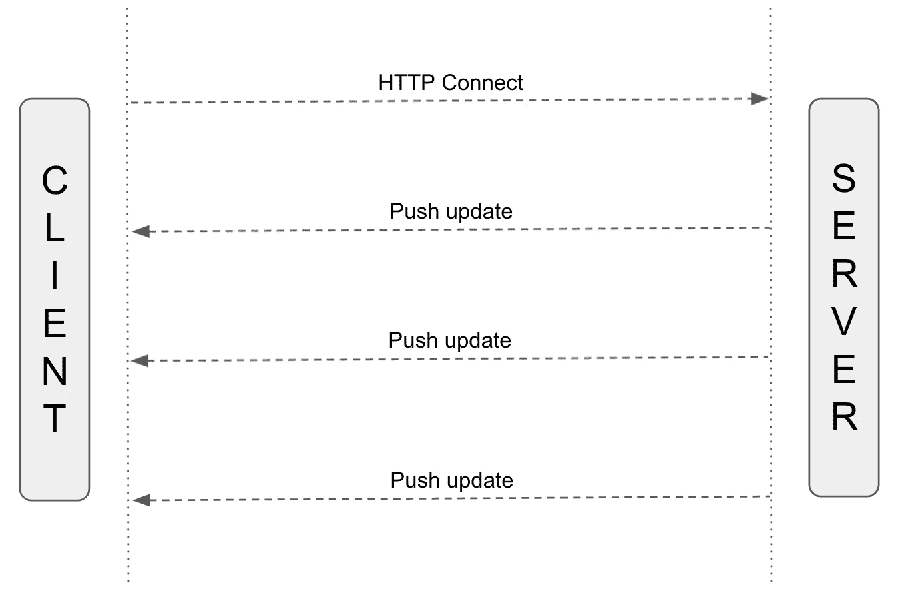

# 无需长时间轮询即可重新加载应用内容的可靠方法

> 原文：<https://betterprogramming.pub/one-solid-way-to-reload-app-contents-without-long-polling-d13e2a9b0abc>

## WebSockets 和长轮询都不错，但是还有一个更好的选择

塔德乌什·拉科塔在 [Unsplash](https://unsplash.com?utm_source=medium&utm_medium=referral) 上拍摄的照片。

您是否经历过这样的情况:您的前端应用程序必须接收一些更新并相应地刷新其用户界面？一个例子是观察服务器上长时间运行的任务并实时检查日志。或者是看财经或体育新闻。它必须是客户端和服务器之间的单向通信通道。

让我们来探索如何实现这一点。

# 发现

现在可能会出现多种想法。我们可以通过[网络插座](https://en.wikipedia.org/wiki/WebSocket)来实现。虽然这种方法听起来很合理，但看起来开销很大。WebSockets 是 TCP 连接上的全双工协议。这对于许多用例来说是很棒的，但是在我们的场景中，我们不需要向服务器发送常规请求。我们的客户只打算接收更新，而不要求他们。

进一步考虑这个问题，长轮询也不能满足我们的需求。在长轮询中，在客户机和服务器之间建立 HTTP 连接。当收到客户端的请求时，服务器不会立即响应。客户端等待服务器的响应，连接保持打开。

一旦服务器将数据发送到客户端，连接就会关闭。这意味着如果客户端想要接收下一批更新，它必须通过发送新的请求来启动新的连接。对于一次性更新(例如，付款的状态)，它工作得很好。但是对于永久更新来说不是很有效。每次建立一个新的连接并处理错误会使双方的事情都变得复杂。

我们还有其他选择吗？

# 解决办法

服务器发送事件(SSE)是一种可以帮助我们的技术。根据[维基百科](https://en.wikipedia.org/wiki/Server-sent_events)的说法，这并不新鲜，已经被大多数网络浏览器所采用。主要思想是在服务器和客户机之间建立 HTTP 连接。它将保持打开状态，直到任何一方将其关闭。服务器可以通过开放的连接向客户机推送多个更新。

服务器发送的事件架构

在上面的例子中，我们可以看到服务器和客户端之间的通信是如何组织的。在该开放连接中，客户端不向服务器发送任何数据。它只接收从服务器推送的常规事件。

## 例子

让我们构建一个发送这些事件的简单应用程序。对于不同的平台和语言，已经有许多可用的库。挑一个你觉得最舒服的。下面是 Ruby on Rails 的一个例子:

`UpdatesController`中的`updates`功能是指适当的端点。我们必须指定`text/event-stream`作为内容类型。这将响应区分为 SSE。然后，我们定义事件名称和重试策略。最后，我们将当前时间写入流中。

这个例子还可以进一步扩展:如果数据库表发生了变化，或者后端发生了某个事件，我们可以发送一个事件。应用这项技术的想法非常广泛。

接下来，我们必须在客户端消费事件。我们的客户将是一个网络浏览器。然而，也有适用于 iOS 和 Android 等移动平台的解决方案。

在上面的代码中，我们连接到服务器的端点`/updates`，并开始监听同一个`time_update`事件。每次收到消息时，结果将被打印到控制台。就是这样！现在，您有了一个解决方案，可以从服务器获取常规事件，而无需提取它们。

# 最后的想法

服务器发送事件(SSE)对于某些业务案例来说是一个很好的解决方案。当要求永久地将消息推送到客户端时，那么您应该考虑利用它。

然而，就像软件开发世界中的任何技术一样，它不是银弹，也有自己的缺点。首先，SSE 是半双工的，客户端不能向服务器发送消息。第二，对打开的连接数有限制。在网络浏览器中打开多个标签时，问题开始出现。因此，我们必须为这种情况构建一个解决方案。

最后，这是在您的应用程序和客户之间交换数据的又一个选择。意识到这一点，并在构建下一个解决方案时牢记在心。