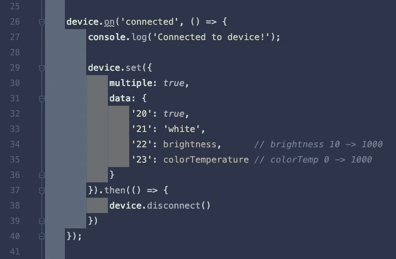

# 给开发者的一个建议——使用缩进彩虹插件

> 原文：<https://betterprogramming.pub/one-tip-for-developers-use-the-indent-rainbow-plugin-520ecae4dcdd>

## 使用讨厌的 openapi.yaml 文件时不再悲伤


我最近发现 IDE 插件[缩进彩虹](https://plugins.jetbrains.com/plugin/13308-indent-rainbow)，同时试图解决我在处理`openapi`文件时遇到的一个挫折。

对于我的一个客户，我正在处理一个大的`openapi.yaml`文件。这个文件定义了我们的 API，并详细描述了我们的每个端点——请求参数、主体、预期响应等。尽管我总是发现将代码粘贴到这个文件中是一种有点令人沮丧的经历。

在 YAML 文件中，拥有正确的缩进是至关重要的，这意味着要将代码粘贴到正确的位置，我必须要么从左边开始计算缩进准则的数量，要么用光标沿着特定的行向下移动。这两个都不好！此外，我的 IDE (Goland)似乎总是在我粘贴时弄乱缩进，但那是另一回事了！

所以我想找一个插件，让这变得简单一点。和缩进彩虹似乎符合要求。Indent Rainbow 是 IDEs 的一个插件(例如 [JetBrains 产品](https://plugins.jetbrains.com/plugin/13308-indent-rainbow)和 [VS Code](https://marketplace.visualstudio.com/items?itemName=oderwat.indent-rainbow) ),为你的每个缩进“步骤”着色。这反过来又使缩进更容易阅读。

例如，这是我在 ide 中作为[辅助项目](https://github.com/MadeleineSmith/smart-home-panel-be)的一部分正在处理的一个文件的样子:



[上面的文件](https://github.com/MadeleineSmith/Smart-Home-Panel-BE/blob/42642cc94748a4724103784ab7a37ad916933c6d/services/deviceService.js#L29)用于控制智能灯泡的颜色和亮度——见左边🥰漂亮的缩进颜色

但是，默认情况下，缩进彩虹在超过 1000 行的文件上是禁用的。这个设置可以被否决，尽管我之前发现它在处理一个将近 6000 行的`openapi`文件时非常慢。这意味着，令人沮丧的是，我将不得不对大文件禁用插件，因此我原来的问题将会存在。

(╯°□°)╯︵ ┻━┻

然而，在撰写本文时，这个问题似乎已经得到了解决，因为处理大文件不再是死一般的慢。哇哦！现在我想我会一直启用这个插件——即使是对于大文件💯

```
**Want to Connect?**In need of a back-end developer for your project? [Get in touch](https://www.madeleinesmith.uk/contact/) to hire me for freelance work.Originally published at [https://www.madeleinesmith.uk](https://www.madeleinesmith.uk/blog/indent-rainbow/).
```