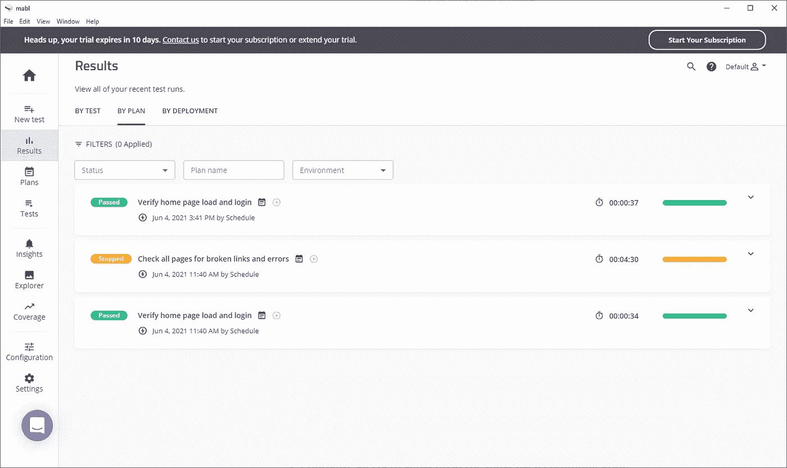
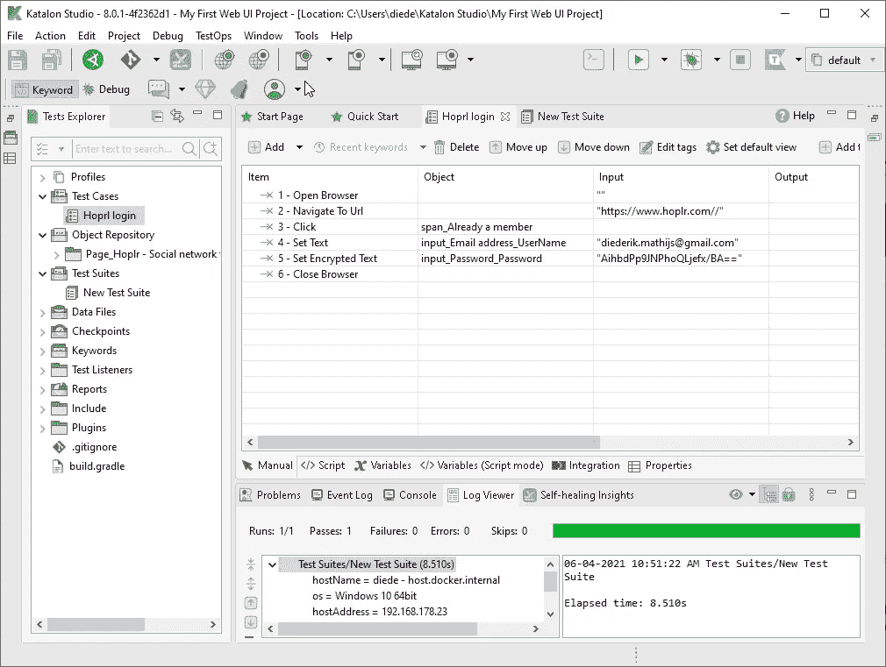
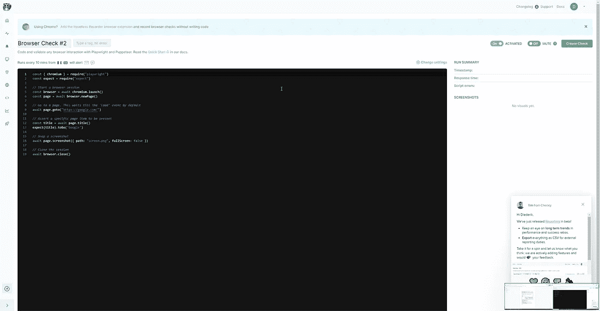

# 如何保持你的网站监控简单和伟大

> 原文：<https://betterprogramming.pub/one-way-to-keep-your-website-monitoring-simple-and-great-4fea491bb5c>

## 您应该考虑的 3 种监控技术

多梅尼科·洛亚在 [Unsplash](https://unsplash.com?utm_source=medium&utm_medium=referral) 上拍摄的照片

关于监控应用程序，已经有无数的书籍被撰写和重写。我个人曾做过企业级软件顾问，在那里我们监控一切。然而，今年早些时候，我转到了一家初创公司，在那里除了在每次部署后进行一些健全性检查之外，没有任何监控。这家初创公司每月有超过 10 万活跃用户，直到现在他们才开始考虑监控。

那么正确的方法是什么呢？我们应该把所有的时间都花在监控我们的监控工具上，还是应该完全停止监控？我们应该监控什么，如何让我们的团队保持兴趣和参与？

由[卢克·切瑟](https://unsplash.com/@lukechesser?utm_source=medium&utm_medium=referral)在 [Unsplash](https://unsplash.com?utm_source=medium&utm_medium=referral) 拍摄的照片

# 什么是监控？

> “监控是测试和验证最终用户能否按预期与网站或 web 应用程序交互的过程。”— [维基百科](https://en.wikipedia.org/wiki/Website_monitoring#:~:text=Website%20monitoring%20is%20the%20process,or%20web%20application%20as%20expected.&text=Website%20monitoring%20companies%20provide%20organizations,and%20observe%20how%20it%20responds)

这意味着，如果情况不是这样，我们的监控工具应该能够提醒我们。监控以各种形式存在——如果服务器上的磁盘容量几乎达到极限，您会收到一封电子邮件，当用户无法登录时会收到一个延迟通知，等等。—所有这一切的最终目标是确保网站对用户可用，并通过鼓励开发人员调查问题来最大限度地减少任何形式的停机时间。

如果你以前配置过监控系统，你会知道让团队参与进来并对每 30 分钟发布一次警报的松弛通道感兴趣有多难。有效地过滤掉这些警报并不总是可能的。

例如，考虑异常。有时，我们希望以某种方式抛出异常，以允许我们收集关于某段代码的信息。或者有时我们使用的库会抛出我们无法控制的异常。我们是否应该开始使用一种工具，在将异常发送给团队或 Slack 之前过滤这些异常？也许是一个 Azure logic app，里面有些复杂的逻辑只有一个团队成员懂？逻辑 app 失败了怎么办？我们需要监控来确保我们的监控工作吗？

你进入了兔子洞，在你知道之前，你有五个不同的仪表板，上面有各种各样的统计数据，团队中没有人再认真地看了。您会知道您的应用程序是否受到影响吗？

# 怎么才能解决这个问题？

我想总结一下我认为构成监控系统最重要方面的几点:

*   用户流可能永远不会受到影响。
*   只有最重要的警报才会出现在我们的通信频道中(例如，用户无法再登录)。
*   每周报告可以帮助我们监控应用程序的状态。
*   应该有人负责确保正常运行时间。

我相信这是对大多数网站/应用程序的监控。记住用户流量是我们应用中最神圣的东西。一旦这些受到影响，就应该敲响警钟了。如果只有最重要的警报发布在一个松弛的通道中，那么当然每个人都会有兴趣确保问题尽快得到解决。

## 1.设置可以定期运行的 UI 测试

我们如何确保用户不受影响？通过模仿他们的行为。

我们可以通过结合 API 测试和 UI 测试来做到这一点。这些测试可以由我们管理，也可以托管在一个在线 SAAS 平台上，该平台连接到我们的 CI 工具和现成的沟通渠道。

**编写我们的 UI 测试**

编写我们的 UI 测试有好处也有坏处。不利的一面是，它们总是必须由具有编码知识的人来创建，并且可能需要相当多的基础设施工作。一个好处是，它们提供了很大的灵活性，因为我们可以利用外面的许多库。

我们还可以使用像[无头记录器](https://chrome.google.com/webstore/detail/headless-recorder/djeegiggegleadkkbgopoonhjimgehda?hl=en)这样的东西来记录浏览器会话并为我们生成代码，这样我们就可以快速创建新的流，而不会被设置自定义选择器的所有技术细节和开销所困扰。

虽然有很多，但我想讨论其中的两个，因为它们直接由 Headless Recorder 支持。

*Puppeteer 是 Chrome DevTools 团队开发的 Node.js 库。它允许简单的测试，因为木偶师使用 DevTools 协议与浏览器对话。这很好，因为它允许我们拦截网络请求，这是一个很好的必须得到的问题的根本原因。使用像 [Jest](https://jestjs.io/docs/puppeteer) 这样的库，我们可以开始测试特定的流程。*

*检查 https://google.com 的[是否有“谷歌”的头衔](https://google.com)*

*[***剧作家***](https://github.com/microsoft/playwright)*

*剧作家是微软开发的 Node.js 库。该 API 与 Puppeteer 的 API 非常相似，都是编写 UI 测试的良好候选。你可以使用 [Jest 剧作家](https://github.com/playwright-community/jest-playwright)快速开始编写用户流。*

*确保你在 Chrome 上运行*

*确保以一种有意义的方式对测试进行分组，以便所有开发人员都知道在哪里添加新的或寻找现有的测试。*

***使用 SAAS 工具***

*另一种可能性是使用 SAAS 工具。在这里，我也将只看其中引起我注意的三个。还有很多，通过一些研究，您可能会找到一个更适合您的用例的。所有这些都允许您安排测试运行，并在出现问题时提醒您的团队。*

*[***Mabl***](https://www.mabl.com/)*

*Mabl 是一个桌面应用程序，允许您的整个团队通过记录预期的行为并沿着(没有编程知识)添加“断言”来创建测试。它允许在多种设备上测试你的网站，并且包含了许多很好的特性，在我看来这是一个很好的选择。*

*我希望他们在定价方面更加透明，因为他们会强迫你与销售代表会面以获得定价信息。*

**

*正面:*

*   *用于测试电子邮件(！idspnonenote)的每个测试运行的邮箱。)*
*   *环境允许拆分多个平台*
*   *集成大量 CI 工具和沟通渠道*

*否定的；消极的；负面的；负的*

*   *断言的不精确定位。我选择了一个 div，它通过检查内部文本断言它在页面上。*
*   *没有定价信息*

*[***卡塔龙工作室***](https://www.katalon.com/)*

*卡塔隆是 Mabl 的竞争对手之一，在某种程度上，他们非常相似。它还可以作为一个桌面应用程序，并与 CI 工具和沟通渠道进行了大量集成。*

*它还声称使用 [Appium](https://appium.io/) 进行原生应用测试(Android/iOS)。然而，我无法让它工作，而且似乎没有什么社区活动来保证我能轻松解决这个问题。*

*与 Mabl 不同，Katalon 的一个优点是您可以完全控制页面上的选择器。你可以通过使用被称为 Web Object Spy 的东西来覆盖你在会话记录过程中点击的东西的选择器。*

**

*正面:*

*   *许多定制测试运行的选项*
*   *与 CI 和消息平台集成*
*   *不错的产品之旅*
*   *一切都在 Git 里*
*   *大多数东西免费*

*否定:*

*   *陈旧且有时令人困惑的界面*
*   *没有用于测试的电子邮件收件箱*
*   *添加手动断言需要做大量的工作*

*[***Checkly***](https://www.checklyhq.com/)*

*Checkly 不同于上面提到的两种工具。它是完全在线的，你用无头记录仪在你的网站上记录一个流量。这个记录器将生成一个脚本，然后您可以将其粘贴到 Checkly 中，并允许您通过使用 webhook 或 GitHub 调用它来重新运行流。*

*我喜欢它的简单性，这也是我选择为我们实现 Checkly 的原因。重要的是要注意，如果你的应用程序有很多流，它们可能会变得昂贵。*

**

*正面:*

*   *自定义测试运行位置，分组测试*
*   *针对大多数通道的细粒度警报*
*   *每月免费 50k API 检查和 5k 浏览器检查*

*否定:*

*   *只有与 GitHub 的本地集成*
*   *很容易变得昂贵*

*所有这些前面提到的工具和库允许您快速构建一个完整的测试流库，可以通过点击一个按钮来执行。没有任何编程知识的人也可以很容易地添加新的测试——这多酷啊？*

***调度执行***

*一旦你写好了整个测试套件，重要的是要考虑每天要运行多少次这些测试。您是每五分钟还是每半小时运行一次？一切都取决于测试的成本和重要性。这是你和你的团队必须做出的选择，以获得最佳结果和安全感。*

*您可以使用您的默认 CI 平台，如 Azure DevOps、GitLab、GitHub 或 CircleCI，来安排这些测试套件。如果您的团队选择了一个 SAAS 工具，您将有可能在工具本身中安排测试运行。*

## *2.将警报配置为在最常用的通信渠道中显示*

*一旦我们的测试开始运行，就该确保我们在遇到问题时能够及时发现。幸运的是，其他开发人员已经确保我们现有的 CI 工具能够很好地与沟通渠道集成。*

*如果您使用自写测试，您可能会使用一个预定的管道每隔 *x* 分钟运行一次。Azure DevOps、GitHub 和 GitLab 都提供现成的警报。如果一个跑步者遇到了失败的测试，它将能够提醒你的懈怠或团队频道。*

*如果你使用的是 SAAS 工具，你可以使用其中一个连接器来确保你不会错过任何警报。*

*最重要的是，如果我们只是使用这些 UI 测试来通知我们的团队，我们知道每一个警报都是最重要的，应该如此对待。例如，如果我们添加了基于异常的其他警报，我们的团队会很快对通道失去兴趣，因为异常通常可以在不太紧急的情况下修复。*

## *3.为团队生成较低优先级的监控摘要*

*我们测试流的事实是否意味着我们不应该知道我们的应用程序中还发生了什么？当然不是！*

*目前，我们正在团队中试行一种叫做“每周文摘”的东西。它包含两个内容:功能性数字(如我们发出了多少封电子邮件，有多少用户登录/注册，发出了多少通知)和技术性数字(如过去一周的 CPU 水平或我们的 iOS 应用程序崩溃的次数)。*

*这些允许我们对我们的应用程序做得如何有一个总体的感觉。这些都很有趣，因为它们可能会导致我们的应用程序的新见解，例如，在某些路线上的缓慢响应时间。*

*我们使用在 Azures 的[应用洞察](https://docs.microsoft.com/en-us/azure/azure-monitor/app/app-insights-overview)、 [Firebase](https://firebase.google.com/) 、 [Mandrill](https://mailchimp.com/features/transactional-email/) 和 [Twilio](https://www.twilio.com/) 中捕获的信息。将所有这些信息汇总起来，与前一周进行比较，你会得到比捕捉某个时刻的仪表盘更有价值的东西*

# *结论*

*监测不是一件容易的事。我们需要确保我们的用户始终可以访问我们的服务，而不会出现任何重大问题。在本文中，我们已经讨论了如何让监控变得简单并模仿用户行为能够让我们更好地了解我们平台的状态。*

*最后，我想提一下，本文并没有涵盖所有用例。总是批判性地思考你的应用程序，并尽可能保持简单。祝你好运！*