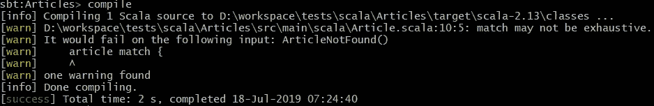

# OOP 模式匹配:访问者模式

> 原文：<https://betterprogramming.pub/oop-pattern-matching-visitor-pattern-2a26cc559e09>

## 使用访问者模式作为路由点(以 Kotlin 为例)

照片由 [Aaron Burden](https://unsplash.com/@aaronburden?utm_source=medium&utm_medium=referral) 在 [Unsplash](https://unsplash.com?utm_source=medium&utm_medium=referral) 上拍摄

函数式编程在 IT 领域获得了巨大的发展势头；很多事情来来去去，但 FP 不在其中。它比 OOP 更具表现力。

几年前，在博洛尼亚举行的 [LambdaConf](http://lambdaconf.us/) 期间，我开始深入研究它，我获得的洞察力越多，我就越喜欢 FP。

6 月份，我去了一个应用函数式编程研讨会，老师深入研究了代数数据类型和模式匹配。我也终于明白了什么是单子，不过这是后话了。

我曾经认为模式匹配是一种有趣的解构列表的方式。现在，我知道它是 FP 软件设计的基础，也是解决领域对象的数据和行为分离需求的有效方法。

我们来看一个例子！

# 按国家本地化的 ERP

假设我们想编写 ERP 软件，在两个不同国家的市场上竞争:意大利和德国。我们将在许多域对象中编写许多 CRUD 操作。这里没有挑战。

但是，在相同的功能流中，在不同的数据结构中对特定于国家的业务规则建模又如何呢？

例如，这两个国家的数据库中都有文章，你肯定想对它们进行搜索。但是，搜索规则和获取的数据可能完全不同。

由于数据结构不同，我们不能只有域实体`Article`——我们至少需要一个`ItalianArticle`和一个`GermanArticle`。

考虑到数据存储也可能因结构而异。

# FP 方式

让我们来看一个 [Scala](https://www.scala-lang.org/) 的实现。

写一个求和式`Article` ***。***

然后，我们将其专门化为产品类型`ItalianArticle` 和`GermanArticle`。

此外，我们可以预计，当我们寻找一些东西时，有时我们什么也没有找到。所以，我们也要考虑`ArticleNotFound`。

每次我们从某个地方收到一个`Article`返回，我们都会在上面进行模式匹配。在比赛中，我们可以访问它的专门数据。

# 不就是一个开关吗？

乍一看，这看起来像是一个经典的过程性“切换”,随后是向下转换。

有一个重要的区别:编译器知道我们是否匹配每一种类型的`Article`。例如，如果我们忘记匹配`ArticleNotFound`:

那么，默认情况下，`sbt compiler` 会发出警告。

**图 1:** sbt 编译输出

由于编译器知道有问题，我们可以让它产生一个错误而不是警告。

# 新要求:西班牙

在这一点上，完全意想不到的事情发生了！公司向我们提出了新的要求:我们还需要在西班牙进行分销。

其实我们是有备而来的，所以让我们把`EspArticle`添加到我们的`Article` sum 类型中。

现在，我们需要添加西班牙语的业务逻辑。

对于一个普通的交换机来说，搜索我们实施了特定于国家的业务规则的每个地方将是一件痛苦的事情。

相反，通过模式匹配，编译器会告诉我们应该在哪里进行干预。

# 用 OOP 可能吗？

是的，当然，有访客模式！

如果你不知道访问者模式，看看这个[维基百科页面](https://en.wikipedia.org/wiki/Visitor_pattern)。如果你不知道[四人组](https://en.wikipedia.org/wiki/Design_Patterns)(他写了一本书*设计模式:可重用面向对象软件的元素*)，有一个阅读。

访问者模式长期以来被称为反模式。当您添加一个新的条目类型时，您将向 visitor 接口添加一个新的方法。

在这种情况下，编译器会中断每个具体的访问者，直到您在每个访问者中实现了新的方法。这是反模式的原因之一。

事实上，对于我们的关注，这个“问题”看起来就像我们正在寻找的！

# 科特林示例

下面是我们的 sum 类型的一个 [Kotlin](https://kotlinlang.org/) 实现:

您会注意到，我没有使用“接受”和“访问者”这两个名称，而是更喜欢考虑“应用于数据消费者的数据”。(我在寻找更好的名字，所以如果你有建议，请告诉我。)

在这里，我们可以实现特定国家的业务规则。

这个例子的语义与 FP 模式匹配完全相同。

当我们添加新的国家时，编译器将中断一切，直到我们不在每个`ArticleConsumer`中实现新的`fun use(article: SpaArticle)`。

# 结论

访问者模式的最初目的是迭代异构对象集合上的操作，这些对象不共享相同的接口和数据类型。

在本文中，我建议使用它作为路由点。当您结束枚举您的域实体并需要设置本地化的域上下文时，这很有用。

在方法中枚举域实体被认为是一个问题。在这个用例中，它是模式的关键特性。

我还演示了这种用法在语义上等同于 FP 模式匹配。

感谢您的阅读！