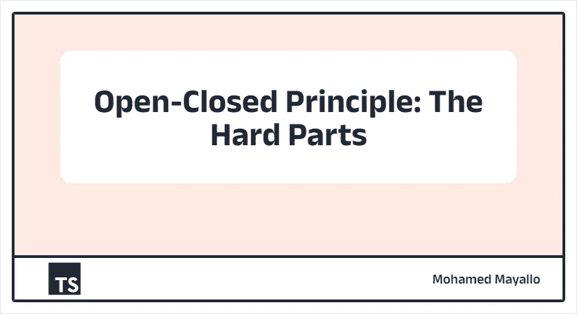
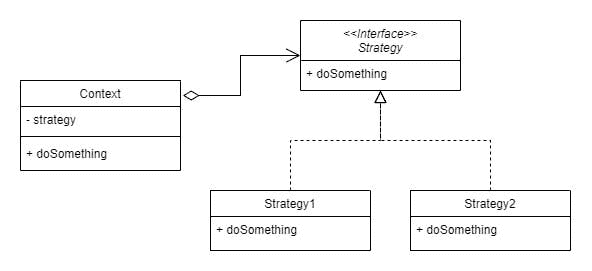

# 开闭原则:难的部分

> 原文：<https://betterprogramming.pub/open-closed-principle-the-hard-parts-34f142b64bc2>

## 开闭原理是固体的第二个原理。让我们知道什么是 OCP，它的局限性，以及我们如何才能正确地遵循它

作者照片

# 介绍

坚实的原则是由罗伯特·马丁(Robert C.Martin)制定的一套原则。这些原则的主要目标是设计易于维护、测试、理解和扩展的软件。

这些原则是:

*   [单一责任原则](/do-you-really-know-what-is-single-responsibility-5e5d9d59ea58)
*   开闭原理
*   [利斯科夫替代原理](/liskov-substitution-principle-isnt-complex-just-give-it-a-try-d4f84093ca5f)
*   界面分离原理
*   依赖性倒置

在前一篇文章中介绍了[单一责任原则](/do-you-really-know-what-is-single-responsibility-5e5d9d59ea58)之后，在这篇文章中，我们将讨论开闭原则中的第二个原则。

# 让我们在某些事情上达成一致

在深入研究这个原则之前，让我们先就一些事情达成一致。我相信你同意我的观点，软件设计不是一个简单的过程，任何软件的主要特征是在其生命周期中的可变性。

如果我们预先知道这一点，我认为我们需要实现的主要目标是以一种适应这种可变性的方式构建软件，并最小化由于业务需求变化而引入新错误的机会。

事实上，SOFT_WARE 这个词意味着任何软件都应该是灵活多变的。所以，软件应该遵循一些已被证实的设计原则来实现这个承诺，其中之一就是开闭原则(OCP)。

照片来自 [Unsplash](https://unsplash.com/photos/KLLcTHE20bI) 由 [Tyler Nix](https://unsplash.com/@nixcreative) 拍摄|高度改变

# 该理论

开合原理对立体原理中的“O”负责。Robert C. Martin 认为这个原则是“面向对象设计最重要的原则”然而，他不是第一个定义它的人。最初， [Bertrand Meyer](https://en.wikipedia.org/wiki/Bertrand_Meyer) 于 1988 年在他的书[面向对象软件构造](https://en.wikipedia.org/wiki/Object-Oriented_Software_Construction)中写到了这一点。他这样表述:

> “软件实体(类、模块、函数等)。)应该对扩展开放，但对修改关闭。”

但这意味着什么呢？简单地说，这意味着如果您的业务需求发生变化，您不应该修改现有的代码(禁止修改)。相反，您应该添加一个新代码，在不影响现有代码的情况下扩展它(为扩展而开放)。

因此，符合这一原则的最终实体将具有两个特征:

*   稳定:由于这个实体不允许修改，所以它的行为不会改变，并且定义良好。以便对使用该实体的代码没有副作用。
*   灵活:由于这个实体对扩展是开放的，所以您可以在不影响现有代码的情况下添加新功能。

如果你第一次读到这个原理，你可能会认为这有矛盾。软件应该如何在修改时关闭，同时在扩展时打开？

好了，为了阐明这一点，我们来介绍一下插件架构。

# 插件架构作为 OCP 的一个实例

由[肖恩·惠兰](https://unsplash.com/@sswhelan)拍摄的 [Unsplash](https://unsplash.com/photos/NG_a-z0ScM0) 照片|图像高度有所改变

在他的[文章](https://blog.cleancoder.com/uncle-bob/2014/05/12/TheOpenClosedPrinciple.html)中，鲍勃大叔说:

> “插件系统是开闭原则的最终完善和典范”

但是是什么让插件架构如此特别呢？想想看，如果你的系统是由一些插件组成的，这些插件可以很容易地插入或拔出，而不会互相影响。每个插件只负责一项工作，而且做得很好。系统对任何需要扩展的新插件一无所知。相反，这个新插件只需要完成系统契约。这意味着添加或删除插件根本不会影响现有的代码。

> *是的，如你所想，OCP 和 SRP 在某种程度上是相互关联的。*

让我引用鲍勃大叔说的话来强调插件架构有多强大:

> “如果你的系统设计是基于插件的，比如 Vim、Emacs、《我的世界》或者 Eclipse，会怎么样？如果您可以插入数据库或 GUI 会怎么样？如果你能插入新的功能，并拔掉旧的，会怎么样？
> 
> 如果您的系统的行为很大程度上是由其插件的配置控制的，会怎么样？那会给你什么力量？
> 
> 添加新功能、新用户界面或新机器/机器界面有多容易？添加或删除 SOA 有多容易？添加或删除 REST 有多容易？"

嗯，那很有趣，不是吗？

# 你真的很懂吗？

我相信我学这个原理的时候你和我想的一样:真的！那很有趣。如果我们能在我们的设计或构建任何基于插件的系统中实现这一原则，我们在未来将不会面临任何问题或重大变化。

但是再想一想，如果你需要给你的类增加一个新的特性，你会怎么做？通常，您通常做的第一件事是打开这个类并添加您的特性，这在大多数情况下是非常合理的。

看一下这个例子:

如果你有前一个例子，你的经理要求你删除税。你要做的第一件事是什么？那是明显的。

那么，在不触及现有代码的情况下添加/删除新的/旧的功能对您来说有意义吗？简而言之，答案是肯定的，但这并不像你想的那么简单。我们继续。

# OCP 的艰苦地区

我认为，在五项坚实的原则中，OCP 是最被误解的。然而，如果你在你的设计中正确地应用它，它会比其他的更有帮助。

也许，你可能会阅读这个原则的定义，然后问自己，我如何才能正确地应用它？我必须遵循什么步骤来实现它？

1.不幸的是，没有一种方法可以编写永远不需要修改并且永远可以扩展的代码。可能永远不会修改的一个类是这样的:

你可能会注意到这个类在抽象上是极端的。这个类本身没有功能，它的所有功能都传递给了它，所以它可能永远不需要修改。

另一方面，看看下面这个例子:

显然，这个类在具体性上是极端的。这个类只以一种方式做一件事，如果你想改变它的功能，你必须直接修改它。

实际上，任何有用的代码都必须介于这两个极端之间。它必须部分具体化以实现其功能，如果需要，部分抽象化以易于重用或维护。

因此，永远不要有极端的想法，认为你的代码不能修改，只能扩展。请记住，无论是抽象的极端还是具体的极端都有其代价。因此，这里的难点是定义正确的抽象层次，以及定义两个极端之间的平衡点。

识别这一点的一个可能的方法是从具体开始，除非你确定你需要 100%的抽象，然后看看应用程序如何随时间发展。当需要更改时，只需在现有代码中进行一两次具体的更改。然而，到了第三次，它可能是一个指示符，表明软件可能在将来继续以这种方式改变。所以你应该考虑重构你的代码来遵循 OCP，并提供所需的抽象。

在我看来，OCP 并没有告诉你要抽象一切来获得最终的通用设计，因为，那是不可能的。相反，如果你有很强的抽象理由，简单地说，去做，如果你没有，简单地说，不要做。混凝土设计是好的，直到它不是。记住[接吻原理](https://en.wikipedia.org/wiki/KISS_principle)。

因此，不可避免地，你可能需要修改你现有的代码，甚至更多，你的抽象。

2.另一点你必须记住的是处理 bug。如果你的类有一个 bug，你会怎么做？你会强行扩展它并留下一个有错误的遗留代码来盲目地实现 OCP 吗？还是直接打开你的类修改这个 bug？所以我认为修复 bug 应该是 OCP 的一个例外。

3.我们需要能够预测代码中的变化，并围绕它应用抽象。与此同时，我们不想开发太复杂的软件，试图猜测未来可能必须修改的每一种可能的方式。所以，预测是关键，同时也是最难实现这个原则的。遵循 OCP 的一个更简洁的方法是引入[变异点](http://codecourse.sourceforge.net/materials/The-Importance-of-Being-Closed.pdf) (PV)原理，该原理规定:

> 确定预测的变化点，并围绕它们创建一个稳定的界面。

但是在预测你的变化时要小心。错误预测变化的成本可能很高:

*   如果你预测不会变化的变化，你最终会在过度工程化上浪费你的努力。
*   如果您不能预测实际需要的变化，您最终将需要修改大量的现有代码。

因此，关于这一点的底线如下:

*   不要因为预测到需要就把东西抽象出来。请记住，开发和维护抽象是有代价的。但是如果事先你 100%确定你会需要它，那就去吧。
*   你不应该预测软件中的每一个变化，但是，定义软件中的变化点是你的责任。
*   一旦对变化的需求成为现实，就是时候重构你的代码，如果你真的需要的话，提供正确的抽象。

# 遵循 OCP 的实用方法

我已经尽我所能简化了前面的部分，但是如果你迷路了，这里有一些跟随 OCP 的实用方法:

1.  如果你不能预先预测软件中的变化点，简单地说，从具体而简单的开始。然后，随着软件的发展，开始重构并围绕这些点构建正确的抽象。
2.  如果你预先 100%地预测了变化点，试着在不使事情过于复杂的情况下，确定你的软件需要的正确的抽象层次。

在理论上介绍了 OCP 及其局限性之后，让我们跳到实际例子中，看看如何在我们的代码中应用 OCP。

# 应用 OCP 的方法

照片来自 [Unsplash](https://unsplash.com/photos/7tkDoo2L_Eg) 由 [Jaye Haych](https://unsplash.com/@jaye_haych) 拍摄

让我们从这个具体的例子开始，试着用 OCP 来重构它。

# 1.功能参数

这种方法是应用 OCP 最简单、最直观的方式，同时也是[函数式编程](https://en.wikipedia.org/wiki/Functional_programming)的理想选择。

简单地说，在这种方法中，例如，通过向函数传递参数，我们可以改变它的功能。这个函数可以通过改变它的参数来扩展。

让我们通过应用 OCP 来重构上面的示例，并记住这种方法:

现在，如您所见，这个函数可以打印任何消息，而不仅仅是固定的消息。所以这个函数通过改变它输出的消息来扩展。

# 2.通过继承的部分抽象

正如我们所说，OCP 是由 Bertrand Meyer 在他的书《面向对象的软件构造》中首次使用的事实上，Meyer 最初的方法是使用继承作为应用 OCP 的核心机制。

每当您的类需要更改时，这种方法不是修改现有的功能，而是鼓励您创建一个新的子类，根据需要保存新的实现或覆盖原来的实现。并保持原来的实现不变。

让我们重构我们的示例，并记住这种方法:

如你所见，我们没有修改原来的类`Logger`，而是添加了一个新的子类`AnotherLogger`，它覆盖了父类的行为，也就是`log`方法。

顺便提一下，如果可能的话，应该避免使用继承，因为如果子类依赖于父类的实现细节，继承会引入紧耦合。如果父类改变了，它会影响子类，它们可能也需要修改。

# 3.通过组合和接口的整体抽象

也许，你以前听说过“编程是为了接口，而不是实现”或者“[复合胜于继承](https://en.wikipedia.org/wiki/Composition_over_inheritance)”，不是吗？因为继承的限制，Robert C. Martin 重新定义了 OCP，使用组合和接口来代替 Meyer 的继承。但是怎么用呢？

在这种方法中，不是直接在主类中设置新功能，而是将它移到另一个类中，然后通过[依赖注入](https://en.wikipedia.org/wiki/Dependency_injection)将这个新类引用到主类中。任何注入的类都必须实现一个接口。一旦新类正确实现了这个接口，主类最终就可以使用它的功能了。这就是你如何在继承之上使用组合和接口。

让我们跳到我们的例子中，使用接口来应用组合:

如您所见，现在`Logger`类独立于任何实体。只有注入的实例必须实现`ILogger`接口。所以你可以使用`AnotherLogger`或者任何你想要的记录器，只要它实现了`ILogger`接口。

这种方法的主要好处是实现了[多态性](https://en.wikipedia.org/wiki/Polymorphism_(computer_science))，这反过来又实现了[松耦合](https://en.wikipedia.org/wiki/Loose_coupling)。

然而，接口编程引入了一个新的抽象层。接口本身被认为是封闭的，而不是实现，因为一个接口可能同时有许多不同的实现。接口本身被重用，而不是实现。这又会导致松散耦合。

# 战略设计模式

照片来自 [Jani Kaasinen](https://unsplash.com/@neon845b) 拍摄的 [Unsplash](https://unsplash.com/photos/7VGzV09YnvA)

策略设计模式是以优雅的方式实现 OCP 的一个很好的例子。这是最有用的设计模式之一。它主要基于对接口的编程。让我们看看它是如何工作的。

你有一个可以用多种方法解决的问题。这些方法被称为策略，每个策略都封装了一个不同的问题解决方案。所有这些策略都必须实现一个接口来解决这个问题。这个问题在一个叫`Context`的课上。这些策略可以通过多种方式注入到上下文中，比如依赖注入、工厂设计模式，或者简单地通过 If 条件。请看这张图表:

作者的策略模式

现在，您的代码对扩展是开放的，因为它使您能够使用不同的策略，只要它们实现所需的接口。并且对修改关闭，因为上下文类本身不必改变，它用任何策略解决它的问题，不管策略是什么。

我之前写过一篇关于策略模式的文章，你可以在这里查看[。](https://medium.com/illumination/strategy-vs-state-vs-template-design-patterns-29f187b0249b)

# OCP 的好处

经过这样的解释，我想你已经知道在你的代码中应用 OCP 的好处了。让我们总结其中的一些:

1.  如果您有一个由许多用户使用的包，您可以让他们能够扩展该包而无需修改它。反过来，这减少了部署的数量，从而最大限度地减少了重大变更。
2.  对现有代码的修改越少，引入新错误的可能性就越小。
3.  代码变得更简单，不复杂，也更容易理解。请看上一节中的策略模式。
4.  向新类添加新功能使您能够从头开始完美地设计它，而不会污染现有代码或在现有代码中进行变通。
5.  因为新类不依赖于任何东西，所以你只需要测试它而不是所有现有的代码。
6.  接触遗留代码中的现有代码会带来极大的压力，因此在新类中添加新功能可以减轻这种压力。
7.  您创建的任何新类都遵循单一责任原则。
8.  它使您能够完美地模块化代码，从而节省时间和成本。

# 摘要

在前面的文章中介绍了第一个可靠原则[单一责任原则](/do-you-really-know-what-is-single-responsibility-5e5d9d59ea58)之后，我们在这篇文章中讨论了第二个原则，即开闭原则。

正如我们所见，这个原则是最重要的设计原则之一。遵循它可以让你创建模块化的、可维护的、可读的、易于使用的和可测试的应用程序。

尽管应用这个原则会给你带来好处，但是应用它并不容易。没有一种方法可以应用它，不可能预先预测每一个变化点，也很难定义应用程序真正需要的正确抽象级别。

除此之外，我们还介绍了遵循这一原则的实用方法。首先，用简单的具体代码解决你的问题。不要预先抽象一切。其次，试着找出你的应用程序中的变化点。如果你有一个不断变化的特性，它可能是一个变化点。最后，如果你已经确定了这些要点，你可能应该考虑 OCP，修改你的代码，并尽量使其可扩展以满足未来的需求。

最后，我们介绍了三种使您能够应用 OCP 的方法，并且知道推荐的方法是使用组合和接口。

如果您觉得这篇文章有用，也可以看看这些文章:

*   [你真的知道单一责任原则是什么吗？](/do-you-really-know-what-is-single-responsibility-5e5d9d59ea58)
*   [利斯科夫替代原理并不复杂。试一试](/liskov-substitution-principle-isnt-complex-just-give-it-a-try-d4f84093ca5f)
*   [Javascript 中处理异步操作的 4 种方法](https://javascript.plainenglish.io/4-ways-to-handle-async-operations-in-javascript-266ab51d8166)
*   [策略 vs 状态 vs 模板设计模式](https://medium.com/illumination/strategy-vs-state-vs-template-design-patterns-29f187b0249b)

非常感谢你陪我到现在。我希望你喜欢阅读这篇文章。

# 资源

*   [开合原理](https://blog.cleancoder.com/uncle-bob/2014/05/12/TheOpenClosedPrinciple.html)
*   [c#开发人员的坚实原则](https://app.pluralsight.com/library/courses/csharp-solid-principles/table-of-contents)
*   [固体设计原理讲解:开/关原理及代码示例](https://stackify.com/solid-design-open-closed-principle/)
*   [开闭原理解释](https://reflectoring.io/open-closed-principle-explained/)
*   [立体设计:启闭原理(OCP)](https://blog.ndepend.com/solid-design-the-open-close-principle-ocp/)
*   [是否应该遵循开闭原则？](https://thevaluable.dev/open-closed-principle-revisited/)
*   [开闭原理与代码](https://levelup.gitconnected.com/open-closed-principle-is-nothing-about-the-code-270f1c04bebf)无关
*   [为什么开闭原理是你需要知道却不知道的原理](https://medium.com/hackernoon/why-the-open-closed-principle-is-the-one-you-need-to-know-but-dont-176f7e4416d)
*   [开闭原理，在复习中](https://codeblog.jonskeet.uk/2013/03/15/the-open-closed-principle-in-review/)

*原载于【https://blog.mayallo.com】**。***