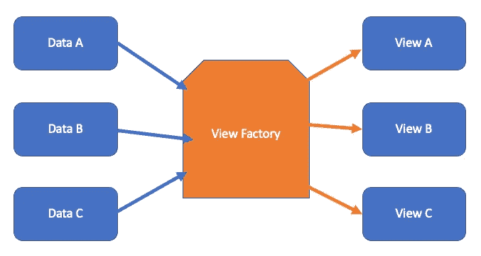
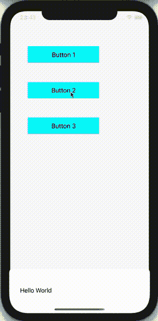

# 如何从任何地方导航到 iOS 中的任何视图？

> 原文：<https://betterprogramming.pub/open-every-view-from-everywhere-c57f6ca61a74>

## 让我们使用一个视图控制器工厂来简化导航

格雷格·罗森克在 [Unsplash](https://unsplash.com?utm_source=medium&utm_medium=referral) 上拍摄的照片

打开多个视图—您是否也有同样的问题？

你在视图 A 中，你需要打开视图 B，但是你也需要从视图 C 打开视图 B，也需要从视图 d 打开视图 B，我们通常怎么做？我们复制我们的代码。直接违反了不重复自己(干)的原则。

肯定有更优雅的方式吧？是的，有。一家**工厂**。一个**查看控制器工厂**。

其思想是在某处注入视图所需的数据，并自动创建视图。这是一张图片:

所以，让我们创建一个工厂。这里的工厂很一般，什么都可以用。其概念是，工厂可以注册任何类型，并使用该类型来创建和返回工厂类型的对象。代码如下:

对于我们的例子，我们将有一个`UIViewController`工厂。代码如下:

我们将使用这个`ViewControllerFactory`作为我们项目的特定`MyViewControllerFactory`的超类。在这个类中，我们可以注册所有需要呈现的 UIViewControllers。下面是代码的样子:

好的，很好。现在我们有了`MyViewControllerFactory`，我们可以给它数据，它会返回给我们正确的`UIViewController.`

示例:

`MyViewControllerFactory().create(for: Data1(title: "Hello"))`会返回一个`UIViewController1`。

`MyViewControllerFactory().create(for: Data2(color: .red))`会返回一个`UIViewController2`

现在，我们如何添加这个功能？我们如何在任何地方使用这种功能？如下所示，协议扩展可以帮助我们:

此时我们唯一需要做的就是将这个协议添加到我们想要的任何`ViewController`中。

通过使`ViewController`与`IViewControllerNavigation`一致，我们的`ViewController`自动拥有了 navigate( `data:`)方法。

我们只需要调用方法和正确的`ViewController`，它是由我们的`Factory`创建并呈现给我的`UIViewController`。

代码如下:

这个解决方案——稍加修改——也适用于 SwiftUI。

一如既往，快乐编码。