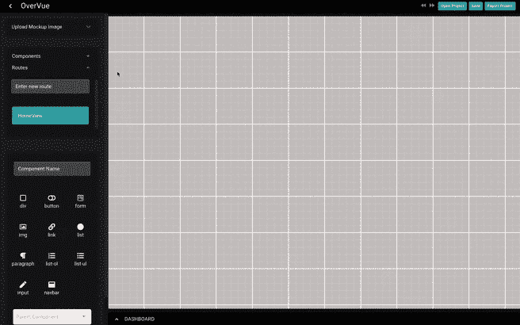
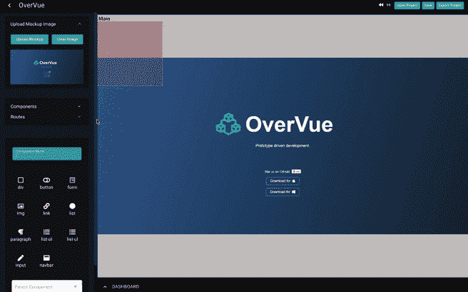
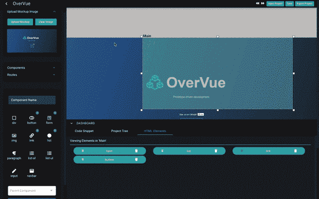

# 开放源代码:高估 V2 的一次漫游

> 原文：<https://betterprogramming.pub/open-source-a-walkthrough-of-overvue-v2-8e46c5682eb9>

## 原型更好，在 Vue.js

保罗·斯科鲁普斯卡斯在 [Unsplash](/?utm_source=unsplash&utm_medium=referral&utm_content=creditCopyText) 上的照片

2019 年推出了 [Vue.js](https://vuejs.org/) 的原型工具 OverVue。这个桌面应用程序允许开发人员用一个易于使用的 GUI 来建模他们的应用程序，并保存或导出所需的最终项目。对于那些已经使用过 OverVue v1，的人，以及那些对这个工具不熟悉的人，我非常兴奋地分享即将到来的版本的一些新的和改进的特性，这些特性使得项目原型更加用户友好。

# **上传图像**

现在 Mac 和 Windows 用户都可以使用，很容易[下载](https://www.overvue.io/)应用程序并开始一个项目。一旦打开，你可以选择上传你当前路线的模型图像，HomeView。在这个项目中，由于我计划使用 Vue 路由器，我创建了第二条路线，并添加了样机图像。这是一个新功能，您可以在创建的每条路线中添加一个独特的实体模型图像。

上传项目路线的实体模型图像

# **定制组件**

创建和定制您的 Vue 组件很简单。每个组件都可以分配一个父组件或子组件。这可以在您在左侧创建组件时完成，或者稍后通过右键单击您的组件并选择“更新子组件”来完成您可以移动和调整您的组件，以适应您的样机。此外，如果需要，您现在可以更改 z 索引(通过右键单击)来对组件进行分层。

组件的创建和定制

# **嵌套 HTML 元素**

使用左侧面板上的图标界面，可以在组件创建期间或之后选择 Vue 组件中需要的 HTML 元素。打开底部的仪表板，检查组件的 HTML 元素。如果需要嵌套 HTML 元素，可以在仪表板中创建组件后完成。有两种方法可以嵌套 HTML 元素:

*   双击您的父 HTML，并从左侧显示的 HTML 图标中选择一个 HTML 元素。
*   单击父 HTML 上的左侧图标，进入 HTML 元素的更深一层，并从左侧显示的 HTML 图标中选择一个 HTML 元素。

Downloads.vue 组件的嵌套 HTML 元素

# **撤销/重做您的操作**

如果你犯了一个错误，或者想回到上一步，你可以通过右上角的撤销/重做按钮或者简单的键盘按键(ctr-z/ ctr-y)相对容易地做到这一点。

撤消添加 HTML 元素和调整 Main.vue 组件的大小

# **保存并导出**

您可以将未完成的项目保存为 JSON 文件，以便以后通过保存项目来处理。一旦您完成了模型，导出项目，并继续在您选择的工作空间中工作。

# **未来迭代**

一些我们感到兴奋但尚未实现的功能:

*   Vuex 状态原型和样板文件导出。
*   以 TypeScript 导出文件的选项。
*   HTML 元素中的嵌套组件。
*   与故事书的整合。

感谢阅读！作为一个开源应用程序，我们很乐意让您测试这个应用程序，并提交您可能有的任何问题或贡献。请让我们知道您的想法，或者前往 [GitHub](https://github.com/open-source-labs/OverVue) 了解更多信息。如果你想阅读第一篇关于 Medium 的高估文章，请阅读这篇文章。

一个巨大的开发团队大喊:院长 Ohashi，德鲁阮，约瑟夫 Eisele，亚历山大哈瓦斯，Keriann 林，艾莉森普拉特，和 Joju Olaode。