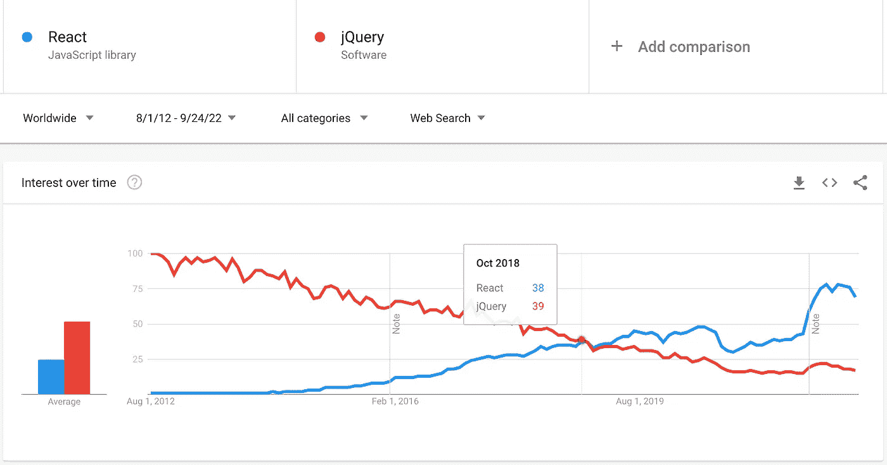
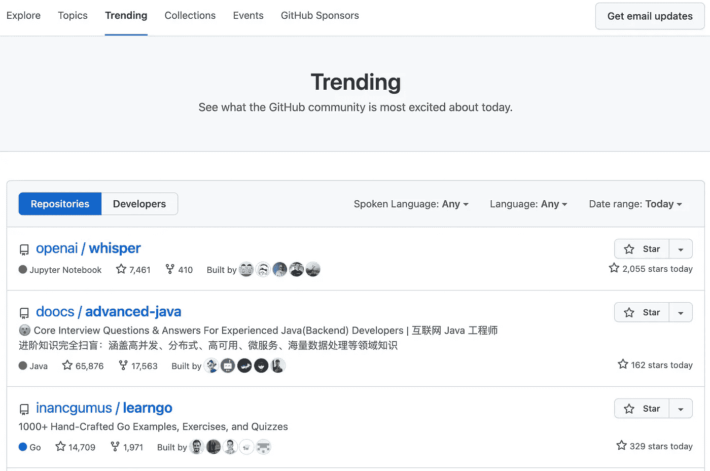

# 开源依赖:它是圣杯还是一堆蠕虫？

> 原文：<https://betterprogramming.pub/open-source-dependencies-is-it-the-holy-grail-or-a-can-of-worms-2954e1e1cfc6>

## 挑选 OSS 依赖项


神秘的开源依赖:它是圣杯还是一堆蠕虫？|照片由[弗吉尼亚·约翰逊](https://unsplash.com/@johnsonvr?utm_source=medium&utm_medium=referral)在 [Unsplash](https://unsplash.com?utm_source=medium&utm_medium=referral) 上拍摄

您是否曾经想过是否应该在代码中包含第三方库？有时这是值得的，但大多数时候不是。这里有一个快速判断的方法:如果这个库正在做你不理解的事情，或者如果它正在做你自己不费吹灰之力就能做的事情，那么就不要使用它。这个规则的唯一例外是，如果库正在做一些你自己很难或很费时的事情。在这种情况下，即使你不能完全理解它，使用这个库也是值得的。

这里有一个最近与外部软件供应商合作的例子:在审查一个拉请求时，我注意到 jQuery 是一个依赖项。我很惊讶:“啊？2022 年还有人用吗？”并将注意力转移到关键功能上，将询问开发人员为什么我们在这个项目中需要 jQuery 的评论留了下来。开发者的回答更让我吃惊。他们使用 jQuery 只是为了`onClick`事件处理(！！！).300kb 的额外捆绑代码可供下载。对于单个处理程序。即使有了`document.body`元素上的处理程序，普通的 JavaScript 实现也没有那么重要。

> 如果您正在添加一个外部依赖项，请检查您是否使用了其至少 50%的功能。否则，不值得。

您是否使用了该依赖关系中超过 50%的功能？库有超过 1000 行的生产代码吗？你有计划使用超过一半的公共 API 吗？该库具有最小的外部依赖性吗？您是否有能力用定制解决方案来取代这种依赖性？

如果你对这些问题中的任何一个回答“是”，你就应该考虑依赖了。这意味着您准备好保持依赖关系最新，修补安全漏洞(稍后将详细介绍)，使用所有对您重要的特性，并关注未来版本的路线图。或者不写，从头开始写所有的东西——你有世界上所有的时间。在写上一篇[文章](/how-golang-generics-empower-concise-api-html-table-extraction-case-study-e2f4050bbb7d)中描述的库的时候，我问了自己所有这些问题。

你不仅带来了依赖，还带来了它的依赖和它的依赖的依赖。务必经常查看类似于`go.mod`、`pom.xml`、`setup.py`、`package.json`的文件。你在看那些执照文件，对吗？你想从树上摘下一根树枝，而不是整片森林。

像 mvnrepository.com[这样的网站提供了很好的依赖洞察，在添加依赖之前一定要使用。这对开源库来说格外重要:不仅仅是你的库获得了依赖。成百上千的其他项目也得到了它。](https://mvnrepository.com/artifact/org.apache.tika/tika-core/2.4.1)


走进依赖的森林|图片来自 [Thom Holmes](https://unsplash.com/@thomholmes?utm_source=medium&utm_medium=referral) 在 [Unsplash](https://unsplash.com?utm_source=medium&utm_medium=referral)

十几年前，当开始一个新的企业软件项目时，我们在头脑风暴技术堆栈，并就选择哪一个展开了争论。接下来发生的事情让我大吃一惊:我的同事在谷歌搜索中输入了两个不同的技术名称，并计算了结果的数量。

结果更多的技术被宣布为获胜者，我们最终使用了它。我惊呆了，因为我从未见过有人这样想。记住——那是 2010 年。代码质量怎么样？组件设计之美怎么样？但事实证明，我的同事是对的:使用谷歌搜索结果作为质量的代理是在两种技术之间进行选择的一种令人惊讶的有效方式。

这种方法奏效有几个原因。首先，当人们试图了解新技术时，他们通常会从谷歌搜索开始。因此，结果的数量很好地代表了技术的质量。或者是？第二，它是一个很好的指标，表明该技术有多好的文档记录。如果有很多结果，这意味着有很多资源可以帮助你了解这项技术。第三，搜索结果的数量很好地反映了这项技术的使用程度。这个数字越大，使用这项技术的人就越多，而且这项技术很有可能得到很好的支持。

因此，如果你试图在两种技术之间做出选择，你可以使用谷歌搜索结果作为质量的代理。但是给定查询的结果数量并不总是一个好的指标。最流行的技术并不总是最好的技术。最受欢迎的技术往往是更擅长营销自己或更擅长让人们谈论它的技术。Haskell 很漂亮，所有的软件都应该用 Haskell 重写吧？另一个问题是，谷歌不是一个完美的搜索引擎。为给定的查询找到最佳资源并不总是可能的。所以，即使你用谷歌作为质量的代理，你也可能不会得到最好的结果。



React 和 jQuery 的谷歌趋势

仅凭搜索结果的数量就能告知你质量如何吗？Cobol 有 11B 结果，但并不代表它是现代有据可查的技术。Stack Exchange 上的问题数量可以告诉你技术的受欢迎程度。它暗示了质量吗？号码

GitHub 上存储库的数量可以向您简要介绍对给定技术感兴趣的开发人员的数量。Google Trends 的文章数量可以揭示技术的流行程度。在 2018 年 10 月之前，jQuery 的搜索结果比 React 多，但这并不意味着 jQuery 是更好的技术。它启发了人们吗？是的。今天它用得多吗？号码

当然，软件采用趋势并不总是正确的，对某些事情下注就像股票投资一样——你永远不知道未来会发生什么。看看[有线卡](https://www.google.com/finance/quote/WRCDF:OTCMKTS?window=MAX)发生了什么。当然，如果你总是尽职尽责，会有所帮助。评估技术、背后的公司和竞争。此外，你应该总是有一个备份计划。或者两个。

> 搜索结果的数量可以表明技术的受欢迎程度，但它不能告诉你技术的质量。



[GitHub 趋势](https://github.com/trending)评估炒作周期

每次我选择新技术时，最后提交和发布日期是我关注的其他事情。如果项目几个月/几年都没有提交，对我来说是一个巨大的危险信号。很容易被最新的技术所吸引，并希望在每个项目中使用它。但这通常是个坏主意。大量的库只是没有足够的时间来成熟，并且通常很难找到支持。

哦，我忘了——它是开源的。没有支持，除非你自己去修。或者花钱请人来做。项目提交者的数量是一个健康社区的良好指标。当只有少数人支持代码库时，应用额外的尽职调查。请记住，Linux 在早期曾一度是一个人的项目。

发布也是项目健康的一个很好的指示器。如果社区没有发布新版本，它可能没有得到它需要的关注。及时修复错误和安全问题是非常重要的。如果你需要一个可以处理数百万用户的坚如磐石的基础，使用一种已经存在 5-10 年的技术可能是一个好主意。很好地理解现有的代码库和你正在考虑的技术是很重要的。

如果你正在做一个绿地项目，你可能有更多的余地来选择一个更新的技术。我参与过几个项目，在这些项目中，我们根据技术的酷感来选择技术组合。这项技术崭新而闪亮，每个人都想使用它。这是一个糟糕的动机，产品无法在合理的时间表推出。

我甚至没有提到第三方依赖的安全风险——有大量关于 ATT[CK&供应链攻击的信息。回想一下最近互联网灾难中一个被广泛使用的无趣的库，](https://attack.mitre.org/techniques/T1474/001/) [log4j](https://www.techtarget.com/whatis/feature/Log4j-explained-Everything-you-need-to-know) 。它拥有 [140 多个贡献者](https://github.com/apache/logging-log4j2)，134 个发布，12k+提交，3k+明星，以及一个健康的社区。它有一个小的 API 表面。但它打破了互联网。你应该写你的日志库吗？大概不会。您应该保持网络边界的安全吗？肯定是的。

您能做些什么来确保更顺利的操作并避免不必要的风险？这里有几个建议:分析依赖树。在包管理器中运行命令或者使用像 Sonatype 这样的专业供应商工具应该很容易。请在更改依赖关系树之前对其进行验证。包管理器跟踪依赖项，因此您应该能够获得它们的签名，并根据已知良好依赖项的安全列表来验证它们。

在我的另一篇博文中，了解 GitHub Dependabot 如何通过自动化的依赖性和安全补丁管理来帮助开源项目保持安全和最新:

[](/github-dependabot-in-action-42a4db93d35) [## GitHub 依赖机器人在行动

### 在过去的两年里，我已经在 20 个开源项目中使用了这个非常棒的工具。以下是我的看法

better 编程. pub](/github-dependabot-in-action-42a4db93d35) 

用 GitHub[dependent bot](https://github.com/features/security)或替代物建立对依赖树的持续监控。它允许您在问题产生之前尽早发现并解决问题。使用软件包管理器将依赖项更新到最新版本。如果您遵循这些步骤，您将能够为您的应用程序构建一个安全的边界，并避免不必要的风险。

这篇文章听起来像是来自[南方公园](https://www.southparkstudios.com/)的[马后炮队长](https://southpark.fandom.com/wiki/Captain_Hindsight)写的。

我在 OpenAI GPT3 模型的帮助下写了这篇文章，它完成了我的一些想法，对草稿来说很有趣。

```
**Want to Connect?**Did I miss anything? Do you agree? Let me know in the comments. Follow [@nf_x](https://twitter.com/nf_x) on Twitter and [subscribe on Medium](https://nf-x.medium.com/).
```