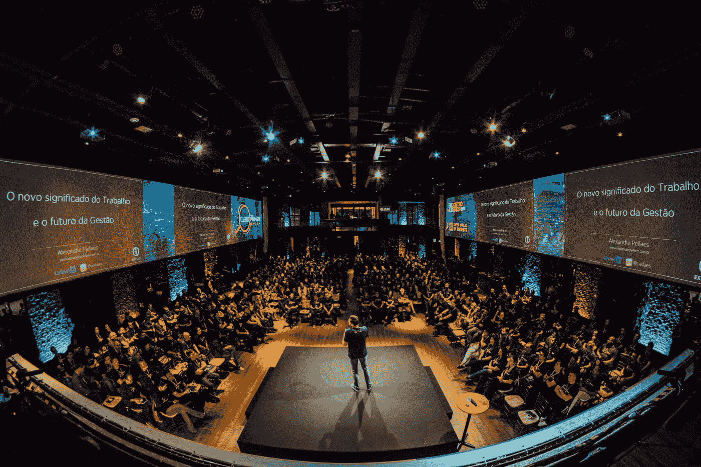
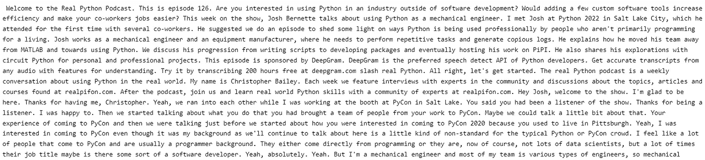

# 使用 Python 通过 OpenAI 的 Whisper API 将播客转换为文本

> 原文：<https://betterprogramming.pub/openais-whisper-tutorial-42140dd696ee>

## 本教程一步一步地指导新的开源模型 Whisper！这是最先进的语音识别技术！

照片由[亚历山大·佩莱斯](https://unsplash.com/@apellaes?utm_source=medium&utm_medium=referral)在 [Unsplash](https://unsplash.com?utm_source=medium&utm_medium=referral)

OpenAI 开源 Whisper 模型——最先进的语音识别系统。

我们测试了一下，印象深刻！

我们拍了最新的 RealPython 一集，时长 1 小时 10 分钟。我们用一个基本的 CPU 花了 56 分钟，用最小的耳语模型将音频文件转换成几乎完美的文本转录。

接下来，我们用几行 Python 代码展示了在实践中使用 Whisper 的步骤。

# **教程**

本教程用一段代码解释了在本地机器和云环境中使用 Whisper 模型的方法。

GitHub 上有 whisper 模型。我们使用下面的命令直接在 Jupyter 笔记本中下载它:

Whisper 模型使用`[ffmpeg](https://ffmpeg.org)`程序作为需求。一些云环境可能已经包含了它，但是很可能您的本地机器需要安装这个程序。

OpenAI 指的是安装这个包的多种方法，我们在这里通过使用 [Scoop](https://scoop.sh/) 包管理器来应用其中的一种。在我们看来，这很简单，因为您可以通过在终端窗口中运行以下两个命令来让它工作:

第一行安装勺子。第二行使用 Scoop 包管理器安装`ffmpeg`程序。

这一步在本地机器中是必需的，但是我们不需要在我们的云环境中执行这一步。

然后，我们重启内核以确保安装生效。

我们现在可以导入库:

Whisper 使用 GPU 运行速度更快。我们用 Whisper 转录了一个 1 小时 10 分钟的播客。花了:

*   在本地机器上用 CPU 运行它需要 56 分钟
*   在云环境下用 GPU 运行 4 分钟。

我们用下面的代码测试了 GPU 的可用性。如果兼容 Cuda 的 Nvidia GPU 不可用，则第一行结果为 False，如果可用，则为`True`。第二行代码将模型设置为首选 GPU，只要它可用。

我们现在可以加载 Whisper 模型。我们在 load_model 中包含了两个变量。“基础”是具有 7400 万个参数的版本的耳语模型名称。3900 万到 15.5 亿个参数之间，每个模型都有对应的模型名称。这里的[指的是每个型号的名称和特性](https://github.com/openai/whisper)。我们在上一节中定义了第二个“设备”变量。代码的第二行让我们打印模型语言和参数的总数。

我们使用 Whisper 模型来录制从互联网下载的播客。音频文件可以在本地目录中找到。

我们使用`“load_audio”` 命令加载这个音频。 `“pad_or_trim”`命令将音频填充并修剪成 30 秒的时间段。最后一行为我们的本地设备创建了`log-Mel`声谱图。

`detect_language`检测音频文件语言:

我们使用`DecodingOptions`和`decode`命令转录音频。我们可以打印前 30 秒的音频。

我们用`transcribe`命令转录整个音频文件并打印结果。

执行这段代码将得到音频文件的完整副本，我们在这里打印了它的简短部分:

来自 [RealPython-podcast](https://realpython.com/podcasts/rpp/) 第 126 集的**播客抄本**的示例片段。[图片由作者提供]

转录用 GPU 产生 us 用了 4 分钟，CPU 用了 56 分钟。

感谢您的阅读。

# **参考文献**

[1] [拉德福德等，2022](https://cdn.openai.com/papers/whisper.pdf) 。基于大规模弱监督的鲁棒语音识别。OpenAI。