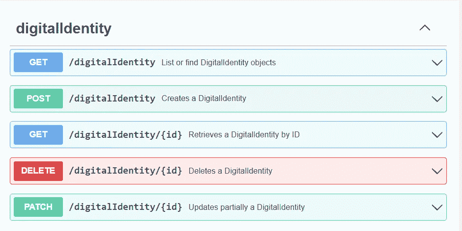
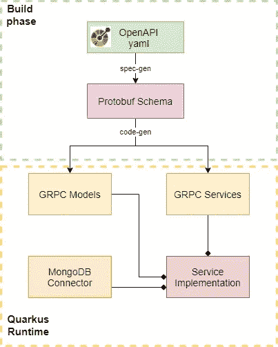
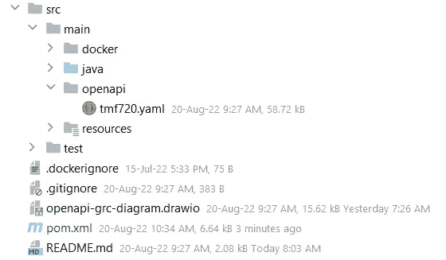
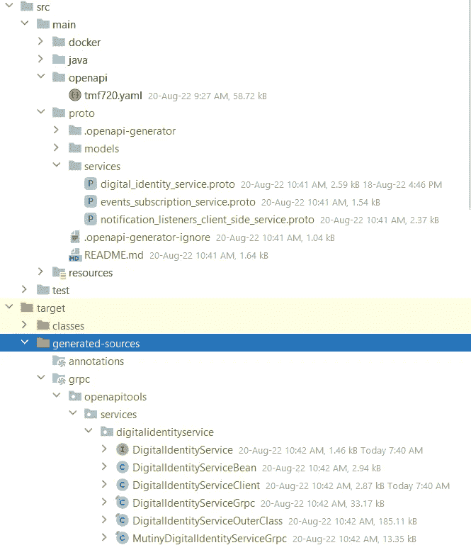

# 使用 Quarkus 从 OpenAPI 到 gRPC

> 原文：<https://betterprogramming.pub/openapi-to-grpc-with-quarkus-61d87e353cbe>

## 如何将 REST 服务实现为 gRPC

Emile Perron 在 [Unsplash](https://unsplash.com?utm_source=medium&utm_medium=referral) 上的照片

# 介绍

[REST](https://en.wikipedia.org/wiki/Representational_state_transfer) (OpenAPI)和 [gRPC](https://grpc.io/) 是两种最流行的 API 格式。REST 是大多数公共 API 选择的风格，gRPC 是需要高效网络的内部 API 的流行替代。

OpenAPI 规范定义了一个描述 REST APIs 及其功能的标准。

默认情况下，gRPC 使用[协议缓冲区](https://developers.google.com/protocol-buffers/docs/overview)，这是 Google 用于序列化结构化数据的开源机制。协议缓冲区模式也是一个 API 规范。

[TM 论坛](https://www.tmforum.org/)是电信行业组织的全球性协会。TM 论坛已经开发了一套覆盖电信领域的 [OpenAPI](https://projects.tmforum.org/wiki/display/API/Open+API+Table) 规范。

# 用例

这篇文章的诞生是因为我想熟悉 gRPC 并理解它的好处和限制。然而，由于 [API 优先的方法](https://swagger.io/resources/articles/adopting-an-api-first-approach/#:~:text=An%20API%2Dfirst%20approach%20means,be%20consumed%20by%20client%20applications.)，现在 OpenAPIs 被广泛使用，我觉得不应该凭空创造一个简单的 API。

相反，如果我们用 gRPC 实现一个成熟的 OpenAPI 会怎么样？TM 论坛 API 非常适合我们的目的，因为它们很复杂，但是与实现无关。

# TL；速度三角形定位法(dead reckoning)

一个 GRPC 服务的 POC，仅使用一个 OpenAPI 规范作为输入，其他的都是从它生成的。

 [## GitHub-go rosc/open API-to-grpc-quar kus

### 其概念是从给定的 OpenAPI 创建一个 GRPC API，并生成所有模型。

github.com](https://github.com/Gorosc/openapi-to-grpc-quarkus) 

邮差:[https://www . postman . com/galactic-shadow-579657/workspace/open API-to-grpc-quar kus-workspace](https://www.postman.com/galactic-shadow-579657/workspace/openapi-to-grpc-quarkus-workspace)

# 设计选择

我选择了 [TMF 720 数字身份 API](https://github.com/tmforum-apis/TMF720_DigitalIdentity) ，它是 TMF API 表中的最新成员之一。它提供了管理数字身份(凭证、密码、生物特征等)的能力。).在此 POC 的范围内，业务逻辑并不那么重要。它是一个成熟的 API，但不像老的 TMF API 那样过于臃肿，我们将把它作为一个 CRUD API 来实现。

我们的目标是将服务实现为 REST

对于实施，技术选择有:

1.  [Quarkus 框架](https://quarkus.io/):我们可以使用普通 Java 和 gRPC 中包含的默认服务器来实现服务。然而，我选择了框架，因为我们必须管理配置和数据库连接。我不喜欢手工实现这些区域。Quarkus 对 [gRPC](https://quarkus.io/guides/grpc-getting-started) 有一流的支持。
2.  MongoDB :这个 API 有一个复杂的模式。它单独的实体本身没有太大的意义。因此，我们希望将整个模型保存为一个文档，MongoDB 是第一个想到的。
3.  [OpenAPI 生成器](https://openapi-generator.tech/docs/generators/protobuf-schema)用于从 OpenAPI 生成 Protobuf 模式。

> 解决方案 1:在评估了 google 的工具 gnostic 之后，我决定使用 OpenAPI 生成器。OpenAPI 生成器 a)以 maven 插件的形式出现，可以在我们的构建链中使用 b)将消息和服务分解成不同的原型文件。因此，gRPC 生成器将生成更多可访问的文件，以便在我们的 IDE 中工作。

软件体系结构

> 由于时间不够，此 POC 尚未准备好投入生产。缺少验证和正确的错误处理。但是，遵循测试驱动的开发方法，所有的主要流程都被覆盖了。

# 履行

## 设置

我们的 maven 设置将包括 Quarkus 以及 gRPC 和 Mongo 的必要依赖项:

OpenAPI 对 gRPC 应用程序的依赖性

OpenAPI 生成器作为一个插件发挥作用。这将是我们构建链中的第一个插件。这个配置的关键部分是输出文件夹`*/src/main/proto*`,因为这是 Quarkus 期望找到原型模式的地方。

用于 protobuf 模式生成的 OpenAPI 生成器 maven 插件配置

我们的初始文件结构将如下所示:

生成前的初始文件结构

# 产生

让我们继续调用“mvn 编译”插件将按顺序执行，结果如下所示:

模式和代码生成后的文件结构

OpenAPI 生成器插件已经用为服务和模型生成的 protobuf 模式填充了我们的`*/src/main/proto*` 文件夹。我们将使用`*digital_identity_service.proto*` 作为我们的用例。看起来是这样的:

gRPC 服务

我们将实现 gRPC 服务的每个方法。Quarkus 已经为我们可以使用的服务生成了一个接口，自动使其对[兵变](https://quarkus.io/guides/mutiny-primer)做出反应。

gRPC 兵变服务接口

> 我们可以使用默认的 gRPC Java 实现
> 
> 数字标识服务 Grpc。DigitalIdentityServiceImplBase
> 
> 然而，由于我们使用 Quarkus，它有意义的去反应。这样，此 POC 更适合用作参考实施。

# 创建数字身份

对于我们的第一个实现来说，Create 是最好的选择，它可以为我们的后续操作提供一些数据。

TMF 规范利用不同的模型进行创建、读取和更新。结果，代码生成产生了多个 gRPC 模型类，它们彼此不能直接映射。

*   `DigitalIdentity`
*   `DigitalIdentityCreate`
*   `DigitalIdentityUpdate`

> 解决方案 2:我们将使用“[com . Google . proto buf . util . JSON format](https://developers.google.com/protocol-buffers/docs/reference/java/com/google/protobuf/util/JsonFormat)”将 gRPC 模型序列化为 JSON。这些模型的区别只是一些字段(id、状态、创建日期等。).因此，将 JSON 反序列化到不同的模型是一种有效的映射方法。这不是一个开销，因为我们还需要 Mongo 的 JSON 序列化(见下文)。

gRPC 创建数字身份

> [超媒体](https://en.wikipedia.org/wiki/HATEOAS)未在 protobuf 或 gRPC 中定义。
> 
> 我仍然觉得用获取特定数字身份所需的方法和输入来填充 href 属性很有趣

我们不想让任何 gRPC 逻辑溢出到我们的 DB 域和 Mongo 连接器中。由于我们没有持久化的模型，我们的 Mongo 服务将接受 JSON 格式的字符串作为输入，返回作为输出。当然，这有一个不希望的效果，即在我们的数据库中有未验证和未类型化的输入。我们将接受此 POC 范围内的风险。

mongo 创造了数字身份

# 列出数字身份

类似地，我们从 Mongo 中检索结果，并使用 JSONFormat 将它们反序列化为 gRPC 模型。我们还将从数据库接收到的 Multi 映射到 Uni。我们将所有结果收集到一个列表中，并将它们添加到`Uni`响应中。

gRPC 列表数字身份

在 Mongo 中，我们使用本地的 ObjectId 作为 id。但是，由于这不是我们规范的一部分(因此，JSON 反序列化将会失败)，我们用`id`代替它。

Mongo 列表数字身份

# 检索数字身份

检索单个数字身份和映射与`List`相同。

Mongo 检索数字身份

当我们使用`_i` d 进行搜索时，我们不期望有多于一个的结果。gRPC 服务不需要知道 Mongo 在这种情况下仍然返回一个 Multi 的细节。

mongo 检索数字身份

# 删除数字身份

gRPC 中的 Empty 是我们需要创建并发回的对象。

gRPC 删除数字身份

mongo 删除操作返回一个 void。我挑战自己让它返回文档或一个 long(点击次数),但是用一个简单的 void 解决了。

mongo 删除数字身份

# 修补数字身份

Patch 非常像 Create，但是我们从请求中提取两个参数，mongo 服务返回文档。

gRPC 补丁数字身份

为了使更新成为操作指定的合并补丁，我们需要使用`[$set](https://www.mongodb.com/docs/manual/reference/operator/update/set/)` [操作符。](https://www.mongodb.com/docs/manual/reference/operator/update/set/)

mongo 更新数字身份

# 包裹

我们创建了服务，并且满足了我们的基本需求。所有与服务相关的代码都是根据 OpenAPI 规范生成的。我们实现了 [glue](https://en.wikipedia.org/wiki/Glue_code) 代码。然而，它也可能是这一代人的一部分。

我还得出了一些有价值的见解:

*   gRPC 更像是一个框架，而不是一个规范
*   Protobuff schema 没有 OpenAPI 那么详细，它的生成遗漏了一些信息，比如业务错误和代码。
*   Protobuf Util `JSONFormat`可以用来为 Mongo DB 存储创建 JSON 文档。
*   `JSONFormat`也可用于相似物体之间的映射。
*   由于我们的服务网络层有了更有效的消息格式，Mongo 所需的 JSON 序列化让我觉得很奇怪。

有没有更有效的方法将我们的数据保存为文档格式？你觉得 gRPC 怎么样？请在评论中让我知道。

# 参考

*   https://quarkus.io/guides/grpc-getting-started 的夸库斯·GRPC
*   OpenAPI 生成器:[https://open API-Generator . tech/docs/generators/proto buf-schema](https://openapi-generator.tech/docs/generators/protobuf-schema)
*   TMF 开放 API 表:[https://projects . TM forum . org/wiki/display/API/Open+API+Table](https://projects.tmforum.org/wiki/display/API/Open+API+Table)