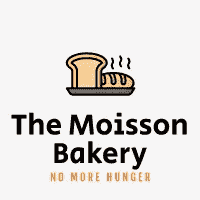

# 经营一家非营利面包店

> 原文：<https://betterprogramming.pub/operating-a-non-profit-bakery-94019b99efa6>

## 用一个虚构的沃尔特面包店的故事深入浅出地说明能力管理


由 [Ales Krivec](https://unsplash.com/@aleskrivec?utm_source=unsplash&utm_medium=referral&utm_content=creditCopyText) 在 [Unsplash](https://unsplash.com/?utm_source=unsplash&utm_medium=referral&utm_content=creditCopyText) 上拍摄的照片

类似于我之前的一个关于如何“[设计一个咖啡店](/system-design-in-laymans-terms-design-a-coffee-shop-e1abb42dd123)”这里有一个关于“经营一家面包店”与上一篇文章不同，这篇文章包含的技术术语较少，但更多的是关于角色的背景知识。

但不管怎样，它强调了大规模分布式系统中资源管理的挑战。如果您的组织拥有许多资源(例如存储、计算等。)，你一定要分发给各个团队，各个产品。你如何确保它们被公平有效地分配？

在今天的故事中，让我们看看沃尔特是如何应对这些挑战的。

# 童年的梦想

沃尔特·福尔诺是一位成功的商人。这些年他努力工作，发了大财。45 岁时，沃尔特准备退休了。

坐在后院，看着某一天太平洋上空的夕阳，他觉得自己还年轻，精力充沛，他想用余生做一些更有意义的事情。

他一直希望做的一件事是开一家面包店。首先，多年来他养成了烘焙习惯。他很少从市场上买面包。最重要的是，他喜欢酵母的味道。他喜欢看蛋糕在烤箱里慢慢发酵。

第二个原因更个人化。大多数人认为沃尔特是一位成功而善良的商人。一些比较亲近的朋友可能知道，他 20 多岁的时候曾经当过兵。但是很少有人知道他在一个贫穷的社区的贫穷家庭中长大。有时，他会吃不饱。

持续饥饿的感觉不是你可以用语言描述的。几年来，沃尔特经历了这一切。这是他想开面包店的第二个原因。他想在家乡西波弗特市开一家面包店。他不想让那个小镇的孩子在饥饿中长大。

# 开始

在为时已晚之前，47 岁的沃尔特终于准备好了。他回到了波弗特西部。他买下了一家停业的旧帽子店。故事就是这样开始的。这就是沃尔特开始他的非营利面包店之旅的地方。他决定把它叫做莫伊森面包店。



# 开场

他决定从自己烘焙开始。他没有雇佣任何人，因为他不确定是否有人会像他一样喜欢他的面包。他也决定暂时不收费。定价很复杂。还有，他开面包店的动机是为了养活那些需要帮助的人，而不是为了发财。

5 月 1 日，随着夏日的第一缕清风，他打开了门。消息走漏了。人们喜欢莫伊森面包店。尽管他现在卖的面包只有一种，那就是手工酸奶面包。人们不断回来，他们带来了他们的朋友和他们朋友的朋友。

# 厨房里有更多的厨师

他很快意识到他应该雇佣更多的厨师，不仅是为了增加产量，也是为了提供更多种类的产品。毕竟他一个人只能做这么多。

夏天结束前，他雇佣了马修、雷和瓦吉哈。

他们每个人都专攻一种烘焙食品。例如，马修接手了沃尔特一直在做的发酵面包。雷加盟的时候带了巧克力蛋糕曲奇的配方。瓦吉哈表示，她擅长用生可可制作黑巧克力。当然，为什么不呢？沃尔特想，只要好吃就好。沃尔特让雷用瓦吉哈的巧克力做饼干，而不是从市场上买。

随着时间的推移，他又雇了几个厨师。但他没有提到任何一个厨师。他希望人人平等。保持扁平的层级结构可能有助于促进所有权和创新。这就是沃尔特一直告诉厨师们的:无论你开发了什么食谱，都要努力改进它。另外，如果你需要一种其他厨师自己生产的配料，试着使用它，而不是从其他地方采购。他以雷的巧克力饼干和瓦吉哈的巧克力为例。

在桌子底下，他也偷偷地认为自己是厨师。但是当然，他把这个想法藏在心里。

# 自带食材

沃尔特开面包店的最初动机不是为了盈利。嗯，还是没有。所以他没有向 Moisson 面包店的人收费。直到有一天…

该镇教育部门的负责人丹尼希望改善所有小学生的学校体验。他的想法是在每周一下午 3 点为每个学生提供一份免费的巧克力蛋糕饼干。

本周五下午，丹尼出现在 Moisson 面包店，与沃尔特分享了这个想法，并询问沃尔特是否有可能从下周开始准备巧克力蛋糕饼干进行实验。沃尔特听了非常高兴，马上同意了。这是一个产生巨大影响的绝佳机会。

多年来，沃尔特养成了每年 12 月写一份年度回顾的习惯，以反映他当年对社会的积极影响。他对丹尼的想法非常兴奋。他认为这一定是他今年必须写下来的一个亮点。

丹尼离开后，他立即与雷和瓦吉哈交谈。和沃尔特一样兴奋，如果不是更兴奋的话，他们立即开始工作。

很快，他们意识到最大的挑战。冰箱里剩下的黄油不够了。更糟糕的是，他们清空了附近几家商店的货架，但仍然不够。

沃尔特最终找到了一个在批发供应商工作的朋友的朋友，并在周日下午为他们紧急运送黄油。

接下来的周一，他们成功地交付了他们承诺的所有饼干。多么疯狂的冒险啊！

周二早上，每个人都聚在一起，汇报上周出了什么问题。最初的会议计划是 30 分钟，但随着时间的推移，会议持续了一个半小时！但这是一次富有成效的讨论。那时，Moisson 面包店制定了第一个政策:

“如果你需要下一个大订单，那你就必须自备原料。”

这也被称为 BYOI 多年后的历史学家。

# 提供资金

在沃尔特意识到之前，已经是年底了。作为一个古老的传统，在平安夜的清晨，他静静地坐在后院，反思自己在这不可思议的一年中所取得的成就。

这是忙碌而充实的一年。今年早些时候，当他决定开一家非营利性面包店时，他从未想到会获得如此巨大的成功。

他也对自己变得如此忙碌感到惊讶。在他还是一名商人的那些年里，他通常用许多笔记来结束一年。但不是今年。他对这项工作充满热情，以至于没有抽出任何时间。更别说一年写很多笔记了。他对此非常后悔。

最大的惊喜之一是会计。他查看了自己所有银行账户中的存款，并进行了一些基本的计算。在手术的最后几个月里，他花光了一生积蓄的 12.4%。鉴于目前的烧伤和预期的增长率，他将在 2.87 年内破产。


照片由[你好我是尼克](https://unsplash.com/es/@helloimnik?utm_source=unsplash&utm_medium=referral&utm_content=creditCopyText)在 [Unsplash](https://unsplash.com/?utm_source=unsplash&utm_medium=referral&utm_content=creditCopyText)

不会吧！这是不可接受的！他打算开一个非盈利组织，但不知何故它变成了一个慈善机构。

需要资金！

第二天沃尔特联系了丹尼。今年，他们与合作者建立了密切的关系。沃尔特想知道政府是否能资助这个非营利性的面包店项目。他向丹尼解释说，如果没有外部的帮助，Moisson 面包店将无法持续经营。

丹尼非常乐意帮忙。Moisson 面包店养活了镇上这么多的穷人，给社区带来了这么多积极的能量。

在接下来一周的市政厅会议上，他提出了由政府资助面包店的想法。这个提议获得了难以置信的广泛支持。

沃尔特内心平静。有了政府的支持，他知道自己可以继续经营面包店，直到老得走不动路。

# 标准化面粉

下一个大挑战是预算。Moisson 面包店应该得到多少资助？此外，预算应该如何进一步分配到每个人身上？

这不再是物流问题了。这更像是人类的问题。

教育部(由丹尼管理)想继续每周一次给小学生提供巧克力饼干的快乐计划。有证据表明，它大大增加了孩子们的快乐，反过来，提高了学习效率。

同时，像小企业局(SBB)这样的组织也想给他们的工会工人提供酸面团面包。他们是给政府带来大部分税收的人。他们认为他们也应该有公平的份额。

按照沃尔特的建议，成立了一个独立的组织来处理预算编制——消费评估机构。这样，沃尔特可以更专注于他最擅长的事情:为人们提供最好的烘焙食品。

展望未来，消费评估机构将帮助决定:

*   每年需要多少预算？
*   为 Moisson 面包店买多少原料？
*   最重要的是，如何将这些分配给不同的组织？

他们每个季度开一次会，他们的目标是准确、公平地做出上述决定。

为了延续沃尔特的非营利精神，消费评估机构决定避免使用美元金额进行预算。但是，他们发明了一种新的货币——标准化面粉。

其实还有一个不为人知的原因。他们都讨厌亚当一直声称他们从 SBB 为镇上带来了 200 万的税收。因此，他们有权为自己的部门每年获得价值高达 200 万美元的发酵面包。

使用标准面粉是不准确的，因为面粉不是经营面包店唯一需要花钱的东西。但是，生活就是权衡，在烘焙行业中，没有什么比面粉更重要的了。

# 食谱、定价和菜单

如前所述，定价是复杂的，尤其是在非营利组织中。在常规业务中，定价是为了实现收入最大化。对于 Moisson 面包店来说，目标是收支平衡。他们想根据制作一条面包的成本来出售这条面包，而不是顾客愿意出多少钱。所有这些都需要用正常的面粉，而不是美元。

一条面包的价格受到很多因素的影响:

*   原料(面粉、鸡蛋、糖、酵母、黄油等)。)
*   电流
*   劳动
*   包装
*   炊具磨损

当然，原材料是成本的最重要因素之一。但其他因素也不容忽视。

所有这些使它成为一份全职工作。沃尔特雇佣了雷利·克拉克。

赖利会和每个厨师交谈，了解他们的秘密配料。他组织了一本大食谱，列出了每种产品的所有成分。Reilly 猜测了每种产品的标准化面粉成本(Nf。).

由于所有的厨师都在不断改进他们的烹饪工艺和配料，这是一个持续的过程。这些产品的价格经常更新，赖利一直掌握着它们的价格。

以下是菜单的一个片段:

*   酸奶面包——510 纳法。
*   巧克力饼干——1010 Nf。每盒 6 个
*   黑巧克力棒——430 Nf。每 100 克
*   白巧克力棒——620 Nf。每 100 克
*   雪纺蛋糕——1220 Nf。

# 簿记

沃尔特还在夏天多雇了一个人，雷米·叶。他在雷米以前的公司认识他很多年了，他是一个值得信赖的人。

他想让雷米帮他记账。既然我们知道了每件产品的价格，沃尔特想确保没有人拿走超过他们有权得到的东西。

这就是雷米每天帮助做的事情。他记录了每位顾客每天的消费金额。如果任何人消费超过他们应该消费的，他们会被雷米和他的两个保安善意地拒绝。

在过去，没有雷米，这是一个荣誉制度。每个人都有分配的数量，但不能保证他们会遵守。例如，SBB 每天分配到 150 条面包。但如果有一天他们拿了 250 就好了，没人会注意到。从雷米开始，一切都写在纸上。

雷米收集的这些信息对消费评估机构也非常有价值。他们可以使用它们来进行更精确的预算规划和配料订购。

# 第二年年末

时光飞逝，不知不觉又来到了另一个平安夜。像往常一样，沃尔特一大早就醒了，坐在窗户旁边盯着外面的小雨，一手拿着咖啡。去年真是太棒了，但是沃尔特怎么也想不到今年会更冒险。

简单回顾一下，这些是他们在 Moisson 面包店第二年取得的成就:

*   得到了政府的资助
*   成立了一个新组织，消费评估机构
*   雷利·克拉克被雇来管理食谱和定价
*   雷米·叶被雇来记录消费情况
*   在这个故事中，沃尔特还雇佣了几个厨师

# 新的开始

沃尔特等不及第三年开始了。还有那么多未解决的问题，沃尔特有很多想法想去探索。

存在浪费的问题。有些人要求太多。沃尔特知道一些面包正在一些后院成型。我们可以制定什么样的政策来减少垃圾量而不造成饥饿？

如果有无限的预算和无限的原料供应，问题可能会容易得多。但是这个世界并不是这样的。资源是有限的，并将继续如此。我们如何确保我们有足够的钱给每个有需要的人？当数量不够时，我们如何决定优先考虑谁？

还有一些问题是由于计划外的事件，如风暴和干旱。在那些日子里，镇上的人们会增加需求。我们应该有多少缓冲来处理像这样的意外峰值？

这些挑战是真实而艰难的。这很难，因为很多时候，这是一个人的问题，而不是一个数学问题。人类是复杂的生物。有时候，他们会情绪化，不可理喻。Walter 面临的是一个容量管理的优化问题，没有最优解，只有取舍。

但沃尔特比以往任何时候都更坚定。他知道旅程只完成了 1%。

# 结束了

今天沃尔特的故事就到这里。感谢阅读！

您是否还必须管理组织的容量？你也面临类似的挑战吗？你的方法是什么？

```
**Want to Connect?**Feel free to leave a comment below or DM me directly on [Twitter](https://twitter.com/yzhong52).
```