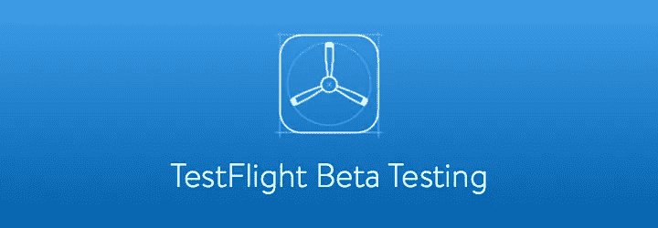
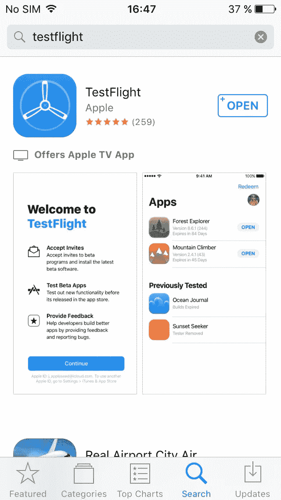
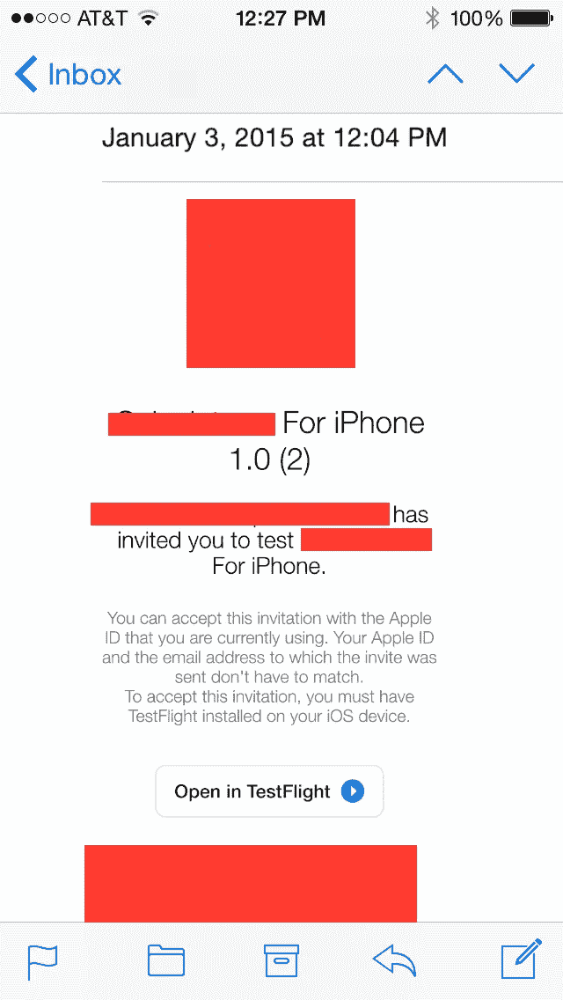
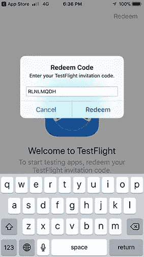
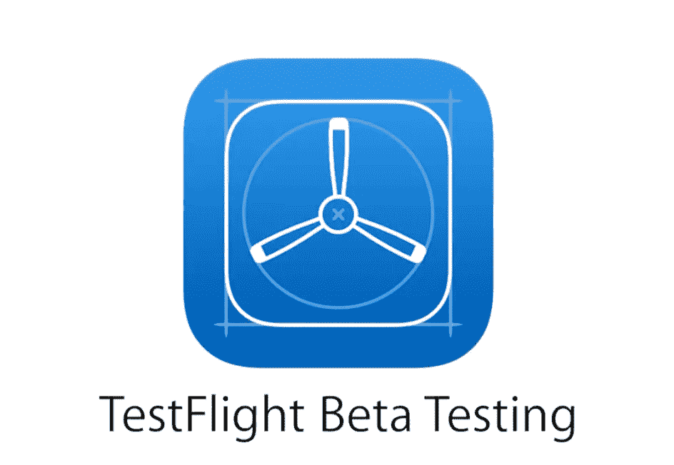

# 试飞-用户的观点

> 原文：<https://betterprogramming.pub/operating-testflight-for-all-mankind-c87fe0fc9c1a>

## 如何设置 TestFlight 并立即开始测试应用程序

我相信每个人都听说过 TestFlight 应用程序，它允许开发者发布和测试他们应用程序的测试版。测试人员/客户只需在苹果应用商店为 iPhone、iPad 和 Apple TV 下载 TestFlight，并测试他们的应用程序！

现在，苹果已经将这款应用交给了测试人员和客户，而不仅仅是开发人员，他们可以安装“测试版应用”，在测试环境中查看他们的应用。

因此，苹果公司让用户通过遵循最多五个步骤就可以轻松开始使用 TestFlight 应用程序。

让我们来看一下安装步骤。

# 步骤 1—安装

将 TestFlight 应用程序安装在您将用于从 Apple Store 进行测试的设备上:

1.  去苹果商店搜索“TestFlight”。点按下载云标志以安装它(就像您对 Apple Store 中的每个其他应用程序所做的那样)。

2.检查 iPhone 菜单中的试飞图标。

# 第 2 步—从邀请电子邮件中下载

## 2.1 在 iPhone 上下载

在您的邮件应用程序上，检查您的邮件并接受您的电子邮件邀请，或者通过公共链接安装测试版应用程序。邀请邮件将来自 iTunes Store(实际邮件是*do_not_reply@apple.com*)。

*注意:你最多只能在 30 台设备上安装一个测试版应用，所以要明智地使用。*

但是首先，您必须将您的邮件 ID 发送给开发人员，他们会将它添加到他们的测试人员列表中。检查您的邮件 ID 是否有这样一封电子邮件:

打开您的邀请电子邮件或点击 iOS 设备上的公共链接。

## 2.2 在 PC 上下载

从您的电脑上通过邀请电子邮件安装您的测试版应用程序。

1.  在 PC 上选择浏览器打开您的邀请电子邮件。
2.  单击或点击开始测试。您将被带到一个带有兑换代码的网页。
3.  在你的 iPhone 设备上打开 TestFlight。

# 步骤 3-在试飞中打开

点击 TestFlight 中的 View 或开始测试；或者轻按您想要测试的应用程序的“接受”、“安装”或“更新”。

去兑换，输入兑换码，你的 App 就安装好了！

*注意:这个邀请只会同步到你手机的 Apple ID 上。因此，转发邮件不会将测试版应用传递给任何人。只有管理 beta 测试的开发人员可以将 beta 应用程序提交给另一个测试人员。*

# 要点-

1.如果你已经在你的设备上安装了应用程序的 App Store 版本，该应用程序的测试版将会取代之前的版本。当你下载了测试版应用程序，你会看到它的名字旁边有一个橙色的点，表明它是一个测试版。

2.当你通过公共链接接受试飞邀请时，你的名字和电子邮件地址对开发者是不可见的。但是，他们可以看到你的会话和崩溃次数，以及你安装他们应用的日期。

# 苹果试飞程序

从开发人员上传他们的构建的那天起，每个构建可以测试长达 90 天。你可以在 TestFlight 的应用名称下看到你还有多少天可以测试。TestFlight 会在每次有新版本可用时通知您，并包含您需要测试的内容的说明。

在测试期间，所有应用内购买都是免费的(如果有的话)

如果需要测试的 iOS 应用没有打开，请联系开发者。开发人员的电子邮件列在邀请电子邮件的回复字段和 TestFlight 中应用程序页面的信息部分。

# 测试期结束后

测试期结束后，您将无法再打开测试版。若要安装应用程序的 App Store 版本，请从 App Store 下载或购买该应用程序。应用内购买仅在测试期间免费，测试期间的任何应用内购买都不会延续到应用商店版本。

务必阅读并分享！！