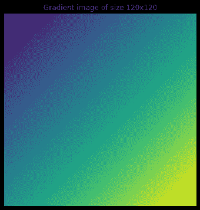
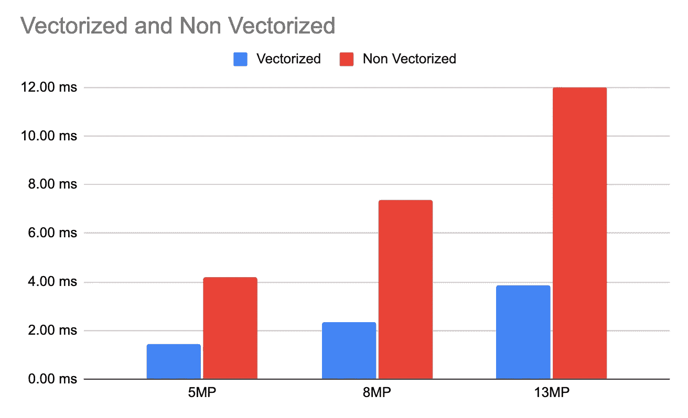
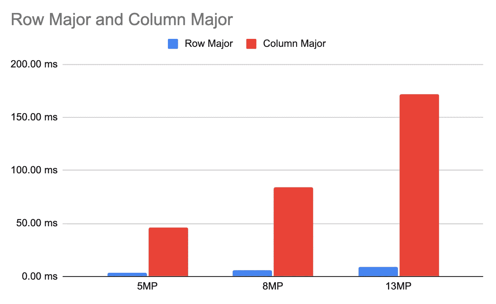
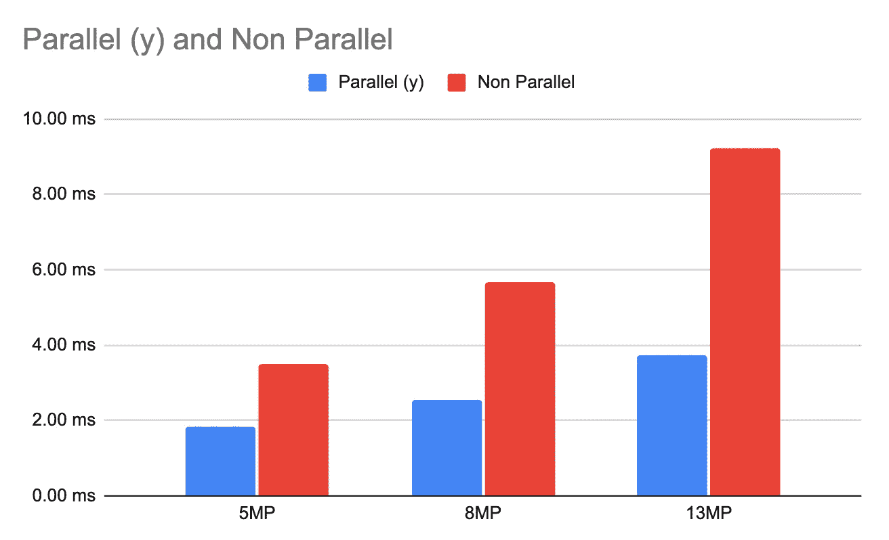
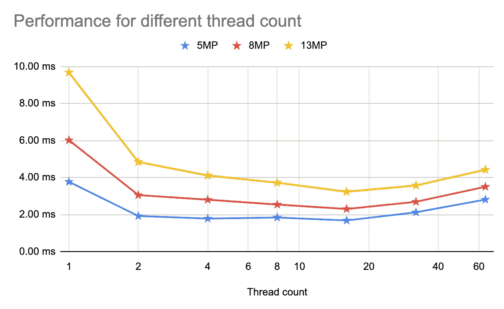

# 超越大 O 的优化——我在谷歌学到的性能技巧

> 原文：<https://betterprogramming.pub/optimisations-beyond-the-big-o-that-i-learned-at-google-5014d5c9d28a>

## 我确实在大学里学过很多，但是要么没有完全理解，要么因为缺乏实践而忘记了。在工作中使用它改变了游戏规则！


由[皮克斯贝](https://www.pexels.com/@pixabay/)在[像素](https://www.pexels.com/photo/close-up-of-electric-lamp-against-black-background-248747/)上拍摄的照片。

对于我们很多计算机领域的人来说，这方面的早期教育都是从大 O 或者大ω(ω)这个概念开始的。

> 大 O 在计算机科学中用于描述算法的性能或复杂度。大 O 用来描述算法最坏情况的复杂度，而大ω用来描述最好情况的复杂度。

对我们许多人来说，这可能也是我们最大的噩梦。软件工程面试通常涉及技术问题，要求受访者在严格的时间范围内提出优化的算法。

一个单一的编程问题可以用几种方法来解决，所以关键的方面通常是减少时间和空间的复杂性。

一个简单的例子就是在一个排序的数组中搜索一个元素。

*   强力算法具有 O(N)复杂度。
*   奥托，二分搜索法的复杂度是 O(logN)。

这意味着，如果在排序后的输入数组中有大约 10⁶元素

*   使用强力方法，在最坏的情况下需要 10⁶迭代。
*   而对于二分搜索法(优化)，你将需要大约`log2(10^6) ~ 20`次迭代。

我不常做面试准备，但每次我都做——我发现这是一次有趣的旅程。一般来说，在工作中，我也喜欢获取一段代码，并想办法让它在其他方面更快或更有效(优化)。如果我完全诚实的话，它对我来说是多巴胺的来源:)。

幸运的是，我在谷歌的工作让我在这方面花了很多时间。我在谷歌开发一款名为[相机的产品。这是一款面向低端 Android 设备的 Android 相机应用程序。因此，我的工作包括研究和实现可以在低端移动硬件上可行运行的高质量计算摄影算法。](https://developers.google.com/camera)

与我在微软围绕分布式系统的工作相反，这帮助我了解了超越标准方法的优化。我在另一篇文章中介绍了在这两个领域中工作的一些关键区别:

[](/why-working-on-cloud-vs-mobile-edge-is-so-different-e32930f1c801) [## 我在微软云和谷歌移动工作了 3 年——这是生态系统的不同之处

### 为什么云与移动(边缘)的工作如此不同？

better 编程. pub](/why-working-on-cloud-vs-mobile-edge-is-so-different-e32930f1c801) 

超越 big O 的优化包括利用现代硬件设计在最少的时间内执行您的算法。这不仅仅是减少迭代次数，还包括减少将数据从主内存传送到 CPU 寄存器所花费的时间、利用不同类型的并行性、减少 CPU 空闲时间、减少可避免的分支等等。

本文将通过证据介绍一些这种优化的例子。

# 序

在本文中，我将使用 Halide 代码示例。我在系列文章中对卤化物做了深入的[。](https://minhazav.medium.com/list/e5245103a438)

**TL；DR；** Halide 是一种特定于领域的语言，使得在现代机器上编写高性能图像和阵列处理代码变得更加容易。

本文中给出的所有数字都是使用 Halide/C++编写的代码测量的，是在启用编译器优化的情况下构建的，并且是使用微基准框架测量的。

基准测试在某个中端八核 arm64 Android 设备上运行。所有提到的方法都在 CPU 上运行。

# 矢量化

传统上，我们认为 CPU 是一个标量机器。让我们举一个生成这样的渐变图像的问题的例子



使用 matplotlib (cmap=vidris)生成的渐变图像。图片作者。

它可以表示为`f(x, y) = x + y`或者对于 2D 阵列来说表示为`a[y][x] = x + y`。

在我们的标量思维中，我们想象它对每个像素执行一次`WIDTH * HEIGHT`次，从而给出一个`O(WIDTH * HEIGHT)`时间复杂度。

这在过去是正确的。早期的 CPU 过去只有 SISD 功能。SISD 代表单指令单数据。

相反，现代 CPU 具有 SIMD 功能。SIMD 代表单指令多数据。

根据数据类型和 CPU 寄存器大小，现代 CPU 可以在单个执行周期内一次对一个数据向量(多个数据)执行单个指令。

比方说，你正在做一个类似`a[i] = a[i] + b[i]`的加法运算。现代 CPU 可以将它作为向量来执行，而不是按索引单独运行:

```
a[i + 0] = a[i + 0] + b[i + 0];
a[i + 1] = a[i + 1] + b[i + 1];
a[i + 2] = a[i + 2] + b[i + 2];
a[i + 3] = a[i + 3] + b[i + 3];
```

一气呵成。

它也不仅限于将 4 个数字相加—根据数据类型(例如`uint8` = 1 字节，`int32` = 4 字节)和处理器&支持的指令集上的寄存器大小，单个 CPU 周期内可以处理的最大数据元素数量可能会有所不同。

最近你可能已经看到越来越多的 DSP(数字信号处理器)出现在画面中(比如高通的 Hexagon)。除此之外，它们倾向于使用非常宽寄存器来支持宽 SIMD 算法。这使他们能够支持更高效的数据并行操作。

## (英)可视化(= visualization)

如果事情仍然不清楚，请允许我展示一些图表。这是你的渐变标量执行看起来像一个`4x4`图像。


渐变示例的执行顺序-默认。来源:[halide-lang.org](https://halide-lang.org/tutorials/tutorial_lesson_05_scheduling_1.html)，阿帕奇执照。

这是 SIMD 的样子(T1 图片)


图:梯度示例的执行顺序——矢量化。来源:[halide-lang.org](https://halide-lang.org/tutorials/figures/lesson_05_vectors.gif)，阿帕奇执照。

## 基准测试结果

> 我很清楚你们这些饥饿的人们，除非我给你们看一些数字，否则你们不会买的！

**代码**

写入 u8 图像和两个时间表的梯度卤化物算法。第一个是没有矢量化，另一个是有矢量化。

**结果**



以矢量化和非矢量化方式运行 f(x，y) = u8((x + y) % 255)的延迟基准比较。作者图片，使用 Google Sheets 生成。

在这个例子中，矢量化代码比非矢量化代码平均速度快`~3 times`。

根据算法和数据类型，这些数字可能会有所不同。例如，对于像`f(x, y) = g(x, y) + b`这样的简单增亮算法，我发现在相同的环境下，对于`u8`数据类型，矢量化代码比非矢量化代码更快`~5.3 times`。

## 怎么用？

有时编译器会自动对你的代码进行矢量化。这取决于使用的编译器和循环的设计方式。有时它不能，例如，如果它不能确定你的循环是数据独立的。

像`a[i] = a[i-1] — 1`这样的循环很难矢量化，因为每个索引的结果都取决于前一个索引的结果。

要在代码中使用矢量化，您可以

*   让编译器自动决定您是否满意当前的性能。
*   [指导编译器你的循环可以矢量化](/guide-the-compiler-to-speed-up-your-code-655c1902b262)。
*   通过使用适用于不同处理器家族的内部函数，对代码进行显式矢量化(例如 [ARM Neon](https://en.wikipedia.org/wiki/ARM_architecture_family#Advanced_SIMD_(Neon))
*   利用像 [Halide Language](https://halide-lang.org/) 这样的解决方案，轻松地跨不同平台向量化代码

# 缓存和内存局部性

你读过— [每个工程师都应该知道的延迟数字吗？](https://gist.github.com/jboner/2841832)如果没有，读一读吧！

从主内存(DRAM)向 CPU 寄存器加载数据可能比从 L1 高速缓存读取数据慢`~200 times`。

在我的云时代，主存上的任何操作都被认为是神速的，IO 被认为是邪恶的。

快速提示:作为开发人员，在评估设备性能时，CPU 时钟速度和总 RAM 大小并不是唯一重要的指标。人们还应该寻找设备上 RAM 芯片的类型。如果需要处理大数据，主存储器的读写带宽是算法在给定设备上执行速度的关键因素。查看 LPDDR3 与 LPDDR4 的区别，了解更多信息。

再来稍微刷新一下我们大学时代上的 CPU 架构课。L1 高速缓存是内置在微处理器中的高速缓冲存储器。它是每个 CPU 内核私有的。

简单地说，CPU 缓存应该保存 CPU 接下来最有可能需要的信息。从而用从高速缓存的超快速数据加载来代替从主存储器的相当慢的数据加载。当 CPU 所需的数据在缓存中找到时—这被称为**缓存命中**。

如果找不到，就需要从主内存中提取数据(最坏的情况),这称为缓存未命中。此外，它通常在本质上是分等级的。如果在 L1 缓存中找不到数据，而设备有 L2 缓存，则尝试在 L2 缓存中查找。L3 缓存(如果可用)也是如此。如果信息在任何缓存中都找不到，就从主存中取出。

正如每个工程师都应该知道的延迟数字中提到的那样，假设 L1 缓存查找需要`~0.5ns to 1ns`而主内存查找需要`~100ns`——应该很容易找出缓存未命中对算法性能的不利影响。

别担心，作为开发人员，就我们所知的缓存行为而言，我们可以帮助确保我们算法的高缓存命中率。

## 时空局部性

缓存通常遵循两个原则来估计 CPU 在不久的将来需要的数据。

*   **时间引用局部性**的原理表明，正在处理的当前数据或指令可能很快就需要——因此我们应该将它们分别存储在数据或指令缓存中，以避免再次从主存储器中加载它们。
*   **空间局部性**的原理表明，顺序的两条指令将引用连续的存储器位置。例如，如果数组在`a[i]`被处理，按照这个原则`a[i + 1]`可能很快就会被使用。

> 你能告诉我们为什么现在应该把大图片存储为数组而不是链表吗？

在实践中看到这一点的一个简单方法是尝试不同的循环顺序。在 C++中，数组以行优先的方式存储。因此，为了利用引用的空间局部性，您应该理想地以行主格式编写循环。

```
# Loop 1
for (int y = 0; y < height; ++y) {
  for (int x = 0; x < width; ++x) {
    output(x, y) = input(x, y) + b;
  }
}# Loop 2
for (int x= 0; x < width; ++x) {
  for (int y= 0; y < height; ++y) {
    output(x, y) = input(x, y) + b;
  }
}
```

对环路 1 和环路 2 之间的性能差异有什么猜测吗？



行主与列主方式运行 f(x，y) = g(x，y) + b 的延迟基准比较。作者图片，使用 Google Sheets 生成。

在这个设备上，行主循环比列主循环更快，这就是高速缓存未命中的代价。

> 设计利用缓存行为的算法可以显著提高算法的性能。

# CPU 级并行性

这是一个更广为人知的领域。

我们都知道现代 SoC(片上系统)有不止一个通用 CPU 内核可用于处理。因此，我们可以利用多个可用的内核，在不同的内核中运行部分算法，而不是在单个内核上运行我们的算法。

这种方法的有效性取决于算法的数据独立性。最好的情况是数据的不同部分可以同时独立处理。这适用于输入和输出数据。

如果算法对数据的依赖性较低，那么利用多线程线程池中的多线程应该有助于提高性能。

对于一个简单的亮度程序`f(x, y) = g(x, y) + b`，在`y-axis`上并行的循环大致给出了`~2.5 times`的加速。



运行 f(x，y) = g(x，y) + b .图片由作者提供，使用 Google Sheets 生成。

对于八核设备，我们为什么没有通过多线程获得 8 倍的性能，这是另一个时间的讨论！

结果是为线程池大小为 8 的非矢量化代码生成的。启用了并行性的多核设备上的算法性能还取决于线程池的大小。对于这个算法，我观察到线程池大小与延迟基准的关系如下。



在不同大小的线程池上运行 f(x，y) = f(x，y) + b 的延迟基准比较。作者图片，使用 Google Sheets 生成。

线程数= 16 时找到了最佳点。

## 怎么用？

算法并行化通常可以跨编程语言和框架使用。您通常可以轻松地创建线程池，并在其上调度您的任务。根据线程池的大小和空闲线程的数量，一个新任务会被直接执行或者等待一个线程释放。

# 减少指令

在你给我一张扑克脸之前，先看看例子！

我知道这没什么新鲜的！大 O 的整个游戏也是关于这个本身。但是这里我说的是减少指令以获得更真实的性能提升，而不是`O(N) vs O(logN)`之间的疯狂差异。

> 对于高达 13，000，000 像素的图像，任何使用`O(N^2)`的算法都是不可行的！

## 循环展开

循环展开是一种循环优化技术，用于通过减少循环周围的条件来改善程序的执行时间。让我们以一个三维图像(如 RBG)为例，说我们想通过固定值来增亮图像。

```
f(x, y, c) = g(x, y, c) + b
```

对于这个问题，没有和有最后维度(通道)的循环展开的循环看起来像这样

无循环展开(顶部)和有循环展开(底部)

在第一种情况下，对于一个大图像(像 1300 万像素的 1300 万图像)，最里面的循环需要初始化变量`c`，进行比较并增加 1300 万次。对于这个问题，我看到了下面的基准测试结果。


f(x，y，c) = g(x，y，c) + b 示例中有无循环展开的运行时延迟比较。作者使用 Google sheets 的图片。

在这个例子中，循环展开的速度平均比`~1.4 times`快。

**这个怎么用？**

*   优秀的编译器通常会自己进行这种优化。
*   如果不能，你也可以[指导编译器你的循环可以展开](/guide-the-compiler-to-speed-up-your-code-655c1902b262)。
*   如果有助于提高性能，请显式展开循环。
*   使用[卤化物语言](https://halide-lang.org/)中的原语展开循环尺寸。

## 杂项示例

过去类似的提示还多着呢。使用现代编译器，开发人员通常不需要显式地这样做。一些例子包括

**除法 vs 乘法**

> 浮点乘法比浮点除法需要更少的周期。

如果可能的话，现在大部分由编译器处理，但是如果不能，你可以尝试用乘法代替除法运算，看看是否有性能提升。当除法在可以用乘法代替的大范围内进行时，差异是真实的。

**减少分支**

> 这个主题需要很多预先解释，最好是另一篇文章的主题，让我知道你是否感兴趣！

CPU 执行任何指令都需要做一系列的准备工作。它包括— `fetching`、`decoding`、`executing`和`writing`。为了提高吞吐量，CPU 流水线这些阶段。这样他们就可以在限定的时间内执行更多的指令。

在条件跳转的情况下

```
if (some condition) {
   // set of instructions
} else {
   // other conditions
}
```

对于 CPU 来说，流水线指令变得很困难，因为可能有不止一组可能的指令要执行。现代 CPU 使用分支预测——它用一些试探法预测逻辑的结果，然后开始流水线化它们。如果预测确实是正确的，则稍后使用结果(节省了一点时间:)，否则丢弃结果并执行另一组指令。

因此，分支预测失误是有代价的，作为一名程序员，如果你能用一些更简单的算法替换这些条件，有时可以提高性能(试一试:)

# 读者结束语

大多数开发人员希望编写优化的算法。对于不同的用例，所需的优化量是不同的，我们应该根据成本效益权衡来优先考虑我们的时间和工作。

> 我喜欢我的代码运行缓慢——从来没有人说过！

如果您发现您的算法比要求的要慢，请遵循

*   基准—对您的代码进行基准测试。没有这个就不要开始！
*   分解——将基准分解成更小的组件，以隔离代码的高成本部分。剖析在这里真的很有帮助！
*   优化——优化将导致有意义的增长的代码部分，从低挂的果实开始！

```
**Want to Connect?**Find me on [Twitter](https://twitter.com/minhazav) or [LinkedIn](https://www.linkedin.com/in/minhazav/?originalSubdomain=sg)!
```

# 参考

*   [卤化物系列文章](https://minhazav.medium.com/list/e5245103a438)
*   [指令级并行](https://en.algorithmica.org/hpc/pipelining/)

如果你觉得这很有趣，你可以阅读更多过去的相关文章:

*   [如何引导编译器加速你的代码](/guide-the-compiler-to-speed-up-your-code-655c1902b262)
*   [用 Halide 编写快速可维护的代码](/write-fast-and-maintainable-code-with-halide-part-1-6a5c3a519250)