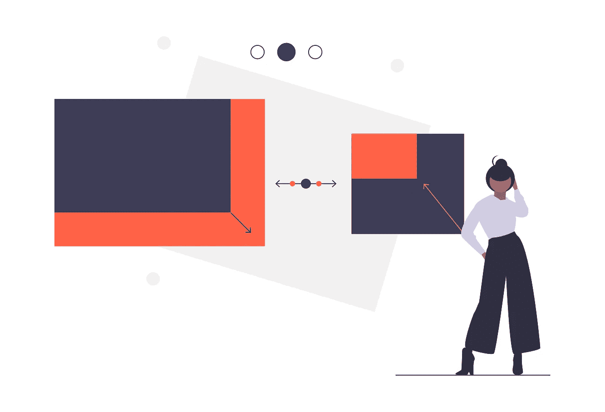

# 网络图像优化:响应性和适应性

> 原文：<https://betterprogramming.pub/optimising-images-on-the-web-9ae9f3e4610e>

## 图像是最大的性能瓶颈之一——但前提是你不去管它们



由[展开的插图](https://undraw.co/illustrations)

> **这篇文章已经过时**——更新版本请关注[https://www . charistheo . io/blog/2021/03/optimized-images-for-the-web-responsive-and-adaptable/](https://www.charistheo.io/blog/2021/03/optimised-images-for-the-web-responsive-and-adaptable/)的这篇文章。

在这篇短文中，我将带你了解一些你现在就可以实现的常见图像优化技术。希望你能获得巨大的性能提升，创造流畅的网络体验。

但首先，让我们先来看一些数据，看看为什么优化你的网页图片很重要——尤其是对手机而言。

平均移动网站有 2.2 MB 大，其中 68%是图片。

引用穆斯塔法·库尔图尔杜的电子书:

> “正如我们刚刚测试的那样，一个网站有很高的百分比，大约 70%是由图像组成的。”

在一个缓慢的 3G 网络中，大的资源大小将是页面加载时间的一个巨大瓶颈。试图只下载一些未经优化的图像会使网络繁忙，阻止其他同样重要的资源被下载。

同样，[根据脸书蓝图](https://www.facebook.com/business/news/improving-mobile-site-performance)，多达 40%的用户会在三秒钟的延迟后放弃网站。当你把这一点加到前面的图片尺寸上时，很容易意识到我们需要在如何向用户提供图片时小心谨慎。

也是时候我们认为图像优化是在移动网络上获得良好用户体验的重要一步，并努力关注我们为用户提供的图像的大小。

在我们开始之前，请记住每个网站都是不同的——因为每个网站可能会有更高的性能提升，甚至有相反的效果。)取决于您正在跟踪的[绩效指标](https://sites.google.com/a/webpagetest.org/docs/using-webpagetest/metrics)。

**提示:**确保每次优化后都进行测试，以便跟踪什么对你的网站有效，什么无效。

# 压缩您的图像

这一部分可能是所有建议中最重要的，这也是它排在第一位的原因。希望经过这次优化后，你的网站在性能审计中会表现得更好。

现在你可能在想，“哦，我不可能触摸我美丽的图像！我不想为了节省几个 kb 而拥有蹩脚的质量。”

但是不要相信我的话。

尝试使用 [squoosh 应用](https://squoosh.app/)压缩和比较一些图像。或者更好的是，尝试压缩一些图像，然后请朋友指出压缩的图像。您将能够亲眼看到**未压缩图像和有损优化图像之间的质量很少存在明显差异。**

在你揭开事情的神秘面纱之后，回到这里，因为我有一些你可能会感兴趣的工具。

*   [imagemin 压缩工具](https://github.com/imagemin/imagemin) — [相关工具](https://webpagetest.org/mobiletest)
*   [“自动化图像优化”文章](https://developers.google.com/web/fundamentals/performance/optimizing-content-efficiency/automating-image-optimization)，作者 Addy Osmani

**提示:**尽量不要再压缩([视频](https://www.youtube.com/watch?v=w7vXJbLhTyI))。建议总是从原始图像压缩，以避免过多的噪声。

# 响应性和下一代格式支持

接下来，我们将看看如何使用`picture` HTML 标签来根据请求它们的平台提供不同的图像大小、分辨率和格式。

听起来很复杂？当我走完这些步骤的时候。

## 多屏幕尺寸支持

让我们从了解如何支持不同的图像尺寸开始。我们将使用`source`标签的`media`属性来定义我们的媒体查询。

使用源标签的[媒体属性](https://developer.mozilla.org/en-US/docs/Web/HTML/Element/picture/#The_media_attribute)支持多种屏幕尺寸

正如你在上面看到的，我们可以为屏幕宽度为 320px 和 480px 的手机提供缩小版的图像，为平板电脑和更高版本提供 768px 宽的图像，最后，为台式机提供 1024px 宽的图像。

请注意`alt`属性，并将其包含在`picture`元素内的最后一个标签中——也就是`img`标签。

## HTML 元素

如果您不熟悉`[picture](https://developer.mozilla.org/en-US/docs/Web/HTML/Element/picture)`元素，我在这里提供了一些解释。如果你已经很熟悉了，可以跳过这一步。

在`[picture](https://developer.mozilla.org/en-US/docs/Web/HTML/Element/picture)`元素中，我们定义了所有的图像来匹配不同设备的不同情况。`[picture](https://developer.mozilla.org/en-US/docs/Web/HTML/Element/picture)`元素将考虑所有这些因素，并推断出当前设备的最佳匹配。如果没有，它将退回到`img`元素。

`img`元素接受要提供的图像 URL 的来源、样式、大小和可选文本。

## 多屏幕分辨率支持

让我们的图片在网络上变得更棒的第二部分，我们将会包括更多高分辨率的图片版本。对于这个魔术，我们将利用`srcset`属性给我们的一些忍者力量。

你不是已经厌倦了生成一堆图像吗？我感觉到你了。只需使用您选择的工具(例如 [ImageMagick](https://imagemagick.org/Usage/resize/) )，就能实现自动化！否则，如果你有钱，你可以使用 [Cloudinary，](https://cloudinary.com/documentation/image_transformations)它提供了很好的服务，作为一种选择。许多开发人员发现 Cloudinary 是一个更简单的图像解决方案。

使用源标签的 [srcset 属性](https://developer.mozilla.org/en-US/docs/Web/HTML/Element/source#attr-srcset)支持多屏幕分辨率

例如，在第 4 行中，我们简单地说明对于设备:
屏幕宽度大于`480px` ( `media`)两倍(`2x`)的[基本 dpi (96)，](https://developer.mozilla.org/en-US/docs/Web/API/Window/devicePixelRatio)使用高分辨率图像`img-480–2x.jpg`
，而使用低分辨率图像`img-480.jpg`

## 支持下一代格式的图像

总结一下，要包含上述所有响应选项，并在下一代格式中包含其他图像，请粘贴以下内容:

如果浏览器支持的话，这里我包括了`[webp](https://medium.com/@charistheodoulou/image-optimisation-for-the-web-webp-webm-4402d7817cce)` 格式的图片。相反，浏览器将退回到下一个`jpg`图像。

**提示:**不要忘记`type=”image/webp”` 部分，因为根据我的经验，`webp`图片不会被浏览器拾取。

它看起来很少，但我保证它是为您的图像添加响应和下一代格式支持。确保自动化到位，这样以后更新图像就容易了。

如果你感兴趣，可以看看我的另一篇关于使用 WebP 和 WebM 而不是 JPG、PNG 和 GIF 的文章。

# `display: none’`陷阱

有时，当用户登陆我们的页面时，我们希望隐藏图片，而不是延迟或有条件地加载图片。但是如果你不熟悉``元素的特性，你可能会不知不觉地落入`display: none`陷阱。

## 问题

`display:none`是否避免触发对图片的`src` URL 的请求？

```
<div style="display:none">
  
</div>
```

不。仍然需要图像。

这里，如果使用了`display: none`，JavaScript 库对于延迟加载是不可靠的，因为在 JavaScript 改变`src`之前会请求图像。

这就是为什么您会看到大多数延迟加载 JS 库中使用的`data-src`属性。

## 问题

`<div>`上的`display:none`是否避免触发对`background: url()`的请求？

```
<div style="display:none">  
  <div style="background: url(example.jpg)"></div>
</div>
```

是的。

CSS 背景不会在元素被解析后立即获取。用`display:none`计算元素子元素的 CSS 样式用处不大，因为它们不会影响文档的呈现。不会计算或下载子元素上的背景图像。

## 阻止手机下载

无论你打算用哪种方式来阻止图像被下载，都要确保首先保护手机，因为它是最容易受到攻击的设备，因为它的 CPU 更低，而且更常见的是，3g/4g 的网络带宽更低，延迟更高。

通过包含一个媒体查询来替换移动设备上的`background-image: url()`到`none`，我们可以确保用于更大设备的图像不会被下载到移动设备上。

# 本地映像延迟加载就在这里

从版本 75 开始，Chrome 就支持原生镜像延迟加载。

Addy Osmani 的本地延迟加载演示

您可能已经在使用类似于 [lazysizes](https://github.com/aFarkas/lazysizes) 的脚本来延迟加载图像；然而，有一种方法仍然可以延迟加载图像，同时在客户端发送更少的代码和执行更少的 JavaScript。另外，它是搜索引擎优化友好的。当然，所有这些优势都依赖于[浏览器对](https://caniuse.com/#feat=loading-lazy-attr)的支持。目前，只有 Chrome 和 Opera 支持`loading`属性。

**注:**图片重复在网站中相当常见。确保你没有使用一个以上的脚本进行延迟加载，这样你的图片就只下载一次。检查开发工具中的网络选项卡，查看正在下载的图像。

[使用 shim 脚本延迟加载图像](https://addyosmani.com/blog/lazy-loading/)

如果你想了解更多，看看几个例子，请查看 Addy Osmani 的这篇文章。如果你喜欢，这里还有一个[示例网站](https://lazy-loading.firebaseapp.com/lazy_loading_native.html)。

# 结论

这就是我优化图像的全部内容。希望你发现这些技巧很有见地，并从今天开始优化你的图片。一定要检查它们，看看你是否得到任何性能的提高，尤其是如果你的网站是图片密集型的。

但是请记住，最好的做法是[在每次改变前后测量性能](https://webpagetest.org/mobiletest),因为每个网站都是不同的，有些优化会奏效，而有些则不会。

祝你愉快。干杯！