# 如何优化 SQL Server 中的查询

> 原文：<https://betterprogramming.pub/optimising-queries-in-sql-server-a-walkthrough-b54987a84567>

## 当你有一个运行有点慢的查询时，这里有一个方法可以让它变快

克里斯·利维拉尼在 [Unsplash](https://unsplash.com/?utm_source=medium&utm_medium=referral) 上的照片

优化 SQL Server 查询既痛苦又有益。一方面，做出一些改变，让您的查询在很短的时间内运行起来，这是一种很棒的感觉。另一方面是有一个查询拒绝变得更快，不管你改变什么。

在我优化查询的所有时间里，有一些事情我总是首先检查，而且很多时候是这些事情中的一个导致查询速度变慢并再次快速运行。

在本文中，我将讨论如何优化几个运行缓慢的查询，并根据我的经验给出一些关于如何进行这种优化的技巧。

# 测试数据

在本文中，我将使用 2013 年的堆栈溢出数据库的副本，托管在 [SQL Server 2019 开发者版](https://www.microsoft.com/en-gb/sql-server/sql-server-downloads)上。这个数据库有一个很好的结构，里面有很多数据。如果您想在您的机器上继续学习，那么可以在 Brent Ozar 的这篇文章中找到这个数据库。如果您没有这些数据库，请不要担心，我会在后面的内容中包括模式定义，这样您就可以看到发生了什么。

# 优化工具

当我遇到缓慢的查询时，我总是首先检查查询的执行计划。

这是 SQL Server 为给定查询生成的计划，显示了执行该查询时它所做的所有不同部分。

这些计划一开始可能有点令人生畏，因为显示的信息太多了。但是它们在指出某些东西运行缓慢的原因方面非常有帮助。

我用来查看这些执行计划的工具是优秀的(免费的) [SQL Sentry Plan Explorer](https://www.sentryone.com/plan-explorer) 。通过在这个工具中运行您的查询，您将获得一个非常好的 UI 来显示和探索计划。还有其他方法可以查看这些计划(包括以纯文本方式查看，如果你愿意的话)，以及直接使用[SQL Server Management Studio](https://docs.microsoft.com/en-us/sql/ssms/download-sql-server-management-studio-ssms?view=sql-server-ver15)，但是我发现计划浏览器是最容易使用的，我将在本文中包括这个工具的截图。

我经常使用的另一个工具是 [SQL Server Profiler](https://docs.microsoft.com/en-us/sql/tools/sql-server-profiler/sql-server-profiler?view=sql-server-ver15) ，它与[SQL Server Management Studio](https://docs.microsoft.com/en-us/sql/ssms/download-sql-server-management-studio-ssms?view=sql-server-ver15)一起安装。我发现能够在本地(或在测试环境中)分析查询有助于跟踪运行缓慢的特定查询。然而，有很多不同的方法可以做到这一点，包括使用[扩展事件](https://docs.microsoft.com/en-us/sql/relational-databases/extended-events/quick-start-extended-events-in-sql-server?view=sql-server-ver15)，或者使用 SQL 监控工具，如 [Redgate 的 SQL Monitor](https://www.red-gate.com/products/dba/sql-monitor/) ，或者在您的基础设施中使用类似 [Azure 的 Query Performance Insight](https://docs.microsoft.com/en-us/azure/azure-sql/database/query-performance-insight-use?view=azuresql) 的东西。

对于本文，我们将假设我们已经确定了哪些查询是缓慢的，需要继续处理。

好了，让我们从一个缓慢的查询开始，看看我们能做些什么。

# 优化简单查询

假设我们有一个帖子表，每个帖子都有许多答案:

我们有一个查询，它找到了拥有最多答案的前 10 篇文章，我们想要每篇文章的`Id`和`Body`。

我们可以这样编写查询:

看起来很简单。让我们运行一下这个查询，看看它是如何执行的:

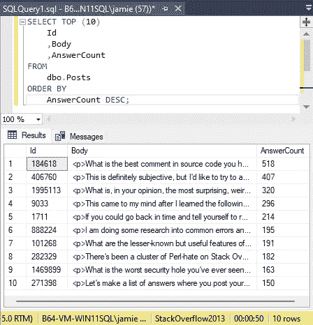

执行查询的结果在 50 秒后出现

啊哦。花了 50 秒返回这 10 行。这可不好。让我们在 [SQL Sentry 计划浏览器](https://www.sentryone.com/plan-explorer)中执行它，并查看执行计划，看看发生了什么。

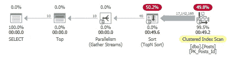

生成的执行计划

这是一个非常简单的计划，我们可以看到问题在哪里。最后的聚集索引扫描发现了 1700 万行，当它与排序步骤相结合时，这实际上是查询的全部成本。

聚集索引扫描是指从头到尾读取聚集索引(在我们的例子中，它只是主键 Id 列)。对于像 Posts 表这样的大表，速度总是很慢。

解决此类问题的一个很好的起点是，看看是否可以添加一个可以使用的新索引，而不是依赖这个聚集索引。我们知道我们是按 AnswerCount 列排序的，所以让我们为该列添加一个新的非聚集索引:

现在添加完毕，让我们重新运行我们的查询:

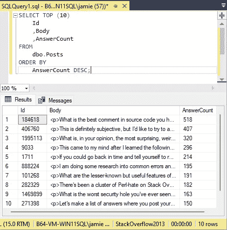

执行查询的结果，将在 0 秒后出现

这就好多了——在“0”秒内返回。现在让我们检查一下执行计划:

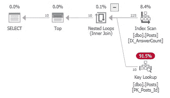

生成的执行计划

太好了。我们现在有了一个索引扫描，而不是聚集索引扫描和排序，由于这个索引针对的是我们基本上作为排序依据的列，因此我们只读取了 225 行(而不是 1700 万行)。我们现在也有了一个新的键查找步骤。当我们将鼠标悬停在它上面时，我们会看到它正在查找“Body”列:

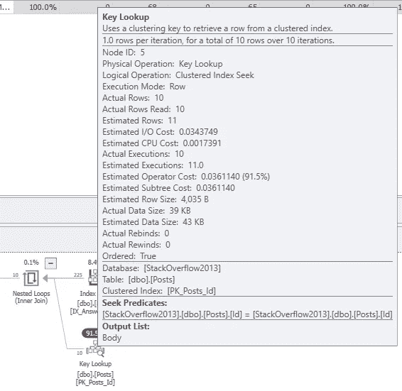

键查找的详细信息

鉴于这个查询现在在 68 毫秒内返回，并且读取了合理数量的行，我建议这是这个优化所需要的。它比原来运行 50 秒的时间要好得多，而且我们大大减少了读取次数，这将减轻服务器的负载。另外，这个 Body 列相当大，所以我们不一定要将它包含在索引中。

# 使用连接优化查询

现在我们想获得 10 个没有任何答案的最新 wiki 帖子，并获得帖子的 Id、CreationDate 和 LastActivityDate。我们有一个包含以下模式的 PostTypes 表:

所以我们可以写的查询是:

让我们运行它:

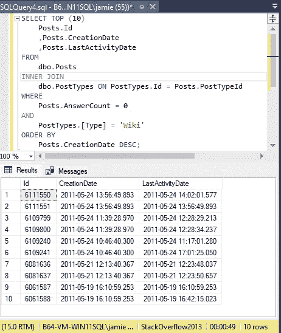

执行查询的结果，在 49 秒时出现

好，我们回到 49 秒。但这并不奇怪，因为我们的新指数可能并不用于此。让我们检查一下计划:

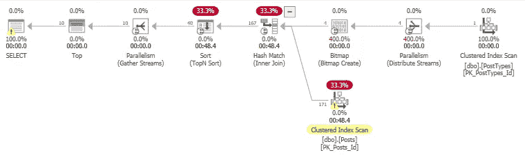

生成的执行计划

这一次，我们没有看到任何真正粗的箭头(表示许多行正在被读取)，但肯定有什么不对劲。我们可以在聚集索引扫描上看到一个小小的警告图标，这表明这又是问题所在。停留在这上面给了我们这个信息:

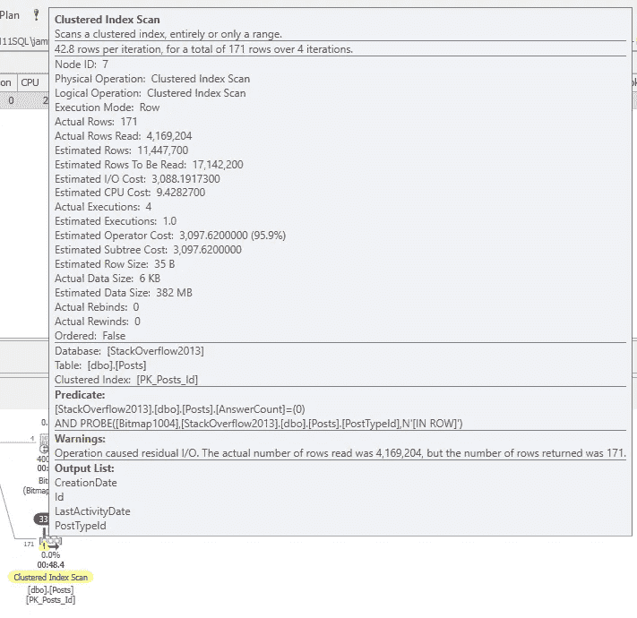

聚集索引扫描的详细信息

看那个警告:

> 操作导致剩余 I/O。实际读取的行数为 4，169，204，但返回的行数为 171。

呀。

这相当低效——它读取了 400 多万行，只返回 171 行。

查看这个聚集索引扫描的谓词，我们可以看到它使用了`AnswerCount`和`PostTypeId`。我们已经有了一个`AnswerCount`的索引，所以让我们编辑这个索引，将`PostTypeId`包含在其中，看看是否有所不同:

现在让我们再次运行查询:

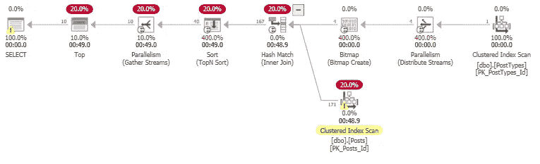

生成的执行计划

不，那个新的索引没有被使用。聚集索引扫描仍然存在。让我们创建一个新的索引，但是这次将`PostTypeId`设置为索引中的主列，并包含`AnswerCount`，看看会有什么不同:

当我们再次尝试那个查询时，我们看到它仍然没有改变。SQL Server 仍然倾向于使用聚集索引扫描，而不是使用我们创建的任何新索引。

让我们更新最后一个索引，使其也包含`CreationDate`和`LastActivityDate`，因为它们也包含在查询中:

运行这个查询要好得多:

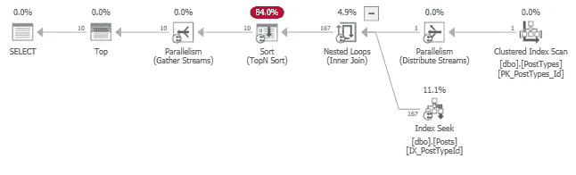

生成的执行计划

这是在 3 毫秒内。比原来的 50 秒好多了。聚集索引扫描已被索引查找所取代，索引查找效率更高，SQL Server 可以使用该索引专门查找感兴趣的行，而不必遍历整个索引。

但是，如果您尝试在该查询中选择另一列，会发生什么情况呢？假设我们将`ClosedDate`添加到选择列表中，就像这样:

当我们运行这个查询时，我们得到这个计划:

生成的执行计划

是的，我们回到了 49 秒。不太好。

现在，我们可以将这个新列包含到索引中，对于某些场景来说，这可能是一个合适的解决方案，但是实际上，我们需要一个能够处理返回的不同列的计划。

如果我们不这样做，这将是一个迟早会发生的性能错误——想象一下，如果 6 个月后，一个新列被添加到这个查询中，而开发人员忘记检查这个计划。

查询可能会在他们的开发机器上快速返回(只有有限的数据)，并且取决于在您的测试环境中对性能问题的关注程度，这种更改可能会一直进行到生产，而没有人注意到它会产生的影响，然后您会突然遇到一个重大的性能错误。

让我们看看是否能做得更好。

我通常尽可能让一切变得简单。看一下我们的计划，我们有一个位图、并行度和聚集索引扫描，只是为了找到类型。现在让我们为 PostTypes 表建立索引，看看会有什么不同:

让我们再次运行查询，并检查计划:

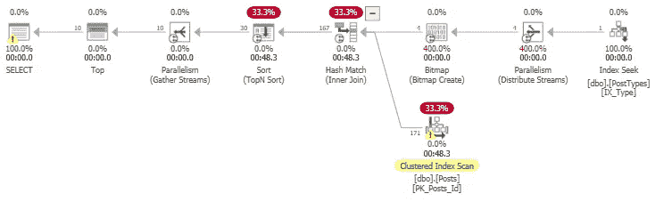

生成的执行计划

因此，我们用索引搜索替换了`PostTypes`上的聚集索引扫描，但它并没有帮助其他任何东西——它仍然以 49 秒的速度出现。让我们尝试更改查询本身。

我们知道我们只寻找特定类型的文章，所以让我们先把它设置为一个变量，完全避免连接到`PostTypes`:

让我们运行它。我们现在有两个计划，因为我们有两个单独的语句要执行。首先，我们有了`@PostTypeId`变量的设置:

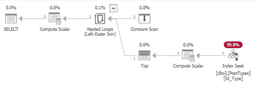

生成的执行计划

这看起来不错，它使用的是索引搜索，速度为 2 毫秒。下一条语句略有改进，现在用时 42 秒(之前是 49 秒)，但还不够好:

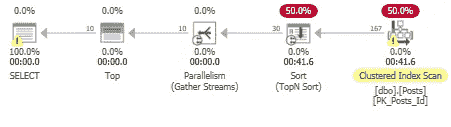

生成的执行计划

好了，这是 Posts 表上的一个非常简单的语句，所以让我们回顾一下我们有哪些索引。我们有`IX_AnswerCount`，它的关键列是`AnswerCount`。我们还有以`PostTypeId`为关键列的`IX_PostTypeId`，还包括`AnswerCount`、`CreationDate`和`LastActivityDate`。

看上面的计划，那个排序步骤有点可疑。让我们试着通过创建一个不同的索引来消除它，这个索引的第一个键是`CreationDate`，希望可以避免这种排序:

让我们检查一下计划:

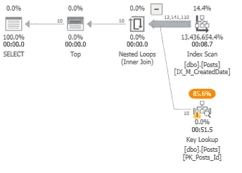

生成的执行计划

哎呀。现在需要 2.5 分钟运行，读取 1200 万行。看起来它正在读取所有这些行，然后进行键查找，然后通过`PostTypeId`和`AnswerCount`进行过滤。一点进步都没有。

让我们创建一个索引，首先索引`PostTypeId`，然后索引`AnswerCount`，最后索引`CreationDate`:

现在的计划是:

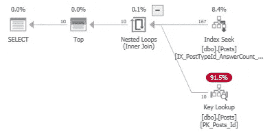

生成的执行计划

非常好。时间是在 1 毫秒，这个计划看起来真的很好，很干净。

这种优化应该很好，因为它非常快，即使添加了额外的列，查询计划也不应该发生巨大的变化。

## 删除关键字查找

我们有的一个选择是整理键查找。查看详细信息，我们可以看到这一步正在查找那些被返回但不包括在`IX_CreatedDate`列中的列:

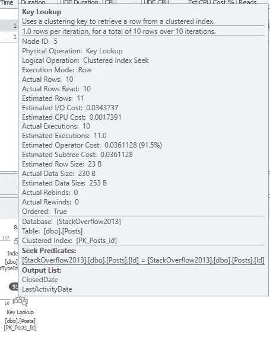

键查找的详细信息

因此，我们可以在索引中包含这些列，不作为键列，而只是包含:

这个计划现在非常简单:

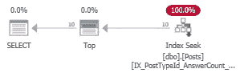

生成的执行计划

现在看起来很棒。我们的索引正在使用，该计划将处理将来可能添加或不添加的额外列。

## 当您完成优化时的注意事项

当你达到了优化某件事的目标时，回顾你所做的改变总是一个好主意。如果您仔细阅读了我们上面的内容，您会发现我们创建的索引比实际需要的要多，所以需要删除它们。

回顾一下您所做的优化也是值得的，尤其是如果您遵循了像我上面所做的增量方法。例如，现在我们已经在 Posts 表中获得了 IX _ poststypeid _ response count _ creation ondate 索引，是否仍然需要重写查询以使用 poststypeid 的变量？

您可能需要做更多的实验来仔细检查您的每个更改是否仍然需要，并可能恢复任何不再为您带来任何好处的更改。

## 添加新索引和删除键查找时出现警告

您只需注意，我们在上面已经尝试删除了所有的密钥查找。有时，在索引中包含这样的列以避免键查找确实很好，但是您不希望索引太重。有时，最好将您的密钥查找保留在计划中，因为总的来说，这可能是有益的。

添加太多的索引，或者在其中包含太多的列，都会带来新的问题。虽然索引可以帮助查询更快地找到它们的数据，但是在索引的表中添加、删除或修改数据时，维护这些索引会产生成本。因此，当您进行索引更改时，您还需要考虑数据更改时会发生什么——拥有一个包含 1000 个索引的表听起来可能会让您的查询运行得非常快，但是插入新数据需要很长时间。如果您的某个列正在重复更新，您可能会认为成本有点太高，最好保留键查找。

例如，以我们的 PostTypes 表为例。假设我们想在该表中插入一行:

如果该表上没有索引(除了主键的聚集索引)，插入新行会生成一个简单的计划:

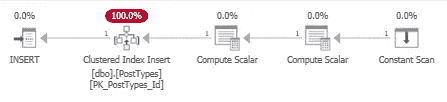

生成的执行计划

我们刚刚得到了聚集索引插入，它是为主键设置的。但是，如果我们在“类型”列上添加 10 个索引:

该计划显示，这 10 个新指标也被插入了:

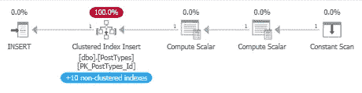

生成的执行计划

如果一天只插入一次这张桌子，可能没什么大不了的。但是，如果每秒钟更新多次，那么成本将会上升。

这是一个您需要注意的谨慎平衡。索引可以加快查询速度，但插入、修改或删除这些数据需要付出代价。这一切都归结于数据是如何使用的，以及成本是否可以接受。

## 优化什么时候完成？

在开始加快查询速度之前，有必要考虑一下您的最终目标是什么。在某些时候，你需要在你所做的改进下画一条线，并且说‘完成了，已经够好了’。进行优化工作时的一个常见风险是尝试和瞄准几乎不可能的目标，但你最终会达到收益递减的点，因为提高性能变得越来越难，哪怕只是一点点。

在某些情况下，您可能正在优化某些东西，因为您正在经历超时，这是应用程序设置的限制，在它抛出错误之前，它将等待您的查询完成。在这种情况下，您的第一个目标显然是让查询在超时限制内一致地完成。但是，如果您就此打住，您可能会发现自己不得不在下一次超时时再次重新访问查询。理想情况下，您会希望您的查询在您设置的超时限制内轻松运行。

有时候你会优化一些东西来提高一些东西的响应时间，让一些东西感觉不那么迟钝。在这些情况下，可能任何一个改进都已经足够好了，或者你的目标可能是减少 50%的查询时间。

在其他情况下，您可能会优化查询以减少数据库的总体负载。因此，查询可能会在合理的时间内运行，但是它给数据库服务器本身带来了巨大的压力，这通常会稍微降低所有查询的速度。在这种情况下，您必须考虑您的目标优化是什么——是减少特定表中的读取次数，还是减少 tempdb 的使用量，等等。如果是的话，你将如何衡量你所做的改变是否足够好。

对于给定的查询应该运行得多好，没有固定的规则—这完全取决于查询本身正在做什么、查询执行的频率、您可用的资源以及您想要在它上面投入多少时间。

因此，假设您有一个需要 10 秒钟完成的查询，并且您希望它能更快。如果你能在 1 秒钟内运行，那么这是一个相当不错的进步。这可能是也可能不是你的目标——在很多情况下，1 秒钟的查询仍然会被认为太慢。所以你花更多的时间在它上面，让它在 500 毫秒内运行。再次，一个很好的改进。尽管如此，仍有改进的空间。你需要决定你还想在这上面投入多少时间——是否值得花更多时间来将这降低到 10 毫秒？或者，考虑到这个查询运行的频率，或者它如何适应更广泛的解决方案，现在 500 毫秒可能是可以接受的。

这可能是一个你需要让更广泛的团队参与进来的决定，特别是如果你有一个产品团队负责你的解决方案的可交付性，并且已经定义了与速度和响应时间相关的非功能性需求。

希望他们对你的用户的需求有一个好的想法，这样他们就能够衡量进一步优化的好处，而不是开发可能在 backlog/board 中的其他功能。这可能是一个筹集技术债务的好例子，如果你知道有一个更好的解决方案可以让事情运行得更快，但你现在只能负担得起一个临时的解决方案，那么你可以考虑将它作为债务筹集，在未来的某个时间处理。见[我的另一篇关于技术债务的文章](/technical-debt-how-to-identify-plan-and-deliver-debt-changes-80aae7161312?gi=33f792aea964)更深入的讨论技术债务是如何工作的。

# 摘要

在本文中，我们讨论了优化过程是什么样子的，并强调了开发人员优化查询可能会经历的一个常见的思维过程。

我们还谈到了决定您希望优化到什么程度是多么重要——显然，您希望一切尽可能快地运行，但请记住，在某些时候，将查询时间缩短几毫秒需要付出指数级的努力，因此您需要学会在优化下画一条线，并说现在已经足够好了。

优化工作是非常值得的，就个人而言，这是我作为开发人员最喜欢的方面之一。即使只是提出上面的小例子，我也真的很喜欢在很短的时间内完成缓慢的查询。这不是每个人都喜欢的事情，但是如果你进入了做优化工作的领域，你会很快发现自己总是在寻找其他的东西来优化，并使之更快！