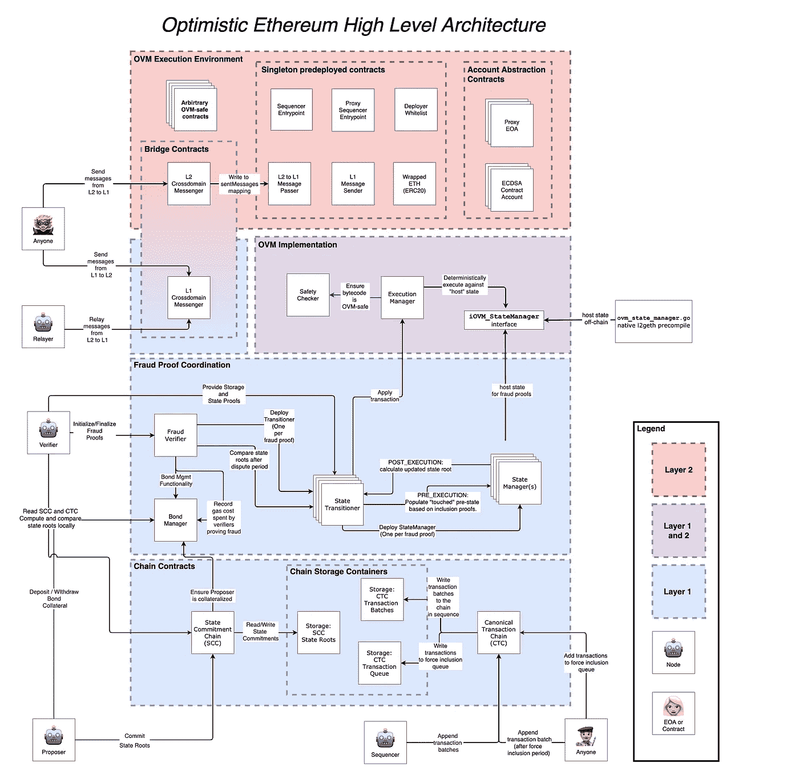

# 乐观智能合同分解

> 原文：<https://betterprogramming.pub/optimism-smart-contract-breakdown-18f87a7b1823>

## 代码级汇总的工作方式


乐观主义是建立在以太坊之上的乐观主义的总结。什么是乐观向上？它在代码层是如何工作的？本文将进行解释。

我们还将介绍为什么汇总需要链间通信，以及这种通信是如何实现的。我们将看到实现最重要的汇总功能的实际代码片段。

这是这篇文章的大纲

*   什么是乐观向上？
*   乐观契约的高级概述
*   L1-L2 大桥代码
*   用于汇总交易记录的代码
*   争议代码

# 什么是乐观向上？

首先，什么是汇总？这是让以太坊更高效的方法之一，通常被称为 L2 解决方案。有 3 种 L2 解决方案类型:状态通道、等离子体和汇总。我有一篇关于“L2 解决方案的分类”的文章，将会详细介绍这一点。下面是对什么是汇总的简短总结，特别是乐观汇总。

以太坊上有一个智能合约(叫它`RollupL1`)允许 ETH 的存取款。当你的钱在`RollupL1`时，你可以认为它在 L2。L2 货币的流动速度比 L1 货币快得多，因为 L2 交易(txn)效率更高、速度更快。这是如何实现的？

有一个程序存在于以太坊之外(就叫它`RollupL2`)。它可以更快地处理 txn，因为它不必通过以太坊缓慢而昂贵的共识机制。它可以处理一堆 txn，将它们组合( *roll* them *up* )成一批，并将该批提交给`RollupL1`。

> `RollupL2`可以是另一个运行在更快的区块链上的智能合约，也可以是传统的 web2 服务器。每种方法都有优点和缺点，例如延迟和分散。

通过离线处理事务，您可以节省 2 个轴的成本:

1.  **数据压缩**:一批占用的空间比一个个堆叠在一起的单个 txn 少。参见本[部分](https://vitalik.ca/general/2021/01/05/rollup.html#how-does-compression-work)了解原因。
2.  你只需要经历以太坊缓慢而昂贵的**共识仅仅一次**。

还有另一个节省轴:以太坊上每次 txn 后不需要计算新的状态。你看，你直接在以太坊上提交一个 txn，以太坊需要计算账户的新状态。这个很贵。通过将这项工作卸载到 L2，您可以避免以太坊上这种昂贵的计算。

但是`RollupL1`应该信任`RollupL2`提交给它的新状态吗？它应该验证吗？如果它进行了验证，它会浪费相同的计算，因此会丢失汇总点。

乐观的汇总通过盲目信任解决了这个问题:他们简单地信任新提交的状态而不做任何验证(他们非常乐观✨).但是，他们会将新提交的批次锁定一周(称为“挑战窗口”)。任何人都可以在这个挑战窗口期间提交数学证明，如果他们发现欺诈性的状态更新，就可以获得奖励。如果该批次在一周内没有争议，它被认为是最终的。

> 奖励由提交该批产品的人的押金支付。如果要提交批次，需要提交押金。

这就是乐观汇总在高层次上的工作方式。ZK-汇总工作不同(阅读我的 L2 文章)。

# 乐观契约的高级概述

乐观汇总需要 3 个高级功能:

1.  在 L1 和 L2 之间转移资金的双向桥梁
2.  处理事务并将它们汇总成一个批处理
3.  无效状态更新的争议/证据

下面是实现上述内容的乐观智能合约图:



来自乐观派 [docs](https://community.optimism.io/docs/protocol/protocol-2.0/#system-overview)

现在让我们看看最重要部分的实际代码。

# L1-L2 大桥代码

这座桥的工作原理是锁定 L1 的资金，并在 L2 铸造等值的货币。为了收回资金，大桥烧掉 L2 的资金，释放被锁定的 L1 的资金。

以下是存款功能:

该函数是以太坊上的 L1StandardBridge 合同的一部分。很简单:接受 ETH(用`payable`关键字自动完成)，将函数的所有参数编码成一条消息，将消息发送给一个跨域的 messenger。

跨域信使在 L1 和 L2 之间广播消息。我们一会儿会谈到它。

L2 上有相应的收听这些消息的功能。`[L2StandardBridge](https://github.com/ethereum-optimism/optimism/blob/master/packages/contracts/contracts/L2/messaging/L2StandardBridge.sol)`合同就是这么做的。这个合同存在于一个独立的 L2 区块链(比以太坊更快)。

该函数只是运行一些检查并铸造新的令牌。我应该提到过，您可以使用这个桥移动任意的 ERC-20 令牌，而不仅仅是 ETH (ETH 只是包装在一个 ERC-20 接口中)。

将资金从 L2 转移到 L1 也有相应的功能。也是用 x 域信使完成的。为了简洁起见，我将跳过它们。

## 跨域消息传递

L1 和 L2 之间的通信通过 x 域信使契约发生(每个链上都有一个副本)。在内部，该契约只存储消息，并依靠“中继者”通知其他链(L1 或 L2)新的消息。

> 没有母语 L1 ↔ L2 通信。每一端都有像`onNewMessage`这样的函数，中继器应该使用传统的 web2 HTTPs 来调用它们。

例如，以下是 L1 → L2 事务在 L1 上的存储/排队方式:

中继器会通知 L2 队列中有新消息。

# 用于汇总交易记录的代码

乐观上有一个定序器，它的工作是接受 L2 事务，检查它们的有效性，并将状态更新作为挂起块应用到它的本地状态。这些待定模块定期大批量提交给以太坊(L1)进行最终确定。

以太坊上接受这些批次的函数是`appendSequencerBatch`，它是 L1 上`[CanonicalTransactionChain](https://github.com/ethereum-optimism/optimism/blob/master/packages/contracts/contracts/L1/rollup/CanonicalTransactionChain.sol)`合同的一部分。在内部，`appendSequencerBatch`使用下面的函数来处理批处理。

*   `batchesRef`是一个用于数据存储的助手契约。那是储存批次的地方。
*   该函数首先计算批处理头，然后计算其哈希。
*   然后，它计算批处理上下文。批处理头和上下文只是关于批处理的附加信息。
*   然后，它将散列和上下文存储在存储器中(`batchesRef`)。

稍后，哈希和上下文将用于验证争议。

现在，sequencer 角色(将事务汇总到一个批处理中并提交它们)是集中式的——由乐观组织控制。但他们计划在未来分散这一角色。您也可以直接向`CanonicalTransactionChain`提交您自己的批处理，而不通过序列器，但是这样会更贵，因为提交批处理的固定成本完全由您支付，并且不会分摊到许多不同的事务中。

# 争议代码

在高层次上，通过提交一个状态更新无效的证据，并根据存储的状态更新(存储的批处理元数据:散列和上下文)来验证该证据，来解决争议。

负责处理纠纷的合同是`[OVMFraudVerifier](https://github.com/ethereum-optimism/contracts/blob/0ad4dcfdef11ef87e278a8159de8414c8e329ba1/contracts/optimistic-ethereum/OVM/verification/OVM_FraudVerifier.sol)`。这个合同是 OVM —乐观虚拟机(类似于 EVM —以太坊虚拟机)的一部分。以下是针对争议的主要功能:

*   `finalizeFraudVerification`检查`_postStateRoot`(由验证者提交)是否不等于由排序器提交的根。
*   如果不是，那么我们删除`_cancelStateTransition`中的批次，并猛砍定序器的保证金(为了成为定序器，你需要锁定一笔保证金。当你提交一个欺诈性的批次时，你的保证金将被削减，这笔钱将作为保持整个机制运行的激励进入验证者手中。

这就是乐观智能合同破裂的全部原因。希望你对以太坊和 L2s 的未来感到乐观！如果你有任何问题，请在评论中告诉我。

我计划对流行的智能合同进行更多的分解，比如 Lens Protocol 和 MakerDAO。

你还可以在 solidnoob.com 的[查看其他智能合同的细目表和更多关于 Solidity noobs 的东西。](https://www.solidnoob.com/)

```
**Want to Connect?**Follow me on [Twitter](https://twitter.com/nazar_ilamanov).
```