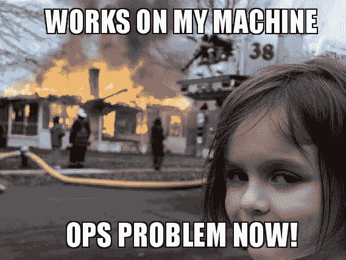

# 使用 Docker、SonarQube、Detekt 和 MobSF 优化 Android 应用程序开发

> 原文：<https://betterprogramming.pub/optimize-android-app-development-with-docker-sonarqube-detekt-and-mobsf-ae7e93ccf879>

## 提高 Android 应用的安全性和代码质量


由[贾米森·麦克安迪](https://unsplash.com/@jamomca?utm_source=unsplash&utm_medium=referral&utm_content=creditCopyText)在 [Unsplash](https://unsplash.com/?utm_source=unsplash&utm_medium=referral&utm_content=creditCopyText) 上拍摄的照片

作为一名 Android 应用程序开发人员，你应该总是希望尽可能实现最好的代码。此外，你的应用程序应该尽可能的安全。

代码质量对于任何类型的软件来说都是非常重要的，你应该总是试图优化你的实现。本文展示并解释了不同的质量工具，这些工具将在 Android `software-quality-chain`中结合使用，以实现更好的代码质量、更安全的应用程序和改进的可维护性。

TL；DR: [*将这个 GitHub 库*](https://github.com/paulknulst/android-software-quality-chain) *克隆到你的 Android 项目文件夹中，用* `*sh software-quality-chain.sh*` *执行全链。之后，打开将登录到控制台的 URL。使用 admin:admin12345 登录，查看您的 Android 项目报告。*

# 先决条件

## 码头工人

要运行该脚本，需要在您的操作系统上安装 Docker。

Docker 是一个广泛用于开发、发布和运行各种应用程序的平台。它使您能够将基础设施从应用程序中分离出来，以便快速地将软件从一台机器传送到另一台机器。

在使用 Docker 的同时实现软件通常会忽略基础设施问题，比如常见的“在我的机器上工作”问题:



用 memegenerator 创造的——灾难小子

要在你的系统上安装 Docker，请遵循关于 docker.com 的官方教程。如果您使用的是 Windows，并且不允许安装 Docker Desktop，您可以遵循以下指南:

[](https://www.paulsblog.dev/how-to-install-docker-without-docker-desktop-on-windows/) [## 如何在 Windows 上不用 Docker 桌面安装 Docker

### 此外，学习如何使用 Portainer 作为 Docker 桌面的替代 Docker GUI。作为一个从 Linux 转行的开发者…

www.paulsblog.dev](https://www.paulsblog.dev/how-to-install-docker-without-docker-desktop-on-windows/) 

## 检测

> Detekt 是一个用于 Kotlin 编程语言的静态代码分析工具。它对 Kotlin 编译器提供的抽象语法树进行操作。

它可以在任何基于 Kotlin 的 Android 应用程序中实现，并可以与一组自定义规则一起使用来检查应用程序。Detekt 是执行脚本的一个强制性先决条件，必须安装在您的 Android 应用程序中。幸运的是，这个过程非常简单，可以通过四个简单的步骤来完成:

**1。将 Detekt 添加到项目**`**build.gradle**`

**2。使用一组已定义的规则创建 detekt.yml。**
在这里下载一个样本文件[并保存在`project_folder/detekt/detekt.yml`中](https://ftp.f1nalboss.de/data/sample-detekt.yml)

**3。在** `**build.gradle**`应用程序中应用检测插件

**4。将检测块添加到 app** `**build.gradle**`

# 使用的其他工具

## MobSF

> 移动安全框架(MobSF)是一个自动化的一体化移动应用程序(Android/iOS/Windows)笔测试、恶意软件分析和安全评估框架，能够执行静态和动态分析。

在继续之前，有必要了解移动安全以及如何以安全的方式创建 android 应用程序。幸运的是， [OWASP](https://owasp.org/) (开放 Web 应用安全项目)，一个以社区主导的开源软件项目和提高软件安全性而闻名的受欢迎的非营利组织，创建了“OWASP 移动十佳”来提高移动安全性。

这些包括在任何 Android 应用中应该避免的最关键的安全问题:

*   [M1:平台使用不当](https://owasp.org/www-project-mobile-top-10/2016-risks/m1-improper-platform-usage)
*   [M2:数据存储不安全](https://owasp.org/www-project-mobile-top-10/2016-risks/m2-insecure-data-storage)
*   [M3:不安全的沟通](https://owasp.org/www-project-mobile-top-10/2016-risks/m3-insecure-communication)
*   [M4:不安全认证](https://owasp.org/www-project-mobile-top-10/2016-risks/m4-insecure-authentication)
*   [M5:加密技术不足](https://owasp.org/www-project-mobile-top-10/2016-risks/m5-insufficient-cryptography)
*   [M6:授权不安全](https://owasp.org/www-project-mobile-top-10/2016-risks/m6-insecure-authorization)
*   [M7:客户代码质量](https://owasp.org/www-project-mobile-top-10/2016-risks/m7-client-code-quality)
*   [M8:代码篡改](https://owasp.org/www-project-mobile-top-10/2016-risks/m8-code-tampering)
*   [M9:逆向工程](https://owasp.org/www-project-mobile-top-10/2016-risks/m9-reverse-engineering)
*   [M10:无关功能](https://owasp.org/www-project-mobile-top-10/2016-risks/m10-extraneous-functionality)

幸运的是，MobSF 可以帮助你以自动化的方式识别 Android 应用程序中许多可能的安全问题。安全框架最适用于:

*   局部环境
*   执行快速安全测试
*   用 mobsfscan 在 CI/CD 中实现(将在这里使用)

为了测试 MobSF，你可以切换到 [https://mobsf.live](https://mobsf.live/) 并上传任何 Android APK，然后对其进行常见安全问题分析。

**我的建议:**所有开发者都应该使用 MobSF，通过做一个静态代码分析，在开发过程中识别出很多安全漏洞。这种分析将在不运行应用程序的情况下检查源代码。它可以在移动应用程序开发期间使用，并且应该定期进行。通常，它应该在每个应用程序发布、更新和请求提交之前执行。

请记住，使用 MobSF 进行静态代码分析并不能保证您的移动应用程序是安全的！但是它将有助于识别最明显的安全缺陷。

## 索纳库贝

> SonarQube 是 SonarSource 开发的一个开源平台，用于持续检查代码质量，通过静态分析代码来执行自动审查，以检测 20 多种编程语言上的错误、代码气味和安全漏洞。

对于您的项目，SonarQube 会分析源代码(不仅仅是 Android/Kotlin 应用程序)，评估质量，并生成报告。它允许在整个时间内持续监控质量，并结合静态和动态分析方法。SonarQube 检查和评估对我们的代码库有影响的一切，从不显眼的样式决策到严重的设计缺陷。

因此，开发人员可以访问和跟踪代码分析信息，从样式错误、潜在的 bug 和代码缺陷到设计效率低下、代码重复、测试覆盖率不足和过度复杂。声纳平台从多种角度检查源代码；因此，它会一层一层地深入您的代码，从模块级别到类级别。

此外，它生成每个级别的度量和数据，突出显示源中需要检查或改进的有问题的区域。它会自动检测你在基于 Kotlin 的 Android 应用中使用的软件类型。

**其他功能**

SonarQube 不仅仅强调问题。它还提供质量管理工具来主动帮助您进行纠正。

*   SonarQube 提供了关于代码标准、测试覆盖、重复、API 文档、复杂性和架构以及其他问题的信息。
*   它为您提供了 Android 应用程序代码质量的当前快照，以及跟踪(之前出错的)和领先(未来最有可能出错的)质量指标的趋势。
*   它提供了衡量标准，以指导您为您的 Android 应用程序做出最佳选择。

## 声纳扫描仪

SonarScanner CLI 是一个扫描器，如果您的构建系统没有特定的扫描器，每次都可以使用它。

这是一个简单的命令行工具，使用 SonarQube 特定的角色扫描提供的文件夹(Android 应用程序文件夹)。成功分析后，它将所有数据上传到 SonarQube 服务器，在那里可以查看结果。

# 准备文档

现在，在解释了先决条件和工具之后，它们将被组合到 Docker Compose 文件中，然后在单个 bash 脚本中使用，这将产生`software-quality-chain`。

## sonar cube/mobsfscan Docker 编写文件

如前所述，SonarQube 和 mobsfscan 将在 Android `software-quality-chain`中使用。为了能够使用它们，它们将与 Docker Compose 一起作为服务部署到您的操作系统上。

以下合成文件包含 sonar cube 服务器、sonar cube 的 PostgreSQL 数据库和用于扫描 Android 应用程序的 mobsfscan 容器:

在这个文件中，定义了三个服务:SonarQube、PostgreSQL 和 mobsfscan。虽然 SonarQube 和 PostgreSQL 将只使用一个标准化的 Docker 服务，但 mobsfscan 会将项目根目录绑定为一个卷。它将有一个被覆盖的入口点，在 SonarQube 容器正确启动并被标记为 healthy 之后立即执行(参见 healthcheck)。

## 声纳扫描仪合成文件

幸运的是，SonarScanner 实用程序也可以作为 Docker 映像使用，并且可以在 Compose 文件中使用和配置:

# 组合工具

现在，所有 docker 文件将被合并到名为`software-quality-chain`的 bash 脚本中，该脚本由以下步骤组成:

1.  增加 Docker 环境的堆计数
2.  安装、配置和启动 SonarQube 和 mobsfscan
3.  等待 mobsfscan 完成分析
4.  运行完整的梯度检查
5.  导入干净的 PostgreSQL 数据库。
6.  在上传到 SonarQube 之前，执行 SonarScanner 并合并结果

这个 bash 脚本包含将执行所有步骤的最终解决方案:

## 增加 Docker 环境的堆计数

要执行 SonarQube 服务器而不出现任何问题，您必须增加运行 Docker 容器的操作系统的`max_map_count`，因为默认值是不够的。

你可以在 SonarQube 文档中读到它。

## 安装、配置并启动 SonarQube 和 mobsfscan

由于 Docker 合成文件已经包含了所有重要的设置，这里唯一需要执行的命令是在后台运行合成文件

## 等待直到 mobsfscan 可以完成分析

不幸的是，mobsfscan 的 Docker Compose 服务只能通过运行 Compose 文件来启动，分析是在之后执行的。因此，脚本必须阻塞，直到 mobsfscan 分析完成并成功创建结果文件。这个“阻塞”是在第 16–21 行完成的，在那里脚本等待直到`result.json`被创建，然后将它移动到输出文件夹。

## 运行完整的梯度检测

下一步是执行一个完整的梯度检测任务。之所以称之为完整，是因为有时开发人员会在他们的 detekt 配置中使用一个`baseline.xml`文件来将遗留代码标记为“被忽略”在这个步骤中，`baseline.xml`文件将被删除，方法是用`sed`注释掉它，然后运行 gradle detekt 任务。之后，detekt 报告将被复制到输出文件夹，并恢复使用`baseline.xml`文件。

## 准备要导入 SonarQube 的文件

在创建和导入`result.json`时组合 mobsfscan 实用程序和 SonarQube 有两个小 bug。

1.  mobsfscan 还可以发现项目中不适合特定源文件的问题。不幸的是，这些问题无法正确导入 sonar cube，因为 sonar cube 总是需要一个文件来添加问题。幸运的是，识别这些问题很容易，因为它们都有`filePath=null`。
2.  mobsfscan 列出 app 文件夹中文件的所有文件路径，而 SonarQube 列出项目文件夹中的所有文件。

这两个问题都将在第 35 行和第 36 行得到解决，其中`sed`用于用正确的条目替换错误的条目。看起来是这样的:

*   第 35 行:`src/main`->-
*   第 36 行:`filePath=null`->-

## 导入干净的 PostgreSQL 数据库

在启动 SonarScanner 来分析源代码并将结果上传到 sonar cube 实例之前，一个干净的 PostgreSQL 数据库备份将被导入到 sonar cube 实例中(第 39 行)。必须这样做，因为新安装的 SonarQube 实例不包含可用于上传数据的用户令牌。提供的 PostgreSQL 备份包含一个用户(`admin:admin12345`)和一个已经在 SonarScanner 环境变量中设置的用户令牌。

*如果没有这一步，您将不得不切换到 SonarQube 实例，并使用默认用户(* `*admin:admin*` *)登录。然后，您必须切换到您的帐户配置，并创建一个可用于分析的新用户令牌。*

## 在上传到 SonarQube 之前，执行 SonarScanner 并合并结果

最后一步是执行 SonarScanner 的 Compose 文件(第 42 行),并打开 docker 日志，以便在分析完成时得到通知。

之后，您将在终端中获得一个 URL，您可以在浏览器中打开它，用`admin:admin12345`登录，并查看执行分析的结果。

# 运行链

现在一切都设置好了，你可以开始`software-quality-chain`了。如果您没有手动创建每个文件，您可以[将这个 GitHub 库](https://github.com/paulknulst/android-software-quality-chain)克隆到您的 Android 项目根目录中。然后，您可以通过执行以下命令来运行它:

```
sh software-quality-chain.sh
```

拿一杯咖啡，等到连锁结束。CLI 中有一个 URL，您可以复制它来打开 SonarQube 实例。用`admin:admin12345`登录，开始检查你的改进、安全问题和其他东西。

# 可能的错误

如果您正在使用此`software-quality-chain`，您可能会遇到一些可以轻松修复的错误！

## SonarQube 不启动

如前所述，要运行 SonarQube，您必须增加`max_map_count`。通常，这将由第 8 行中的命令来完成。如果您正在使用 Windows 或没有正确的权限，则必须更新命令:

对于 Windows:

```
wsl sysctl -w vm.max_map_count=262144
```

由于权限问题，无法:

```
sudo sysctl -w vm.max_map_count=262144
```

## 无法运行 docker-compose (Windows)

如果您没有 Docker Desktop(或 Rancher Desktop ),可能会出现无法从您的终端执行 docker-compose 的情况。

有时会发生这种情况，因为您必须在每个`docker-compose`命令前添加`wsl`(与第 11 行相比):

```
DOCKER_BUILDKIT=1 wsl docker-compose -f docker-compose.sq.yml up -d
```

## 无法导入 PostgreSQL 备份(Windows)

如果您在使用 windows 时尝试在 Powershell 或 Git-bash 中运行`software-quality-chain`,那么在脚本尝试恢复 PostgreSQL 数据库时，您通常会遇到一个错误。

这是因为所使用的 PostgreSQL 转储的文件编码有问题。要解决这个问题，请连接到您的 WSL 并重启`software-quality-chain`。或者，您可以使用默认用户`admin:admin`登录到正在运行的 SonarQube 实例，切换到 accounts settings，并创建一个新的用户令牌。然后您可以更新`sq.env`文件来使用这个新的用户令牌。如果这样做，您必须从`software-quality-chain`中删除 PostgreSQL 备份将插入的部分。

# 软件质量链的改进/变化

由于这个链主要适用于那些想要在自己的电脑上对他们的 android 应用进行快速全面测试的开发者，这个链也可以在某些方面进行改变。

所描述的链的一个重要特性是，它将在任何运行 Docker 的设备上运行，因为它在执行时会自动插入一个数据库。这意味着，每当您运行这个链时，您将拥有一个新安装的 SonarQube，它只包含来自已执行分析的结果。

但是如果你想有一条曲线，在那里你可以看到开发过程中的改进，你必须持久化来自每个连续分析的数据。此外，您可以在同一个 SonarQube 实例上使用几个成员，并在 CI/CD 管道中使用这个链来自动检查是否将一个 Pull 请求合并到您的 release 分支中。

以下章节涵盖了以上述任何一种方式使用链时必须进行的更改。

## 持续分析数据

要在连续分析之间保存数据，只需在第一次运行后调整`software-quality-chain`。

在第一次成功运行这个链之后，切换到第 38 行和第 39 行，在那里进行数据库导入。

您仍然需要第一次运行，因为它将在数据库中填充一个有效的用户令牌和登录的用户`admin:admin12345`。

## 使用不同的 SonarQube 实例

如果您在`software-quality-chain`中使用不同的 SonarQube 实例，您必须调整这两个文件:

`docker-compose.sq.yml`:删除 SonarQube 和 PostgreSQL 容器，只保留 mobsfscan。这个`Compose`文件看起来像这样:

`sq.env`:用 SonarQube 实例 URL 替换 URL，并将令牌更新为用户令牌

此外，删除 PostgreSQL 数据库备份(第 38/39 行)。

## 在 CI/CD 链中使用它

要在 CI/CD 链中使用此脚本，您必须合并前面的部分。通过编辑合成文件、更改`sq.env`的 URL/令牌并删除 PostgreSQL 备份来删除 SonarQube 实例。

# 附加工具

为了进一步提高 Android 应用程序的质量，可以使用两个额外的工具/命令来增强您的 Android 项目，这两个工具/命令与`software-quality-chain`结合使用效果很好。

## Android 的 SonarLint 插件

SonarLint 插件可以从 JetBrains marketplace 手动下载并安装，或者你也可以在 Android Studio 中打开设置- >插件并安装它。

## 用于执行梯度检测的预推挂钩

为了保证所有推送的文件不包含任何 Gradle 会发现的错误，你可以在你的。git 文件夹。打开它。git/hooks，创建一个名为 pre-push 的新文件，使其可执行(`chmod +x`)，粘贴以下内容:

# 结束语

我希望你喜欢阅读这篇文章，现在将使用我的`software-quality-chain`来显著提高你的代码质量，使你的应用程序更加安全。请记住，高质量的软件更容易维护和增强！

本教程中解释的所有文件都可以在 GitHub 库中找到[。下载整个文件夹，放入你的 Android 项目根目录，用下面的命令执行 Android `software-quality-chain`:](https://github.com/paulknulst/android-software-quality-chain)

```
sh software-quality-chain.sh
```

请记住，在 Windows 上，您必须连接到 WSL！

本教程到此结束。希望你现在能使用我的 Android `software-quality-chain`。如果你还有任何没有完全描述的问题，你可以在评论区提问。此外，如果你喜欢阅读这篇文章，考虑评论你的宝贵想法！我很想听到你对我开发的链的反馈。

本文最初发表在我的个人博客上，网址为[https://www . paulsblog . dev/optimize-Android-app-development-with-docker-sonar qube-detekt-and-mobsf/](https://www.paulsblog.dev/optimize-android-app-development-with-docker-sonarqube-detekt-and-mobsf/)

```
**Want to Connect?**Feel free to connect with me on [LinkedIn](https://www.linkedin.com/in/paulknulst/) and [Twitter](https://twitter.com/paulknulst).
```