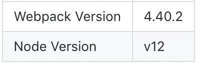
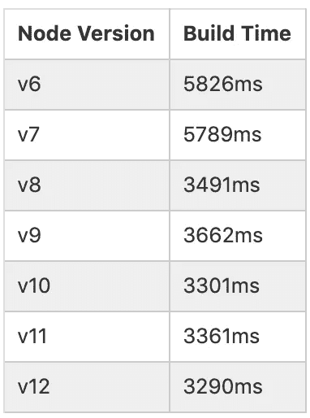
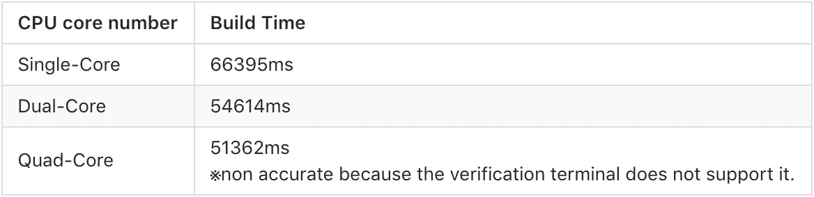
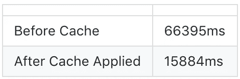

# 优化 webpack 4 的构建速度

> 原文：<https://betterprogramming.pub/optimize-buid-time-with-webpack-4-9bd503952145>

## 因为功能很棒，但速度就是一切

Marc Sendra Martorell 在 [Unsplash](https://unsplash.com/s/photos/speed?utm_source=unsplash&utm_medium=referral&utm_content=creditCopyText) 拍摄的照片

最近，我研究了如何优化 webpack 4 的构建时间。这篇文章展示了我所验证的结果。

## 目录

*   [不同版本节点的速度验证](#6bb8)
*   [多核速度验证](#0755)
*   [应用缓存的速度验证](#9b87)

首先，确保你的 webpack 和 Node 版本是最新的。以下是我的环境:

环境

# 不同版本节点的速度验证

Node.js 在每次版本更新时都越来越优化。最新版本是 12.11.1，LTS 是 10.16.3。我测量了每个节点版本的构建时间。

## 结果

按节点版本的结果

## **结论**

虽然在 v8 和 v9 之间有一个降级的版本，但是随着版本的升级，构建时间已经减少了。令人惊讶的是，版本间编译后的文件大小*没有*变化。所有的文件大小都一样。只有构建时间不同。

# 多核速度验证

官方 webpack 页面上的文件压缩插件 [uglyfy-webpack-plugin](https://www.npmjs.com/package/uglifyjs-webpack-plugin/v/1.3.0) 支持多 CPU 内核构建。这个插件在 v1.0.0 中默认应该包含在 webpack 中，但是现在需要通过 npm 手动安装。

`npm install --save-dev uglifyjs-webpack-plugin`

插件引用具有以下注释:

> 并行化可以显著加快构建速度，因此强烈推荐。

强烈建议提高构建速度。为了在构建过程中应用多核，需要启用并行属性或指定核的数量。代码如下。

## 结果

## 结论

就获得更快的构建速度而言，为多核进程设置并行属性是有效的。尤其是构建大型项目时，这个功能超级有帮助。

虽然我的笔记本电脑没有配备四核，但我试图将内核数量设置为四个并进行测量。结果似乎比双核略快，但由于我的笔记本电脑不支持四核，所以肯定一直是用双核测的。双核和四核在构建时间上的差异可能是公差范围。

的确，在 webpack 这边，下面的代码中使用了内核数量的设置，看起来要使用的内核数量是看 OS 的内核数量决定的。

`os.cpus().length — 1`

# 应用缓存的速度验证

UglifyJsPlugin 有一个缓存属性设置(`default: false`)。如果启用，将在`node_modules/.cache/uglifyjs-webpack-plugin`中创建一个缓存，从下一次开始引用。

## 结果

应用缓存后，构建时间显著减少。此外，我尝试测量多核对应的构建时间。

## **结论**

因为需要在缓存中进行累积，所以第一次构建时间没有变化。但是，一旦在第一次构建完成后创建了缓存，第二次构建后的构建时间就会大大减少。

小心改装。如果在创建缓存后再次修改文件，这将是正常的构建时间。尽管如此，它似乎是有效的，因为通过不变的文件，构建速度仍然变得更快。

# 全部的

由于 Node 版本的不同，构建时间会更快。尤其是自从 Node at 版本 8 有了相当大的改进，只需升级节点版本就有效了。

此外，当将 cache 属性设置为 enabled 时，由于文件自第二次以来没有更改，因此生成时间会减少。因此，如果要构建多个项目，并且项目中的某些文件不必更改，那么总的构建时间将会减少。

然而，在这种情况下，最好对目标文件进行转义。如果应用了缓存属性，并且允许使用多核，构建时间将会进一步缩短。

下面是我最后一个`webpack.config.js`例子。

优化代码