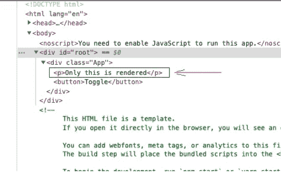
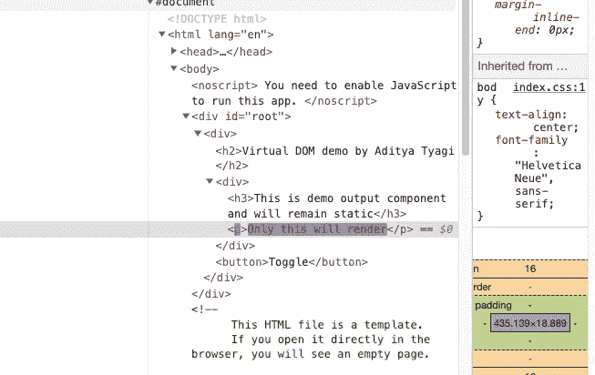

# 如何优化 React 应用的性能

> 原文：<https://betterprogramming.pub/optimize-performance-react-59b3e7ba47fa>

## 了解 React 的幕后，让您的应用程序运行得更快！

作者图片

要掌握任何框架或库，你必须深入其中。这不仅有助于理解抽象，也有助于改善开发人员的调试体验。对一个库的深入了解也会帮助你优化 app。

在 React 中，有一些事情让新手感到沮丧，当他们遇到这些事情时，他们会抓耳挠腮。在这篇文章中，我会试着列出一些让我毛骨悚然的事情，并告诉你了解这些基本原则是如何给我带来平静的！

# 重新评估组件≠重新呈现 Dom

就像一个库不知道存在像“DOM”这样的东西一样。是`[ReactDOM](https://reactjs.org/docs/react-dom.html)`与实际的 DOM 进行通信和交互。它是一个只管理组件和状态的库。然后，React 将所有关于更改内容以及屏幕上应显示的内容的信息传递给正在使用的界面(即`ReactDOM)`)。React 基本上关心以下内容:

1.  道具(来自父组件)
2.  状态(组件的内部数据)
3.  上下文(应用程序范围的状态)

每当道具、状态或上下文发生变化时，React 都会检查是否有新的内容要呈现在屏幕上，如果确实需要呈现，它会将该信息传递给`ReactDOM`。

# 虚拟 DOM

React 使用一种叫做[虚拟 DOM](https://reactjs.org/docs/faq-internals.html) 的东西。虚拟 DOM 决定了组件树(最终会呈现在屏幕上)，每个组件都有一个子树。所以 React 在任何状态改变后确定当前虚拟 DOM 和新虚拟 DOM 之间的差异，并将这个差异交给`ReactDOM`。如果需要的话，`ReactDOM`然后接收差异并操纵真正的 DOM。

因此，无论何时状态、上下文或属性发生变化，React 都会重新评估并重新运行组件功能。

假设我们有这样一个演示组件:

演示组件

当该组件上的道具改变时，组件功能`Demo`将重新运行并重新执行。另一方面，这并不意味着整个真实的 DOM 也会重新渲染。

真正的 DOM 只会在道具/状态/上下文的变化影响到 DOM 的部分发生变化。因此，对真实 DOM 的更改只是为了评估之间的差异。真正的 DOM 很少改变，只有在需要的时候才会改变。

这是一个很大的性能优势！在先前状态和新状态之间进行虚拟比较相对更便宜，因为它只发生在内存中，而不是接触真实的 DOM 然后进行比较。这个比较虚拟 DOM 新旧状态的概念叫做[虚拟 DOM Diffing](https://reactjs.org/docs/reconciliation.html) 。[这篇](https://medium.com/@gethylgeorge/how-virtual-dom-and-diffing-works-in-react-6fc805f9f84e)是关于同一主题的另一篇精彩文章。

# 差分算法:幕后

App.js

现在，想象一个状态变化，一个新的`
`标签被引入 DOM。所以，`ReactDOM`不会再渲染整个东西，即`
`和`<h1>`。但这只会造成差异。

App.js

为了查看它的运行情况，我将在浏览器中呈现上面的示例。我还将向您展示它是如何出现在开发人员工具中的，因为差异会“闪现”

*按钮切换< p >标签*的可见性

对于上面的功能，如果你仔细观察开发者工具，当添加和删除时，`
`会闪烁，而 DOM 的其余部分保持不变。这证明了真正的 DOM 只显示所需的更改，而不会不必要地呈现整个 DOM。

*DOM 显示切换< p >时的变化*

上面的例子甚至适用于在 JSX 渲染的组件(有/没有道具)。

考虑重新评估与状态和属性更改相关的组件。每当一个组件的状态或属性值改变时，整个组件都被“重新评估”这并不意味着 DOM，即由该组件返回的整个 JSX 也被重新呈现。只有在虚拟 DOM 中存在差异的部分，变化才会在真实 DOM 中发生。

重新评估包括功能组件中定义的变量以及创建的功能的重新初始化。但是，React 足够智能，不会重新初始化使用 React 挂钩`useState`和`useCallback`创建的状态和功能。因此，当整个组件被重新评估时，setter 函数、状态变量和初始状态(对于`useState`、`useReducer`)都不会被重新初始化。

这里有一个例子:

从上面可以清楚地看到，当`showPara`变量发生状态变化时，只有`<p` >标签闪烁，因此`DemoOutput`组件的`show`的`prop`值也发生变化。

*< p >标签闪烁为这是唯一的状态变化*

这是 React 的主要性能激励，因为组件子树可能非常复杂，并且与应用程序的大小嵌套很深。

# 不必要的重新评估

每当父组件中有状态改变时，子组件和链接到它的子组件的整个子树也将重新评估。这意味着，在上面的例子中，每当父组件`App`发生状态变化时，`<DemoOutput>`都会重新评估。

当道具改变时，对`DemoOutput`组件的重新评估是有意义的。但是如果道具永远不变呢。

`<DemoOutput show={false} />`

在这里，`show`道具永远不会变。还会重新评估`<DemoOutput>`组件吗？是啊！

我知道这很糟糕，但这就是 React 的工作方式！

当组件很小时，这不是问题。但是当`<DemoOutput>`组件是一个拥有多个子组件的巨大组件时，应用程序的性能会受到影响。

如果`DemoOutput`中有异步逻辑或者一些内存密集型的操作(比如繁重的排序)，那么会让 app 真的很慢！这就是为什么我们需要减少组件不必要的重新评估的数量。

考虑这个带有控制台语句的新`DemoOutput`组件:

在这里的例子中，您将看到每当父组件中有状态改变时，`DemoOutput`组件中的控制台语句将运行，即使`show`的属性值从未改变并且对`false`是静态的。

*每次父组件发生状态变化时，演示都会记录日志，但演示输出的属性不会发生变化*

# React 中组件的 React.memo()

以上问题可以通过在 React 上使用`memo()` API 来解决。`memo`有两种形式:

1.  `React.memo(Component)`
2.  `useMemo`挂钩

这就使得利用“记忆化”原理！

> *在计算中，记忆化或记忆化是一种优化技术，主要用于通过存储昂贵的函数调用的结果并在相同的输入再次出现时返回缓存的结果来加速计算机程序。—谷歌*

为了使一个完整的函数被记忆，我们将把函数组件包装在`React.memo`中。这样，组件将只在属性值发生实际变化时才进行渲染，从而减少不必要的重新计算次数。

使用`<DemoOutput show={false} />`，并在导出时以这种方式包装组件:

`export default React.memo(DemoOutput);`

我们已经记住了反应成分。现在，父组件的任何状态变化都不会重新评估`DemoOutput`组件，直到道具发生变化！

查看“演示如何运行”不再在控制台中记录。

*演示运行不再记录*

要测试所有这些新事物，请使用这里的操场:

`React.memo()`将功能组件的属性与它们之前的状态进行比较。只有当传递到`memo()`的组件的任何属性值发生变化时，它才会重新执行并重新评估该组件。

这里，它不会重复执行组件，因为传递给组件`DemoOutput`的属性`show`不会从`false`改变。你可以在这里阅读更多关于`React.memo()` [的内容](https://dmitripavlutin.com/use-react-memo-wisely/)。

这是避免整个 react 组件不必要的重新执行的第一步。

# 抓住了！

尝试使用带有适当值的`React.memo()`:

1.  原语—布尔、数字等。
2.  抽象—数组、对象、函数

您会惊讶地发现，即使 prop 值从不改变，当 prop 是抽象类型时，组件也会被重新计算。例如，组件将重新执行，即使在这些例子中使用了`React.memo( )`:

`<DemoOutput listItems={[1,2,3,4]} />`

或者

`<DemoOutput onClick={onDemoClick} />`

对于作为属性数据的原始数据类型，它比较

`props.show === previous.props.show`。

对于原语，这将像`false === false`将给出`true`一样工作，因为在 JavaScript 中，比较两个原语类型就是这样工作的。

对于抽象，这将是不同的`[1,2,3,4] === [1,2,3,4]`将给出`false`，因为比较两个抽象数据类型是通过引用进行比较的，因此它给出 false。

DemoOutput 组件将被重新渲染，因为 JavaScript 中的所有函数都是对象。对象再次被引用比较时给出`false`，即使对象值相同！

# 使用 useCallback 防止函数重新创建

当一个父组件被重新执行，并且它有一个带有作为函数的属性的子组件时，传递给它的函数总是被重新创建。这有重新执行子组件的副作用，即使功能是相同的！

onDemoClick 函数永远不会改变

因此，为了记忆对象(也称为函数)，我们可以使用`useCallback`钩子。传递给这个钩子的函数被 React 记忆，在重新执行组件时，函数不会被重新创建。

`useCallback`的定义与`useEffect`类似。它还接受一个依赖数组。

# useCallback 为什么需要依赖数组？

`useCallback`需要一个依赖数组，因为 JavaScript 中函数的[“闭包”现象。这些函数关闭其环境中可用的值。第一次定义函数时，Javascript 锁定函数中使用的变量。下次函数运行时，将使用锁定变量的存储值。](https://developer.mozilla.org/en-US/docs/Web/JavaScript/Closures)

有些情况下，我们确实需要重新创建函数，因为来自外部的函数所使用的值可能已经改变。因此使用了依赖数组。

例如，如果我们在这里讨论的函数使用了一个`useState`变量的值，那么一旦变量发生变化，就需要向函数提供该变量的新值。如果我们在`useCallback`中省略了依赖数组的使用，那么在状态改变时，将会重新执行函数，但是我们的函数仍然具有该状态变量的旧值。

这只在`DemoOutput`组件被包裹在`React.memo(DemoOutput)`中时有效。

# 使用 useMemo()挂钩

考虑这个例子，其中我们对来自`DemoOutput`组件中父组件的`items`数组进行排序。

上面的组件对道具`items`上的输入项目进行排序，然后显示这些项目。

现在，考虑我们仅仅改变道具上的`title`。您将看到`DemoOutput`组件重新执行。老实说，应该是这样的。这里所关心的是，即使输入(`props.items`)从未改变，整个排序算法每次都要重新运行。

这又是一个性能打击，可以让你的应用程序毫无理由地慢下来！

为了解决这个问题，让我给你介绍一下`[useMemo](https://reactjs.org/docs/hooks-reference.html#usememo)`钩。

使用`useMemo`挂钩，您可以记忆排序功能和其他对象！因此，将排序函数改为使用钩子，它将只在传递给它的依赖数组的参数改变时运行。

这将减少浏览器的压力，从而提高应用程序的性能！

# 记忆化的缺点

这种优化需要额外的成本。当我们将一个组件放入`memo`时，React 必须存储`props`之前的值，这样它才有东西可以比较。这需要额外的时间和内存。因此，我们不为每个组件添加`memo`。

权衡取决于你试图优化的组件树的级别。对于一个长而复杂的组件树分支，使用`memo`是有意义的。

# 组件和状态

一切都归结于状态/道具/上下文，它们控制着屏幕的重新渲染。

每当函数组件由于状态改变而重新执行时，我们看不到`useState`、`useReducer`等钩子 React 提供的重新初始化。

这是因为`useState`来自 React，它会为您进行管理。

例如:

`const [isLoading, setIsLoading] = useState(false);`

这里，

`isLoading`–状态变量

`setIsLoading`–状态变量的设置器

`false`–初始值

因此，React 确保`useState`和传递的初始值只被考虑一次——组件第一次运行的时候。然后，React 会记住初始值属于哪个组件。

但是，如果组件从 DOM 中完全删除，它将重新初始化`useState`。它可以是有条件的，也可以是用户退出该组件/页面。

# 了解状态更新和调度以优化性能

考虑我们上面的同一个例子

`const [isLoading, setIsLoading] = useState(false);`

调用 setter 时，状态不会立即更新。它被安排在晚些时候。对于时间表中的状态更改，顺序始终保持不变。

如果我们在第一次状态更改发生之前再次调用状态设置器来更新状态，第二次状态更改将不会先于第一次更改。秩序保持不变。

我举个例子解释一下:

考虑一下`App.js`中的这段代码。有两个按钮分别与两个功能相关联。

当`updateLoading`被点击时，即使最后的`setIsLoading`将状态设置为`true`，我们也会得到`false`的安慰。该函数完成的状态更改计划在以后进行。当执行了一些延迟/异步任务或者重新呈现函数时，它就会发挥作用。

现在，当点击`checkLoading`按钮时(延迟一段时间后)，会打印`true`，因为预定值是`true`。

> 这是我们需要理解和掌握的调度原则，因为这是大多数开发人员在学习 React 时忽略或误解的复杂部分。这也是在[调试](https://adityatyagi.com/index.php/2022/02/19/how-to-debug-a-react-app/) React 应用程序时必须牢记的原则。–自我提醒

如果有许多状态改变调用，我们将从函数组件的最后一次执行中得到结果。所有状态变化都不会考虑中间状态变化值，而只会返回最后一次函数执行的结果。

这就是为什么如果你依赖于先前的状态快照，就要使用函数形式来更新状态。

`setIsLoading((prevState) => !prevState);`

因此，函数形式——对于每一个状态变化，它查看突出的状态，并给出结果。它不使用组件上次执行时的状态。

**注意**:组件被重新渲染的时间和状态改变被安排的时间是不同的。一次函数执行可以有多次状态改变。

如果在一个块中有两个背靠背的状态更新，中间没有任何回调/承诺/时间延迟，将不会导致功能组件的两次重新执行。它将在一次重新执行中批处理这两个文件。

所有三个状态变化将被合并成一个功能重新执行。

记住以上几点，你不仅可以优化你的 React 应用程序，还可以获得更好的[调试](https://adityatyagi.com/index.php/2022/02/19/how-to-debug-a-react-app/)体验！

我希望你觉得这是有帮助的和有趣的。万一有什么问题出现，我很乐意回答！

*最初发表于*[T5【adityatyagi.com】](https://adityatyagi.com/index.php/2022/06/07/optimize-performance-in-a-react-applications/)*。*