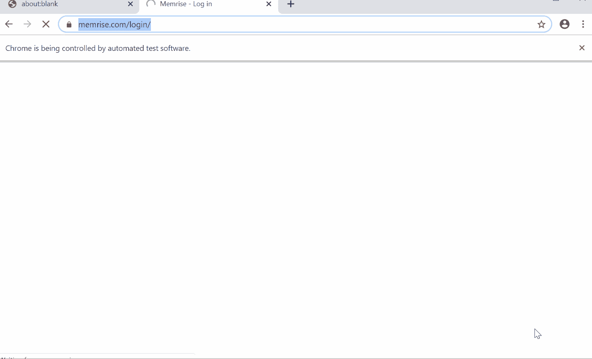
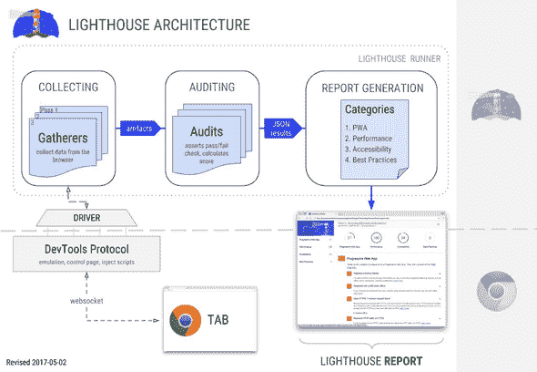
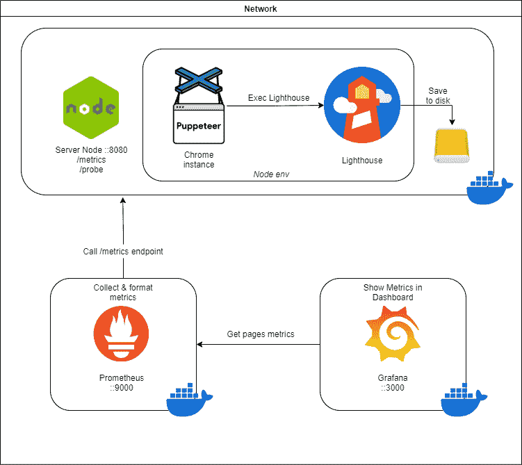
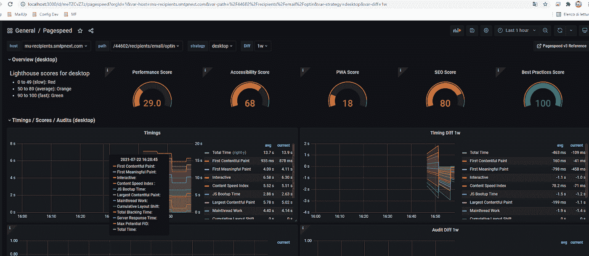

# 通过 Node.js 和 Lighthouse 优化用户体验和性能

> 原文：<https://betterprogramming.pub/optimize-the-user-experience-and-performance-via-node-js-and-lighthouse-bfd8107fe248>

## 同时改善两者的技巧

尼古拉斯·霍伊泽在 [Unsplash](https://unsplash.com?utm_source=medium&utm_medium=referral) 上拍摄的照片|图像高度有所改变

> 想一想:为什么你要把精力集中在优化用户界面和应用程序的用户体验上，而不是集中在整个事情的性能方面？

我相信 UX/UI 的改进可以带来更好的性能。产品负责人和技术人员将会从中受益。

最近，我通过 Lighthouse 实现了一个自动化的后期构建管道，以自动化视觉和性能测试。我们正在收集指标、截图、测试和性能结果，在手动分析这些之后，我们实现了一些更改、一些 UX 改进、一些功能删除等等。

我们在前端代码库(我们使用微前端架构)的 Grafana 仪表板上实现了许多改进和一个很好的历史图表。

让我们深入了解这些改进。

# 场景是怎样的？

我曾为一家受欢迎的意大利电子邮件营销平台工作，这是一个顶级的多渠道云平台，有 10，000 多家客户使用它来改进他们的电子邮件和短信营销策略。

我们致力于通过改进性能、用户界面和用户体验，为最终用户提供最佳体验。

该平台有许多日常使用的功能和页面，正因为如此，每个版本都很重要。我们正在开发一个微前端架构，每周每个项目交付超过 30 个版本。

除了 e2e、a/b 测试、压力测试等。，我们希望监控每一个前端版本，以检查我们是否在 UI/UX 或客户端性能上做了改进。

# 对于我们的情况，哪一个是最好的解决方案？

我们想了很多，提出了很多有正反两面的假设方案。我们最终在我们的 Jenkins pipelines of Lighthouse 中使用 Node.js、Puppeteer、Prometheus 和 Grafana 定制了一个实现。

我们使用 Lighthouse metrics 来监控新的开发、移植任务、UI/UX 改进、性能等等。

通过收集这些指标，我们还可以通过 Prometheus 和 Grafana 获得历史数据来比较“旧”和“新”。当然，一切都应该是可移植的，所以我们使用了 Docker 来实现可移植性，并在我们的云提供商(AWS)上部署一切。

# 使用了哪些技术？

所有提议的技术都是开源库。以下是我们使用的方法:

puppet eer——一个节点库，它提供了一个高级 API 来通过 DevTools 协议控制 Chrome 或 Chrome。因此，您拥有一个在后台运行的 Chromium 实例，并拥有完全的控制权！

普罗米修斯——一个用于数据建模和时间序列数据库的开源系统。我们用它作为 Grafana 的数据提供者。

grafana——开源分析和监控解决方案。它允许你建立你的仪表板，提高你的应用程序的可观察性。

light house——一个开源的自动化工具，用于提高谷歌制作的网页质量。它的架构是围绕 Chrome 调试协议构建的，这是一组与 Chrome 实例交互的低级 API。它与一个 Chrome 实例接口。

这些审核来自于新的现代网络标准，比如页面上的第一次内容绘制、渲染时间等。你可以在 https://web.dev/measure/找到更多信息。

我们选择开源项目是因为我们真的相信开源。我们的项目很快就可以在一个开源仓库中获得。

# 我们如何实施解决方案

我们尝试了许多不同的架构和实现，最终我们做到了以下几点:

*   在节点实例上构建我们的解决方案
*   在后台运行的无头浏览器(puppeteer)中为我们的 API 执行 web 服务器
*   获取灯塔指标
*   在 S3/磁盘上写入指标
*   通过普罗米修斯收集它们，这样我们就能最终从格拉夫纳那里取回它

这是我们的架构模式:

我们的节点实例服务于端点，通过 cURL bash 命令从 Jenkins 管道收集指标。

API 对请求中作为参数传递的 URL 执行了 lighthouse 测试，这样我们就可以将浏览器重定向(通过一个木偶实例)到正确的页面。

当然，我们的平台有一个表单认证，所以我们首先需要对我们的演示平台进行认证。为了给你一个解决方案的例子，我将通过 puppeteer 和 Node.js 向你展示我们的认证流程的一个片段。

当我们使用木偶师时，我们复制了真实用户的任何动作。因此，我们将点击按钮，输入输入，并将鼠标移动到页面上的一个方向来模拟用户的动作。

在下面的代码片段中，您可以看到我们是如何实现`signIn`函数以及木偶师 API 是如何工作的:

# 这个项目的成果是什么？

我们设法构建了我们的解决方案，并通过 Jenkins 中的后构建触发器将我们的自动化附加到每个微前端应用程序。这将触发一个 API 来收集任何页面或特性的指标。

这是来自我们本地仪表板的图像，检索页面指标、得分、次数、审核等:

通过使用这个工具，我们允许产品和设计团队控制他们的客户旅程和用户流/ UX 性能。我们使技术团队能够了解特定版本中的问题或性能方面的重大改进。

> 有趣的是:我们改变了 CDN 缓存和交付资产的方式，并且由于 Grafana 的历史图表，我们设法看到了我们指标的变化。

# 外卖食品

*   我们相信 Lighthouse 是分析和监控我们的应用程序的一个很好的工具。
*   最大的挑战是在容器中实现平台的认证和业务逻辑，但是我们做到了！
*   收集发布前和发布后的指标让我们更加清楚我们的目标，并且让我们对整个应用程序设计有一个大的了解，以提高 UX
*   改进产品开发流程

> 我的最后一个建议是，总是尝试改进和自动化一切！