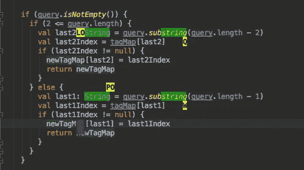
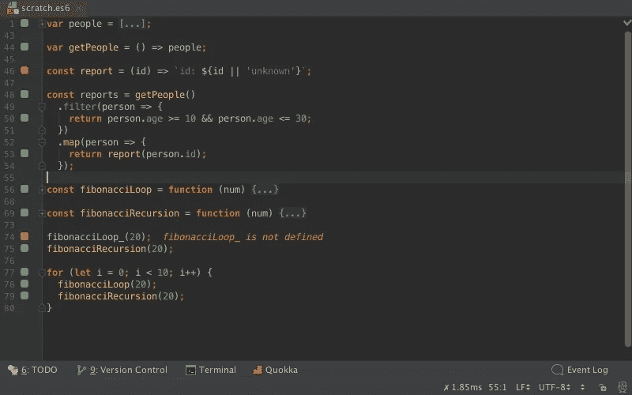
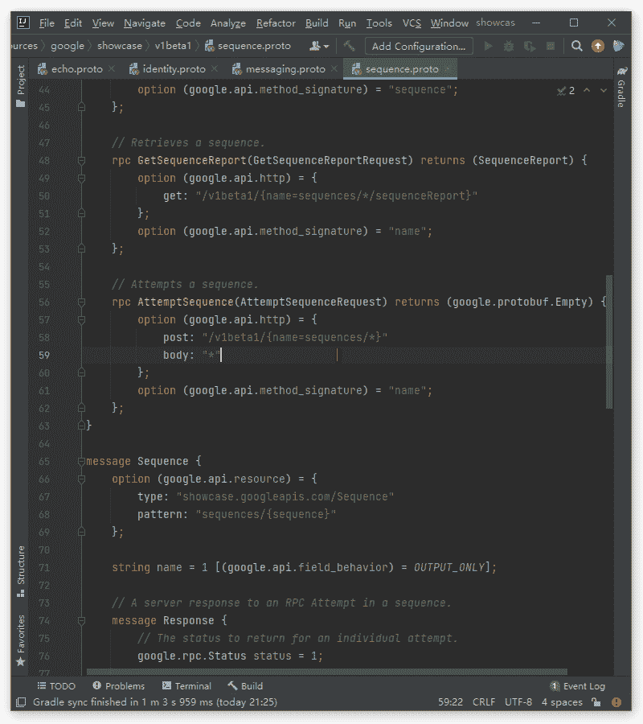

# 优化 WebStorm 以提高工作效率——我的 5 大扩展

> 原文：<https://betterprogramming.pub/optimize-webstorm-for-productivity-my-top-5-extensions-a0d53ec6327b>

## 看看一些 Jetbrains 的扩展

作者图片

前阵子我从 VS 代码迁移到了 WebStorm，感觉很棒。像所有 JetBrains IDEs 一样，它带有一组内置特性，使每个程序员的生活变得更加轻松。尽管如此，即使是这样一个伟大的工具，只要稍加优化，也会变得更加神奇。由于我喜欢尝试很酷的插件，我想我会与你分享我挑选的工具，这些工具确实提高了我在 WebStorm 中的工作效率。

# [VS 码键图](https://plugins.jetbrains.com/plugin/12062-vscode-keymap)

这是一颗真正的明珠，因为它使得从 VS 代码到 WebStorm 的过渡更加容易(或者，如果您在两者之间切换，它是一个救命稻草)。它允许您迁移和同步您的键映射，这样您就不必学习一组新的键码来在基于 IntelliJ 的 ide 中有效地工作。

如果您的 IDE 中没有预装 VS Code keymap，您可以使用它。值得注意的一点是，它不会在安装后自动将 keymap 设置为 VSCode。您必须手动设置它:首选项>键映射>选择 VSCode

# [GitLive](https://plugins.jetbrains.com/plugin/11955-gitlive)

这个插件对于增强 WebStorm 的内置 Git 功能是绝对必要的，它具有实时特性，例如团队成员的在线状态和即时合并冲突检测。

GitLive 为您的 IDE 添加了一个工具窗口，您可以在其中看到您的团队中谁在线，他们正在处理什么问题和分支，以及他们对这些分支所做的更改，这有助于最小化中断和上下文切换。

即时合并冲突检测是一个真正的游戏改变者。编辑器中的指示器显示您的更改和其他人的更改之间的差异。这些会在您和您的队友编辑时实时更新，并提供潜在合并冲突的早期警告。这样您就可以在合并冲突发生之前解决它们！

GitLive

# [跳跃式](https://plugins.jetbrains.com/plugin/7086-acejump)

你知道在编码时不小心把光标带到错误的地方，然后噗的一声，你的思路就消失了的感觉吗？让我告诉你，这并不好。幸运的是，使用 AceJump，您可以快速地将插入符号导航到编辑器中任何可见的位置。只需点击“ctrl+”。，键入一个字符，然后键入匹配的字符进行 Ace 跳转。
习惯它需要一点时间(在这里可以看到完整的演示: [AceJump in action](https://www.youtube.com/watch?v=8cgy8ITtsJE&ab_channel=CharlBotha) )，但是相信我，一旦你习惯使用它，你就再也不想回去了。

AceJump

# [阔卡](https://plugins.jetbrains.com/plugin/9667-quokka)

如果你是一个 JavaScript 开发人员，Quokka 是一个值得考虑的好工具。它是编辑器中的快速原型游乐场，可以访问项目文件、内联报告、代码覆盖和丰富的输出格式。它运行 JavaScript 和 TypeScript，并提供即时反馈。当您键入时，运行时值会更新并显示在编辑器中的代码旁边。在您键入时，代码会立即运行，对未保存的更改；无需手动操作或切换上下文。错误消息显示在导致错误的代码旁边。控制台日志和标识符表达式值也以内联方式显示。

阔卡

# [原蟾蜍](https://plugins.jetbrains.com/plugin/16422-protobuf)

这个插件提供了完整的 protobuf 支持。这是捆绑的 [Jetbrains 官方 Protobuf 插件](https://plugins.jetbrains.com/plugin/14004-protocol-buffers)的替代方案，在我看来效果更好。它支持大多数官方插件功能，并提供了许多独特的高级功能，如自动导入、代码格式化或更完整的代码提示。值得注意的是，创建者对报告的问题或功能要求非常敏感，这对我来说是一个很大的优势。

请记住，为了使用你需要禁用 Protol 缓冲区和 gRPC，否则，它将无法正常工作。推荐！

GIF 格式

原蟾蜍

这就是我为提高你在 WebStorm 中的工作效率而选择的扩展。

我希望你在这个列表中发现了一些有趣的东西，如果你有一些反馈，不要犹豫，在评论中联系我们吧！