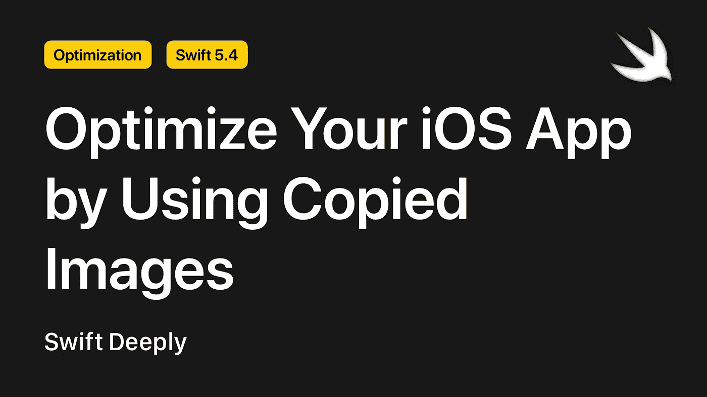
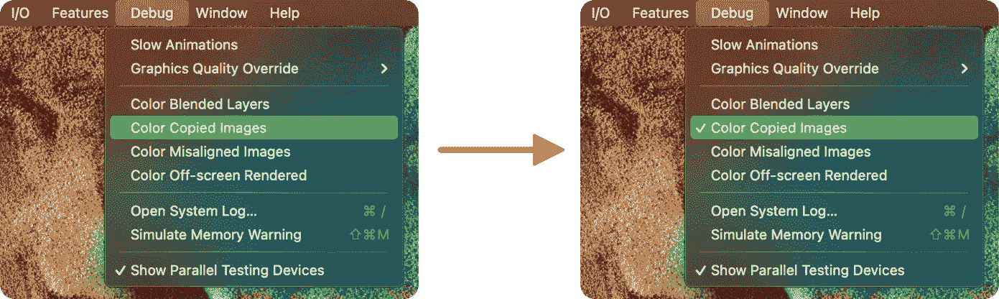

# 通过使用 Swift 中复制的图像优化您的 iOS 应用程序

> 原文：<https://betterprogramming.pub/optimize-your-ios-app-by-using-copied-images-in-swift-8338782250ef>

## 有了复制的图像，我们可以让图像在我们的项目中更有表现力



作者照片。

iOS 和 macOS 支持许多图像格式，如 JPEG 和 PNG，但偶尔我们作为开发人员，不得不在我们的项目中使用 iOS 和 macOS 不支持的格式。例如，当您从无法确定来源的 API 获取数据时，就会发生这种情况。

当您试图直接在屏幕上显示图像，而 iOS 或 macOS 不支持其格式时，您可能会遇到非常值得注意的性能问题。在这种情况下，复制的图像可以帮助我们。

在这篇文章中，我们将学习如何使用复制的图像，以及如何转换和使用我们想要的方式不支持的图像。

**注意:**你可以[在 GitHub 上下载本文的示例项目和源代码](https://github.com/SwiftDeeply/Copied-Images-in-Swift)。

# 让我们看看这个例子

首先，我们有一个非常基本的项目:它只涉及使用一个`UImage`对象。

```
**class** ViewController: UIViewController {

    // MARK: - UI Elements
    **let** imageView = UIImageView()

    // MARK: - Life Cycle
    **override** **func** viewDidLoad() {
        **super**.viewDidLoad()

        imageView.translatesAutoresizingMaskIntoConstraints = **false**
        imageView.contentMode = .scaleAspectFit
        view.addSubview(imageView)

        NSLayoutConstraint.activate([
            imageView.centerXAnchor.constraint(equalTo: view.centerXAnchor),
            imageView.centerYAnchor.constraint(equalTo: view.centerYAnchor),
            imageView.widthAnchor.constraint(equalToConstant: 300),
            imageView.heightAnchor.constraint(equalToConstant: 300)
        ])

        imageView.image = UIImage(named: "example.tif")
    }
}
```

如你所见，我们在`UIImage`对象上使用了一个 TIF 格式的图像文件。iOS 和 macOS 不支持此文件格式。这就是为什么我们的图像对象现在很难绘制。在真正的 iOS 或 macOS 应用程序中，这可能会造成相当困难的性能问题。

那么我们怎么知道 iOS 或 macOS 不支持这种图像格式呢？(毕竟，很有可能记住每一种不支持的文件格式。)答案是 Xcode 的调试模式。

在模拟器中运行我们的应用程序后，当我们在菜单栏的“调试”选项卡中单击“颜色复制的图像”按钮时，需要很长时间渲染的 UI 元素的颜色会发生变化。如果图画有大问题，一些会是红色的，如果问题不大，一些会是蓝色的。



解决问题的唯一方法是重新绘制我们的图像元素。以下函数将适用于此。

```
// MARK: - Methods
**func** redraw(for image: UIImage) -> UIImage {
    **let** renderer = UIGraphicsImageRenderer(size: image.size)

    **return** renderer.image { **_ in**
        image.draw(at: .zero)
    }
}
```

然后，用这个方法，我们可以如下定义`UIImageView`对象的图像属性。

```
**let** image = UIImage(named: "bad-image.tif")!
**let** renderedImage = redraw(for: image)
imageView.image = renderedImage
```

由于这种方法，我们的图像对象将复制本地缓存，所以它不会降低性能。

# 结论

现在您知道了如何在 iOS 或 macOS 项目中使用拷贝的图像。如果你想让我写更多关于优化主题的文章，如果你在评论区写下你想要的主题，我会很乐意的。

感谢阅读。

## **我的其他文章**

*   [“Swift 5.4 有什么新功能？](/whats-new-in-swift-5-4-88949071d538)”
*   [“在 SwiftUI 中创建自定义预警对象](/create-a-custom-alert-object-in-swiftui-bddf98923a1)
*   [“如何在您的 iOS 应用程序中创建入职屏幕](/how-to-create-onboarding-screens-in-your-ios-app-e41b518db31f)”