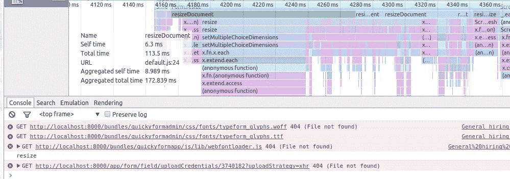
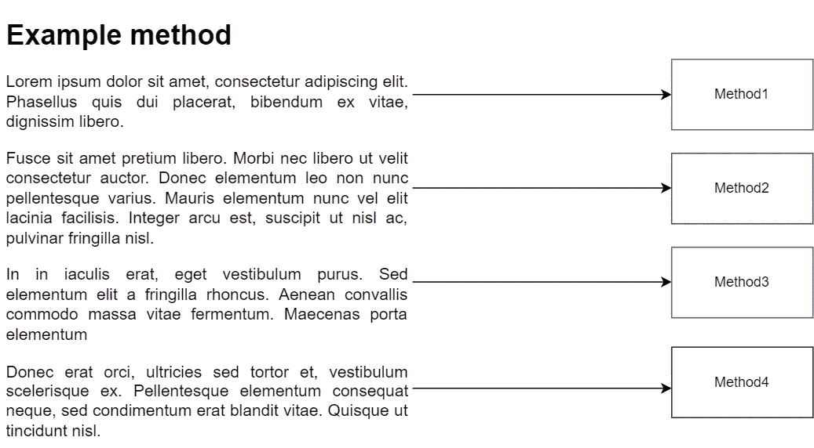
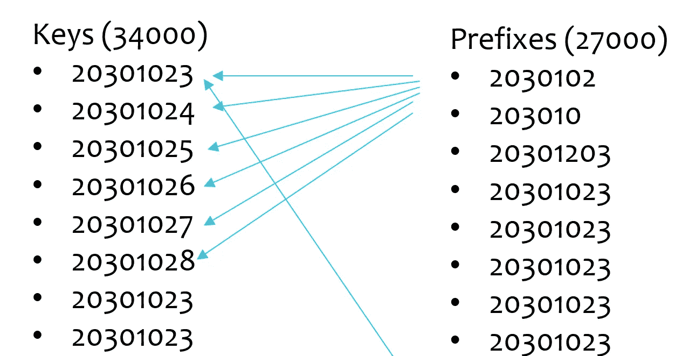
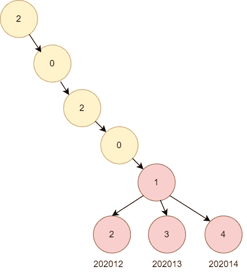
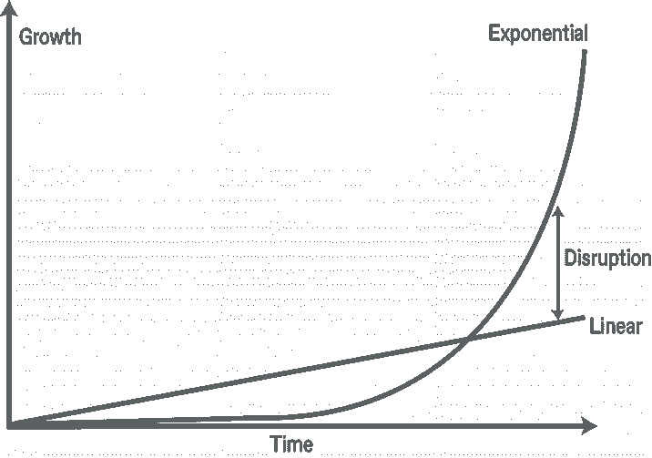
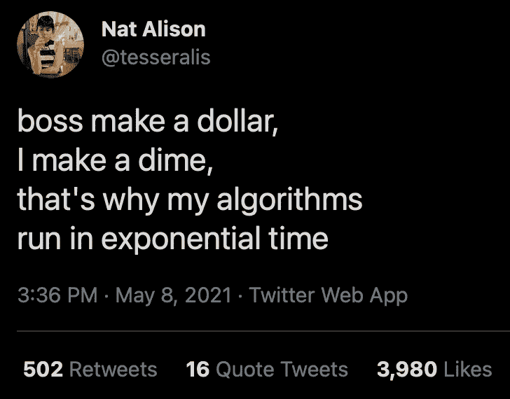
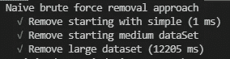
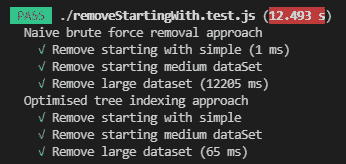

# 优化删除 JavaScript 中多个键的算法

> 原文：<https://betterprogramming.pub/optimizing-an-algorithm-to-delete-multiple-keys-in-javascript-2a95a8563eb1>

## 发现、隔离和解决实际应用中的算法难题

罗曼·辛克维奇在 [Unsplash](https://unsplash.com/s/photos/code?utm_source=unsplash&utm_medium=referral&utm_content=creditCopyText) 上拍摄的照片

一个客户提出了他们从 Redis 缓存中批量删除太慢的问题。虽然最初，我认为 Redis 是错的，鉴于删除数千个键并不是最好的，但我错了。请继续关注我寻找、隔离和解决算法挑战的思维过程。

# 初始调试—寻找瓶颈

照片由[安德鲁·西曼](https://unsplash.com/@amseaman?utm_source=unsplash&utm_medium=referral&utm_content=creditCopyText)在 [Unsplash](https://unsplash.com/s/photos/bottleneck?utm_source=unsplash&utm_medium=referral&utm_content=creditCopyText) 上拍摄

在做侧写之前，我的大脑开始创建假设，关于什么会很慢的理论。有时它是正确的，但真正的测试是科学地证明瓶颈，用一个分析器确认 80%的处理时间花在哪里，然后用 20%的努力应用一个修复，获得 80%的改进。

在本例中，我调试了 Redis 缓存删除，用了 4 分钟响应时间中的 5 秒钟。那么如果 Redis 没有错，那会是什么呢？

**仿形**

示例分析器

我运行了 profiler，这是一个可以告诉你每个函数花费了多少时间的工具。结果是一个函数占用了 90%的时间。

通过这种方式，分析器可以完成它的工作，并将结果分成如下几部分:

*   方法 1: 90%
*   方法 2: 3%
*   方法三:3%
*   方法三:3%

## 瓶颈

在阅读了 Method1 之后，我明白了它的工作是从字符串列表中移除许多键，但它不是简单的移除。它删除了所有从它们开始的键，以及其他集合中的任何键

比如说。假设我们有一个键列表:

*   **“一个”**
*   “ab”
*   “abc”
*   “abcd”
*   **“BCD”**
*   " bcdf "
*   " bdcf "

我们希望删除任何以

*   “ab”
*   " bcdf "

过滤后，我们应该剩下:

*   " a "
*   " bdcf "

如果我们使用一种简单的方法来实现这一目标，我们可以这样做:

这种方法的问题在于 foreach 键，我们需要遍历前缀列表来删除集合，以检查它们是否以。这就引出了一个大 O(键*前缀)

这给我们带来了一个大 O(键*前缀)。在这种情况下，它是:

> o(键*前缀)

有 34000 个键和 27000 个前缀在一个指数大 O()中运行，它过去在运行时会伤害计算机:

> O(34000 * 27000) = 917，000，000 次迭代

每个前缀的可视化表示必须循环遍历这些键

> 什么是 O(键*前缀)
> 
> 这叫做大 O 符号，用来描述算法的复杂性。你可以在这里得到更多的信息。随着开发人员资历的提高，能够识别算法的大 o 符号是一项重要的技能。

## 回到问题上来

通常，当您面临从另一个数组中移除多个键的挑战时，您会使用编程、Hashsets 和字典的作弊代码。

示例:

这解决了这个问题，因为从集合中删除是 O(1)，所以我们只需要迭代一次键列表来构建集合，然后在键中删除一次。将我们带到:

> 大 O(键+前缀)

但在这种情况下，我们不能作弊。没有一个简单的结构来解决我们的数据算法问题。这是一个典型的 leetcode 挑战=)

> 但是我们可以从 Set 解决方案中获得灵感，我们可以索引我们的数据以减少查找成本吗？

在我的白板上画满了图表之后，这就是我要做的。假设你有那些钥匙:

*   202012
*   202013
*   202014

这是要删除的前缀:

*   20201

您可以基于关键字的每个字母创建一个树:

因此，当您查看某个内容是否以前缀开头时，您可以在树中导航，直到前缀的最后一个字母节点，然后删除该节点及其子节点。将我们的大 o 符号带到:

> o(键+前缀)
> 
> O(34000 + 27000) = 61，000 而不是
> 
> o(34000 * 27000)= 9.17 亿

以前，整个端点的响应时间为 1.8 分钟；这一改，就到了 6 秒。这是算法效率的巨大差异。此外，它可以有效地将指数转换为线性:

指数/线性图表比较

这让我想起了这个笑话:

信用:[纳特·艾莉森](https://medium.com/u/18c0b276923b?source=post_page-----2a95a8563eb1--------------------------------)

这是解决算法挑战的最佳方式吗？也许，从我在 LeetCode 上看到的其他问题的解决方案来看，可能有更有效的方法来使用更少的内存甚至更高的 CPU 效率来做到这一点。

> 如果你能想到一个更有效的方法，请随时回复或发送给我你的解决方案。

然而，这将响应时间提高了 94%以上，因此它已经实现了我的 20%努力 80%结果的目标。

# 真正的 JavaScript 实现

如果你想看实际操作，这里有一个[实际的 JavaScript 实现](https://github.com/RaphaelYoshiga/algorithm-tree):

## 测试案例示例:

用我们的简单实现运行这些

带有大 O(键*前缀)= 12.2 秒的结果

## 实现树索引方法

## 说明

第一步是构建我们的树，然后遍历所有前缀，从树中删除它们，然后基于剩余的树分支重新构建我们的列表:

**结果**

优化前 12.2 秒，优化后 65 毫秒的最终结果

# 结论

我希望你能从这里学到三点:

*   1 —科学地识别性能瓶颈
*   2 —熟能生巧
*   3-能够快速发现代码中的大 O 符号。

在识别性能问题时，可以先了解最初问题的想法，但是最终，您需要通过测量代码在哪里花费时间来证明。

另一点是训练；我只能在练习算法网站后解决这个问题。作为钢琴家，在大舞台上表演，如果在主舞台之外训练，收获会更大。

最后，除了度量之外，你还得开发你的大鼻子，这样你就能快速找出可能导致问题的代码。

## 参考

*   [源代码](https://github.com/RaphaelYoshiga/algorithm-tree)
*   [大魔神解说](https://medium.com/asos-techblog/a-beginners-guide-to-big-o-notation-f708dae31652)