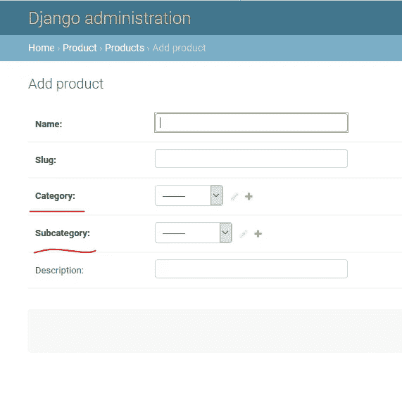
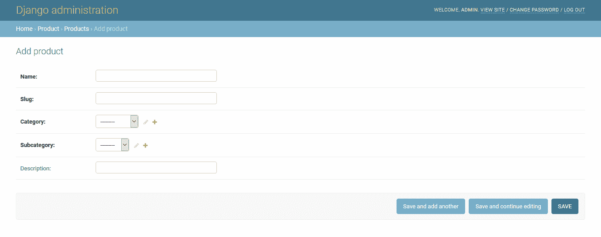

# 优化 Django 管理

> 原文：<https://betterprogramming.pub/optimizing-django-admin-6a1187ddbb09>

## 如何根据另一个选择填充选择选项


照片由 [Faisal M](https://unsplash.com/@heyfaisal?utm_source=medium&utm_medium=referral) 在 [Unsplash](https://unsplash.com?utm_source=medium&utm_medium=referral) 上拍摄

从 [Django 管理界面](https://docs.djangoproject.com/en/3.1/ref/contrib/admin/)管理数据应该快速而简单，尤其是当我们有大量数据需要管理的时候。

为了改进这个过程，也为了让你更容易理解，我们将在这里用一个我在一个项目中经历过的真实场景来工作。

# **场景**

该场景是为电子商务网站添加 Django administration 的产品。

我们有三个表:类别、子类别和产品。

每个产品都与一个类别和一个子类别相关，子类别也与一个类别相关。你可以在下面看到所有三个表的模型。

产品需要填充这些字段:名称、Slug、类别、子类别(应该与一个类别相关)和描述。



插入新产品时，有两个下拉选择字段(类别和子类别)。

**这里的问题是:**当我填写名称和 slug，然后选择我要添加的产品的类别时，我得到了子类别的下拉列表中的所有项目，甚至是不属于所选类别的项目。因此，我需要填充下拉子类别中与所选类别相关的项目。

# 结果预览



现在我将向你展示我找到的解决这个问题的正确方法。这很容易实现——只要仔细遵循这三个步骤。但首先，这是我的设置:

Python →3.7

姜戈→2.2.4

JQuery →3.2.1

```
<script *src*="https://ajax.googleapis.com/ajax/libs/jquery/3.2.1/jquery.min.js"></script>
```

这是三张桌子的模型。

## 类别表的模型

## 子类别表的模型

## 产品表的模型

# 解决办法

## 1.创建视图

要填写子类别字段下拉列表中的项目，您必须创建一个视图来响应`JSON`数据。

`views.py`:

## 2.添加图案

在`urls.py`处，需要添加一个图案才能到达视图:

## 3.添加 JavaScript 代码

现在你必须为你的产品应用程序覆盖 Django admin 的`change_form.html` 来添加一些 JavaScript 代码来完成这个魔术。

这个文件的位置并不重要。你可以把它放在你的应用程序中，它仍然可以工作。只要姜戈能发现它的位置。更重要的是，HTML 文件的名称`change_form.html`必须与 Django 提供的原始 HTML 文件名相同。

`change_form.html`:

# 结论

就这样，现在下拉选择子类别中的项目列表中的项目与所选择的类别相关。

如果你有这个问题的另一个解决方案，请在下面随意提出来，以增加我们与 Django 框架的技能，特别是使 Django 管理界面成为一个更强大的工具。