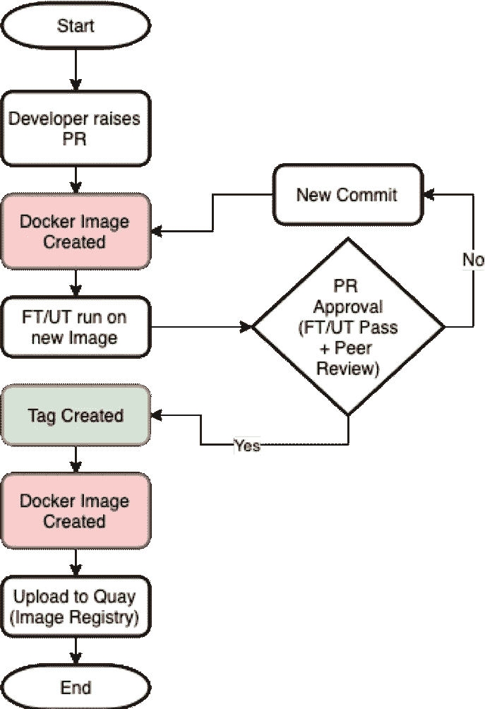
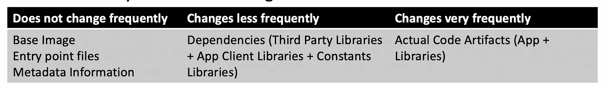
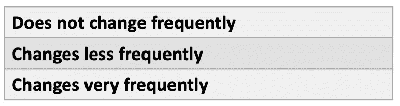
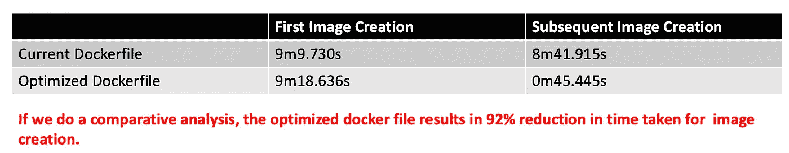

# 优化 Docker 图像创建

> 原文：<https://betterprogramming.pub/optimizing-docker-image-creation-fa06bb42733d>

## 我们优化创建码头工人形象的经验以及从中我们学到了什么


# 语境

我们的大多数微服务都是基于 Python 的容器，它们是通过持续集成过程创建的。该过程描述如下:



容器生成和容器推广流程

正如您在这个过程中看到的，只要开发人员提出一个拉请求，集成过程就开始了。创建映像后，会对映像进行 UT 和功能测试。如果他们通过了，PR 将被提供给同行评审。如果同行评审者提供了任何注释，那么开发人员将处理该注释，这可能会导致新的提交，如果发生这种情况，循环将会重复。否则，评审者可能会批准拉取请求。批准后，提交被标记，映像被再次创建，生成的映像被发布到容器注册中心。

经过仔细分析，优化 Docker 图像创建实际上有助于我们优化整体流程。因此，我们开始了改进我们的容器构建过程的旅程。

*注意:我交替使用容器和图像。我仍在习惯这些术语*

# Docker 图像创建流程

我们先来了解一下 Docker 的形象创建过程。

首先，我们将看到一个 Dockerfile 文件。Docker 文件示例如下所示:

```
#This is a example Dockerfile 
FROM ubuntu 
MAINTAINER myself@somedomain.com 

RUN apt-get update && \
    apt-get -y upgrade
CMD [“echo”,”Image created”]
```

在上面的 Dockerfile 中，第一行告诉我们这个图像应该从基础图像:`docker.io/library/ubuntu:latest`创建。

下一行添加了关于谁在维护运行 docker 构建过程所创建的映像的元数据。

下面一行更新容器中的包。

最后一行向容器添加了另一段元数据，一旦容器启动，它就会回显命令`Image created`。

以下是 docker 映像创建过程的高级表示。


Docker 图像创建流程

当映像创建过程开始时，docker 守护进程做的第一件事就是检查 docker 文件中指定的基本映像是否在本地机器中。如果不存在，它就从注册表中取出图像。然后它移动到 docker 文件中的下一行。它读取下一行，并验证构建缓存中是否有一个映像具有 docker 文件中提到的这种更改。如果它有图像，它就移动到下一行，并重复这个过程，直到遇到 Dockerfile 中的一行，该行有一个没有图像被缓存的更改。同样的过程已经在" ***绿色"*** 章节中描述过了。

此时，或者如果没有缓存中间图像，Docker 守护程序会创建一个容器，应用该行中提到的更改，从中创建一个图像，然后移动到下一行，重复相同的过程，直到到达 Docker 文件的末尾。这已经描绘在“*桃子”的彩色方框中。*

*(*请注意:这是 Docker 图像创建过程的一个非常简化的版本，为了让我们集中注意力，我故意省略了很多细节*)*

# *这个想法*

*随着我们对 Docker 构建过程理解的加深，我们开始意识到，如果我们能够以某种方式最小化构建过程进入"***【peach】***"部分的次数，并最大化它进入构建过程工作流的"***【green】***"部分的次数，我们也许能够使图像创建过程更快。*

*以此为起点，我们开始分析我们的 docker 文件。在我们的大多数案例中，docker 文件包含以下内容:*

```
**1\. Base Image
2\. Shell Scripts (Entrypoint files)
3\. Dependencies (Third Party Libraries)
4\. Actual Code/Artifacts related to the Microservice
5\. Metadata Information(Maintainer, Ports, etc)**
```

*在我们分析这些问题时，我们意识到这些问题可以分为以下几类:*

**

*docker 文件组件的分类*

*这是一个启示。我们现在需要做的就是将 docker 文件重新组织成以下结构:*

**

*我们文档的理想结构*

*这就是我们所做的！*

# *结果呢*

*结果如下:*

**

*优化的 docker 文件需要 45 秒来生成图像*

*由于对 Docker 构建过程有了更好的理解，这一小小的改变带来了相当大的优化。*

***这有什么影响？***

*   *优化的图像创建*
*   *优化的构建机器存储，因为 Docker 使用了缓存的层/图像*
*   *由于 Docker 只提取非缓存层，因此映像的部署速度总体更快*
*   *由于 Docker 层的原因，上传到注册表也相对较快*

*对我们所有参与其中的人来说，这是一个伟大的学习过程。对我们来说，这仍是一项进行中的工作。*