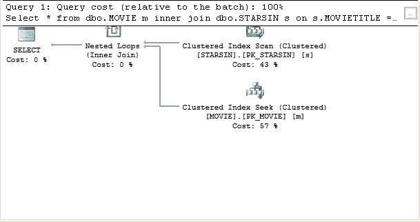
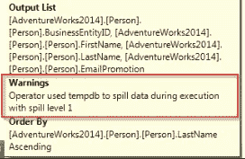

# 优化 SQL Server 中的查询

> 原文：<https://betterprogramming.pub/optimizing-queries-in-your-sql-server-b8f13082fde5>

## 调查执行计划

在 [Unsplash](https://unsplash.com?utm_source=medium&utm_medium=referral) 上由 [Helloquence](https://unsplash.com/@helloquence?utm_source=medium&utm_medium=referral) 拍摄的照片

这篇文章概述了我们在检查执行计划时需要知道的基本知识。

# 介绍

您是否曾经在指出性能瓶颈时不得不优化 SQL 查询？

在这种情况下，SQL Server 为您提供的执行计划就派上了用场，您最好能够正确地解释它，因为它显示了许多关于查询优化器如何执行查询等的重要信息。

一个查询声明性地指定了我们需要检索什么数据，但是步骤是什么取决于查询处理器。因此，查询计划(或者还有*执行计划*)向我们揭示了 SQL Server 是如何决定检索我们所请求的数据的。

一个常见的误解是，SQL Server 选择了最佳计划，而实际上它选择了一个“足够好”的计划，因为可能有许多可能的序列，执行所有这些序列可能会花费太多时间。

在本文中，我们将讨论执行计划中显示的主要操作符，以及在研究它时需要记住的一些要点。

# 什么是执行计划，在哪里可以找到？

一个非常基本的执行计划如下所示

有两种类型的执行计划—估计的和实际的。

第一个是在不执行 T-SQL 查询的情况下生成的，因此不包含运行时信息。您可以通过点击特定查询上的*显示预计执行计划* 工具栏按钮来显示。

实际的执行计划是在执行 T-SQL 查询之后生成的，并且包含运行时信息，例如实际的资源使用度量和运行时警告(如果有)。点击*包含实际执行计划* 工具栏按钮即可显示。

# 经营者

让我们来看看您可能在执行计划中看到的一些操作符:

*   索引扫描—索引扫描意味着 SQL Server 读取表中的所有行，然后返回满足搜索条件的行。当表很小或者大多数行符合谓词条件时，这是一种有效的策略。
*   索引查找—另一方面，索引查找意味着它只接触包含这些合格行的行。因此，在只返回一小部分记录的情况下，这是最有益的。
*   排序——这是你能做的最昂贵的操作之一，所以应该尽可能避免。对列进行索引是减少使用该操作符的需要的方法之一。
*   哈希连接-哈希连接是开销最大的连接操作之一，因为它需要哈希表来执行连接。这是最适合大型未排序输入的连接。它首先读取其中一个输入并对连接列进行哈希运算，然后将结果哈希和列值放入内存中构建的哈希表中。然后，它读取第二个输入中的所有行，对这些行进行哈希处理，并检查结果哈希桶中的行，以查找连接的行。
*   嵌套循环-通过循环一个输入的所有行，并针对每一行循环第二个输入的所有行来查找匹配项。
*   合并连接-通过遍历两个输入、比较行并输出匹配行来工作。两个输入都必须在联接列上排序，这样联接才有可能。

当然，这份清单绝非详尽无遗。

# 我们实际上如何阅读执行计划？

我们从查看右上角的操作符开始解释这个计划，然后沿着箭头的方向向左看。

运算符之间的箭头代表数据的流向。它们也有不同的厚度——它们越厚，运算符之间读取的行数就越多。

在每个经营者的下面，显示了该经营者相对于所有其他经营者的成本百分比。这些相对成本有时可以帮助您确定性能瓶颈在哪里。

示例运算符及其成本百分比。

您还可以通过将鼠标悬停在任何操作员图标或任何箭头上来检查*估计行数*和*实际行数*。

另一件需要注意的事情是有时出现在操作员右下角的警告标志。它们表明操作员中有警告。悬停时我们可以了解更多信息。

最常见的警告之一是操作员向`tempdb`泄漏数据。

通常，原因是估计的行数和实际的行数之间有很大的差异。

当估计值太低时，查询优化器分配的内存会比需要的少，这会导致向`tempdb`写入数据，这显然会更慢。

# 结论

在本文中，我们介绍了 SQL Server 中执行计划的基础知识——如何找到它们、一些操作符以及如何解释它们。当然，这个主题比我们在这里讨论的要深刻得多。

如果有任何不准确或您有任何问题，请不要犹豫评论。

# 资源

1.  [显示实际执行计划](https://docs.microsoft.com/en-us/sql/relational-databases/performance/display-an-actual-execution-plan?view=sql-server-ver15)
2.  [阅读执行计划时要知道的 5 件事](https://bertwagner.com/2019/08/06/5-things-you-need-to-know-when-reading-sql-server-execution-plans/)
3.  [SQLAuthority](https://blog.sqlauthority.com/2007/03/30/sql-server-index-seek-vs-index-scan-table-scan/)