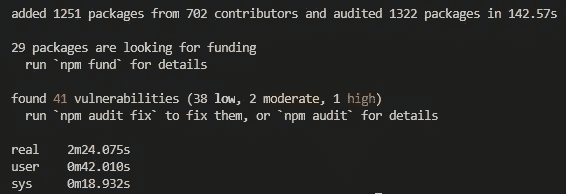
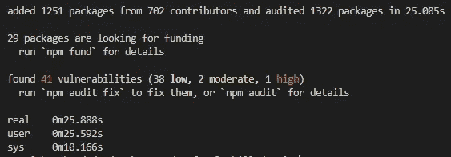

# 在 Windows 上优化 VS 代码开发容器

> 原文：<https://betterprogramming.pub/optimizing-vs-code-dev-containers-on-windows-6d3411ba76b5>

## 使用命名卷提高开发容器环境中的磁盘性能

在 [Unsplash](https://unsplash.com?utm_source=medium&utm_medium=referral) 上 [Toa Heftiba](https://unsplash.com/@heftiba?utm_source=medium&utm_medium=referral) 拍摄的照片。

# 什么是 VS 代码开发容器？

[Visual Studio 代码远程容器](https://code.visualstudio.com/docs/remote/containers)是一个 VS 代码扩展，它解决了软件工程中一个最古老的问题:“但是它能在我的机器上工作。”Dev 容器还允许您缩小开发和生产环境之间的差距，使调试生产问题变得更加容易。

只要您的机器上安装了 Docker 和 VS 代码，您就可以使用 Dockerfile 和`devcontainer.json`文件轻松地配置您的项目。有了 dev 容器扩展，VS 代码就可以在一个隔离的环境中打开您的项目工作区，并在 docker 文件中定义所有的依赖项。这样，任何克隆存储库的人都将能够构建完全相同的开发环境——不管他们使用什么样的主机操作系统。

# Windows 上的性能问题

不幸的是，在 Windows 上运行 dev 容器有一些性能问题。在某些情况下，我甚至不能运行`npm install`来为我的项目安装必要的包依赖项。码头工人会被绞死。对于依赖项较少的项目，安装依赖项仍然比我在 MacBook Pro 上开发或者甚至在同一台 PC 上启动 Linux 时花费了更多的时间。这显然不是硬件问题。

事实证明，在 Windows 上运行 dev 容器时，这似乎是一个众所周知的问题，因为 VS 代码文档提供了关于[提高容器磁盘性能的提示](https://code.visualstudio.com/docs/remote/containers-advanced#_improving-container-disk-performance)。它特别提到了`node_module` ，并指出使用命名卷来解决这个问题。

以下是他们建议您包含在`devcontainer.json`文件中的内容:

这确实解决了问题。以下是我在设置命名卷之前和之后的一个较小项目:

使用默认绑定装载

使用命名卷

如您所见，它极大地提高了性能。我不完全确定潜在的问题是什么，但这可能是由于 Docker 桌面在 Windows 上运行的方式。

# WSL2 还没有解决这个问题

在 Windows 上，Docker 桌面迄今为止一直依赖于本质上是模拟器的东西——在虚拟机内部运行 Docker。随着用于 Linux 2 的 [Windows 子系统的引入，Linux 更加深入地集成到了 Windows 生态系统中，因此文件系统性能以及其他性能增强都得到了极大的提高。](https://docs.docker.com/docker-for-windows/wsl/)

不幸的是，文件系统性能的提高似乎只适用于存储在 Linux 文件系统本身中的文件，因为 Windows 文件系统仍然作为远程文件系统挂载在 WSL2 中。我非常依赖文件监视器进行实时重载，但不幸的是，WSL2 下的 Docker 对此没有适当的支持。

至少现在，我已经禁用了 Docker 桌面中的 WSL2，直到这个问题得到解决。

# 将命名宗卷用于多个项目

事实证明，命名卷是全局的，可以在容器之间共享。在某些情况下，这可能是有用的，但我想保持我的环境相互隔离。

我遇到了一个名为`localWorkspaceFolderBasename`的环境变量，它基本上允许我根据本地工作区文件夹(即项目名称)来定义卷的名称:

关于命名卷需要注意的一些事情是，它们不会受到容器重建的影响，但是由于它们的装载方式，您也不能删除文件夹。

例如，如果你使用`rm -rf node_modules`，你应该用`rm -rf node_modules/*`来代替。这将删除文件夹中的所有文件，而不会删除文件夹本身。

同样值得注意的是，如果您的项目编译任何构建输出，您也可以通过为这些输出配置命名卷来提高构建速度。

# 结论

Dev 容器非常强大，我强烈推荐使用它们。然而，当我从在 MacBook Pro 上开发转向在 Windows PC 上开发时，我当然没有想到会遇到严重的性能问题。在我找到命名卷的解决方法之前，我几乎求助于在单独的 SSD 上安装 Linux 来解决这个问题。

如果您正在 Windows 上使用 dev 容器，我希望您会发现这个建议很有用。如果您还不知道这个技巧，我很想知道它对您的工作空间性能提高了多少。