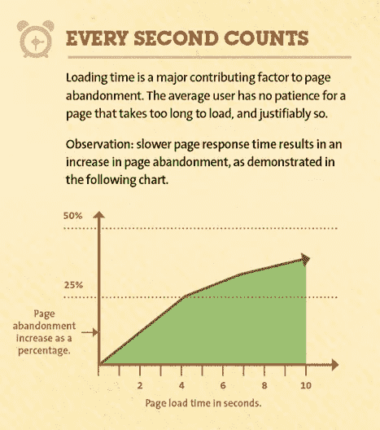
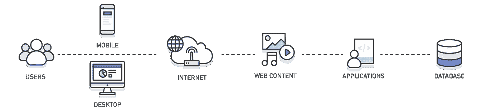
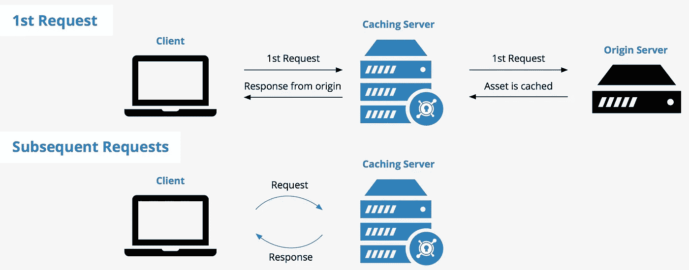
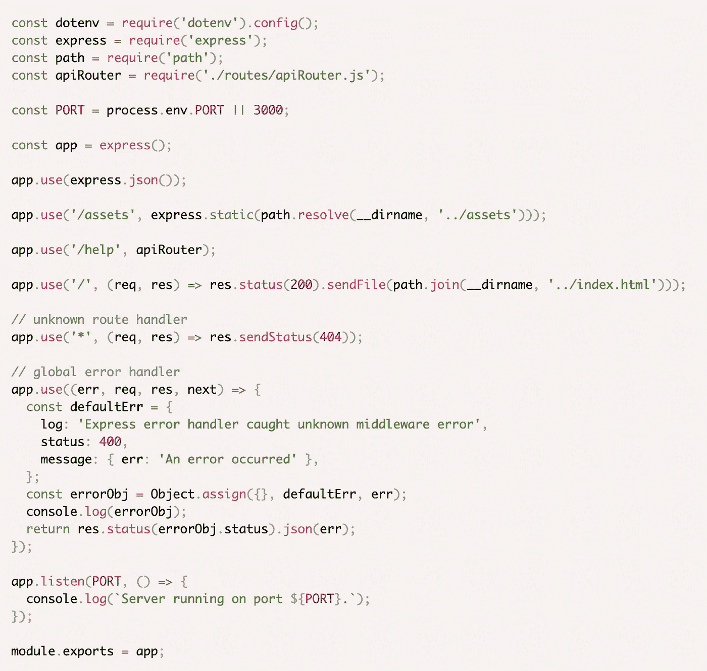
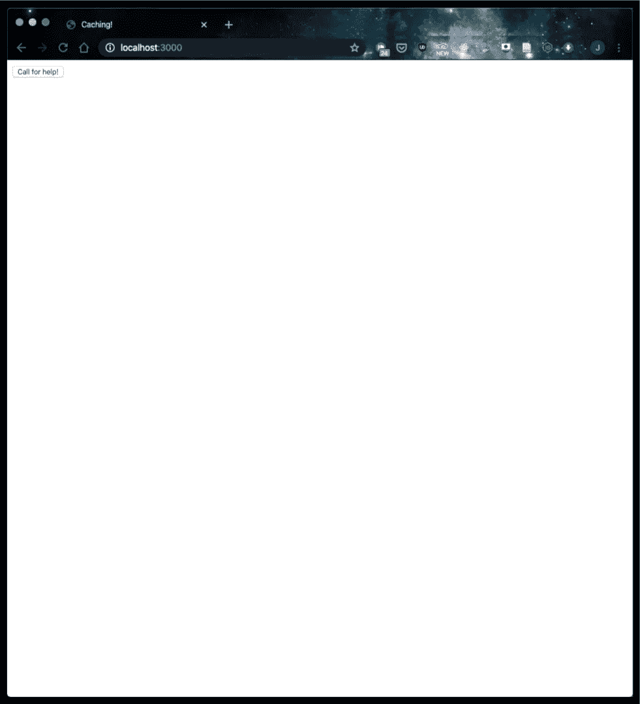
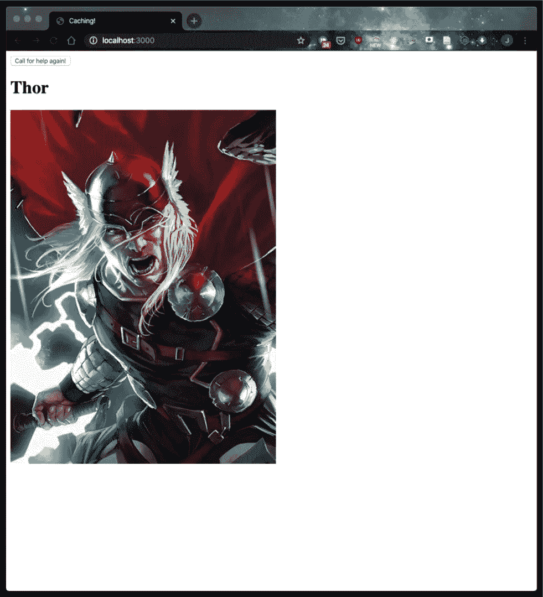
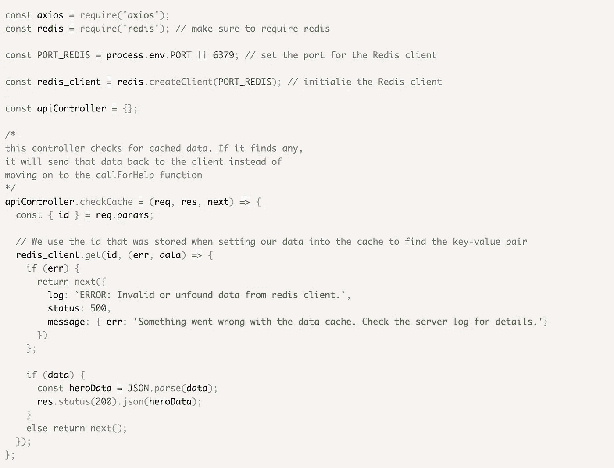
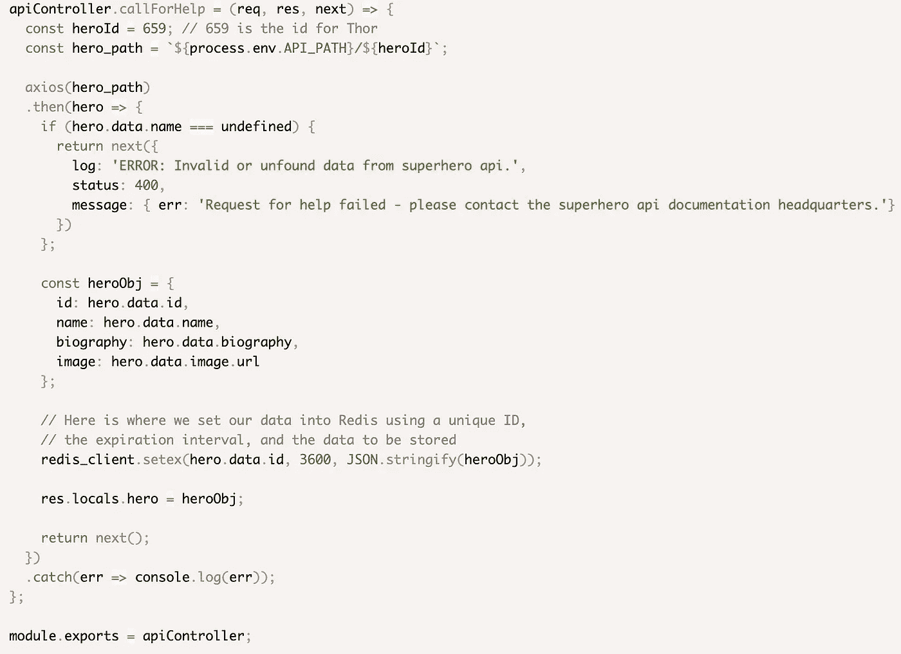
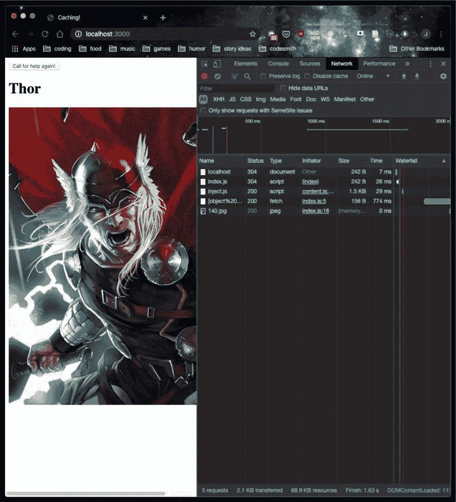

# 使用 Redis 缓存优化您的应用程序

> 原文：<https://betterprogramming.pub/optimizing-your-application-with-redis-caching-5df5fb9acbd4>

## 你最重要的特征之一是速度

利亚姆·布里斯在 [Unsplash](https://unsplash.com/s/photos/ram?utm_source=unsplash&utm_medium=referral&utm_content=creditCopyText) 上拍摄的照片

软件工程师的角色不仅仅是构建和创造新事物。如果你把你的应用程序看作是建造和拥有一栋房子，你可以想象它需要持续的关注和维护。现在想象一下，在所有这些工作之后，有人花了三秒多的时间通过任何一个门口。对于任何 web 应用程序来说，挫折都是相互的。

许多[研究](https://dl.acm.org/doi/10.1145/1835449.1835513)显示，如果页面加载时间超过三秒，人们就会离开。在这个手机广泛使用和注意力持续时间缩短的时代，这一点变得尤其真实。许多应用程序不仅仅是静态页面，所有这些移动的部分意味着要加载更多的东西。正因为如此，对于任何软件工程师来说，在创建和维护一个成功的网站时，优化加载时间变得越来越重要。

分秒必争！！

但是从哪里开始呢？有这么多的策略。每种策略的功效因应用而异。模块捆绑、精简代码、压缩图像、使用内容交付网络——所有这些都是有效的技术，但每种技术的用途都略有不同。

在本文中，我们将讨论一个特定的解决方案:缓存。缓存是指最近使用或传输的数据以一种允许将来更快访问的方式临时存储。缓存节省了应用程序成本，并为用户创造了更好的体验。

在本文的最后，我将展示如何使用 [Redis](https://redis.io/) 实现自己的缓存。

# **为什么要缓存？缓存是如何工作的？**

缓存的实际创建和实现非常简单。在设置缓存时，开发人员被赋予了极大的灵活性。他们不仅可以选择存储什么(图像、html 页面、用户数据、脚本文件等。)，他们还可以决定存储过程背后的物流。

记住，缓存的数据是*暂时*存储的数据。因此，您可以决定缓存数据何时更新，以及数据何时过期。它必须过期，否则你就有可能向用户展示过时的数据。缓存为开发人员提供了更多的选择和更多的控制，因此您可以决定如何使您的应用程序更好！

那么什么是缓存呢？*如果不在标准数据库中，我们将这些数据存储在哪里？*我们如何储存它？而*当*在沟通过程中我们这样做了吗？缓存非常灵活，因为您可以选择在何处、何时以及如何存储数据。虽然最初创建缓存可能很容易，但这种灵活性的提高可能会导致更复杂的设计挑战。通过更好地了解在何处、何时以及如何设置缓存，您可以最大限度地减少这些挑战，并创建更成功的缓存来优化您的应用程序。**

定义和分类缓存的一种总括方法是通过客户端和服务器端缓存。这两个概念指的是应用程序存储缓存数据的“位置”和“时间”。

下图显示了用户与应用程序的通信过程。

*图片由亚马逊“缓存概述”页面提供:*[*https://aws.amazon.com/caching/*](https://aws.amazon.com/caching/)

缓存可以存在于这个周期的不同阶段。在左侧，或者说客户端，有一个浏览器缓存。在右边，或者说服务器端，我们有一个服务器缓存，它位于应用程序的服务器上。两者都有助于更快的数据访问，因为第一个请求之后的所有请求都可以访问适当的缓存。我们不再需要对服务器(当使用浏览器端缓存时)或数据库(当使用服务器端缓存时)进行完整的往返。

*服务器端缓存*

# **缓存优势**

*   缓存减少了传输的数据量，从而减少了带宽消耗、网络负载和流量，并降低了网络延迟和成本。
*   通过最小化服务器的整体负担，缓存可以提高应用程序的整体响应能力。
*   缓存最大限度地减少了所需的数据库访问次数，使您的应用程序不必执行许多昂贵的数据库操作。
*   即使脱机，内容也是可用的。由于可以在客户端访问缓存的数据，而不必与 web 服务器通信，因此即使在网络或服务器崩溃的情况下，用户也可以脱机访问这些数据。

# **缓存缺点**

*   如果在指定的过期时间间隔结束之前修改缓存，可能会导致数据失效、数据丢失或数据不一致。
*   由于只有一个缓存，你的应用程序很容易出现[瓶颈](https://www.apicasystems.com/blog/5-common-performance-bottlenecks/)。
*   准确测量应用程序的流量指标和统计数据会变得很困难，因为服务器不再代理每个请求的信息。

# **一个 Redis 操作指南**

本演练假设您有使用 JavaScript 创建自己的网站的经验。

为了讨论缓存的数据是如何存储的，让我们来讨论一个流行的缓存系统，Redis(远程字典服务器)。Redis 是一个开源的 NoSQL 数据库，它将数据作为键值对存储在内存中。具体来说，这些数据存储在 RAM(随机存取存储器)中，而不是写入硬盘。RAM 的访问速度比硬盘快几百倍，这也是高速缓存数据检索速度如此之快的部分原因。然而，RAM 比硬盘空间昂贵得多，而且本身也不稳定，这意味着任何断电都可能导致数据丢失。虽然这对于持久性数据存储来说可能不太好，但对于缓存之类的东西来说却非常合适。

# **为什么是 Redis？**

*   Redis 支持多种数据类型和数据结构(字符串、集合、散列等)。)
*   它简单、灵活、易于扩展。
*   它可以用于许多目的，而不仅仅是缓存！(那些这里就不赘述了。)
*   它是开源的！工程师们一直在努力使 Redis 变得更好。

让我们开始吧。我将展示一个我制作的简单应用程序，演示如何用 Redis 设置服务器端缓存。它通过查询`[SuperHero](https://superheroapi.com/)` [API](https://superheroapi.com/) 来寻求帮助。我们将看看在不使用缓存的情况下呼叫帮助需要多长时间，然后使用缓存。此应用程序的回购可在[此处](https://github.com/json-yu/redis-tutorial)找到。在跟随过程中，请随意使用它。

首先，您总是希望确保您的设备上安装了 Redis。根据您使用的设备，请遵循以下说明: [Redis 快速入门指南。](https://redis.io/topics/quickstart)然后，确保使用`npm install redis`在您的应用程序中安装 Redis 包。

这是我的服务器文件——非常标准的东西。

这是我的前端的样子。你可以在没有前端的情况下建立一个缓存，使用类似于 [Postman](https://www.postman.com/) 的东西，但是为了这个演示的目的，我决定做一些非常详细和复杂的东西。

这么详细。

我们从一个按钮开始，该按钮向我们在服务器文件中设置的`/help`端点发起一个获取请求。这调用了我们的`callForHelp`中间件函数。

让我们看看当我们点击这个按钮时会发生什么。

嘣。砰。啪。托尔来救援了。

在我们将 Redis 并入我们的代码之前，让我们通过查看 Chrome DevTools 的 network 选项卡来看看这个初始请求花费了多长时间。

说我们想再打电话给托尔。这次应该会更快，因为 Thor 已经知道我们在哪里(或者因为我们这次将使用缓存)。让我们看一下控制器文件，看看我们是如何做到这一点的。

我们的中间件来检查缓存。

我们的`callForHelp`中间件功能，现在有了`redis`。

注意到`callForHelp`函数中以`redis_client.setex`开始的那一行了吗？SETEX 代表“设置”和“过期”。这个命令有三个参数:一个键、一个时间和将保存到那个键的值。记住，Redis 是一个 NoSQL 数据库，它将数据存储为*键-值对。*您随后提供的时间是数据在到期前应该保留的时间。在我们将数据存储在缓存中之后，我们可以使用同一个键来检索数据，使用内置的 Redis `.get`方法，如`checkCache`函数所示。

现在我们有了 Redis incorporated，让我们看看再给 Thor 打电话需要多长时间。

差别真大！这看起来似乎不是很多时间，但是当您处理大量数据(可能是图像和 HTML 文件)时，它真的会增加。

# **结论**

Redis 只是众多选择之一。像决定使用什么技术或框架一样，找到您的应用程序需要的解决方案。对更新和修改缓存的结构和实现持开放态度，以便随着时间的推移更好地适应。例如，随着微服务架构和云计算的兴起，亚马逊的`[ElastiCache](https://aws.amazon.com/elasticache/)`成为了在云中开始缓存的选项！它甚至让您选择使用 Redis 或其他流行的缓存系统， [Memcached。](https://memcached.org/)现在就让自己踏上缓存之路，开始优化您的应用吧！