# 可选链接、空合并以及它们将如何改变您编写代码的方式

> 原文：<https://betterprogramming.pub/optional-chaining-and-null-coalescing-a93cb3dc7bb9>

## 一种更安全、更符合人机工程学的方式来编写代码以访问对象属性

西蒙·艾布拉姆斯在 [Unsplash](https://unsplash.com/s/photos/coding-at-work?utm_source=unsplash&utm_medium=referral&utm_content=creditCopyText) 上拍摄的照片

如果您最近一直在关注 TypeScript 版本，那么您已经知道可选链接和 Nullish 合并是在 [TypeScript 3.7](https://www.typescriptlang.org/docs/handbook/release-notes/typescript-3-7.html) 中引入的。它们都是 JavaScript 即将推出的特性的一部分，截至本文发布时，它们分别处于[阶段 4](https://github.com/TC39/proposal-optional-chaining) 和[阶段 3](https://github.com/tc39/proposal-nullish-coalescing) 。

更新:从 [Babel 7.8.0](https://babeljs.io/blog/2020/01/11/7.8.0) 开始，这些特性也是默认包含的。

# 可选链接

我们经常发现自己深入一个对象来获取一个属性的值。如果你用 JavaScript 写了超过 100 行的代码，你就会知道，如果做得不对，这可能是一个常见错误的根源:`Uncaught TypeError`。

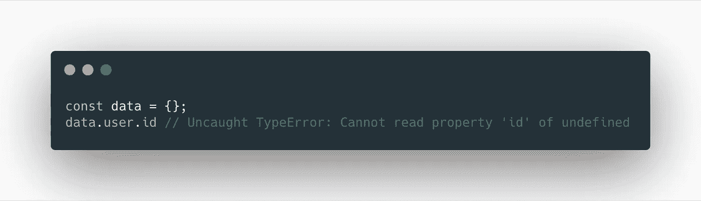

一个常见的问题是在 JavaScript 中访问值会遇到可怕的 undefined 的无法读取属性

我们将在其余示例中使用这个模拟响应:

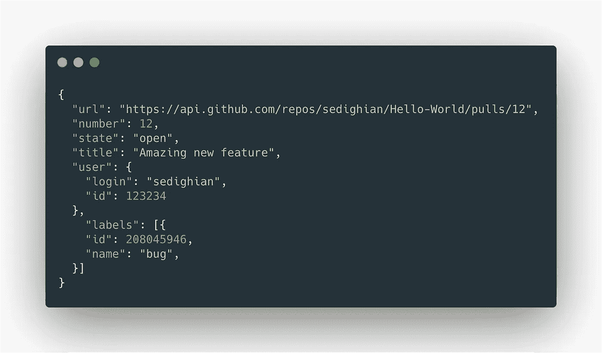

为了避免常见的`Uncaught TypeError`并从上面的响应中获得`id`的值，我们需要在 JavaScript 中做一些舞蹈。我们今天的方法是通过检查物体在每个深度的真实性，我们的工作方式是`id`。这种模式看起来更像是一个条件语句，它应该产生一个布尔值，而不是一个属性访问器语句，但这是我们今天拥有的最干净、最安全的本机方式。

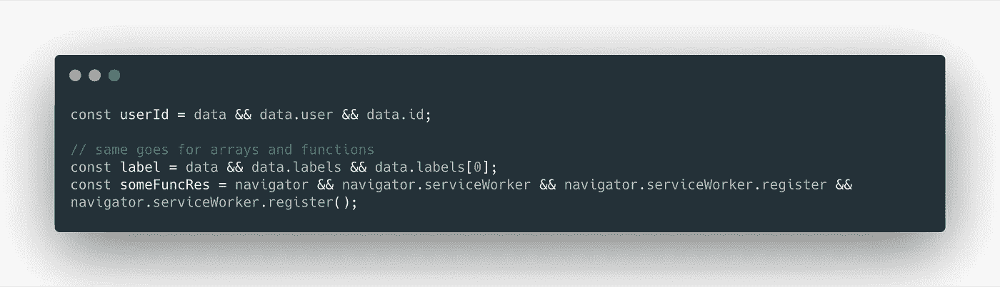

或者，如果您喜欢对象析构:

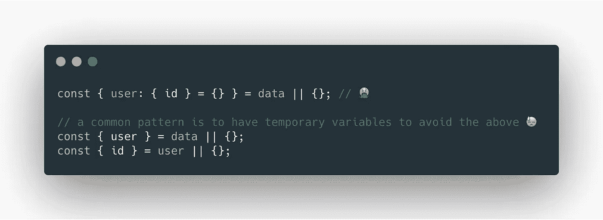

基本上，这里发生的是`&&` `Logical-and-operator`左侧的代码块与`Boolean(data)`类似地被求值，如果值为`true`它就移动到右边求值。

如果你使用 Lodash 或 Ember，会有更多符合人体工程学的方法。

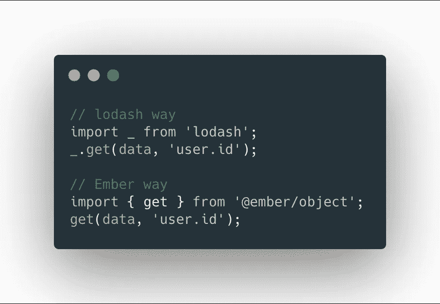

那么，我们如何使用新的`Optional Chaining`做同样的事情呢？

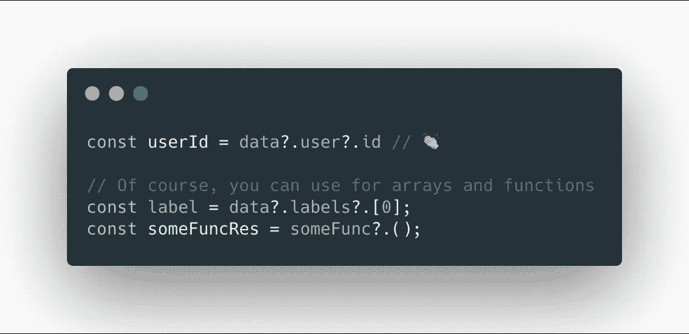

# 零合并

当我们访问的属性值为`null`或`undefined`时，通常会有一个默认值。目前，实现这一点的常用方法是使用`||` `Logical-or-operator`

如果我们需要 Github 用户名，即`login`属性，并且将默认设置为当前用户的用户名，在本例中为`sedighian`，我们的做法如下:

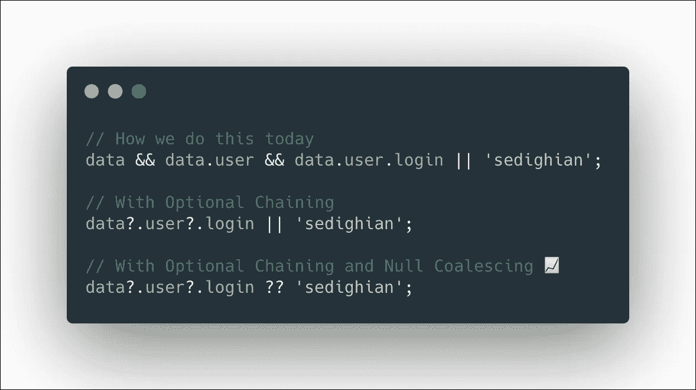

第二个和第三个例子看起来很相似。那么，`Null Coalescing`为什么有用呢？简而言之，只有当左边的结果为`undefined`或`null`时，`Null Coalescing`才会计算`??`操作符右边的结果——这为我们在处理数据中有效但虚假的值时提供了一些保护，以防出现意外的结果。

例如，在许多情况下，我们希望将一个空字符串`''`、`false`和`0`返回一个值，而不是产生一个假值，并因此移动到`||`逻辑“或”操作符的右侧进行求值。现在，我们可以使用`Null Coalescing`，我们将不再有这些问题，如下例所示:

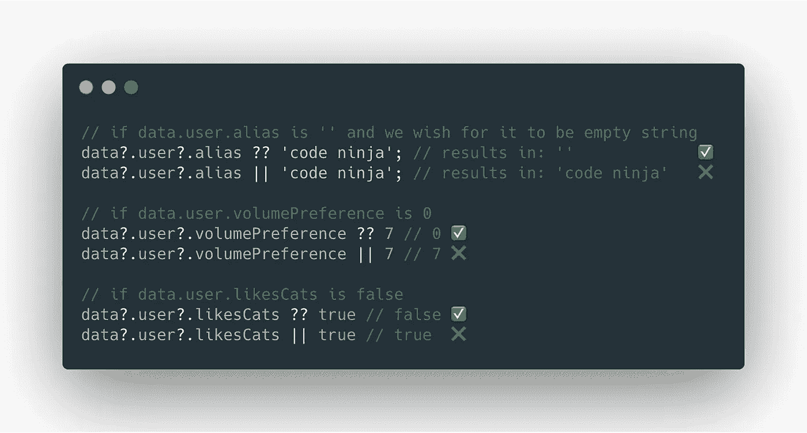

当访问一个对象时，为了得到后备或缺省值，有第三方库形式的替代方法，在 Ember 的例子中，有一个内置的实用程序。

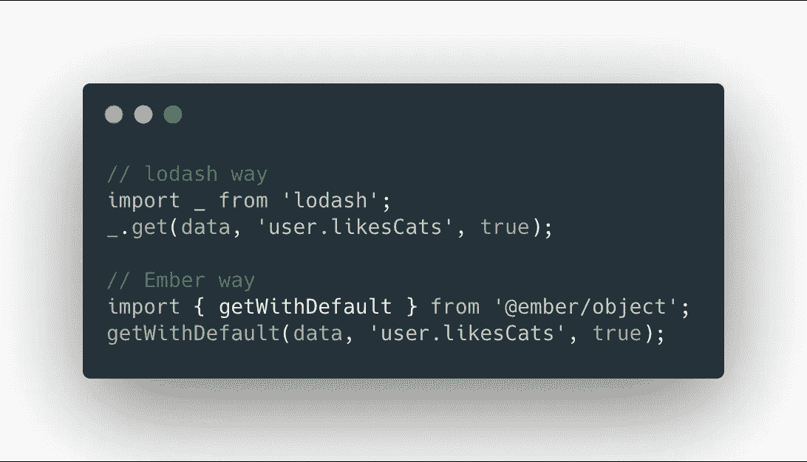

不要忘记`Null Coalescing`不仅仅是提供一个默认值给变量。这是执行给定了`null`或`undefined`值的代码块的另一种方法。例如:

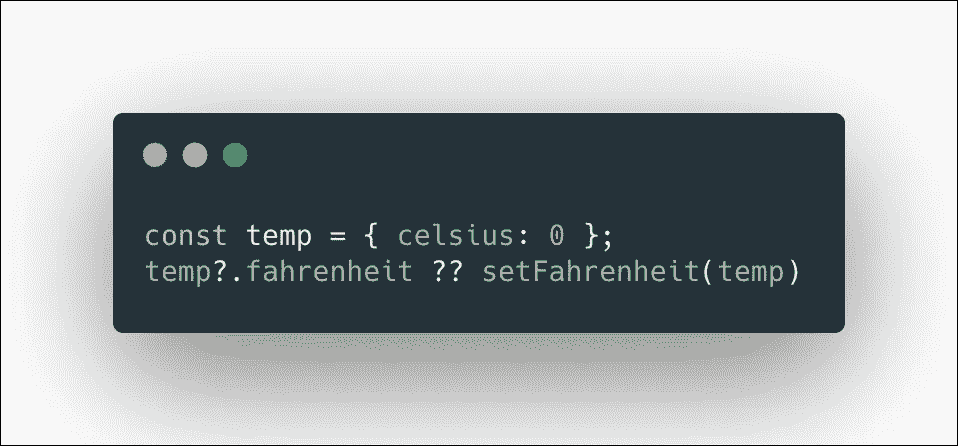

# 需要注意什么…

在可选链接中使用`?`时，顺序很重要:

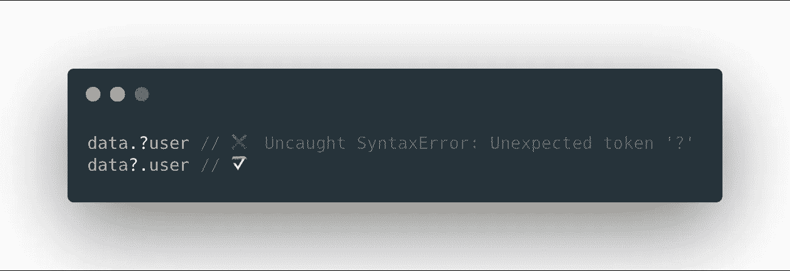

可选链接不能防止您错误地调用非函数:

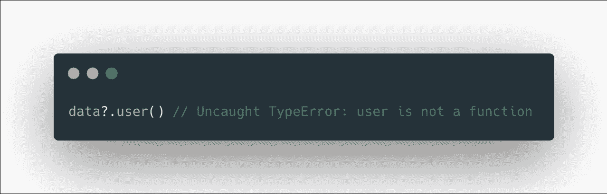

零合并不是苹果对苹果对`lodash.get`或`EmberObject.getWithDefault`。主要区别在于`Null Coalescing`如何对待`null`和这两个工具。

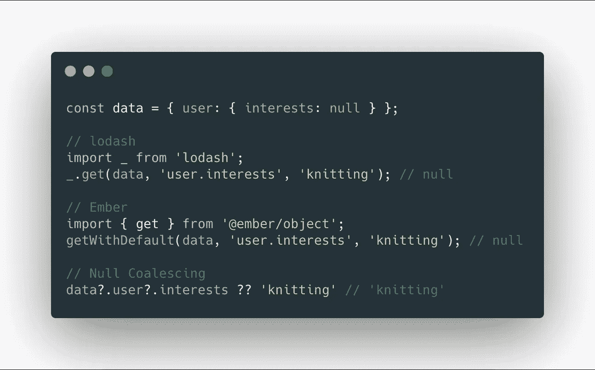

# 资源

[TypeScript 3.7 发行说明](https://www.typescriptlang.org/docs/handbook/release-notes/typescript-3-7.html)

[巴别塔 7.8.0 发行说明](https://babeljs.io/blog/2020/01/11/7.8.0)

【JavaScript 提议的可选链接

【JavaScript 提案的无效合并

[lodash.get](https://lodash.com/docs/4.17.15#get)

[EmberObject.get](http://api.emberjs.com/ember/3.15/functions/@ember%2Fobject/get)

[ember object . getwithdefault](http://api.emberjs.com/ember/3.15/functions/@ember%2Fobject/getWithDefault)