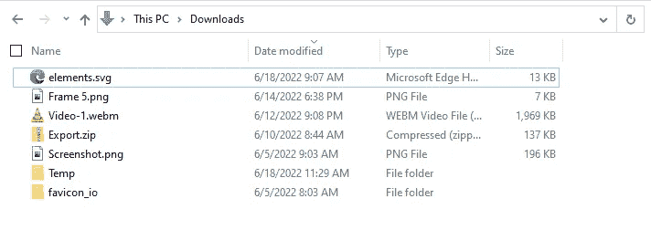
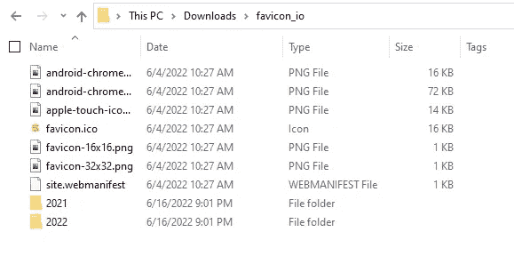

# 如何使用 Python 组织文件和文件夹

> 原文：<https://betterprogramming.pub/organize-files-and-folders-using-python-660246ef9310>

## 3 件主要的事情将帮助我们决定如何组织我们的文件


照片由[JF·马丁](https://unsplash.com/@numericcitizen?utm_source=medium&utm_medium=referral)在 [Unsplash](https://unsplash.com?utm_source=medium&utm_medium=referral) 上拍摄

3 件主要的事情将帮助我们决定如何组织我们的文件。

1.  我们希望如何管理文件？
2.  我们想要组织什么样的文件？
3.  我们要组织哪个目录？

## **我们希望如何组织文件？**

我们可以根据名称、创建日期、修改日期和大小等各种因素来组织文件。我们还可以根据文件的类型/扩展名来管理文件。这就是下一个问题出现的地方。

## 我们想要整理什么样的文件？

我们可以在下载文件夹中找到许多类型的文件。可以有音乐、视频、图像、压缩文件、可执行文件、文档等等。回答完前两个问题后，我们必须决定要组织哪个目录。

如果您也在组织子目录，这个问题很重要。例如，可以有一个包含多种文件的编码项目。根据文件类型来组织这个目录不是一个好主意，因为它会搞乱我们的整个项目。

因此对于本教程，我们将主要关注根目录。

# 如何获得 Python 中所有文件的列表

要组织任何目录，首先，我们需要一个文件列表。要获得给定目录中所有文件的列表，我们可以使用来自`os`模块的`listdir()`方法。

语法:`os.listdir(path)`

```
import ostotal_list = os.listdir("Downloads")
print(total_list)""" OUTPUT:['elements.svg', 'Export.zip', 'favicon_io', 'Frame 5.png',
'Screenshot.png', 'Temp', 'Video-1.webm']"""
```

这里，我们得到一个包含文件和目录的列表。



下载文件夹的屏幕截图

如果我们想使用这个，那么我们必须自己使用`os.path`来分离文件和目录。为了确定给定的路径是文件还是目录，我们可以使用下面的代码片段:

```
from os import listdir, pathtotal_list = listdir(".")file_list = []
dir_list = []for file in total_list:
    if path.isfile(file):
        file_list.append(file)
    else:
        dir_list.append(file)print(file_list)
print("-"*15)
print(dir_list)""" OUTPUT:
['elements.svg', 'Export.zip', 'Frame 5.png', 'Screenshot.png', 'Video-1.webm']
---------------
['favicon_io', 'Temp']
"""
```

当我运行这段代码时，我在下载目录中。因此，如果我想要当前目录中的列表，我可以使用`os.listdir("./")`或`os.listdir(".")`或`os.listdir()`。

你可能会说，光是获得一个文件名列表就要做很多工作。所以，让我给你介绍一个简单的方法。我也不知道这个方法。我在为这个教程做研究的时候发现的。我们可以使用`os.walk()`方法来检索所有文件。你可以在这里查看我从哪里了解到这个的博客帖子[。](https://pynative.com/python-list-files-in-a-directory/)

语法:`os.walk(path)`

```
from os import walkfiles = []
for (dirpath, dirnames, filenames) in walk("./"):
    files.extend(filenames)
    breakprint(filenames)""" OUTPUT:
['elements.svg', 'Export.zip', 'Frame 5.png',
'Screenshot.png', 'temp.py', 'Video-1.webm']
"""
```

首先，我来解释一下为什么在这里使用`break`关键字。方法不仅列出了给定位置的目录和文件。但是，它也会尝试扫描所有子目录。让我展示给你看。

```
from os import walkfiles = []
for (index, data) in enumerate(walk("./")):
    if index == 2:
        break
    print(index)
    print(data)
    print("-"*15)""" OUTPUT:0
('./', ['favicon_io', 'Temp'], ['elements.svg', 'Export.zip', 'Frame 5.png', 'Screenshot.png', 'temp.py', 'Video-1.webm'])
---------------
1
('./favicon_io', ['2021', '2022'], ['android-chrome-192x192.png', 'android-chrome-512x512.png', 'apple-touch-icon.png', 'favicon-16x16.png', 'favicon-32x32.png', 'favicon.ico', 'site.webmanifest'])
---------------"""
```

如您所见，第一次迭代**产生了**当前路径和两个列表**。**第一个列表包含所有目录，第二个列表包含所有文件名。现在，在第二次迭代中，`walk()`方法开始扫描子目录，在我们的例子中是“favicon_io”和“Temp”。我们目前只关注“下载”目录。因此，我使用 break 关键字，这样在一次迭代之后，它就停止扫描子目录。



favicon 子目录的截图

一旦我们得到了所有文件的列表，我们需要根据文件类型将它们分开。为此，我们将使用每个文件的扩展名。

# 如何使用 Python 获得文件扩展名

要获得文件扩展名，我们可以使用`os`中的`path`模块。`path`模块有一个`splitext()`方法，该方法将返回一个包含文件名及其扩展名的元组。

语法:`os.path.splitext(path)`

```
from os import pathfile_tuple = path.splitext('Screenshot.jpg')
print(file_tuple)
print(file_tuple[1])""" OUTPUT:
('Screenshot', '.jpg')
.jpg
"""
```

现在，我们有了所有的文件，并且知道如何获得扩展名。因此，下一步是根据文件类型移动文件。

# 如何使用 Python 移动文件

我们可以用`os`模块移动文件，但这次我们将使用`shutil`，我认为它比操作系统更适合这个任务。我们将使用来自 **shutil** 模块的`move()` 方法。

语法:`shutil.move(src, dst, copy_function=copy2)`

**注意:**第三个参数可选。

```
import shutilshutil.move("Screenshot.png", "Temp/")
shutil.move("elements.svg", "Temp")
shutil.move("Frame 5.png", "Temp/Frame 5.png")
```

我们可以使用`shutil.move()`以三种方式移动**文件**

最后一步。我们需要创建一个新的文件夹，如果它不存在，以移动相同类型的所有文件。

# 使用 Python 创建一个文件夹/目录

我们可以使用`os.mkdir()`方法创建一个文件夹。

语法:`os.mkdir(path, mode=0o777, *, dir_fd=None)`

**注:****模式**和 **dir_fd** 参数可选。

```
from os import mkdir, pathif not path.exists("Temp"):
    mkdir("Temp")
```

`path.exists()`方法检查给定位置是否存在。我们需要验证目录是否存在，因为如果目录已经存在，`mkdir()`将抛出一个错误。我们希望只创建一个不存在的目录。

现在，我们已经走完了所有的步骤。是时候把它们放在一起了。

# 使用 Python 基于文件类型组织文件

概括来说，我们需要采取以下步骤:

1.  获取文件列表
2.  提取每个文件的扩展名
3.  如果文件夹不存在，请创建一个
4.  将文件移动到各自的文件夹中

```
from os import mkdir, path, walk
from pathlib import Path as pathlib
from shutil import moveIMAGE_EXT = [".jpg", ".png", ".jpeg", ".gif", ".webp", ".eps"]
DOWNLOAD_LOCATION = str(pathlib.home() / "Downloads")file_list = []
for (dirpath, dirnames, filenames) in walk(DOWNLOAD_LOCATION):
    file_list.extend(filenames)
    breakdef check_directory(dir_location):
    """Check if directory exists or not. If not create one."""
    if not path.exists(dir_location):
        mkdir(dir_location)def file_mover(extention_list, new_location):
    """move file based on extension list to new location."""
    for file in file_list:
        if (path.splitext(file)[1]).lower() in extention_list:
            move(file, new_location)def organize_images():
    """Organize images based IMAGE_EXT list"""
    image_location = path.join(DOWNLOAD_LOCATION, "Organized Images")
    check_directory(image_location)
    file_mover(IMAGE_EXT, image_location)organize_images()
```

在这里，大部分代码来自更早或者非常常见。你可能看到的一个区别是我使用了 ***pathlib*** *模块。为了制作一个可以在 Linux、Windows 和 macOS 上运行的通用代码，我使用了* **pathlib** *模块。它可以给我每个操作系统的默认主目录的直接路径。我在 Ubuntu、Windows 和 macOS 上测试过。*

我已经尽可能保持简单。在这个例子中，我展示了如何组织图像文件。但是对于各种文件都可以这样做。这将很难阅读和理解，这就是为什么我在我的 [GitHub](https://github.com/SahilFruitwala/auto-file-organizer) 上推出了可以用于任何类型文件的代码。

[](https://github.com/SahilFruitwala/auto-file-organizer) [## GitHub-sahilfrutwala/自动文件管理器

### 此时您不能执行该操作。您已使用另一个标签页或窗口登录。您已在另一个选项卡中注销，或者…

github.com](https://github.com/SahilFruitwala/auto-file-organizer) 

# 结论

在 Python 中操作和使用文件和目录并不难。如果你知道你想做什么，你在寻找什么，你可以通过谷歌搜索找到几乎所有你需要的东西。我就是这样遇到了 **walk()** 法。

如果你想了解更多关于 Python 的知识，可以看看我正在进行的 [Python 系列](https://sahilfruitwala.com/series/python-101)。

就这样。感谢您的阅读。直到下一次👋

## 参考

1.  [https://pynative.com/python-list-files-in-a-directory/](https://pynative.com/python-list-files-in-a-directory/)
2.  [https://www . geeks forgeeks . org/how-to-move-files-and-directory-in-python](https://www.geeksforgeeks.org/how-to-move-files-and-directories-in-python)

[](https://levelup.gitconnected.com/file-handling-in-python-6ffc23cc92c) [## Python 中的文件处理

### 所以，只是为了刷新我们的记忆，到目前为止，我们已经看到了 python 的所有基础知识，包括变量、数据类型、函数…

levelup.gitconnected.com](https://levelup.gitconnected.com/file-handling-in-python-6ffc23cc92c) 

```
**Want to Connect?**I know it is a lot, but, I hope, you were able to absorb some knowledge. Let me know if you need any help or want to discuss something. Reach out to me on [Twitter](https://twitter.com/Sahil_Fruitwala) or [LinkedIn](https://www.linkedin.com/in/sahilfruitwala/). Make sure to share any thoughts, questions, or concerns. I would love to see them.
```