# 为初学者组织您的 Swift 全球常数

> 原文：<https://betterprogramming.pub/organizing-your-swift-global-constants-for-beginners-251579485046>

## 让我们清理代码


这篇文章旨在帮助初学者更好地组织应用程序的重要数据和资源，如颜色、字体、图像、字符串、URL 等。

有几种不同的方法来组织这些项目。我认为两者各有千秋。我在这里展示的这个解决方案是使用 [Swift](https://docs.swift.org/swift-book/LanguageGuide/ClassesAndStructures.html) `[struct](https://docs.swift.org/swift-book/LanguageGuide/ClassesAndStructures.html)` [s](https://docs.swift.org/swift-book/LanguageGuide/ClassesAndStructures.html) 完全组织起来的。

你可以在文档中阅读更多关于结构[的功能和使用，但是为了保持本教程的重点，让我们继续。](https://docs.swift.org/swift-book/LanguageGuide/ClassesAndStructures.html)

# 入门指南

在我们开始创建我们的文件之前，让我们回顾一下为什么这很重要。我们不希望在十个不同的地方使用相同的字符串、颜色或图像，我们希望有一个定义，然后在十个不同的地方引用它。

如果你有一个字符串值`Title`，或者一个注释图标图像被用在你的应用程序的不同区域，并且需要做出改变，你必须找到所有不同的定义并且单独地改变它们。

但是如果我们有一个被引用的`Constant`定义，我们所要做的就是改变`Constant`，所有的引用都会被更新。简单，对。

# 要引用的数据

让我们回顾一下我们可能想要为其创建`Constants`的数据类型。

## 颜色；色彩；色调

```
static let blue = UIColor.rgba(red: 0, green: 255, blue: 255, alpha: 1)// this definition utilizes a great little RGBA Extensions, is provided below
```

## 形象

```
static let icoStar = UIImage(named: "ico_imageName")
static let icoComment = UIImage(named: "ico_imageName")
```

## 字体

```
static let Body = UIFont.systemFont(ofSize: 16, weight: .regular)
static let headingOne = UIFont.systemFont(ofSize: 22, weight: .semibold)
```

## 内容字符串

```
static let email = "Email Address"
static let typeMessage = "Type a message…"// if you want to Localize your Strings, i'd suggest just reading up on that if you need it. we won't be covering it here
```

## 应用程序接口

```
static let twitterApiUrl = URL(string: “https://api.twitter.com/")
static let DB_REF = Firestore.firestore()
static let USERS_DB_REF = DB_REF.collection(USERS_REF)
```

所以，这应该给你一个很好的图片，每个常数是如何定义的。接下来，我们将进入结构和如何组织所有的数据。

# 创建我们的应用程序常量文件

首先创建一个新文件， *File > New > File，*选择 *Swift File。*

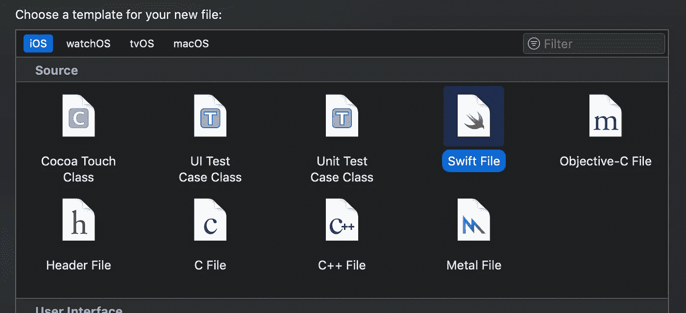

把这个文件命名为`AppConstants.swift` 放到一个文件夹里，名字类似于`Utils`。

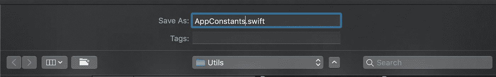

确保导入`UIKit`。

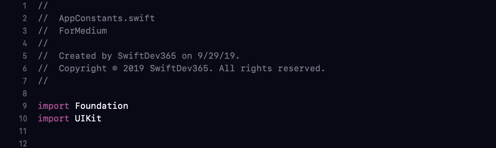

创建包含每个`struct`类型的父/根`struct`。你可以叫它任何适合你的名字`App`、`Main`、`Constants`，无论什么。姑且称我们的`Constants`。

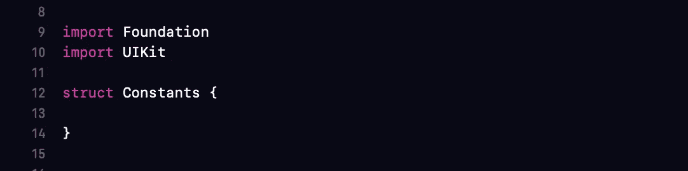

现在，让我们添加三个结构，称为`Design`、`Content`和`API`。

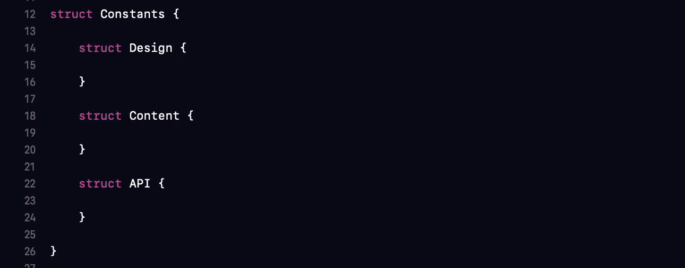

在`Design`中，我们希望将`Design` `constants`组织成三个不同的结构，`Color`、`Image`和`Font`。

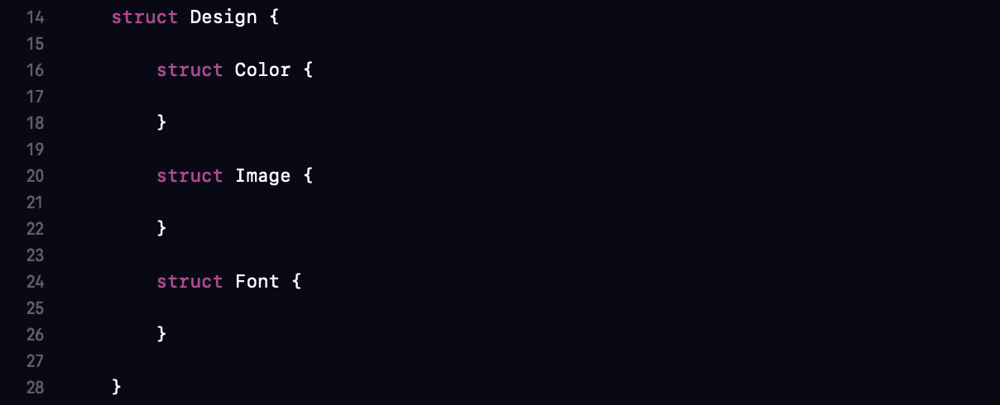

现在添加三个到颜色结构中，`Primary`、`Secondary`和`Grayscale`。

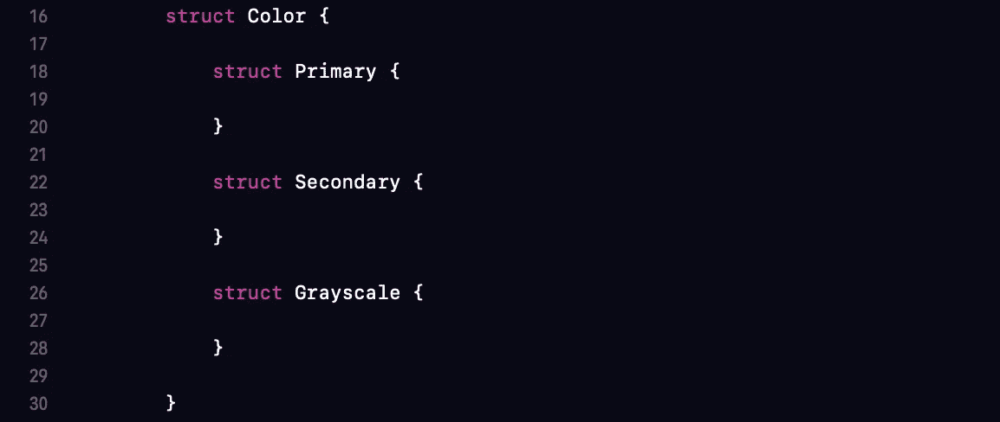

你可以一直使用`Color`，但就我个人而言，我会尽可能的有条理，这样当你使用`Constant`时，你会对`Constant`有一个真正清晰的理解和上下文。

这对那些不熟悉你的代码的人来说是非常好的，它很快给他们提供了背景。

一个例子是:

```
button.backgroundColor = Constants.Design.Color.Primary.Blue
button.font = Constants.Design.Font.HeadingOne
```

这种组织和命名方式让我们的`Constants`给出有用的信息。好了，这是`Design`相关的，是一个`Color`，一个`Primary` `Color`。

# 添加常量值的时间到了

添加`Design` `Constants`:

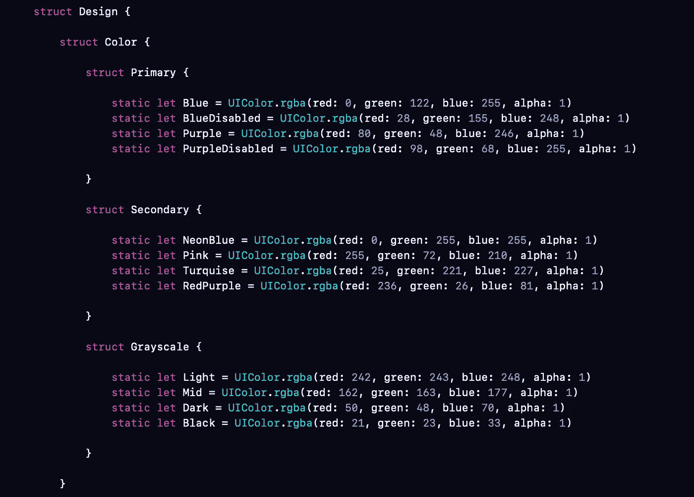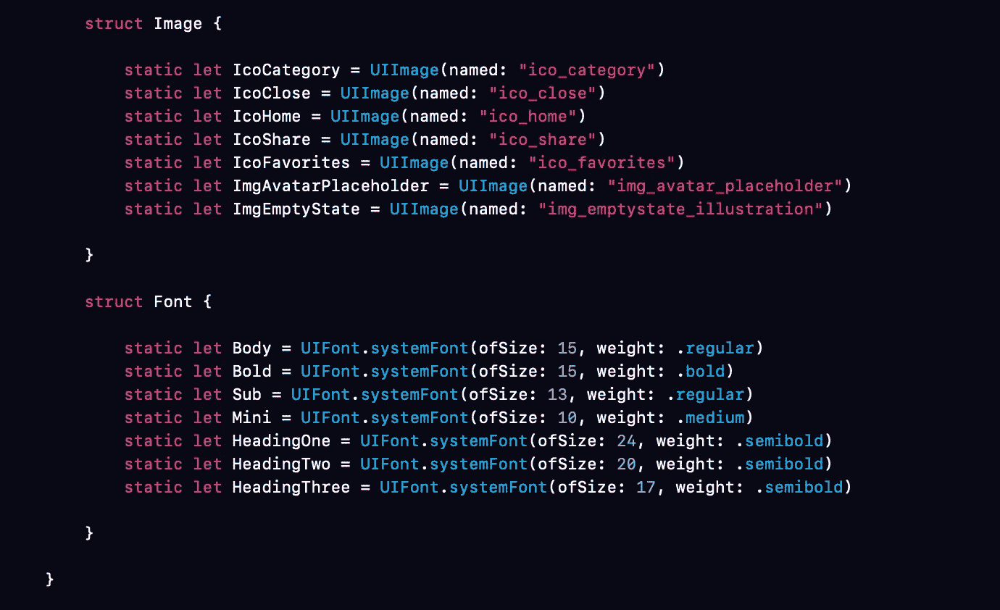

参考`Colors`:

```
textField.backgroundColor = Constants.Design.Color.Grayscale.Light
textField.borderColor = Constants.Design.Color.Grayscale.Mid
```

参考`Fonts`:

```
label.font = Constants.Design.Font.HeadingTwo
```

# 添加内容和 API 常量

内容通常是需要文本字符串的任何东西。`Labels`、`Buttons`、`TextViews`等。

```
static let Email= "Email Address"
static let Login= "Login"
```

字符串`Constants`的另一个用途是使用虚拟文本。如果需要测试长字符长度，可以使用虚拟文本。

```
static let dummyText = "Lorem ipsum"
static let dummyTextMedium = "Lorem ipsum dolor sit amet"
```

API 是我将用于任何与外部服务相关的部分；API 调用，数据库调用，任何与这两个相关的东西。你可能会看到一个`API` `struct`看起来像这样:

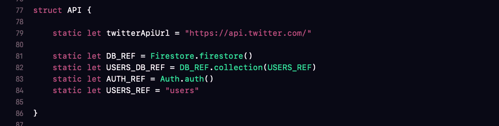

你可以这样引用这些`Constants`:

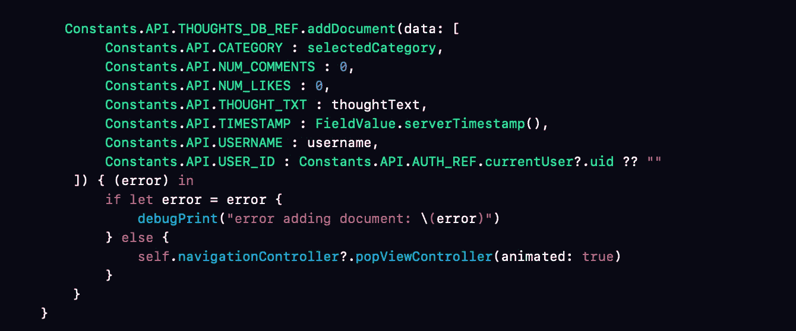

此外，定义`API` `Constants`的最佳实践是将它们大写。

完整模板:

另外，这是我为处理 RGBA 颜色创建的一个扩展:

这就结束了本教程。我认为还有其他处理`Constants`的选择，比如使用枚举或扩展，但是对于任何想要快速上手并运行的初学者来说，这是一个很棒的小解决方案，有望让你的生活变得更轻松。

我能给你的最后一个建议是，当你开始一个新项目时，首先试着创建这个文件。

这样，您已经预先定义了许多设计元素，并且可以继续前进，而不需要停下来创建这些常量，或者不断地更改它们。是让自己入门的好基础。干杯。