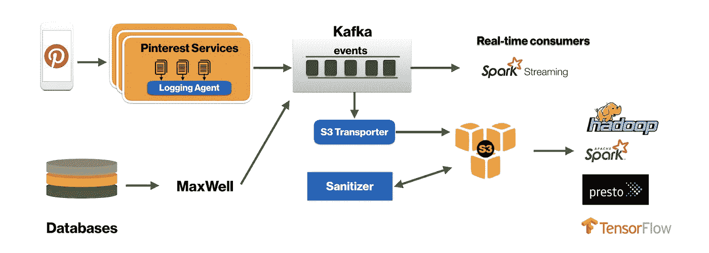

# 我们最喜欢的工程博客

> 原文：<https://betterprogramming.pub/our-favorite-engineering-blogs-3d8365b2d871>

## 你有没有想过了解 Pinterest、谷歌、优步和其他你喜欢的科技公司的后台发生了什么？

现代工程界的一件大事是，许多公司对他们开发的解决方案更加开放。谷歌、Chef、脸书、Lyft、优步等公司都发布了一些他们最近开发的设计和工具。

这可以作为吸引人才的诱饵，作为 B2B 客户的广告，以及作为建立品牌知名度的另一种途径。它还提供了对大数据、机器学习、数据科学和编程问题的创造性解决方案的见解。

如果你缺乏灵感或者只是需要有趣的阅读，那么考虑看看这些博客。

# Quora 的工程部门

Quora 是一个收集各种工程博客帖子的好地方。

他们讨论 NLP、大数据、机器学习和几乎所有其他的时髦词汇，因为 Quora 的网站需要处理一系列非常多样化的 NLP 问题。

有如此多看似合理的主题和问题，以至于找到好的问题展示给合适的人需要很多有趣的解决方案。

 [## Quora 的工程

### 工程师从头开始构建 Quora，从后端基础设施到排名算法到前端抽象…

engineering.quora.com](https://engineering.quora.com/) 

# 优步工程博客

尽管在过去的几年里优步发生了很多商业和道德丑闻，但优步的工程博客是我个人最喜欢的。

与许多其他科技公司不同，优步在现实世界中运营。也就是说，他们要处理现实世界的物流问题。他们处理实时问题，地理信息系统，定价，司机和乘客的安全，以及许多其他复杂问题。他们被迫变得聪明。这就引出了一些有趣的帖子。

 [## 优步工程博客

### 优步工程背后的工作。

eng.uber.com](https://eng.uber.com/) 

# Pinterest 工程

我们另一个最喜欢的博客是 Pinterest。Pinterest 发布了许多我们非常喜欢阅读的伟大的基础设施博客。

例如，他们最近发布了[“为云优化卡夫卡](https://medium.com/@Pinterest_Engineering/optimizing-kafka-for-the-cloud-4e936643fde0)”。在这篇文章中，他们很好地描述了问题和解决方案。当你面临类似的问题时，这可以帮助激励你。

 [## Pinterest 工程-中等

### 阅读 Pinterest Engineering 在媒体上的文章。构建首个视觉发现引擎的创新工程师，175…

medium.com](https://medium.com/@Pinterest_Engineering) 

# **网飞科技博客**

你有没有想过，你最喜欢的一家媒体发行公司是如何将如此多的数据传输到你的电视、笔记本电脑上的？和其他表面？

想想看:网飞和 YouTube 构成了互联网上流动的大部分数据。想象一下，一个系统需要设计得多好，才能确保你在正确的时间不间断地得到你的“奇怪的东西”。

 [## 网飞科技博客

### 了解网飞世界一流的工程成果、公司文化、产品开发等。

medium.com](https://medium.com/netflix-techblog) 

# 谷歌、脸书和亚马逊的研究博客

像谷歌、脸书和亚马逊这样的公司每年都在研究上投入大量资金。想象一下，如果你能瞥见他们在看什么东西。

嗯，通过下面的博客，你可以了解谷歌、脸书和亚马逊正在研究什么。

 [## 研究博客

### 谷歌研究的最新消息

research.googleblog.com](https://research.googleblog.com/index.html)  [## 脸书研究

### 在脸书，研究渗透到我们所做的一切。我们认为最有趣的研究问题来自…

research.fb.com](https://research.fb.com/)  [## 音频水印算法首先实时解决了“第二屏问题”

### 亚马逊应用和服务开发者门户

developer.amazon.com](https://developer.amazon.com/blogs/home/tag/Alexa+Research) 

# **贝莱德工程博客**

你听说过黑石吗？有些人有，有些人可能没有。无论你站在哪里，贝莱德都是全球最大的资产管理公司。它管理着超过 6.5 万亿美元的资产。

一家拥有如此多资本的公司必须花大量时间开发更好的产品——尤其是在金融科技公司纷纷上门的情况下。

 [## 贝莱德工程博客

### 了解我们如何在贝莱德解决复杂的工程问题，以及我们的技术活动、慈善活动…

rockthecode.io](http://rockthecode.io/) 

# Lyft 工程

我们已经分享了优步的工程博客——现在是时候提到另一个最近的 IPO 拼车服务博客了。

这和优步很相似。然而，我们发现与优步相比，它更注重软技能。这没什么不好——我们只是倾向于真正喜欢阅读以工程为重点的博客。

 [## Lyft 工程

### 来自 Lyft 工程的故事。

eng.lyft.com](https://eng.lyft.com/) 

# **Salesforce 开发者博客**

如果你为任何大公司工作，那么你有机会使用 Salesforce。

这意味着您的公司可能需要从 Salesforce 的 API 中提取。这意味着及时了解 Salesforce 发布的新工具以及您可能需要及时了解的任何变化非常重要。

类似于 Databricks，这个博客更多的是为使用或正在考虑购买 Salesforce 的人服务。

 [## Salesforce 开发者博客

### 提升开发人员技能并联系 Salesforce 开发人员社区

developer.salesforce.com](https://developer.salesforce.com/blogs/engineering/) 

# 结论

如果你喜欢这些博客，那么看看 [fulljoin.io](https://fulljoin.io/) 。

这个网站是一个搜索工具，可以帮助你找到你喜欢的数据科学、编程和 DevOps 博客。它还聚合了许多博客的文章，所以你可以在多个博客中搜索一个主题。这很棒，帮助我们减少了一些搜索时间。

我们希望你喜欢这些博客。