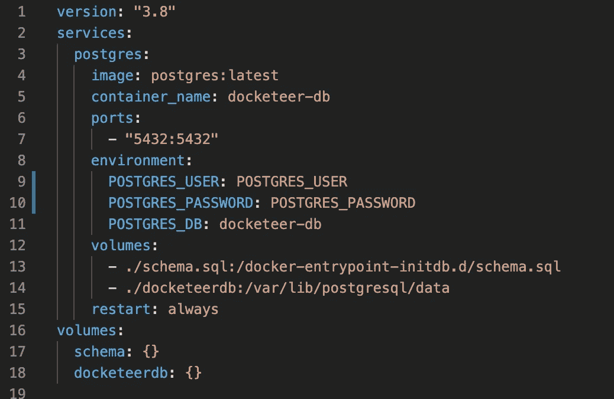
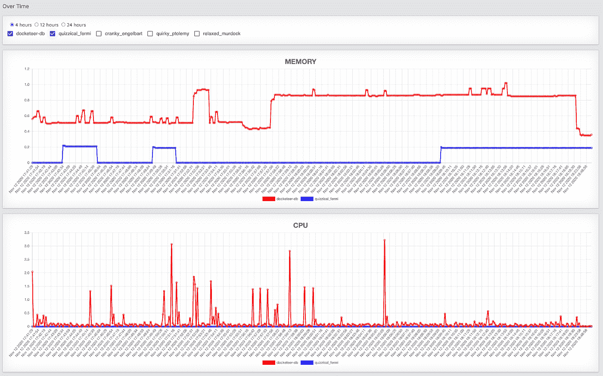

# 我们建造码头的旅程

> 原文：<https://betterprogramming.pub/our-journey-building-docketeer-an-open-source-docker-container-monitoring-and-visualization-tool-fb6c26d8908a>

## 一个开源的 Docker 容器监控和可视化工具


如果你点击了这个链接，那么很有可能你关心码头，集装箱，或两者兼而有之。我们不怪你！在 dockeeter，我们认为容器太棒了，我们用我们的容器监控工具[dockeeter](https://github.com/open-source-labs/Docketeer)构建了一个完整的开源应用程序来改善开发体验。

在 Docketeer 上工作，我们最喜欢的事情之一就是让开发人员能够从他们的容器化应用程序中获得最大的收益。因此，当规划最新版本时，我们决定专注于提供对容器性能更具可操作性的洞察。

经过深思熟虑，我们同意增加以下功能:

*   能够查看一段时间内的容器指标(现有版本只显示实时指标)。
*   当容器使用大量 CPU 和内存(超过 80%)或容器停止运行时，自动通知系统向用户发送文本警报。
*   包括查看最近 GitHub 历史的能力，以帮助调试哪些代码更改可能是性能下降的根源。

在我们开始之前，我们应该为我们的技术堆栈做好准备。Docketeer 由以下部分组成:

*   React(钩子，路由器):前端库
*   Redux:状态管理库
*   电子:桌面应用框架
*   网络包:Bundler
*   Twilio:短信服务
*   Chart.js:数据可视化
*   Jest:测试框架
*   酶:测试工具
*   PostgreSQL:关系数据库

# 从命令行提取 Docker 统计信息并放入 Docketeer

我们的应用程序依赖于从`[docker stats](https://docs.docker.com/engine/reference/commandline/stats/)`命令的标准输出中提取容器指标，返回运行容器的实时数据流。

为了从命令行中提取这些信息并使其对 Docketeer 有用，我们的团队采用了以下方法:

*   利用 Node.js 的 child_process 模块将标准输出引入我们的应用程序。
*   解析标准输出，并传递给应用程序可视化数据所需的数据结构

在第一个产品发布中，我们的团队编写了一个解析算法来重新格式化输出并更新我们的全局 Redux 存储。虽然这种方法确实有效，但仍有很大的优化空间。我们最初算法的时间复杂度是次优的，由于这是一个开源项目，我们希望确保其他开发人员能够在代码基础上构建，这意味着使它更加明确。

值得注意的是，因为我们实时显示数据，所以我们以高频率从 docker stats 读取输出，*每 5 秒*！因此，我们的解析算法中的任何低效都可能在整个应用程序中引发问题。

因此，我们开始寻找简化算法的方法。谢天谢地，我们发现了`--format`！

如 Docker 文档中所述:

> 格式化选项(`--format`)使用 Go 模板漂亮地打印容器输出。

这很棒，因为它允许我们通过制定如下命令来显著减少数据解析的数量:

```
'docker stats --no-stream --format "{{json .}},"'
```

[命令](https://docs.docker.com/config/formatting/)可能看起来有点混乱，但重要的是它允许我们使用 [Go 模板](https://golang.org/pkg/text/template/)将 Docker stats 的输出定制成我们选择的格式。

现在是测试时间，我们所有的测试都在 macOS 上通过了，但是在我们团队的 Windows 机器上没有通过。

如果您想使用类似的策略，需要注意的一点是 Windows 和 Mac shells 的执行方式不同，导致我们的字符串在 Windows 上无法解析。经过一番调查，我们得出了以下结论:

```
'docker stats --no-stream --format \'{"block": "{{.BlockIO}}", "cid": "{{.ID}}", "cpu": "{{.CPUPerc}}", "mp": "{{.MemPerc}}","mul": "{{.MemUsage}}", "name": "{{.Name}}","net": "{{.NetIO}}", "pids": "{{.PIDs}}"},\''
```

这在 Windows 和 Mac 机器上都是完美的——它现在将返回的输出编码为 JSON 字符串。

最后，这个新命令允许我们将解析功能减少三分之二，并且由于我们简化的、更明确的代码，使得其他开发人员更容易为产品做出贡献。

# 决定数据库

我们在这次迭代中面临的另一个关键问题是，是使用关系数据库还是非关系数据库来存储我们的数据。

由于我们添加的特性依赖于以一致的频率(每五分钟)写入数据库，我们最初的方法是利用非关系数据库。然而，最终我们决定使用 SQL，理由如下:

*   首先，我们的应用程序主要限于处理来自 Docker stats 的数据，这为它提供了一个固有的结构，并使它非常适合严格的模式实施
*   其次，我们的产品路线图包括需要关系数据结构的特性，以及利用用户、容器和容器的定制通知设置之间的多对多关系的使用连接表的能力。

# **使用容器化数据库**

决定了数据模型之后，我们需要决定是将其存储在云托管的实例中，还是利用 Docker 容器来托管我们的 Docker 容器监控服务。

使用 docker compose 为我们的用户创建无缝体验的能力被证明不仅有趣，而且对我们的用例有益。因此，我们的用户不需要手动设置数据库实例来使用 Docketeer。在第一次启动时，应用程序建立一个 docker 网络，从 Postgres 创建一个容器(从 Docker Hub 中提取，如果还没有在它们的图像列表中)，创建数据库容器并构建必要的表和模式。所有这些操作都是即时完成的，无需用户进行任何配置。



使用容器化的`Postgres`实例还具有性能优势，因为查询不需要通过主机外部的网络进行读写。

一旦我们同意使用`Postgres`容器，我们必须考虑另一个问题:持久化数据。默认情况下，一旦容器被停止或删除，它的数据就不再持久，这对于我们的用例来说显然是一个问题。为了解决这个问题，我们利用了 Docker [绑定挂载](https://docs.docker.com/storage/bind-mounts/)，它允许我们跨容器实例持久化数据。

# 使用 Chart.js 显示指标

现在我们有了需要可视化的数据。

如前所述，我们的发布路线图包括的功能使我们的用户能够:1:可视化容器数据随时间的变化(不仅仅是实时的)和 2:在 4、12 或 24 小时内进行比较。

在之前的版本中，我们的团队使用流行的 Chart.js 库在饼图和条形图中显示实时信息。因此，在规划附加功能时，必须决定是否将它用于我们的新功能，或者我们是否应该使用一个新的库。

该团队研究了两者的优缺点，并确定尽管 Chart.js 不是最健壮的动态渲染解决方案，并且可能会带来一些挑战，但与切换到另一个库(如 D3.js)相比，这些折衷是可以接受的。支持继续使用 Chart.js 的最有说服力的理由是，这意味着我们不必在 React 和 D3 之间平衡对 DOM 的控制。我们还必须考虑到使用这两种方法所需的时间。Chart.js 最终赢得了投票。

最终，我们的决定得到了回报，我们的图形以最少的代码实时动态呈现。该团队同意，将来可以决定使用功能更丰富的图表库。考虑到这一点，图表组件是以模块化格式构建的，以使转换尽可能简单明了。



# 通知和可操作的见解

因为期望我们的用户一直关注 Docketeer 是不现实的，所以我们的团队认为包含一个自动通知系统来提醒用户糟糕的容器性能或失败是至关重要的。

为不同的容器设置通知规则允许用户自动执行监控过程，并在出现问题时(例如，CPU 或内存超过 80%或容器已停止)获得及时通知。为了解决这个问题，我们为 SMS 通知部署了 Twilio，这样用户可以轻松地将负责的团队成员添加到通知列表中。

好的监控工具不仅可以帮助您了解什么时候出现了问题，还可以围绕触发事件提供可操作的见解。考虑到这一点，Docketeer 还允许用户在 GitHub 项目存储库中查看他们的团队成员所做的最新提交。

# 电子的进程间通信

令人惊讶的是，我们更有趣的挑战之一最终不是与容器相关的问题。虽然 electron 使得用 JavaScript 构建桌面应用程序成为一个相对高效的过程，但它在构建我们的应用程序的后端时导致了一些严重的问题。

困境是 Docketeer 需要一个后端 REST API 从外部云服务提供商请求数据，并将数据发送到我们的前端。最初的策略是实现一个节点 JS 服务器，它利用 RESTful 端点在云服务提供商和我们的前端之间进行通信。虽然这个解决方案肯定会工作，但服务器的唯一目的是托管 Twilio API，这让我们的团队质疑我们是否过度工程化了这个解决方案。

经过一些研究，我们确定了一个使用电子的进程间通信(IPC)的替代策略。简单来说，Electron 允许开发者使用两个并发线程:一个 IPC 主进程和一个 IPC 渲染器进程。GUI 出现在主进程中，然后启动显示 web 应用程序的渲染器进程。

实现 IPC 相当简单，并且还有一个额外的好处，就是减少了 300 行代码。为了将 Twilio 与我们的前端连接起来，我们只需从 Electron 导入 ipcRenderer 模块，这为我们提供了一个向 ipcMain 发送数据的通道。来自 Electron 的 ipcMain 模块运行在主进程上，监听来自 ipcRender 的通信。因为有了这个渠道，我们能够在 electronic 中处理后端逻辑，而不必部署 Node.js/Express.js 服务器。

# **结束**

我们真的很喜欢这个最后的发布周期，并且很兴奋地看到社区把这个项目带到了哪里！我们也希望您能够从我们一路走来获得的一些很酷的见解中学习！

本文由以下作者合著:

*   里奇·爱德华兹 [@GitHub](https://github.com/richie-edwards) [@LinkedIn](https://www.linkedin.com/in/richieedwards/)
*   米特什·帕特尔 [@GitHub](https://github.com/mit1812) [@LinkedIn](https://www.linkedin.com/in/mitesh-patel-8702728b/)
*   马特·琼斯[@ GitHub](https://github.com/mc-jones)@ LinkedIn
*   柴李[@ GitHub](https://github.com/seachai)[@ LinkedIn](https://www.linkedin.com/in/chai-lee-5a064649/)
*   安东·阿卜杜哈米多夫[@ GitHub](https://github.com/abdukhamidov-anton)[@ LinkedIn](https://www.linkedin.com/in/anton-abdukhamidov-1163733b/)