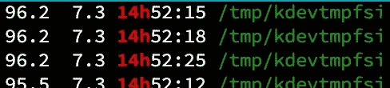

# 我们的 Slack 应用受到了威胁——以下是如何保护 Redis 实例的方法

> 原文：<https://betterprogramming.pub/our-slack-app-got-compromised-heres-how-you-can-secure-redis-instances-bf6be1503dce>

## 亲属恶意软件攻击是如何发生的，以及如何保护您的应用程序免受其害


照片由[马体芒果](https://www.pexels.com/@mati?utm_content=attributionCopyText&utm_medium=referral&utm_source=pexels)从[像素](https://www.pexels.com/photo/numbers-projected-on-face-5952651/?utm_content=attributionCopyText&utm_medium=referral&utm_source=pexels)

2022 年 1 月 10 日，我们在一个星期一继续我们的工作。

我们的产品之一 [Dixiapp](https://dixiapp.com/) ，用于我们的日常站立。每天，它都会问一些问题，比如你昨天做了什么，今天打算做什么等等。我们回答，我们的后端记录响应，并提交一份报告给一个选定的渠道。

迪克西 app(可爱地叫做西地)应该在上午 9 点整触发一个问题，但是那天没有。

发生了什么事？我是这个应用程序发生任何事情的负责人，所以我开始调试它。

我们的健康检查监控工作正常，这意味着 Gunicorn 服务器没有停机。Nginx 也没有。

我们的应用程序的工作方式是，每当我们在 Dixiapp 频道上发送消息时，Slack 都会向我们的服务器发送一个事件请求，然后我们对其进行处理。这触发了我们服务器的回应，显示在西地的频道上。但是那天没有回应。有意思。那么 Slack 停止发送消息了吗？我开始调试，发现不是 Slack 的问题。

最后，我不得不 SSH 到我们的生产服务器。我检查了 Gunicorn 和 Nginx [systemd](https://wiki.archlinux.org/title/systemd) 进程。他们像预期的那样跑着。在检查了日志并没有发现什么之后，我运行了最通用的命令，该命令向我们显示了系统的所有信息，例如`htop`

> `*htop*` *向我们显示系统中正在运行的所有进程，以及它们消耗了多少 CPU、内存和网络带宽。*

当我运行它时，我震惊地看到了结果！

我们所有的 CPU 都被刷爆了！他们满负荷运转。难怪其他进程不能正常运行。我查看了这些进程，发现一个可疑的进程消耗了所有的 CPU。



htop 输出

看到了吗？嗯，这个`kdevtmpfsi`是谁？

经过一番探索，我明白了发生了什么。我们暴露在互联网上的 Redis 端口是罪魁祸首。或者说，是受害者。有人试图利用一个已知的 Redis 问题进入我们的系统。

# 那么 kdevtmpfsi 进程到底是什么呢？

> `*kdevtmpfsi*` *是一个加密矿工。黑客/脚本小子试图利用服务器上易受攻击的端口，并安装该程序来运行他们的挖掘操作。这是通过一种名为*亲缘*的恶意软件实现的。*

首先，我得清除这个恶意软件，让系统运行起来。在浏览了一堆文章和 StackOverflow 问题(咄，我是一个真正的开发者)之后，我想把它去掉。在这篇文章的最后，我附上了一些关于恶意软件以及如何对付它的有用资源。

# 攻击是如何发生的？

我会解释的。

根据我的研究，它是基于利用 Redis 的`CONFIG`命令。这里是攻击的分类，但没有给出具体的细节，这样脚本小子就不会利用这个漏洞

1.  攻击者可以通过 telnet 使用暴露的 Redis 端口访问外壳
2.  一旦获得访问权，攻击者就可以在运行时使用`CONFIG SET`命令重新配置 Redis。
3.  他首先将 Redis 的数据目录设置为特定的目录，然后将 data db 文件设置为包含 cron 命令的文件，以下载和运行远程脚本。
4.  这个脚本下载并运行一个加密挖掘器。
5.  即使您终止了该进程，由于 crontab，它每分钟都会重新启动

这消耗了我们 100%的 CPU，导致服务不可用，而攻击者正在享受他们的免费 CPU

> *💡经验教训:在将端口暴露给互联网时要小心。*

# 如何保护 Redis 实例？

这件事让我对安全有了更深层次的思考。我开始了解 Redis 的架构和安全问题。

Redis 被设计为由可信环境中的可信客户端访问。这意味着您需要在一个独立的环境中运行您的 Redis 实例，该环境不直接连接到 internet。只有运行该应用程序的计算机才能直接访问它。

下面是在拥有 Redis 实例时需要采取的一些安全措施。

# 1.将 Redis 绑定到网络

Redis 的主要配置文件是我们应该仔细查看的，并理解每个选项的含义。默认情况下，该文件名为`redis.conf`，位于 Redis 安装目录中。

您可以将 Redis 绑定到单个接口，以便它只接收来自该接口的请求。这可以通过在您的`redis.conf`文件中添加一行来完成，如下所示:

```
bind 127.0.0.1
```

# 2.保护模式

对于 3.2.0 以后的版本，Redis 增加了一个名为**保护模式**的特殊设置。默认情况下，Redis 配置没有密码保护。如果使用默认配置运行 Redis 实例，那么它将进入一种称为保护模式的特殊模式。

当 Redis 在这种模式下运行时，它只回复来自环回接口(即 localhost (127.0.0.1))的查询。如果其他客户端尝试连接，它们会得到错误响应。

# 3.通过密码验证

正如我上面提到的，Redis 默认没有密码认证。您可以通过在您的`redis.conf`文件中添加下面一行来启用它

```
requirepass <password>
```

请注意，这只是增加了一层小小的安全措施，因为密码以明文形式存储，任何有权访问该文件的人都可以读取它。

# 4.禁用特定命令

Redis 提供的最好的安全特性之一是禁用您不需要的命令。您也可以将它们重命名为某个不可访问的名称。以下是重命名命令的方法:

```
rename-command CONFIG b840fc02d524045429941cc15f59e41cb7be6c52
```

要完全禁用一个命令，您可以将其重命名为空字符串，如下所示

```
rename-command CONFIG ""
```

# 外卖食品

当我们开始构建应用程序时，我们倾向于认为安全性是理所当然的。我们倾向于暴露不必要的端口并忘记关闭它们。我们在构建应用程序时所做的每一个假设都应该记录下来，并在我们构建好应用程序后重新审视。

**资源:**

1.  [https://www . trend micro . com/en _ us/research/20/d/exposed-redis-instances-abuse-for-remote-code-execution-cryptocurrency-mining . html](https://www.trendmicro.com/en_us/research/20/d/exposed-redis-instances-abused-for-remote-code-execution-cryptocurrency-mining.html)
2.  [https://blog . trend micro . com/trend labs-security-intelligence/more-than-8000-unsecured-redis-instances-found-in-the-cloud/](https://blog.trendmicro.com/trendlabs-security-intelligence/more-than-8000-unsecured-redis-instances-found-in-the-cloud/)
3.  [https://redis.io/topics/security](https://redis.io/topics/security)
4.  [http://antirez.com/news/96](http://antirez.com/news/96)

```
**Want to Connect?**If you enjoyed this, you can subscribe to my [Software Engineering Weekly](https://softwareengineeringwk.substack.com/) newsletter and get similar stories directly in your inbox!
```