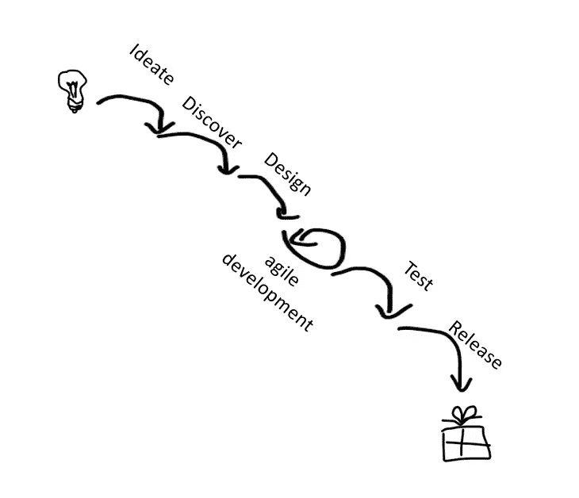
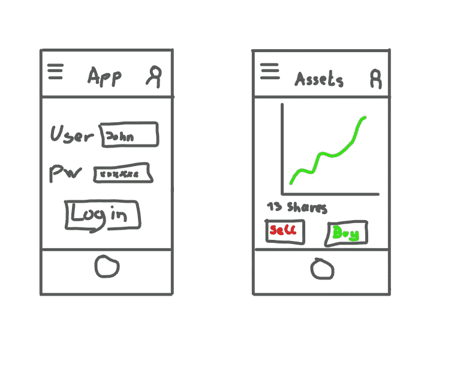

# 找到我们走出水-Scrum-Fall 特征工厂的路

> 原文：<https://betterprogramming.pub/our-way-out-of-a-water-scrum-fall-feature-factory-349216dfc127>

## 为什么设定冲刺目标和缩短反馈周期是降低产品风险和为用户创造有价值成果的关键

巨大的瀑布

我最近开始在一个新团队中担任 scrum master。我花了第一时间观察和确定我们作为一个团队的立场和问题所在。我与不同的团队成员进行了很多对话，我们利用回顾会议来提问和讨论开发的当前状态。

我们很快得出结论，我们目前深陷于一个功能工厂，我们不知道市场和用户将如何接受该产品。这是一个关于我们如何从功能工厂中找到出路的故事。

# 产品开发中的巨大风险

由作者创建

我们很快意识到我们是巨大瀑布的一部分。在这个更大的结构中，我们是一个快速高效的团队，在我们的 scrum 特性工厂中编程我们的标签并创建一个又一个特性。但问题是我们从未见过最终用户，也从未收到任何反馈。所以我开始问我的团队这些问题:

*   该功能面向谁？
*   为什么特性很重要？
*   该功能对用户有什么影响？
*   我们如何判断该特性的实现是成功的？

开发人员不理解这些问题。我很快意识到我们不知道谁是我们的用户，他们需要什么。

我的下一步是找到产品负责人。

我问了产品负责人以下问题:

*   产品的愿景是什么。
*   产品的客户和用户是谁，以及
*   我们的产品将如何改善他们的生活。

出乎我意料的是，这些问题都是产品负责人回答的。但是我仍然想知道为什么开发团队不能回答我的问题。缺失的一环在哪里？

在与产品负责人的讨论中，还有一件事困扰着我。是的，他可以回答我的问题，但是在回答中，有很多表达方式，比如:

*   我想…
*   我们假设…
*   如果是这样的话，那就像…

# 产品管理就是风险管理

好的产品负责人知道自己一无所知。但是好的产品所有者也知道如何建立他们关于用户和市场的知识。不幸的是，在我们的产品开发中，许多关于市场和用户的假设是在没有质疑这些假设是否正确的情况下做出的。这是一个巨大的风险。

此外，我们经常在过程中很晚才确认我们的假设。只有当发布的特性到达用户手中时，我们才能得到反馈。直到一个特性已经经历了整个水-Scrum-Fall，并且客户可以使用新特性之前，已经过了太多的时间。所以反馈来得太晚了，在我们的团队中有时是几个月后。

# 症状—产品风险的重新评估

在我提出这个问题之前，我们一直认为我们的行为是好的。我们认为发展的风险不是特别高。然而，我们也注意到 bug 和变更请求不断涌现。这些浪潮被延迟的时间正好与组织从开发到用户获得一个新特性的时间一样长。

我们后来意识到为什么——这是由于误解和我们对这种产品风险的错误定价。

[Marty Cagan 这样定义产品风险:](https://www.svpg.com/four-big-risks/)

1.价值风险(客户想买我们开发的东西吗？)
2。可用性风险(用户能使用我们开发的东西吗？)
3。可行性风险(我们的开发者到底能不能建？)
4。业务生存风险(它是否适用于我们的业务模式/业务？)

在进行了这些对话并花了几天时间消化这些讨论的结果后，是时候与团队一起寻找解决方案了。

在回顾中，我们提出了以下几点:

*   产品风险
*   测试假设
*   尽早获得反馈

# 我们所做的改进

在回顾中，我的第一个目标是让团队明白我们的行为增加了产品风险。由我们的行为引发的产品风险比我们想象的高得多。所以我们必须改变我们的行为来降低产品风险。

当然，如果能从混乱中挣脱出来，在一个敏捷的跨学科团队中自主工作，那就太好了。这也是我们敏捷之旅的大愿景。然而，我意识到团队很难独自实现这样的组织变革。它需要本组织许多其他部门的合作，最重要的是需要管理层的支持。所以我决定不去解决水混乱的问题，而是专注于最小化产品风险。

作为 scrum master，我的任务就是推动这些敏捷的变化。但是我们不能等那么久来寻找一个全组织范围的解决方案。我们现在必须调整我们的工作方式，解决团队中发现的风险。

# 了解用户的需求

讨论中的一个重要发现是，开发团队对用户及其需求知之甚少。他们不知道这个功能对谁有用，如何有用。为了改变这一点，打破这个特性工厂，开发团队必须获得更多关于用户及其需求的见解。所以我们反思了如何写用户故事和设定目标。产品负责人有产品愿景，了解他们的需求，所以我们必须将这些知识传递给团队。

为此，我们决定了几件事:

1.  创建适当的[结果导向的](https://david-theil.medium.com/output-oriented-vs-outcome-oriented-scrum-teams-8208a341f6c4)冲刺目标
2.  将冲刺目标与产品愿景保持一致
3.  始终如一地撰写用户故事
4.  使用人物角色来理解用户

## 建立正确的以结果为导向的冲刺目标

为了对用户的需求有一个共同的理解，并为 spring 目标创建一个共同的承诺，我们发现我们必须以一种清晰的、书面的形式来阐明和正式化 sprint 目标。为此，我们选择使用受 Steve Trapps 启发的 sprint 目标模板，并对其进行了一些修改:

我们关注的是 <topic objective="">，我们认为它将<输出/效果>传递给<用户>。
这将在<事件发生/KPI 达到>时得到确认。</topic>

> 示例:
> 
> 我们的重点是提供新的广告见解。
> 我们相信它能让我们的营销用户更好地理解营销措施。
> 这将在营销用户为新活动配置和使用 Ad-Insights 功能时得到证实。

## 将冲刺目标与产品愿景结合起来

为了理解 sprint 和 sprint 目标在产品愿景中的作用，我们需要使用产品目标。我们创建了一个路线图，其中包含我们想要实现的产品目标。有了这些产品目标，开发团队就更容易理解产品愿景中 sprint 目标的上下文，以及 sprint [如何融入到产品目标中。](https://www.scrum.org/resources/blog/tips-tricks-facilitate-sprint-planning)

[产品愿景、产品目标和冲刺目标](https://www.scrum.org/resources/blog/product-goal-sprint-goals-simple-example)的例子:

> 产品愿景:我们是领先的汽车价格比较网络服务
> 
> 产品目标 1:为美国市场推出一个比较汽车价格的网站
> 
> 冲刺目标 1:我们的重点是提供一个列出所有汽车价格的基本网站…
> 冲刺目标 2:我们的重点是提供一个基本的用户资料，登录和注册功能到…
> 冲刺目标 3。我们的重点是基于给定的价格范围创建一个过滤视图，我们相信…
> Sprint 目标 x…
> 
> 产品目标 2:扩大网站，以比较和筛选不同的汽车类型，并提供优惠
> 
> 产品目标 3:创建一个通过我们的 web 服务买卖汽车的基本功能
> 
> 产品目标 4:创建一个广告基础设施，允许客户为他们的汽车做广告。

## 用户故事和人物角色

我们看了几张票，发现有些写得非常专业。因此，我们同意为每张票建立一个关联角色，并提供一个专门的用户故事来解释用户为什么需要这个特性。对于用户故事，我们使用[这个模板](https://www.atlassian.com/agile/project-management/user-stories)。

“作为一个[角色]，我[想]，[以便]。”

# 更快的反馈，更快的测试

缩短水资源短缺的一个步骤是缩短反馈循环。为此，我们确定了关键用户，并邀请他们直接参与 sprint 评审。这使得他们能够给我们直接和快速的反馈。这样做不会缩短一个特性经历混乱的时间，但是会缩短反馈给我们的时间，并且提高特性的质量，因为反馈可以在下一个 sprint 中处理。

# 通过原型设计降低风险

为了最大限度地降低产品风险，我们现在更仔细地分析我们的票证，并在优化会议中发现它们。在这些发现中，我们讨论用户需要哪些功能以及为什么需要。我们试图通过更简单的原型来识别和创建更快的解决方案设计，然后在下一次审查中向最终用户展示这些设计。这样，我们可以更好地确保用户需要我们计划实现的东西。测试这些设计的一种方法是创建线框原型。

# 摘要

虽然我们还没有完全脱离功能工厂，仍然是水资源短缺的一部分，但是我们已经通过我们的行动取得了显著的进步。我们缩短了反馈周期，增加了团队成员对用户需求的理解，并通过冲刺目标和产品目标使产品愿景对团队来说变得切实可行。

在原型和线框原型的帮助下，我们还设法降低了产品风险和实现“错误”东西的风险

我们正在寻找摆脱功能工厂的方法。

你喜欢这个帖子吗？敬请关注更多内容。