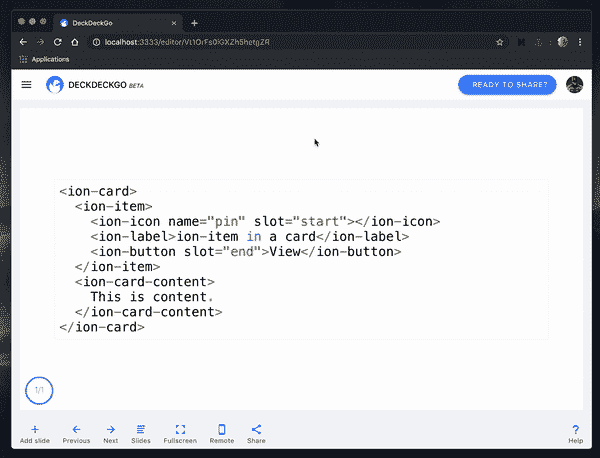

# 我们第一次征集 DeckDeckGo 投稿人的结果

> 原文：<https://betterprogramming.pub/outcome-of-our-first-call-for-contributors-34ea95bd68cf>

## 谢谢，更新，并呼吁功能请求

由[亚历克斯·霍利奥克](https://unsplash.com/@stairhopper?utm_source=unsplash&utm_medium=referral&utm_content=creditCopyText)在 [Unsplash](https://unsplash.com/search/photos/open-source?utm_source=unsplash&utm_medium=referral&utm_content=creditCopyText) 拍摄的照片

上周，我们为开源项目 [DeckDeckGo](https://deckdeckgo.com) 发布了第一次[征集贡献者](https://medium.com/@david.dalbusco/contribute-to-our-open-source-project-17289c3c4254)。结果令人着迷！

在我们继续之前，我们首先要感谢每一位阅读这篇文章、与我们互动或自愿解决问题、甚至向我们发送拉请求的人。你真的很棒，你的反应让我们都很开心。

*谢谢！！！*

# 拉取请求

在我们的博客帖子之后，许多人联系我们接管我们列出的问题，甚至在我们的回购中找到了其他要解决的问题。其中一些仍在进行中，但现在已经开发了两个显著的特性。我们认为展示他们的成果并表扬他们的作者会很酷。

# 开始之前

我个人非常喜欢我们项目的模块化。我们所有的 web 组件都可以在任何应用程序中作为独立组件使用(“有或没有任何现代框架”)。或者，如果您正在使用 HTML 或 Markdown ( `npm init deckdeckgo`)开发演示文稿，它们也可以用在我们的初学者工具包中。它们也用于我们即将推出的用于演示的 web 编辑器中。

想到如果您正在改进或修复一个组件，这种改进可以用在许多构造中，这是很酷的。

# 用于代码突出显示的可选行号

这个特性的目标是为我们的代码高亮组件添加一个选项，该组件在底层使用 [Prism.js](https://prismjs.com) 来自动显示每行开头的行号。

这是由 Stefan Nieuwenhuis([Twitter](https://twitter.com/stefannhs)/[Github](https://github.com/StefanNieuwenhuis))开发的，并在 PR [#213](https://github.com/deckgo/deckdeckgo/pull/213) 中提交。(不是所有英雄都穿披风，你是牛逼的斯特凡！)

在要展示的代码的开头自动显示行号

# YouTube 短 Url

当使用短 URL 嵌入视频时，我们的组件和“YouTube”模板(这使得在演示文稿中集成 YouTube 视频变得容易)面临一个问题——URL 必须遵循特定的格式。

该修复程序由 Rohit Bokade ( [Github](https://github.com/bokaderohit98) )开发，并在 PR [#207](https://github.com/deckgo/deckdeckgo/pull/207) 中提交。(你的原力很强大，Rohit，非常感谢！)

将 YouTube 视频轻松整合到您的演示文稿中

# 蛋糕上的樱桃

我们还有一些[问题](https://github.com/deckgo/deckdeckgo/issues)要解决！其中大多数标记为“良好的第一期”的项目正在进行中，其他的可能没有那么简单，但谁知道呢，你可能会找到一个你感兴趣的项目，更重要的是，我们欢迎任何想法或建议。

不要犹豫提交您的功能请求——获得它们将会非常酷！

到无限和更远的地方！

大卫