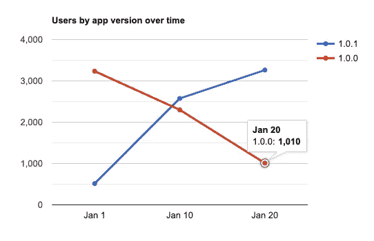
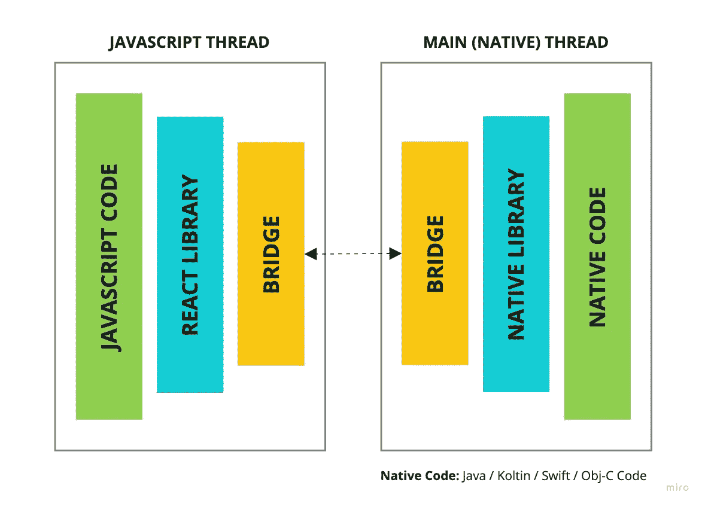
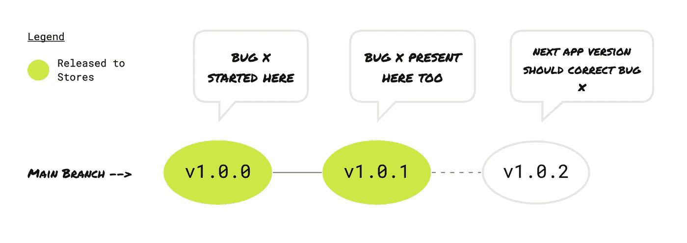
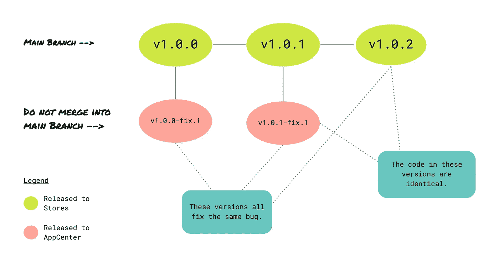

# 通过 React 本机代码推送和 GitHub 操作进行空中下载(OTA)更新

> 原文：<https://betterprogramming.pub/over-the-air-ota-updates-with-react-native-codepush-and-github-actions-a6cef69249dd>


## 在 React Native 中解决经典移动部署问题的一种方法…无需通过官方应用商店

# 一个经典的移动部署问题

经过大量调试后，您确定了一个关键错误的来源。好啊，这很容易解决！不幸的是，您还发现错误从版本`v1.0.0`开始，并且您已经发布了带有错误代码的版本`v1.0.1`。

现在不是单一的问题，而是一系列的问题。

向应用商店发布新的应用版本可能需要时间。您有一个影响用户的严重错误。您不希望在修改后的版本接受审查时等待 2-7 个工作日，除非您绝对有必要。

即使你获得批准，商店里有了`v1.0.2`，用户也不会频繁更新他们的应用。如果你看一下你的分析工具，可能会有一个图表，根据用户使用的应用程序版本对他们进行分组。

你会发现它看起来像这样:



通常情况下，我们有很大一部分用户使用过时版本的应用程序，正如我们在这里看到的。可能需要几周时间，大多数用户群才会使用正确的版本。与此同时，这个 bug 仍然会影响用户，即使你已经在技术上纠正了它。

我们该如何着手解决这个问题？

好吧，在 React 本地应用的情况下，部署到 CodePush 是一个可行的选择。

# 那么，什么是代码推送？

CodePush 是一种空中下载(OTA)更新服务，由[微软的 AppCenter](https://appcenter.ms) 提供。OTA 更新是混合应用相对于原生应用的一大优势。它们允许您快速部署新的应用程序版本，绕过 App Store 和 Play Store 审查流程。

你可能会问，为什么是微软代码推送？因为我找不到任何其他为 React Native 提供类似服务的提供商。截至 2022 年 5 月，通过 CodePush 的分发[完全免费](https://docs.microsoft.com/en-us/appcenter/general/pricing)。

具体来说，让我们看看 CodePush 在 React Native 中是如何工作的。



每个 React 原生应用都分为两部分:原生代码和 JavaScript 代码。当你构建你的应用时，你所有的 JavaScript 代码都被编译，并且分别为 Android 和 iOS 生成`index.android.bundle`和`index.ios.bundle`文件。CodePush 允许您将新的包上传到 AppCenter，然后直接下载到您的设备。

这里有一个重要的警告。不可能通过 OTA 更新本机代码。如果本机代码已经更改或添加了新的本机库，则必须照常通过应用商店部署更新。

# CodePush 合法吗？

是的。React Native CodePush 的文档包括[商店指南合规性的一部分](https://github.com/microsoft/react-native-code-push#store-guideline-compliance)归结为:通过 OTA 更新你的 JavaScript 文件是没问题的，只要它不会彻底改变你的应用程序的目的或添加/删除主要功能。

# CodePush 是否会取代通常的 App Store/Play Store 发布流程？

不，你的用户应该总是被鼓励使用最新版本的应用程序，你应该不断发布新版本。其中的一些原因包括:

*   你仍然需要通过商店获得本地更新。
*   频繁更新的应用程序往往会得到商店搜索算法的奖励。失去那一点点优势就太可惜了。
*   如果你通过 CodePush 发布你的大部分新功能，最终你的应用程序将会发生足够的变化，以至于你可能会遇到[遵循指南](https://github.com/microsoft/react-native-code-push#store-guideline-compliance)的问题。
*   正如您将在下面的部分中看到的，CodePush 发布过程并不总是简单的，所以尽量限制它的使用。如果可能，只使用它来纠正仍然受用户欢迎的版本中的错误。

# 从用户的角度来看，它是如何工作的？

1.  用户从 App Store 或 Google Play 下载应用版本`vA.B.C`。
2.  每次他们启动应用程序时，CodePush 都会向 AppCenter 发出 HTTPS 请求，为`vA.B.C`寻找新的更新/修复。

如果有更新/修复:

*   下载新的代码包(`vA.B.C-fix.N`)。(“-fix”后缀是任意的，可以是您喜欢的任何东西。)
*   下一次用户打开他们的应用程序时，会安装新版本。

如果没有更新/修复:

*   什么都没发生。用户继续正常使用应用程序。

在调试模式下开发时，您甚至可以在 Metro Bundler 中看到代码推送日志:

```
LOG  Running "your_mobile_app" with {"rootTag":1,"initialProps":{}}
LOG  [CodePush] Checking for update.
LOG  [CodePush] App is up to date.
```

# 从开发人员的角度来看，它是如何工作的？



让我们回到我们的例子。你已经找到了一个从版本`v1.0.0`开始的错误，并且你已经发布了版本`v1.0.1`。我们如何开始纠正这种情况？嗯，注意`v1.0.0`和`v1.0.1`有不同的源代码，这意味着我们需要纠正同一个 bug 两次，发布三个版本:

*   `v1.0.0-fix.1`:来自`v1.0.0`的代码，修复了 bug，发布到 AppCenter。这个代码不在`main`分支上。
*   `v1.0.1-fix.1`:来自`v1.0.1`的代码，修复了 bug，发布到 AppCenter。这个代码不存在于`main`分支上。
*   `v1.0.2`:来自`v1.0.1`的代码，修复了 bug，发布到 Apple Store/Google Play。这是将被合并到`main`的代码。



# 开发人员错误修复工作流程

当我们需要通过 CodePush 发布任何东西时，这些是我和我的团队遵循的步骤。我们只通过代码推送发布错误修复。

对于每个错误版本(`v1.0.0`、`v1.0.1`)，执行以下操作:

*   检查有错误的版本，并创建一个修复分支。

```
# git checkout tags/<tag> -b <branch>
git checkout tags/v1.0.0 -b fix/fix-a-critical-bug# This is equivalent to:
git checkout tags/v1.0.0
git checkout -b fix/fix-a-critical-bug
```

*   实施错误修复。确保您不必在该过程中安装任何本机依赖项。
*   提交错误修复。
*   通过添加适当的后缀来提升应用程序版本。我推荐类似`fix`的东西，但这是武断的。

```
# In our case
v1.0.0 -> v1.0.0-fix.1# Also possible, if you're fixing a fix version:
# v1.0.0-fix.1 -> v1.0.0-fix.2
```

*   提交版本升级。
*   将新的分支推送到远程存储库。

```
# git push --set-upstream origin <branch>
git push --set-upstream origin fix/fix-a-critical-bug
```

*在下一节中，我们将详细介绍一个手动触发的 GitHub 动作工作流，它将您的发布部署到 CodePush。我在下面的步骤中提到的就是这个工作流程。*

*   在 GitHub 上打开 repo，导航到部署代码推送 GitHub 操作工作流。
*   单击“运行工作流”按钮。
*   选择您正在处理的分支(`fix/fix-a-critical-bug`)。
*   点击绿色的行动号召“运行工作流”按钮。
*   让工作流完成，然后删除修复分支。工作流创建了一个标签，所以我们不需要保留分支。

# 自动化代码推送发布工作流

此工作流程使用您在创建免费 AppCenter 帐户时定义的应用程序名称，以及在 CodePush 安装过程中生成的一些密钥和令牌。在这个例子中，所有相关的密钥和令牌都已经在存储库的秘密中定义了。

# 安装 React 本机代码推送

如果你确信 CodePush 是适合你的工具，去 GitHub 安装 [React Native Code Push](https://github.com/microsoft/react-native-code-push#getting-started) 包。

感谢阅读！