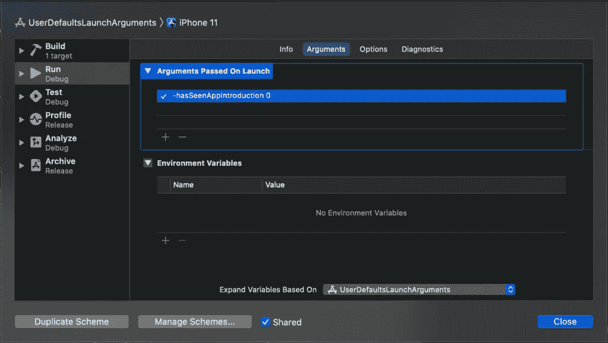

# 覆盖用户默认值以提高生产率

> 原文：<https://betterprogramming.pub/overriding-userdefaults-for-improved-productivity-244969d42e3a>

## 更好的用户默认值


照片由[S O C I A L C U T](https://unsplash.com/@socialcut?utm_source=medium&utm_medium=referral)在 [Unsplash](https://unsplash.com?utm_source=medium&utm_medium=referral) 上拍摄

`UserDefaults`应用内用于存储与用户配置相关的数据。这是一个易于访问的数据存储，用于保存状态、统计数据和其他与应用程序相关的数据。

启动参数在启动时传递给应用程序，可用于修改应用程序以进行调试。苹果经常使用它来允许开发者启用特定的调试模式，[就像在核心数据](https://www.avanderlee.com/debugging/core-data-debugging-xcode/)中一样。我们可以自己做同样的事情，在我们的应用程序中启用某些调试模式。

# 一个例子:用户默认触发一个应用程序介绍

使用启动参数的一个常见用例是在开发过程中强制启用介绍屏幕。如果没有这个，我们每次都需要重新安装应用程序，这样就会出现介绍屏幕。

示例代码实现可能如下所示:

```
var shouldShowIntroduction: Bool {
    /// Use a launch argument to always skip the app introduction.
    if ProcessInfo.processInfo.arguments.contains("-skipAppIntroduction") {
        return false
    }

    /// Use a launch argument to always show the app introduction.
    if ProcessInfo.processInfo.arguments.contains("-requireAppIntroduction") {
        return true
    }

    /// No launch arguments found, read from the user defaults.
    return UserDefaults.standard.bool(forKey: "hasSeenAppIntroduction") == false
}
```

在这种情况下，我们有三种选择:

*   使用`-skipAppIntroduction`启动参数强制跳过介绍
*   使用`-requireAppIntroduction`启动参数强制启用引入
*   从用户默认值中读取值

尽管这种方法可行，但它很容易填满您的启动参数，并且需要额外的代码，存在潜在的错误。直接覆盖用户默认值会容易得多。如果是这样，我们可以有一个简单的代码实现，如下所示:

```
import SwiftUI

@main
struct UserDefaultsLaunchArgumentsApp: App {
    var body: some Scene {
        WindowGroup {
            if UserDefaults.standard.bool(forKey: "hasSeenAppIntroduction") == false {
                IntroductionView()
            } else {
                ContentView()
            }
        }
    }
}
```

# 使用启动参数覆盖用户默认值

使用启动参数覆盖用户默认值可以在 scheme 编辑器中完成。在这种情况下，我们希望通过覆盖`hasSeenAppIntroduction`用户默认值来强制启用介绍屏幕。

您可以通过以下步骤完成此操作:

1.  选择您的方案，点击`Edit Scheme...`，或使用`Product ➞ Scheme ➞ Edit Scheme...`
2.  转到`Run`，打开`Arguments`选项卡
3.  给`Arguments Passed On Launch`添加一个新值
4.  在本例中，添加:`-hasSeenAppIntroduction 0`



使用启动参数覆盖用户默认值

需要使用键前面的破折号来传递启动参数。该值可以添加在键的后面。在这种情况下，我们将使用一个零，它等于布尔值`false`。如果我们想强制禁用简介屏幕，我们可以使用值 1。

# 结论

就是这样！我们在不接触代码的情况下，为开发启用了应用程序介绍。自定义启动参数允许我们改变用户默认值，因此总是显示简介。

谢谢！