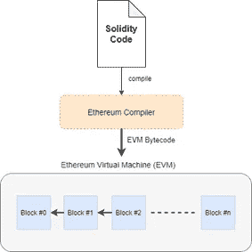
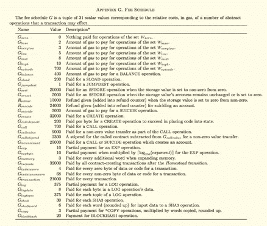

# 以太坊和固体概述

> 原文：<https://betterprogramming.pub/overview-of-ethereum-solidity-d7a0ea5fbf00>

## 一本关于以太坊区块链、Solidity 编程语言和智能合约的有用入门书


图片来源:作者

在本文中，我们将了解以太坊的基础知识，并了解区块链的与众不同之处以及以太坊带来的好处。

# 以太坊

以太坊由 Vitalik Buterin 于 2013 年首次提出。在比特币之后，在区块链的项目中，以太坊是最有特色的项目，因为它提出了智能合约的概念。以太坊为开发去中心化的应用和智能合约提供了一个平台。(这是一个分布式计算平台，旨在运行智能合同。)

*以太*是以太坊区块链的价值令牌。它在加密货币交易所被列为 ETH。

## 智能合同

*智能合同*是一种计算机程序或交易协议，旨在根据合同或协议的条款自动执行、控制或记录法律相关的事件和行为。

智能合约的主要贡献是使区块链应用程序可编程，它使区块链应用程序不仅仅是转移货币。它使得任何协议条款的验证都是自动的。因此，所有依赖于某个条件的操作都可以在没有任何中间人或第三方介入的情况下被计算出来。

智能合同提供了以下好处:

*   **透明性:**由于智能合约在编译后像交易一样被部署到以太网，这些合约对所有相关方都是完全可访问和可见的。
*   安全:保存智能合约的条件和环境是一个安全的地方，就像加密货币一样。
*   **信任:**通过将智能合约保存在一个像加密货币一样安全的地方，区块链的安全、自治和透明特性也可以提供给智能合约。知道对放置在块中的信息进行操作的可能性非常低有助于我们信任。
*   **速度:**智能合约生活在互联网上，运行在软件代码上。因此，它可以非常快速地验证交易。这样的速度可以节省很多人为造成的时间浪费。
*   **节省:**智能合约消除了中间人或第三方权威机构根据协议条款决定该做什么的需要。因此，除了浪费时间之外，他们还节省了浪费的金钱。这意味着不需要律师、银行、证人和任何其他中介。

# 以太坊虚拟机(EVM)

以太坊虚拟机(EVM)是一个强大的沙盒虚拟堆栈，嵌入在每个完整的以太坊节点中，负责执行合同字节码。EVM 规定机器代码与网络、文件系统或主机的任何进程完全隔离。它强制以太坊网络中的所有节点运行相同的指令或操作，尽管它们彼此独立(以太坊网络在 EVM 上使用沙箱)。

EVM 主要处理智能合同部署和执行，此外还防止非我们造成的无限循环和网络上的各种恶意攻击。以太坊网络中的每个节点都运行一个 EVM 实例，这允许它们同意执行相同的指令。

EVM 是图灵完备的，指的是能够执行计算功能的任何逻辑步骤的系统。

出于安全考虑，智能合约不会立即发布。智能合同通常用更高级的语言编写，比如 [Solidity](https://docs.soliditylang.org/en/v0.7.5/) 。然后我们编写的 Solidity 代码被以太坊编译器编译成 EVM 字节码。之后，Solidity 代码就可以以 EVM 字节码格式部署到网络中，然后就可以执行了。



智能合同的编译和部署流程

智能合约部署到以太坊网络后，无论任何节点何时运行，都必须由以太坊生态系统中的所有节点运行。在这一点上，如果一个契约有一个无限循环，网络上的每个节点都将永远执行这个循环。(可能是偶然发生的，也可能是故意的。)如果意外发生，这种情况会给交易的发送方带来问题。这可能是通过拒绝服务攻击(DDoS)故意造成的。在这一点上，EVM 有助于保护以太坊网络免受这两种问题的影响。

**拒绝服务攻击(DDoS)** :由于每个节点都工作在 EVM 上，如果一个契约出现无限循环，网络上的每个节点都将永远陷入执行循环。因此，通过暂停问题，不可能提前确定合同是否会终止。

# 气体

在以太坊中，气体**T5 被用来保护以太坊网络免受这类问题的影响。为了在以太网上执行交易，发送交易的发送者需要通过一个名为 *gas* 的中间令牌向 miner ether 付款(这是我们执行合同所需的)。它是一个允许您测量运行智能合约或其他交易所需的计算工作量的单位。**

下表显示了哪项操作需要多少气体。Solidity 中的每一行代码都需要一定的 gas 来执行。因此，完成任何操作所需的气体量取决于将在智能合同中执行的操作，并且在执行智能合同之前根据下表进行计算。



气体数量表

以太和气体是不同的东西。汽油是交易中所需的计算能力，乙醚是用来支付汽油的货币。汽油价格(以乙醚计)是对应于一单位汽油的价格。在计算出所需的气体量之后，通过将气体量和气体价格相乘来计算从发送者的账户中取出的量。一般来说，该金额以 *gwei* 为单位支付。

Gwei 是一小块以太，就像欧元和美分。(以太对应欧元，gwei 对应美分)。

1 gwei 等于 0.000000001 ETH，1 ETH 等于 10 亿 gwei。

除 gwei 之外，还有几个单位，如 wei、kwei、mwei 等。

天然气价格可以根据网络中的交易数量而提高/降低。

*   随着网络流量的增加，气价也会提高。
*   随着网络流量的减少，天然气价格将会降低。

尽管天然气价格是可变的，但是进行特定交易所需的天然气数量是固定的。(这确保了复杂操作总是比简单操作需要更多的气体)。

# 气体极限

在操作视图中，所有发送者必须指定一个称为*气体限制*的数量，这是发送者在将交易提交给网络之前愿意为该交易支付的气体的最大数量，然后该数量与相关交易一起发送。因此，矿商能够负担它的花费。

如果他们想要对他们自己的交易进行验证，发送者应该注意的主要问题是指定尽可能接近与交易相关的天然气价格的天然气限制。以下步骤描述了气体限制的主要原理。(以下使用的气体量不正确，只是为了帮助您理解一般概念。)

*   在变量= 45 气体中储存 11
*   添加两个变量= 10 气体
*   存储结果成本= 45 汽油
*   该操作将需要的总气体= 100 气体
*   发送方必须指定气体限值= 120 气体
*   120–100 = 20 气体未被使用，它被发送回发送者帐户

这里，将气体限制指定得太低或太高会导致我们应该避免的以下问题:

*   如果气体限制被指定得太低，则发生“气体耗尽”的情况，并且合同恢复到原始状态。然而，这种恢复操作仍然需要运营成本，并且它通过从发送者之前支付的气体中扣除来提供这些成本。让我们假设操作需要的总气体= 100 气体。发送方必须指定气体限值= 90 气体。结果，发生了“汽油用完”的情况，然后发送者将被收取发送者费用，只要恢复操作是值得的。
*   如果气体限制被指定得太高，那么，一般来说，矿工会避免它们，并且更喜欢具有小气体限制的交易，因为他们知道气体限制可能会膨胀。

# 为什么天然气很重要？

不管是什么原因(无意还是有意)，gas 都是用来保护网络不会因为任何回路的无限运行而被卡住。

*   如果事务进入无限循环或操作继续超过预期，它会保护发送方支付额外的费用——当意外发生时，事务会进行不必要的操作，并浪费网络上的计算能力和资源。支付所有这些浪费的计算能力和资源的人将是相关交易的发送者，这意味着发送者将遭受这种情况。
*   它保护以太坊网络免受拒绝服务攻击(DDoS)——当它故意发生时，这意味着它是一种 DDoS 攻击。如果攻击者想要发起 DDoS 攻击，他们应该提供足够的攻击资金。因此，它允许攻击者避免执行任何 DDoS 攻击。


# 固态

Solidity 是一种面向对象的高级语言，用于实现智能合约，它的设计目标是以太坊虚拟机(EVM)，管理以太坊状态下的账户行为。

它是一种面向契约的语言，这意味着智能契约负责存储与区块链进行交易的所有编程逻辑。

有了 Solidity，任何契约都可以开发用于投票、众筹、盲拍、多签名钱包等用途。

在编译 Solidity 代码的几种方法(即， [solc-js](https://github.com/ethereum/solc-js) **，**node . js 框架，或最新的 Docker 构建)中， [Remix IDE](https://remix-ide.readthedocs.io/en/latest/index.html) 是一个强大的开源工具，它可以帮助您直接从浏览器编写 Solidity 契约，而无需安装任何东西。Remix 用 JavaScript 编写，支持在浏览器和本地使用。Remix 还支持测试、调试和部署智能合约，等等。

智能合约的以下元素有助于理解智能合约的一般结构。

## 声明合同

实体版本和合同名称必须由以下内容声明。

```
pragma solidity ^0.4.24;contract MyContract {
    // do something
}
```

## 导入其他源文件

Ethereum Solidity 支持的导入语句与 JavaScript 中的非常相似，尽管 Solidity 不知道“默认导出”的概念。

```
import "filename";----- OR -----import * as symbolName from "filename";
```

## 评论

就像任何其他语言一样，单行和多行注释在 Solidity 中都是可能的。

```
// This is a single-line comment.----- OR -----/*
   This is a
   multi-line comment
*/
```

## 变量

坚实度支持以下变量:

*   **状态变量** — 永久保存在契约存储器中
*   **局部变量** —直到函数执行时才出现
*   **全局变量** — 存在于全局名称空间中的特殊变量，用于获取有关区块链的信息

```
pragma solidity …contract HelloWorld{
   uint storedData;     **// state variable** function getResult() public view returns(uint){
      uint a = 1;     **// local variable** }
}
```

## 变量作用域

坚固性支持以下类型的可见性，这些可见性对于函数和变量都是常见的

*   **公共** — 可以内部调用或通过消息调用的公共函数或变量
*   **内部** —只对当前合约和衍生合约有效的函数和变量
*   **私有** —仅适用于当前合同，不适用于衍生合同
*   **外部** —只能用于从其他合同和交易中调用的函数

## 数据类型

以下类型也被称为*值类型*，因为这些类型的变量总是通过值传递。

*   **布尔型**—`bool`；可能的值是常数，即真或假
*   **整数**—**`int/uint`；各种大小的有符号和无符号整数**
*   ****弦**——**`string`；字符串文字用双引号或单引号“foo”或“bar”来表示****
*   ******地址** — `address/address payable`保存一个 20 字节的值，以太坊地址的大小等。****

## ****地址类型****

****地址类型也有成员，并作为所有协定的基础。有两种类型的地址:`address`保存一个 20 字节的值，`address payable`与上面的`address`相同，只是有`transfer`和`send`成员。`address` / `address payable`的区别在于`address payable` 是可以发以太的地址，而普通的`address` 是不能发以太的。****

****允许从`address payable`到`address`的隐式转换，而不允许从`address`到`address payable`的转换。地址类型有几个成员:****

*   ****`balance`返回给定地址的余额(单位为魏)****
*   ****`transfer`给定地址发送给定金额(单位为威)****
*   ****`send`向给定的地址发送给定数量的 wei(不是安全的转移替代方案)****

## ****数据结构****

****以下类型专门用于坚固性:****

*   ******Struct** — `struct` Solidity 提供了一种以 Struct 的形式定义新类型的方法。结构是自定义类型，可以将几个变量组合在一起。****
*   ******数组** — `[]`数组可以有一个编译时固定的大小，也可以有一个动态的大小。****
*   ******映射** — `mapping(k => v)`映射可以被视为哈希表，这些哈希表被虚拟地初始化，使得每个可能的键都存在，并且被映射到一个字节表示全为零的值:一个类型的默认值，等等。****

## ****数据位置****

****所有引用类型都包含关于它们存储位置的信息，有三个区域来存储它们:****

*   ******存储** — 状态变量、结构、数组、映射的局部变量:每个账户都有自己的存储，在函数调用和事务之间是持久的。****
*   ******内存** — 函数参数，其中一个契约为每个消息调用获取一个新清除的实例。它保存临时值，并在(外部)函数调用之间被擦除，使用起来更便宜。****
*   ******堆栈** —小局部变量。EVM 不是寄存器机器，而是堆栈机器，因此所有计算都在称为*堆栈*的数据区上执行。它保存小的局部变量，几乎可以免费使用，但只能保存有限的值。****

## ******功能******

****在一个函数中，`<parameter types>`可以为空，但`<return types>`必须填充。****

*   ******内部函数**只能在当前合同内部调用。****
*   ******外部函数**由地址和函数签名组成，可以从外部函数传递和返回。****

```
**function (<parameter types>) {internal|external} [pure|view|payable] [returns (<return types>)]**
```

## ****功能类型****

****`pure`确保它们不改变状态(可以转换为视图)。****

****`view`不读取状态或修改状态。****

****`payable`使得以太能在函数中被发送。****

****`fallback`没有任何参数，不返回任何东西，但特别用于发送以太，写入存储，创建契约。****

****功能可以设置为`view`和`pure`来限制状态的读取和修改。****

## ****方法重载****

****当协定中的几个函数名称相同但参数不同时，就会发生函数重载。****

```
**function sayHi(string n1) public pure returns (string out) {
   out = "Hi " + n1 + " !" ;
}function sayHi(string n1, string n2) public pure returns (string out) {
   out = "Hi " + n1 + " and " + n2 + " !" ;
}**
```

## ****修饰语****

****定义修改器是为了改变函数在 Solidity 中的工作方式。通过使用修饰符，可以设置在函数执行前检查的条件。****

```
**pragma solidity ^0.4.24;contract MyContract {
   constructor() public { owner = msg.sender; }
   address payable owner; modifier onlyOwner {
      require(msg.sender == owner, "Only owner can call this function.");
      _;    **// When the owner calls this function, it executes. Otherwise, it throws an exception.** } function close() public onlyOwner {
      // do something
   }
}**
```

****我希望这篇文章对那些不熟悉以太坊和智能合约技术，并且希望熟悉区块链提出的概念的人有所帮助。****