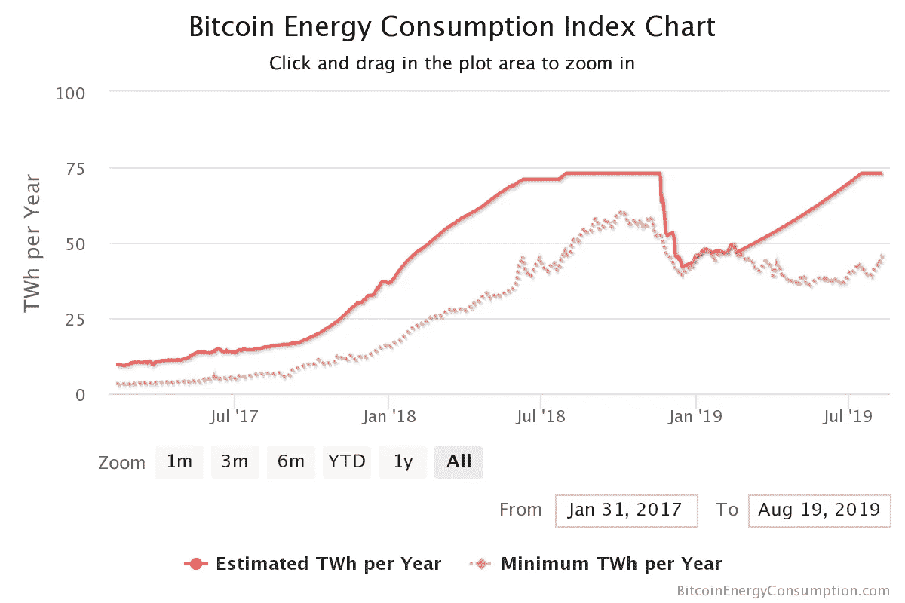
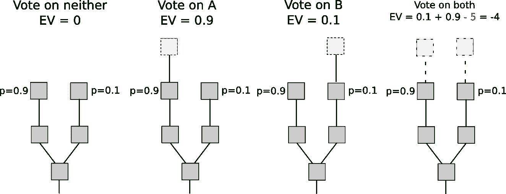

# 以太坊 2.0 新特性概述

> 原文：<https://betterprogramming.pub/overview-of-whats-new-in-ethereum-2-0-cdf902e0220d>

## 以太坊 2.0 预计将于 2019 年第四季度推出。了解它会带来什么

照片由[思想目录](https://unsplash.com/@thoughtcatalog?utm_source=medium&utm_medium=referral)在 [Unsplash](https://unsplash.com?utm_source=medium&utm_medium=referral) 上拍摄

[以太坊](https://www.ethereum.org/)是目前最流行的分散应用程序的发射台。以太坊为您提供了铸造自己的加密货币所需的工具，它提供了一种编程语言和环境。

以太坊由以太提供动力，以太是第二种最广为人知的加密货币。以太坊项目得到了社区的大力支持，目前正在积极开发中。

 [## 以太坊

### 以太坊有 204 个可用的仓库。在 GitHub 上关注他们的代码。

github.com](https://github.com/ethereum) 

以太坊是什么？

以太坊 2.0 自 2018 年开始讨论和开发，第一阶段计划于 2019 年底推出。以太坊未来会带来什么，我超级兴奋。

# 为什么是以太坊 2.0？

## 表演

以太坊每秒可以处理大约25 笔交易，如果它成为主流，这显然是不可持续的。客观地说，Visa 每秒能够执行 24，000 笔交易，尽管高峰时间的需求只有约 4，000 tps。

## 更环保的方法

以太坊将从*工作证明*切换到*赌注证明*。在 PoW 中，得到正确的答案是非常困难和昂贵的，并且你会因为得到它而得到奖励。

在 PoS 中，得到正确的答案是非常容易的，但是得到错误的答案是非常昂贵的，因为你会因为得到它而受到惩罚。

权力奖励做对的事，权力惩罚做错的事。

PoW 的缺点是耗电量大，这是最不环保的选择。例如，[比特币](https://bitcoin.org/)的能耗堪比新西兰这个国家。

比特币能耗指数—[https://digiconomist.net/bitcoin-energy-consumption](https://digiconomist.net/bitcoin-energy-consumption)

## 更安全

通过从 PoW 切换到 PoS，以太坊将通过解决 51%的攻击问题而变得更加安全。我不是安全方面的专家，请阅读 Github Gist 以获得更详细的答案。

## 什么是工作证明？

工作证明发生在矿工试图解决异常困难的数学问题时。寻找解决方案是一个随机的猜谜游戏，但是很容易检查一个解决方案是否是正确的，因为只能有一个解决方案。

什么是加密货币挖矿？

矿工无法欺骗系统，因为它需要真实世界的资源来制定这些解决方案。

## PoW 易受 51%攻击

可以说，PoW 最大的缺点之一是相对容易受到 51%的攻击。

51%的攻击得到解释

51%攻击是指一个矿工，或者更可能是一个矿池，控制了网络计算能力的 51%。

有了这种能力，他们可以使有效的交易无效，并重复花费资金。比特币之所以如此出名，是因为它能够解决重复消费的问题。

# 利害关系证明

PoS 发生在矿工投入股份，或锁定他们的一些硬币，以验证一批交易。

PoS 中的密码计算对计算机来说要简单得多；你只需要证明你拥有给定货币中一定比例的硬币。

例如，如果你以某种方式拥有所有以太网(ETH)的 1%,你将能够挖掘以太坊所有交易的 1%。

什么是利害关系的证明？

 [## 解释工作证明与利益证明

### 以太坊正计划从工作证明共识机制转变为利益证明系统。但是什么是…

www.ethnews.com](https://www.ethnews.com/proof-of-work-vs-proof-of-stake-explained) 

# 从电源切换到 PoS

以太坊正在计划在不久的将来从 PoW 转换到 PoS 系统，很可能使用一种叫做 Casper 的协议。

## 以太坊 Casper 协议

Casper 协议旨在帮助以太坊从工作证明(PoW)模型转向利益证明(PoS)模型，同时最大限度地降低与此类开发相关的风险。

以太坊 Casper 协议

Casper 将分阶段实施，以降低网络上的风险。

第一阶段将是卡斯帕·FFG(友好的终结小工具)，它是 PoW 和 PoS 的混合物。在这种情况下，PoW 仍将是保护网络的主要算法，但每 50 个块将通过 PoS 进行验证。

卡斯珀节点—【https://vitalik.ca/files/casper_note.html 

如果你想知道卡斯帕是如何工作的，[维塔利克在这里写了关于这个主题的文章](https://vitalik.ca/files/casper_note.html)。

然而，重要的是要记住，PoS 的早期版本不会是分散的。由于以太坊测试赌注机制，只有少数参与者将被允许加入。

PoW 将与 PoS 共存一段时间。两条不同的链。参见[双醚的故事](https://our.status.im/two-point-oh-the-tale-of-two-ethers/)。

# 以太坊 2.0 设计目标

以下是以太坊 2.0 的总体设计目标:

*   最小化复杂性，即使以一些效率损失为代价。
*   在主要网络分区中以及当大量节点脱机时保持活动状态。
*   选择所有组件，以便它们或者是量子安全的，或者可以在可用时容易地替换为量子安全的对应物。
*   利用密码和设计技术，允许大量验证者在总时间和单位时间内参与。
*   允许具有`O(C)`资源的典型消费者笔记本电脑处理/验证`O(1)`碎片(包括任何系统级验证，如信标链)。

以太坊 2.0 将分多个阶段推出。这些阶段如下:

# 阶段 0

*   [信标链](https://github.com/ethereum/eth2.0-specs/blob/dev/specs/core/0_beacon-chain.md)

阶段 0 将使用 Casper 友好的终结小工具(FFG)来终结。

用非常宽泛的术语来说，终结意味着一旦一个特定的行动完成，它将永远铭刻在历史中，没有任何东西可以逆转这个行动。

信标链将为自己和所有碎片链管理 Casper Proof 协议。

*   [叉子选择](https://github.com/ethereum/eth2.0-specs/blob/dev/specs/core/0_fork-choice.md)

与一个`store`相关的头块根部被定义为`get_head(store)`。在 genesis，让`store = get_genesis_store(genesis_state)`和更新`store`运行:

*   `on_tick(time)`无论何时`time > store.time`其中`time`是当前的 Unix 时间
*   `on_block(block)`每当接收到块`block`时
*   `on_attestation(attestation)`每当收到证明`attestation`时
*   [定金合同](https://github.com/ethereum/eth2.0-specs/blob/dev/specs/core/0_deposit-contract.md)

以太坊 2.0 的初始部署阶段是在没有对以太坊 1.0 进行一致更改的情况下实现的。地址为`DEPOSIT_CONTRACT_ADDRESS`的存放契约被添加到以太坊 1.0，用于将 ETH 存放到信标链。

验证机天平将在第 2 阶段(即当 EVM 2.0 部署且碎片有状态时)撤回到碎片。

*   [诚实验证者](https://github.com/ethereum/eth2.0-specs/blob/dev/specs/validator/0_beacon-chain-validator.md)

验证者是参与以太坊 2.0 协议共识的实体。对于用户来说，这是一个可选角色，他们可以将 ETH 作为抵押品发布，并验证和证明块的有效性，以寻求财务回报来换取构建和保护协议。这类似于工作证明网络，在这种网络中，矿工以硬件/散列函数的形式提供抵押品，以寻求回报，作为建立和保护协议的交换。

# 第一相

*   [监护权游戏](https://github.com/ethereum/eth2.0-specs/blob/dev/specs/core/1_custody-game.md)
*   [分片数据链](https://github.com/ethereum/eth2.0-specs/blob/dev/specs/core/1_shard-data-chains.md)

# 第二相

第二阶段仍然活跃在 R&D，还没有任何正式的规格。

请参见 [ETH 2.0 第二阶段 WIKI](https://hackmd.io/UzysWse1Th240HELswKqVA?view) 了解关于这项工作的当前进展、讨论和定义。

 [## 以太坊 2.0(宁静)阶段

### 以太坊的宁静升级将带来分片，股权证明，一个新的虚拟机(eWASM)等等。这是…

docs.ethhub.io](https://docs.ethhub.io/ethereum-roadmap/ethereum-2.0/eth-2.0-phases/) 

# 结论

跟随[以太坊研究讨论](https://ethresear.ch/)、[分片](https://ethresear.ch/c/sharding)和 [Casper](https://ethresear.ch/c/casper) 主题。还有更多的东西有待发现。

要了解更多关于切分和以太坊 2.0 (Serenity)的信息，请参见[切分常见问题](https://github.com/ethereum/wiki/wiki/Sharding-FAQ)和[研究纲要](https://notes.ethereum.org/s/H1PGqDhpm)。

感谢阅读，保持敬畏！