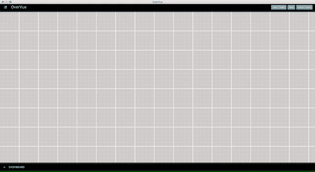
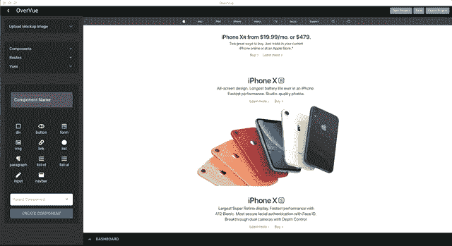
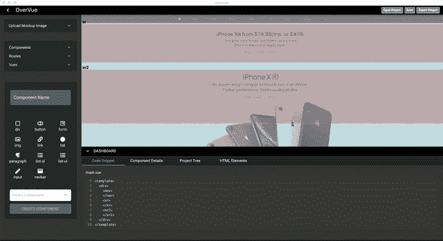
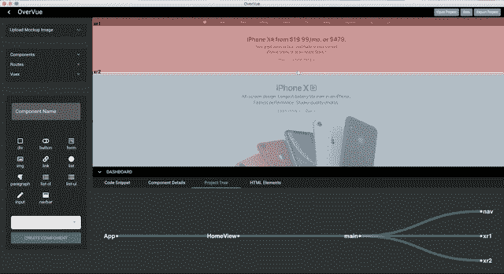

# OverVue，一个 Vue 原型工具

> 原文：<https://betterprogramming.pub/overvue-a-vue-prototyping-tool-f2b8a2f0c229>

截至 2019 年 7 月， [Vue](https://vuejs.org/) 在 GitHub stars 的所有 JavaScript 框架中排名第一，总体排名第三，超过 [React](https://reactjs.org/) 一万多颗星，将 [Angular](https://angular.io/) 远远甩在身后。

作为三大前端 JavaScript 框架中最年轻的一个，它的受欢迎程度爆炸式增长，并迅速受到开发人员社区的喜爱。

尽管 Angular 和 React 得到了谷歌和脸书的支持。

作为三者中最年轻的框架，Vue 的开发者生态系统落后于其竞争对手。over value 在这里提供并帮助开发者快速开始构建他们的 web 应用。

在其核心，OverVue 是一个桌面应用程序，由 Vue 和 [Electron](https://electronjs.org/) 构建，允许用户创建 Vue 组件，建立父子层次结构，并使用 [Vue 路由器](https://router.vuejs.org/)设置路线，所有这些都来自一个漂亮的用户界面。

一旦满意，用户就可以生成文件并将样板代码导出到项目中。这里有更多它的热门功能！

# 上传图像

这第一部分是可选的，但是如果你有一个准备好转化为代码的深思熟虑的设计，这将非常有用。

打开左边的工具条，点击“上传图片”从你的文件系统中选择你的模型图片。单击“仪表板”旁边的箭头将在显示和最小化仪表板之间切换。

图像上传

# **创建一个组件**

在 OverVue 中创建一个组件非常简单。给你的组件起一个名字，选择任何 HTML 元素放在 Vue 模板中，如果可以的话，从侧边栏的下拉菜单中选择一个父元素。

创建组件后，您可以拖动组件并调整其大小，以适应您的图像模型。

如果您忘记在下拉菜单中指定父子层次结构，您只需右键单击您的组件来调整层次结构。

创建组件

# 组件估价过高

左键单击在活动组件之间切换。从左边的组件菜单中调整您想要的 HTML 元素，并在仪表板中跟踪它们。

使用 Team OverVue 漂亮的重新渲染树显示来可视化您的父子层次结构。

树和 HTML 重新呈现

# 代码片段

单击仪表板面板中的“代码片段”选项卡查看您的代码。请随意将代码复制到剪贴板上，并直接粘贴到您的项目中。

密码

# 路由器支持

在“路线”下拉列表中输入路线名称，然后点击“回车”将路线添加到您的应用程序中。

在路线之间切换将仅显示画布上活动路径中存在的组件。这实际上就是 Vue 路由器在您的应用中所做的事情。

对路线结构的任何更改都会无缝地更新树显示。

路线

# 保存/导出

完成后，您可以保存项目并在以后打开它，或者您可以将新的样板代码导出到您的工作区。

创建了一个`package.json`，您可以`npm/yarn`安装您的依赖项。

# 走向

有几个功能我们还没有完成。由于这个工具是开源的，欢迎提供帮助。

我们尚未实现的一些功能有:

1.  [Vuex](https://vuex.vuejs.org/) 状态管理。
2.  [打字稿](https://www.typescriptlang.org/)整合。
3.  嵌套 HTML 元素的能力。
4.  能够拖动一个特定的父对象和它的子对象。
5.  一个 CLI 版本和 [npm](https://www.npmjs.com/) 包。
6.  能够为每条路线上传多个图像。

欢迎任何建议！

OverVue 团队非常自豪地推出我们的测试版产品。我们欢迎我们应用程序的第一批用户和测试者。

我们很乐意帮助开发人员加快他们的初始应用程序架构设置，并通过这个漂亮的抽象来加快开发。

你可以在这里找到[over value 的 GitHub](http://www.github.com/TeamOverVue/OverVue) 。

非常感谢我的软件工程师同事们的辛勤工作:Dean Ohashi、Drew Nguyen 和 Joseph Eisele。