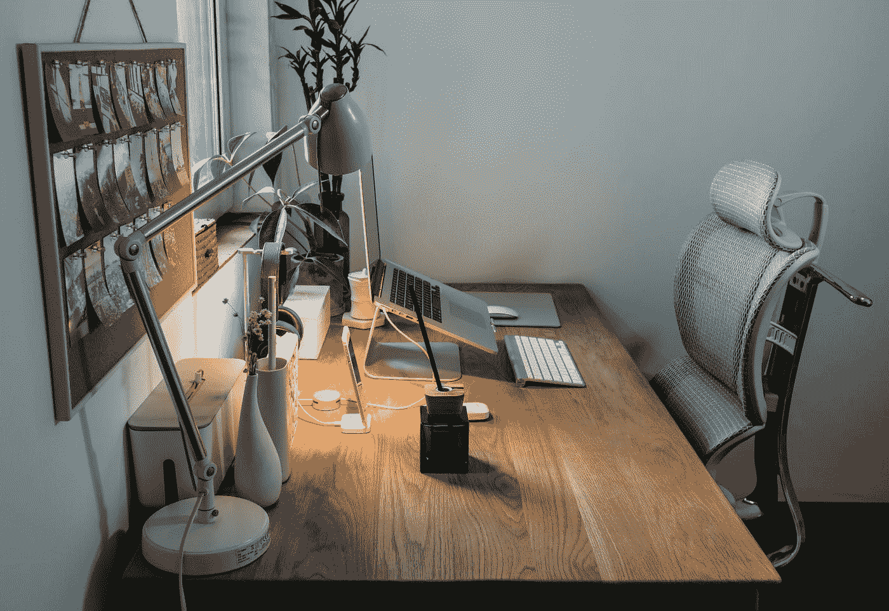
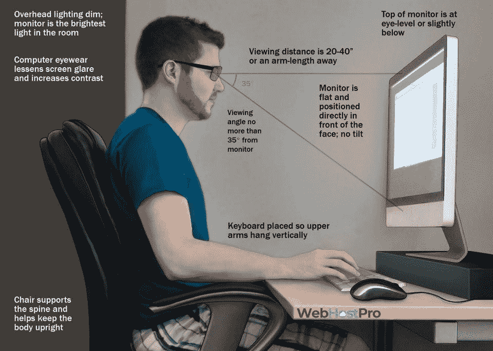
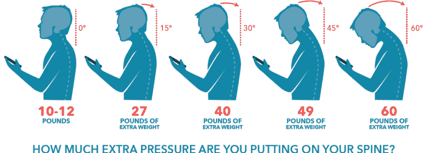
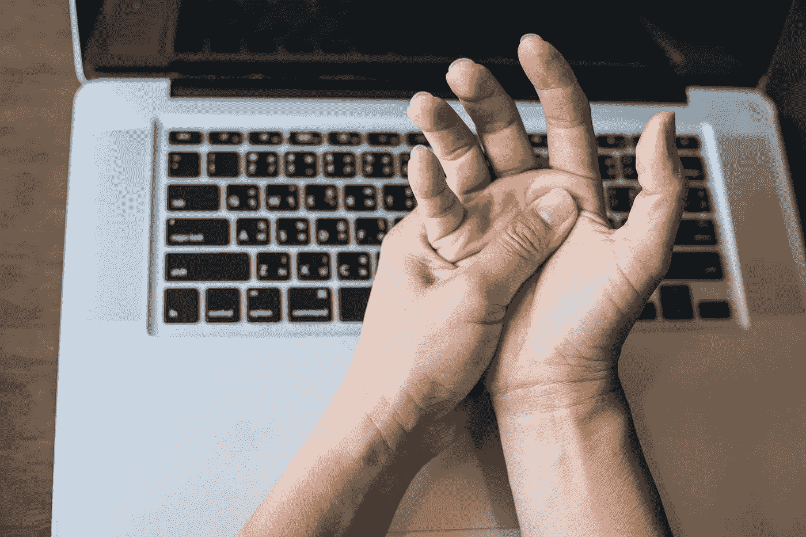
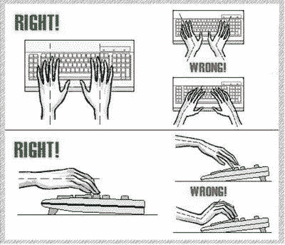
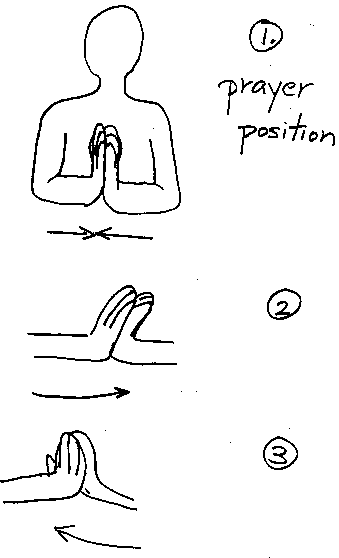
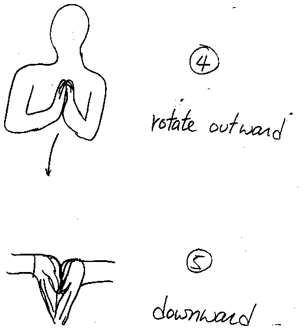

# 哎唷，JavaScript 杀了我

> 原文：<https://betterprogramming.pub/ow-javascript-is-killing-me-8aa0600e049b>

## 人体工程学以及如何设置健康的工作站

[Samule 孙](https://unsplash.com/@samule?utm_source=medium&utm_medium=referral)在 [Unsplash](https://unsplash.com?utm_source=medium&utm_medium=referral) 上的照片

我们许多人一次花几个小时在电脑上，盯着代码。不需要很长时间就会出现疼痛。我开始怀疑我们的电脑习惯是否会永久性地损害我们的身体。

我对长时间使用电脑的相关风险做了一些研究。本文讨论了编程时需要注意的事项以及保持健康的方法。

# 脖子和后背

来源:[贡纳，“什么是数字眼疲劳？”](https://gunnar.com/blog/what-is-digital-eye-strain/#)

长时间坐着，尤其是对脊柱有害的姿势，会导致慢性疼痛。处理这个问题的最好方法是首先防止疼痛。

加州大学洛杉矶分校脊柱中心建议每坐 30 分钟，站起来，伸展，走 1-2 分钟，以放松肌肉、关节、韧带和肌腱。

此外，坐着时保持脊柱中立、直立也很重要。以自然、直立的姿势坐着，直视前方——避免上下倾斜头部。

来源:[莫莉运动按摩，《科技脖子》](https://mollysportsmassage.com/2020/01/15/tech-neck/)

> “当你直视前方时，你头部的重量在 10 到 12 磅之间。即使你只将脖子向前弯曲 15 度来看手机，它也会使你的头部重量增加一倍，使你的头部重量达到 27 磅左右。想象你的脖子弯曲 45 度——这差不多是你的颈部肌肉、上背部和肩膀支撑的 50 磅重量。”
> 
> — [北美脊柱研究所](https://spineina.com/blog/all-about-tech-neck/)

每当我们的车厢错位时，一些肌肉不得不绷紧来支撑负荷，而另一些则变得虚弱。过度劳累的肌肉会发炎，导致附近关节的关节炎。

加强保持身体直立的肌肉是纠正和预防姿势相关疼痛的有效方法。克利夫兰诊所推荐尝试这些肌肉强化练习:

*   **超人。**俯卧，同时抬起你的胳膊和腿，离地仅几英寸。保持，放松，重复。
*   **核心。**仰卧起坐、平板运动和腿部伸展运动都有助于增强你的核心肌肉。
*   **脖子伸长。**舒适地坐着，将你的头紧紧地向后压在你的椅子(或汽车)头枕上或双手中。坚持 30 秒多次，增强力量。
*   **肩胛骨。**锻炼你的斜方肌和菱形肌，帮助你向后拉肩膀。将一根锻炼带举在身前，与肩同高，然后在胸前拉伸，手臂微微弯曲。回到起始位置，然后重复。

如果你正在寻找矫正练习，这份英国国家健康服务的清单提供了纠正常见坏习惯的方法。

# 眼睛

我们的眼睛是我们身体的一个脆弱部分。盯着屏幕看太久会导致眼睛疲劳。这是由于两个因素:(1)眼睛表面变干，(2)当近距离观看物体时，使固定眼睛的肌肉疲劳，并收缩眼睛晶状体。

我一直在想，每次我看东西时间太长时，我的眼睛是否会永久磨损。好消息是，根据美国眼科学会的说法，眼疲劳不会导致永久性损伤。

使用电脑时要记得眨眼，这很重要，因为眨眼会在眼睛上覆盖一层泪膜，使眼睛保持湿润。交替看更远的地方也是很好的。

我发现的最一致的建议是 20-20-20 法则:每 20 分钟，休息 20 秒钟，看看 20 英尺外的东西。这将有助于防止眼睛疲劳。

我在考虑买一副蓝光眼镜，[但是关于它们是否有帮助，有相互矛盾的证据，尽管任何抗反射眼镜都可以减少刺目的眩光。](https://www.webmd.com/eye-health/news/20191216/do-blue-light-glasses-work)

# 手臂和手腕

重复性劳损(RSI)是一个泛指术语，用于描述腱炎和腕管综合征等疾病，在这些疾病中，随着时间的推移，重复相同的运动会逐渐对肌肉、肌腱和神经造成损伤。RSI 的症状包括肿胀、刺痛、麻木、僵硬、虚弱和对冷热敏感。

我在网上简单搜索了一下，发现了三个[不同的](https://medium.com/@mrmrs_/i-got-rsi-and-what-happened-next-wasnt-surprising-at-all-63ddb58b5e3f) [程序员](https://blog.evanweaver.com/2012/09/05/a-programmers-guide-to-healing-rsi/)遭受手臂和手腕疼痛的故事。我了解到过度劳累手腕会导致潜在的职业生涯终结的痛苦:

> “我减少了与电脑的互动，但我仍努力工作。我手臂的疼痛继续恶化。当我工作的时候，开始是手腕疼痛，后来演变成我的双臂被晒伤的感觉。拿起或使用我的电话会很痛。触摸电脑会痛。
> 
> 在这一点上，我会把自己描述为处于一种“非常害怕”的状态。我的职业生涯很大程度上是围绕着通过在电脑上写作来进行设计。我的内在感知价值与我操纵、产生和删除代码的能力紧密相连。我需要转行吗？我可以用一些听写软件来编码吗？我该怎么办？哪些职业不涉及计算机？我满脑子都是令人紧张的问题。"
> 
> — [mrmrs，](https://medium.com/u/47ae71ef6ae9?source=post_page-----8aa0600e049b--------------------------------)“[我得了 RSI，接下来发生的事情一点也不意外](https://medium.com/@mrmrs_/i-got-rsi-and-what-happened-next-wasnt-surprising-at-all-63ddb58b5e3f)”

定期休息对预防重复性劳损很重要。根据[哈佛 RSI 行动小组](http://www.rsi.deas.harvard.edu/minor.html)的说法，如果你有轻微的 RSI 症状，你可以继续打字，只要你发现你可以在没有症状的情况下打字多长时间，并在到达该点之前休息 10 分钟，以防止组织损伤的累积，从而导致永久性疼痛。

打字时保持手的自然姿势也很重要。我在小学时就知道，打字时不应该把手腕放在键盘上，因为这会给腕管神经带来压力，但写这篇文章是我第一次注意到，在打字时，我的手向外张开，手腕向内弯曲。

我经常把电脑放在膝盖上，我不得不用胳膊做霸王龙的动作，因为我的手肘低于键盘的高度。简单地调整我的姿势，使我的前臂平行于键盘，并且在打字时我的手腕是直的，这就消除了我的刺痛感。

来源: [TheWindowsClub，“密集鼠标用户，警惕腕管综合症！”](https://www.thewindowsclub.com/be-aware-of-the-carpal-tunnel-syndrome/)

最后，一些资料建议定期进行预防性拉伸。这种简单的拉伸有助于预防和缓解 RSI:

(1)祈祷姿势。(2)向左推动手指。然后向右。(3)向身体转动手指。(4)手指远离身体。(5)指向下方。每次坚持 15-30 秒。不要过度。来源:[哈佛 RSI 行动](http://www.rsi.deas.harvard.edu/preventing.html)

# 结论

编程时注意身体是很重要的。

最好的药物是预防性药物。休息，伸展，锻炼，放松你的眼睛和手腕。如果你正经历慢性背痛或 RSI 症状，去看物理治疗师，并立即采取行动阻止对你身体的损害。