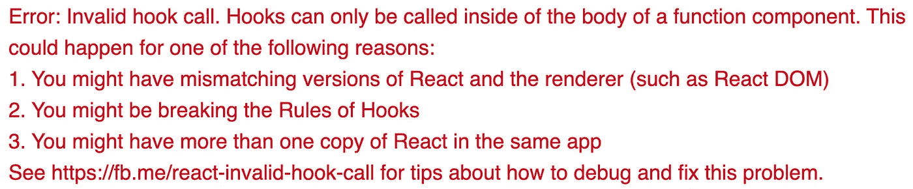

# 对 package.json 依赖项的深入解释

> 原文：<https://betterprogramming.pub/package-jsons-dependencies-in-depth-a1f0637a3129>


[贷方:unsplash](https://unsplash.com/photos/2zGTh-S5moM)

## 依赖、开发依赖和对等依赖:它们是什么意思？

如果您使用 npm(节点包管理器)来管理一个 JavaScript 项目，那么在您的`package.json`中正确构建依赖关系是至关重要的。只需一个 npm 命令`npm install`，就可以根据规范安装所有依赖包。

随着微前端和 monorepo 方法的出现，依赖性之间的相互关系变得越来越具有挑战性。

这篇文章描述了`package.json`中不同类型的依赖，并展示了我们在产品开发过程中针对`peerDependencies`问题采用的一些解决方案。最后，我们讨论外部依赖性。

# 依赖类型

在 [npm 文档](https://docs.npmjs.com/cli/commands/npm)中定义了五种类型的依赖关系:

## 1.正常相关性

正常的依赖关系:这些依赖包作为库来使项目工作。

最终产品必须捆绑这些包，可能是框架(比如 React、Angular、Vue 等。)、实用程序(如 [i18next](https://www.i18next.com/) 、 [Lodash](https://lodash.com/) 、 [axios](https://github.com/axios/axios) 等。)，以及组织中的子组件。

```
"dependencies": {    
  "axio": "0.19.0",
  "i18next": "~17.0.6",
  "react": "^16.12.0",
  "react-dom": "^16.12.0",
  "react-i18next": "~10.11.4",
  "react-router-dom": "~5.1.2"
}
```

## 2.开发依赖性

这些依赖包充当开发工具。最终产品不需要这些包，它们可能是:

*   格式化工具([更漂亮的](https://prettier.io/)、[更漂亮的](https://beautifier.io/)、 [ESLint](https://eslint.org/) 等。).
*   Transpilers ( [巴别塔](https://babeljs.io/)，打字稿等。).
*   类型定义(`@types/react`、`@types/jest`等)。
*   捆扎机([网袋](https://webpack.js.org/)、[大口](https://github.com/gulpjs/gulp)、[卷起](https://github.com/rollup/rollup)等。).
*   测试库( [Jest](https://jestjs.io/) ，TestCafe，[酵素](https://airbnb.io/enzyme/)，[测试库](https://testing-library.com/)等。).
*   文档库( [JSDoc](https://jsdoc.app/) )，文档等。).
*   Monorepos 工具( [lerna](https://github.com/lerna/lerna) 、 [Bit](https://blog.bitsrc.io/monorepo-architecture-simplified-with-bit-and-npm-b1354be62870) 等。).
*   和许多其他类型的库。

```
"devDependencies": {    
  "@types/jest": "24.0.18",
  "@types/react": "16.8.23",
  "@typescript-eslint/eslint-plugin": "2.8.0",
  "@typescript-eslint/parser": "2.8.0",
  "eslint": "^5.16.0",
  "husky": "^3.0.0",
  "lerna": "^3.16.4",
  "prettier": "^1.18.2",
  "rollup": "^1.0.0",
  "typescript": "^3.6.4"
}
```

## **3。对等依赖**

这些依赖包是产品所需要的，类似于正常的依赖。然而，该产品不是最终产品。相反，它是一个供主机应用程序使用的库或插件。

对于这种情况，建议将依赖项放在`peerDependencies`中，并期望主机应用程序包含它。

这种方法有几个原因:

1.  它可以在没有外包装的情况下保持中间产品的包装尺寸较小。
2.  它不会不必要地将中间产品与固定版本的第三方依赖项捆绑在一起。
3.  消费主机应用程序本身可能需要相同的包。
4.  消费主机应用程序可能依赖于许多需要相同包、相同版本或兼容版本的库或插件。

```
"peerDependencies": {    
  "jest": ">=24 <25"
}# This way, npm will issue a warning when some peer dependencies are missing.npm WARN ts-jest@24.2.0 requires a peer of jest@>=24 <25 but none is installed. You must install peer dependencies yourself.
```

从版本 4 开始，由于重复数据删除算法的技术挑战，npm 不再支持自动安装`peerDependencies`。

但是从版本 7 开始，npm 使用树状算法来自动安装`peerDependencies`。

`peerDependenciesMeta`提供了关于如何使用`peerDependencies`的附加信息。具体来说，它允许将`peerDependencies`标记为可选。

```
"peerDependencies": {    
  "jest": ">=24 <25"
}
"peerDependenciesMeta": {
  "jest": {
    "optional": true
  }
}
```

当用户安装软件包时，如果`peerDependencies`中指定的软件包尚未安装，npm 将发出警告。将对等依赖项标记为可选可确保如果主机上没有安装`jest`软件包，npm 不会发出警告。

## **4。可选依赖性**

这些依赖包是产品所需要的，类似于正常的依赖。

但是，如果 npm 找不到它们或安装失败，它将继续运行。产品应该有能力处理这些类型的问题。这是一种很少使用的类型。

## **5。捆绑依赖关系**

这些依赖包在发布包时捆绑在一起。这将在本地保留 npm 软件包，或者通过单个文件下载使它们可用。

`bundledDependencies`列在一个数组中，没有版本。这是一种很少使用的类型。

# 对等依赖的问题和解决方案

在`package.json`中的所有依赖类型中，`dependencies`和`devDependencies`是使用最频繁的，并且概念很简单。

同时，`optionalDependencies`和`bundledDependencies`很少使用。有趣又麻烦的是`peerDependencies`。

> 正如我们之前提到的，从[版本 7](https://medium.com/better-programming/the-step-by-step-guide-to-understanding-and-adopting-npm-7-914504f7090f) 开始，npm 使用 Arborist 算法自动安装`peerDependencies`。因此，以下问题和解决方案仅适用于 npm 版本 4 - 6 或在安装时使用`--legacy-peer-deps`标志的 npm 7。

正如我们前面提到的，`peerDependencies`提供了主机应用程序应该提供的规范。它对生产很有效。

然而，在库或插件开发期间，`npm install`不会安装`peerDependencies`中指定的包。如果`peerDependencies`设置如下:

```
"peerDependencies": {    
  "react": "^16.12.0",
  "react-dom": "^16.12.0"
}
```

然后，开发构建的 ESLint 可能会报告一个警告:

```
Unable to resolve path to module ‘react’ import/no-unresolved 
```

此外，单元测试用例将失败，并显示以下错误:

```
Cannot find module: ‘react’. Make sure this package is installed.
```

解决办法是把`peerDependencies`加到`devDependencies`里。

```
"devDependencies": {    
  "react": "^16.12.0",
  "react-dom": "^16.12.0"
}
```

那么开发版本也将在`node_modules`下安装 React。这解决了我们的库或插件开发的问题。

在我们的环境中，我们构建主机应用程序和插件。

Lerna 是一个 monorepo 工具，它优化了使用 Git 和 npm 管理多包存储库的工作流程。在开发模式下， [lerna bootstrap](https://github.com/lerna/lerna/tree/master/commands/bootstrap) 创建一个符号链接到已安装的插件`devDependencies`。

实际上，我们从`host-app`的依赖项和`plugin`的`devDependencies`中为`react`和`react-dom`找到了下面的树形结构。

```
host-app
  └─┬ node_modules
    ├── react
    ├── react-dom
    └── plugin
          └─┬node_modules
            ├── react
            └── react-dom
```

这个问题也可能是由 [npm 链接](https://docs.npmjs.com/cli/link.html)引起的，它在主机应用程序和插件之间使用符号链接。

```
# link the plugin
$ cd host-app
$ npm link path/to/plugin
```

Npm 的重复数据删除功能会忽略符号链接。

通常，它仍然适用于包的多个副本。但是，当包含两次时，React 会中断(即使版本相等)。您可能会看到这个闪烁的红色错误:



丹·阿布拉莫夫提到了[这个问题](https://github.com/facebook/react/issues/14257):

> “事实上一直都是这样(当有两个 React 模块副本时，React 应用程序会被巧妙地破坏)。胡克斯立即浮出水面，我认为这很好。”

对于 npm 链接问题，如果将自身链接回主机应用程序，将会起作用:

```
# link the plugin
$ cd host-app
$ npm link path/to/plugin# link its copy of React back to the host-app's React
$ cd path/to/plugin
$ npm link path/to/host-app/node_modules/react
```

我们为与 webpack 捆绑在一起的 React 项目采用了[更通用的解决方案](https://github.com/ianstormtaylor/slate/issues/3164):

# 外部依赖性

依赖关系还不够复杂吗？

捆绑器引入了一些外部依赖项，如 rollup 和 webpack。外部依赖对于构建库是最有用的。它提供了一种从输出包中排除依赖项的方法。相反，创建的包依赖于最终产品中存在的依赖性。这听起来像对等依赖吗？

通常，外部依赖项指定了普通版本。对等依赖关系指定范围。

要配置外部依赖项，需要将包指定为普通依赖项，并在配置文件中将它们设置为外部依赖项。

```
external: ['packageName1', 'packageName2', 'packageName3']
```

那么它们不会被捆扎机捆扎。

对于对等依赖，如果它们不存在于最终产品中，`npm install`将抛出一个错误。但是，对于外部依赖项，如果它们不存在于最终产品中，打包程序会安装它们。

如果外部依赖项和最终产品的依赖项指定了不同的版本怎么办？它提供了一种可能性，即库使用外部依赖中定义的一个版本，而最终产品使用自己的版本。但是，不鼓励捆绑包的多个版本。它扩大了包的大小并引入了错误(例如多重反应错误)。

让事情变得更复杂的是，有 rollup 和 webpack 插件可以自动使所有依赖成为外部的。

听起来探索起来很有趣！

感谢阅读。我希望这有所帮助。你可以在这里看到我的其他媒体出版物。